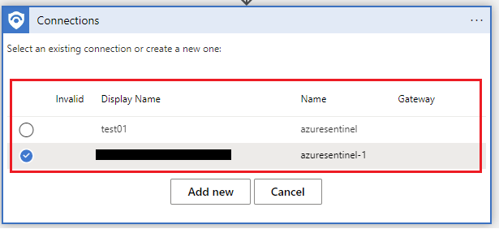
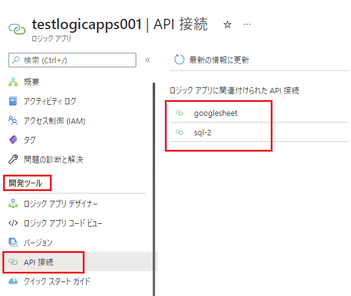
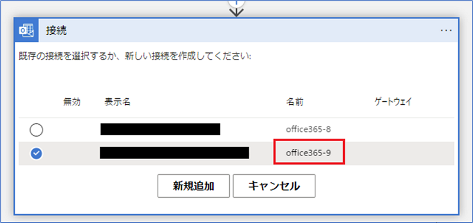
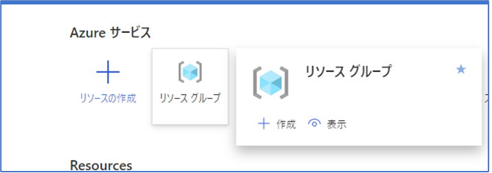
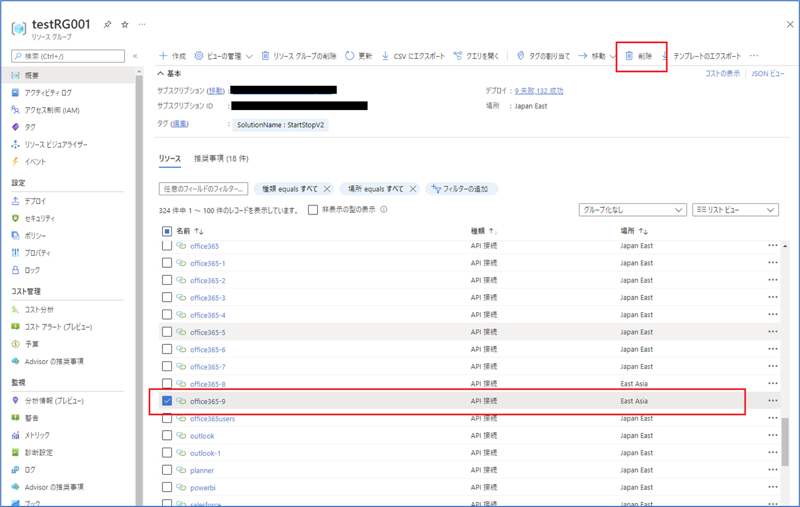
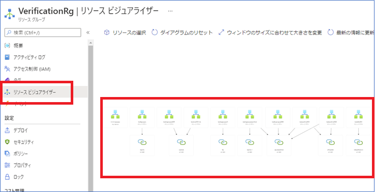

こんにちは！Azure Integration サポート チームの 川合 です。  

Azure Logic Apps でワークフローを作成する際に、コネクタの接続情報を設定する画面で以下のように複数項目が表示されることがあるかと思います。

今回はこの接続情報について、誤って作成してしまった場合や不要になった場合にどうやって削除すればよいかをご案内いたします。

<!-- more -->

## 目次
- 接続情報 (API 接続) のリソースの確認方法について
- 接続情報 (API 接続) のリソースの削除方法について
- まとめ

## 接続情報 (API 接続) のリソースの確認方法について
まず、この接続情報がどのように作成されるかご説明させていただきます。
Azure Logic Apps でコネクタをご利用になられる場合、以下のように当該サービスの認証に必要な接続情報を入力する画面が表示されます。

ここで認証に必要な情報を入力し接続情報を作成すると、自動的にワークフローと同一のリソース グループに [API 接続]というリソースが作成されます。

こちらのリソースがコネクタの接続情報を設定する画面で表示されている接続情報の内容になります。
なお、従量課金タイプの Azure Logic Apps ですと、ワークフローの画面左部より [開発者ツール] - [API 接続] を選択いただくことで内容を確認することが可能でございます。

Standard タイプの Azure Logic Apps の場合は、[ワークフロー] - [接続] を選択頂くことで API 接続 を確認いただくことが可能でございます。

以上が接続情報のリソースである [API 接続] の確認方法でした。

## 接続情報 (API 接続) のリソースの削除方法について

次に、接続情報の削除方法についてご案内申し上げます。
本記事では従量課金タイプの Azure Logic Apps で利用している API 接続の削除方法をご説明いたします。

こちらにつきましては、当該リソースを削除することで既存の接続先を削除することが可能でございます。
以下にキャプチャと併せて削除例を記載いたしますので、参考までにご確認いただけますと幸いです。

＜削除例＞
1．対象の接続情報を確認する。
 

2．リソース グループを開く。
 

3．対象の API 接続が存在することを確認し、削除を選択。
 

4．再度、対象のリソースが表示されていることを確認し、削除の確認欄に "はい" と入力し、削除ボタンを選択。
 

5．削除されたことを確認したのち、Logic Apps のワークフローの接続情報作成時に削除した接続情報が表示されないことを確認する。
 
 
 
以上より、誤った接続情報や不要になった接続情報を削除することが可能でございます。
ただし、こちらのリソースについては削除すると復元が出来ませんので、影響範囲を十分調査いただいたうえで削除頂ければと存じます。

参考までに、API 接続がどのリソースに紐づいているかを確認されたい場合、同一のリソース グループに閉じた情報ではありますが、リソース グループの画面より、以下のリソース ビジュアライザー という機能を利用することで視覚的に確認いただくことが可能です。

 

こちらも併せてご確認いただけますと幸いでございます。

## まとめ
本記事では、以下についてご案内いたしましたが、ご理解いただけましたでしょうか。
- 接続情報 (API 接続) のリソースの確認方法について
- 接続情報 (API 接続) のリソースの削除方法について

本記事が少しでもお役に立ちましたら幸いです。最後までお読みいただき、ありがとうございました！

<Azure Logic Apps の参考サイト>
-- 概要 - Azure Logic Apps とは
https://docs.microsoft.com/ja-jp/azure/logic-apps/logic-apps-overview
Azure Logic Apps とは、ロジック アプリ デザイナーでフロー チャートを用いて作成したワークフローを自動実行するソリューションです。
Azure Logic Apps では、条件分岐などを実装することができ、ワークフローの実行状況に応じて実行する処理を分岐することが可能です。
