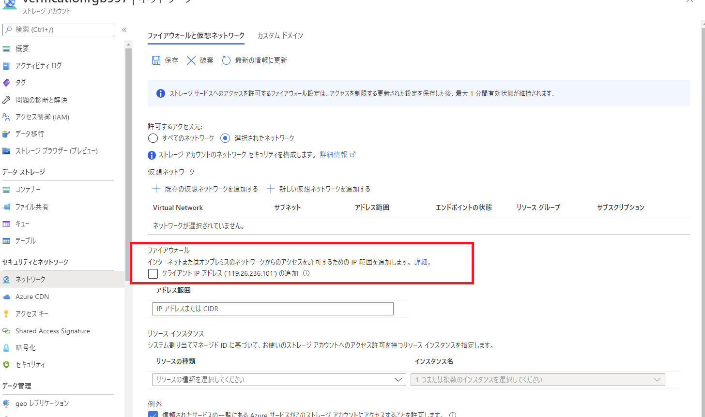

こんにちは！Azure Integration サポート チームの 川合 です。  
つい先日、Azure Logic Apps が Availability Zone に対応するという情報が Tech Community のブログ記事で公開されましたね。

- [Azure Logic Apps - Availability Zone support is coming soon](https://techcommunity.microsoft.com/t5/integrations-on-azure-blog/azure-logic-apps-availability-zone-support-is-coming-soon/ba-p/3254456)

こちらの要件に伴い、お客様の中では以下の件名でメールが届いた方もいらっしゃるのではないでしょうか。

**Action required: Update firewall configurations that allow or deny IP addresses of Azure Logic Apps**

今回は上記メール本文の概要と、お客様にてご対応いただく内容について整理いたしましたのでご案内させていただきます。

<!-- more -->

## 目次
- メール本文の概要について
- 本メールに対するアクション
- まとめ

## メール本文の概要について
まず、本メールの概要については大きく以下の内容となります。

・2022 年 3 月 25 日より、アベイラビリティ ゾーンをサポートするため Azure Logic Apps で利用する IP アドレスの追加が予定されている。
・Azure Logic Apps の IP アドレスとの通信を許可するファイアウォール設定がある場合、2022 年 5 月 15 日までに Azure Logic Apps とコネクタの両方について新しいアドレスに更新する必要がある。
・既存および新規で作成する Azure Logic Apps に今回追加される IP アドレスが利用される。

以上が本メールの概要となります。

## 本メールに対するアクション
お客様にご対応いただく内容として、メールにも記載されております通り ファイアウォール の設定変更がございます。

ここで記載されております　**ファイアウォール**　が何を指しているかですが、Azure Firewall だけではなく、ネットワーク セキュリティ グループやストレージ アカウントのファイアウォール等、Azure Logic Apps からの IP アドレス通信制御を行っている全てのリソースを指します。

例えば、ストレージ アカウントのファイアウォールにて、Azure Logic Apps の送信 IP アドレスを許可されている場合、
IP アドレスが変更となりますのでファイアウォール側の設定を見直していただく必要がございます。

ファイアウォールに対して設定すべき IP アドレスにつきましては、以下の通りご利用いただいておりますコネクタの種類によって異なります。

マネージド コネクタをご利用されている際には、
以下の公開情報の該当リージョンの IP アドレスをすべて追加いただきますようお願いいたします。

<ご参考情報>
- [マネージド コネクタのアウトバウンド IP アドレス](https://docs.microsoft.com/ja-JP/connectors/common/outbound-ip-addresses#azure-logic-apps)

組み込みトリガー、アクションをご利用されている際には、
以下の公開情報の該当リージョンの IP アドレスをすべて追加いただきますようお願いいたします。

<ご参考情報>
- [Azure Logic Apps の制約と構成の参考文献 # マルチテナントとシングルテナント - 送信 IP アドレス](https://docs.microsoft.com/ja-JP/azure/logic-apps/logic-apps-limits-and-config?tabs=azure-portal#multi-tenant--single-tenant---outbound-ip-addresses)

ファイアウォール経由で、Azure Logic Apps への 通信を制御している際には、
以下の公開情報の該当リージョンの IP アドレスをすべて追加いただきますようお願いいたします。

<ご参考情報>
- [Azure Logic Apps の制約と構成の参考文献 # 受信 IP アドレス](https://docs.microsoft.com/ja-JP/azure/logic-apps/logic-apps-limits-and-config?tabs=azure-portal#inbound-ip-addresses)

なお、お客様のコネクタでご利用されているサービスについて、これまで特にファイアウォール等の設定をしておらず、
Azure Logic Apps の送信 IP アドレスをブロックしていない際には、対応は不要となります。

## まとめ
本記事では、以下についてご案内いたしましたが、ご理解いただけましたでしょうか。
- メール本文の概要について
- 本メールに対するアクション

本記事が少しでもお役に立ちましたら幸いです。最後までお読みいただき、ありがとうございました！

<Azure Logic Apps の参考サイト>
-- 概要 - Azure Logic Apps とは
https://docs.microsoft.com/ja-jp/azure/logic-apps/logic-apps-overview
Azure Logic Apps とは、ロジック アプリ デザイナーでフロー チャートを用いて作成したワークフローを自動実行するソリューションです。
Azure Logic Apps では、条件分岐などを実装することができ、ワークフローの実行状況に応じて実行する処理を分岐することが可能です。
