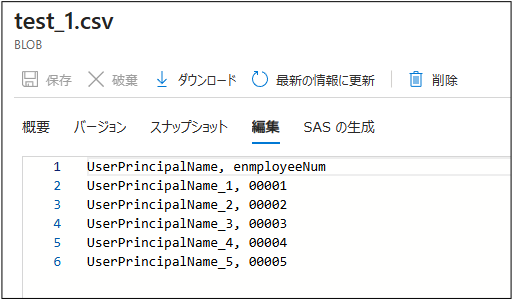
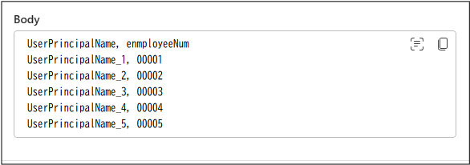
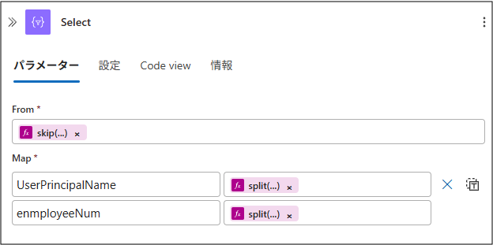
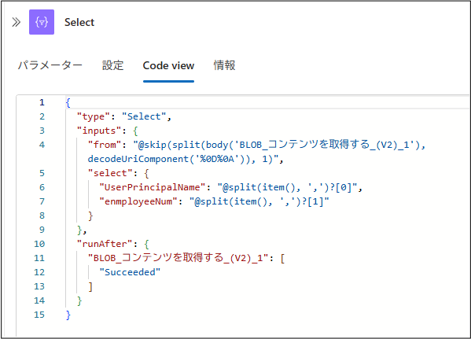
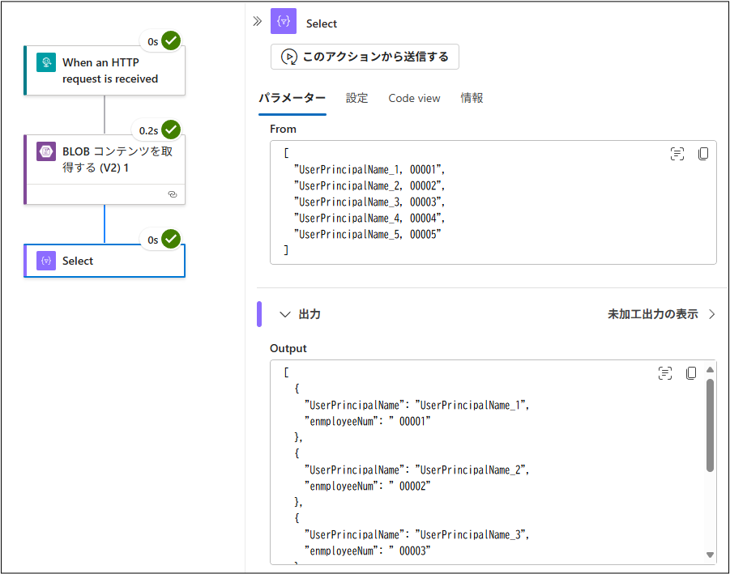
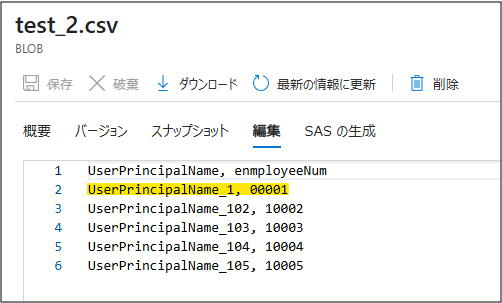
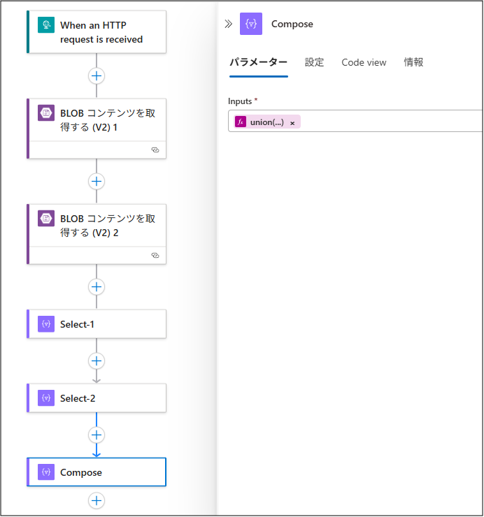
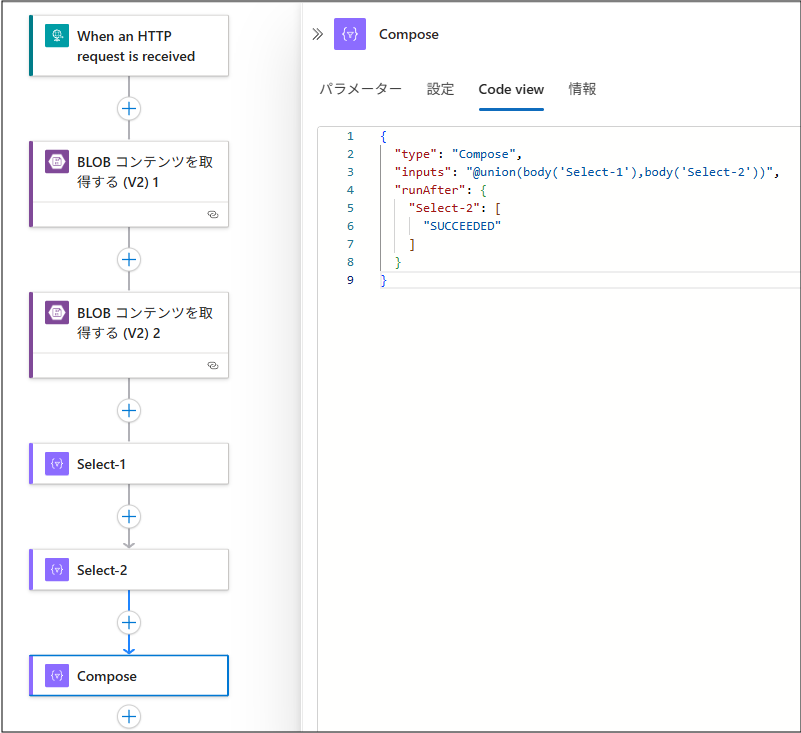
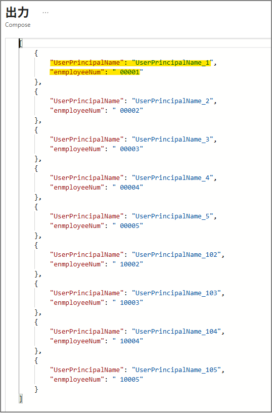
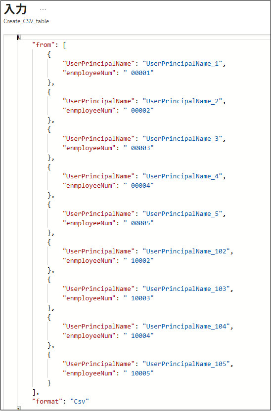

こんにちは！ Azure Integration サポート チームの 武田 です。 
Azure Logic Apps を用いて、Azure Blob Storage などから複数の CSV ファイルを取得、そのデータを加工したいというご質問を、しばしばいただくことがございます。
そこで今回は、CSV ファイルの加工方法をいくつか紹介させていただきます。
<!-- more -->
 

## 目次
- データを分割して配列にする
- 複数の配列を 1 つの配列にまとめる
- 配列にしたデータを CSV 形式に戻す
- 留意点
- まとめ
 

## データを分割して配列にする
大前提としまして、Azure Blob Stotage などから取得した CSV ファイルは、そのままだとデータがひとつの塊になってしまっています。
例えば、以下のような CSV ファイルを用意して、[Azure Blob Storage] コネクタの [BLOB コンテンツを取得する (V2)] アクションでデータを取得してみたとします。

<b>test_1.csv</b>

上記の CSV ファイルを Azure Blob Storage から取得した結果がこちらです。

取得した結果を転記するだけでしたらこのままでも問題ないかもしれませんが、これでは取得結果に対してループ処理を行うようなことができません。
その対応として、CSV ファイルから取得したデータを JSON 形式の配列に変換する方法がございます。

では、実際にやってみます。
本作業で使用するのは、[Select] アクション、[skip] 関数、および [split] 関数です。
作業内容を簡単に説明致しますと、[skip] 関数で先頭のヘッダー行以外のデータ部分を取得し、[split] 関数でカラム単位にデータを分割、[Select] アクションでプロパティ名をつけなおして JSON 形式の配列に変換ます。

- [トリガーとアクションの種類のスキーマ リファレンス - Azure Logic Apps | Microsoft Learn # Select action](https://learn.microsoft.com/ja-jp/azure/logic-apps/logic-apps-workflow-actions-triggers#select-action)
- [式関数のリファレンス ガイド - Azure Logic Apps | Microsoft Learn # skip](https://learn.microsoft.com/ja-jp/azure/logic-apps/workflow-definition-language-functions-reference#skip)
- [式関数のリファレンス ガイド - Azure Logic Apps | Microsoft Learn # split](https://learn.microsoft.com/ja-jp/azure/logic-apps/workflow-definition-language-functions-reference#split)
 

あらためて、分割するデータは以下です。

そして、[Select] アクションの設定内容が以下となります。

上記ではご紹介しておりませんが、[decodeUriComponent] 関数はエスケープ文字をデコード バージョンに置き換える関数でございます。
今回は改行コードを置き換えています。

- [ワークフロー式の関数のリファレンス - Azure Logic Apps | Microsoft Learn # decodeUriComponent](https://learn.microsoft.com/ja-jp/azure/logic-apps/expression-functions-reference#decodeuricomponent)
 

この処理を実行した結果が以下です。
CSV ファイルから取得したデータが JSON 形式の配列になっていることが確認できます。

<b>Output 全体</b>

これで、取得した CSV ファイルのデータをループ処理などで使用できるようになりました。
 

## 複数の配列を 1 つの配列にまとめる
続いて、複数の配列をひとつにまとめる方法でございます。
複数の配列を 1 つの配列にまとめるには [union] 関数を使用します。

[union] 関数は、引数に指定された複数のコレクションをまとめる関数でございます。
この際、重複するデータは削除されますのでご注意ください。

- [ワークフロー式の関数のリファレンス - Azure Logic Apps | Microsoft Learn # union](https://learn.microsoft.com/ja-jp/azure/logic-apps/expression-functions-reference#union)
 

では、実際にやってみます。
まとめるデータとして、新たに以下の CSV ファイルを用意しました。
先頭のデータが、[test_1.csv] ファイルのデータと重複しています。

<b>test_2.csv</b>

少し横道にそれますが、複数の入力から単一の出力を作成するためのアクションとして、[Compose] アクションのご用意がございます。
軽量な処理や一時的な値の保管に使用できるもので、今回はこちらのアクションと [union] 関数による処理を組み合わせています。
なお、後続処理でループ処理や分岐処理が行われる、値の更新や再利用が必要とされる場合は、[Variables] コネクタをご使用いただく方がよろしいかと存じます。

- [トリガーとアクションの種類のスキーマ リファレンス - Azure Logic Apps | Microsoft Learn # Compose](https://learn.microsoft.com/ja-jp/azure/logic-apps/logic-apps-workflow-actions-triggers#compose-action)
 

こちらは簡単で、設定内容は以下の通りです。
なお、本デモンストレーションを行うため、「データを分割して配列にする」でご紹介している内容を、新たに用意した CSV ファイルのデータにも行っております。

[Compose] アクションの実行結果を見てみます。
[test_1.csv] と [test_2.csv] で重複していたデータが削除された状態で、ふたつの配列がまとめられていることがわかります。

 

## 配列にしたデータを CSV 形式に戻す
最後に、一度は JSON 形式の配列にした CSV ファイルのデータを、再び CSV 形式に戻す方法をご紹介させていただきます。
JSON オブジェクトのプロパティ値と値を配列に含むデータを CSV に変換するには [Create CSV Table] アクションを使用します。

- [データの操作の実行 - Azure Logic Apps | Microsoft Learn # CSV テーブルの作成アクション](https://learn.microsoft.com/ja-jp/azure/logic-apps/logic-apps-perform-data-operations?tabs=consumption#create-csv-table-action)
- [Azure Logic Apps で各ファイルフォーマットを変換する Tips # 3．JSON → CSV](https://jpazinteg.github.io/blog/LogicApps/FileFormatConversion/#3%EF%BC%8EJSON-%E2%86%92-CSV)

こちらも実際にやってみます。
[Create CSV Table] を追加し、[From] 欄には「複数の配列を 1 の配列にまとめる」でご紹介をした [Compose] アクションの出力結果を設定します。

実行結果を見てみます。
データの全体を確認するために、[Create CSV Table] アクションの未加工入力と未加工出力で結果を見てみます。

<b>[Create CSV Table] アクションの未加工入力</b>

<b>[Create CSV Table] アクションの未加工出力</b>

JSON 形式の配列が CSV 形式に変わっていることがわかります。
今回の例ではここまでの操作といたしますが、この出力結果をもって、Azure Blob Storage や SharePoint Online に CSV ファイルを新規作成する、Logic Apps から送信するメールに添付するといったことが可能でございます。
 

## 留意点
今回はあくまで CSV ファイルを取得して加工する方法にフォーカスして一例をご案内いたしましたが、本手順は CSV ファイルの加工にのみ使用できるものではございません。
たとえば、「データを分割して配列にする」内にてご紹介している方法を用いれば、[Azure Monitor Logs] コネクタで取得したログ情報から、任意の項目のみを抽出することができます。
そこに「複数の配列を 1 の配列にまとめる」内でご紹介している方法を組みあわせれば、CSV ファイルとログをマージする、ということも可能になるかと存じます。

このように、基にするデータや組み合わせ次第では、Logic Apps 内で様々なデータ加工が可能になります。

一方、Logic Apps にてループ処理を用い大量のデータを扱う場合には、処理が複雑になり時間を要する可能性がございます。
本記事でご紹介している手順は、比較的少量のデータ処理やシンプルなワークフロー設計に適しているため、使い分けに関し留意をしていただきますと、より効果的にご活用いただけるものと存じます。

 

## まとめ
本記事では、以下についてご案内いたしましたが、ご理解いただけましたでしょうか。
- CSV ファイルのデータを分割して配列にする方法
- 複数の配列を 1 つの配列にまとめる方法
- 配列のデータを CSV 形式に変換する

本記事が少しでもお役に立ちましたら幸いです。最後までお読みいただき、ありがとうございました！

<Azure Logic Apps の参考サイト>
-- 概要 - Azure Logic Apps とは
https://learn.microsoft.com/ja-jp/azure/logic-apps/logic-apps-overview
Azure Logic Apps とは、ロジック アプリ デザイナーでフロー チャートを用いて作成したワークフローを自動実行するソリューションです。
Azure Logic Apps では、条件分岐などを実装することができ、ワークフローの実行状況に応じて実行する処理を分岐することが可能です。
