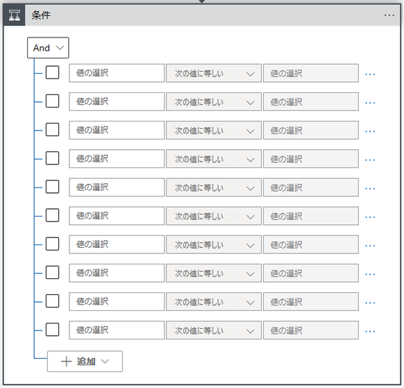
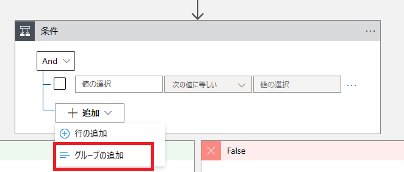
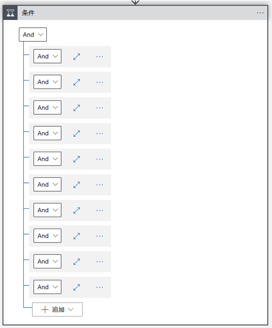
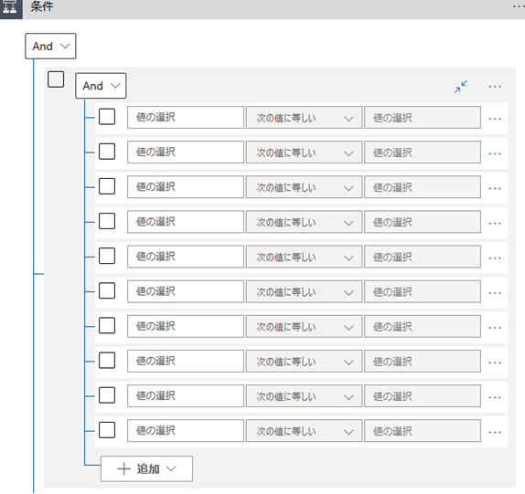
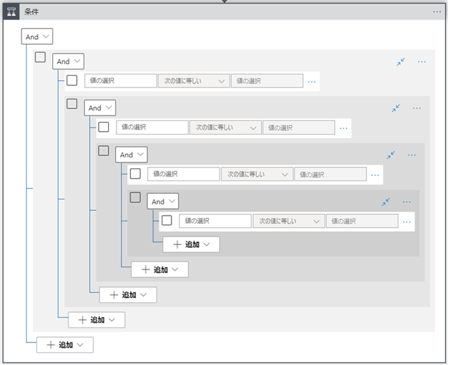
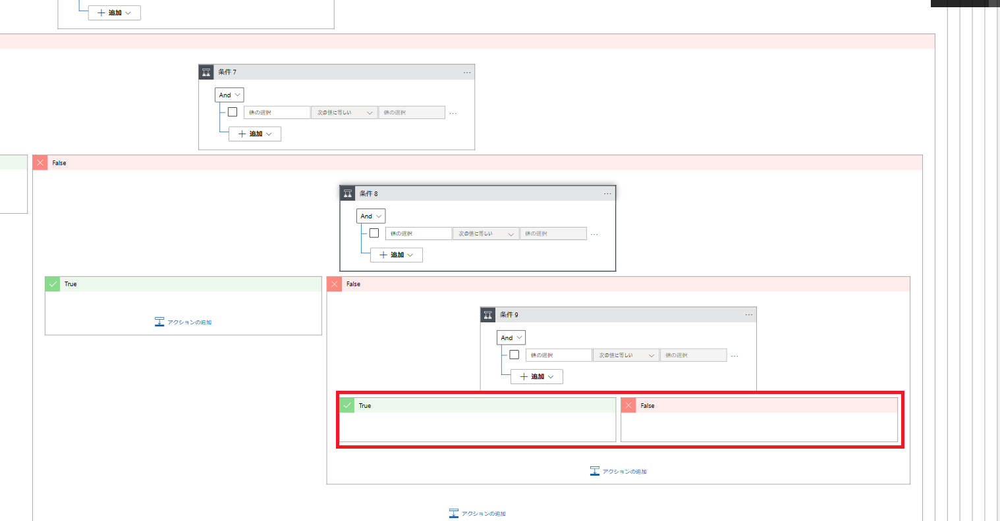

こんにちは！Azure Integration サポート チームの 川合 です。  

Azure Logic Apps には以下の条件アクションを利用することでプログラミングでいう If 文の様な処理を構築することが可能です。

- [Azure Logic Apps のワークフロー アクションを制御する条件を追加する](https://learn.microsoft.com/ja-JP/azure/logic-apps/logic-apps-control-flow-conditional-statement)

今回は上記の条件アクションを利用する際に、公開情報に記載がない上限値に関する Tips をお届けします！

<!-- more -->

## 目次
- 1． 設定可能な条件の最大数
- 2． 設定可能なグループの最大数
- 3． 1 つのグループの中で設定可能な条件の最大数
- 4． 1 つのグループの中で入れ子設定可能なグループの階層
- 5． ワークフロー定義の制限
- まとめ

## 1．設定可能な条件の最大数
一つの条件アクションに指定可能な条件の最大値につきましては、以下の通り 10 個が上限値となり、それ以上は指定できない挙動となっております。

1 つ目の Tips については以上となります。

## 2．設定可能なグループの最大数
条件アクションには各条件をグループ化する機能がございます。

こちらの設定可能なグループの最大値につきましても同様に 10 個が上限値となり、それ以上は指定できない挙動となります。

2 つ目の Tips については以上となります。

## 3．1 つのグループの中で設定可能な条件の最大数
条件とグループに関する上限値が分かったところで、これらを組み合わせた際の上限値について検証致しました。
こちらの結果につきましては、1 つのグループに対して最大 10 個の条件を指定することが可能でございました。

その為、グループが 10 個、条件が各グループ内に 10 個と、合計 100 個まで条件を設定することが可能でございます。
3 つ目の Tips については以上となります。

## 4．1 つのグループの中で入れ子設定可能なグループの階層
それでは、1 つのグループ内にいくつまでグループを入れ子に出来るか検証致しました。
結果としましては、以下の通り 5 階層までグループを入れ子に設定することが可能でございました。

4 つ目の Tips については以上となります。

## 5．ワークフロー定義の制限
本 Tips は条件アクションではなく以下の Logic Apps 自体のワークフロー定義の制限となりますが、
参考までに記載致します。

- [Azure Logic Apps の制約と構成の参考文献 # ワークフロー定義の制限](https://learn.microsoft.com/ja-jp/azure/logic-apps/logic-apps-limits-and-config?tabs=consumption%2Cazure-portal#workflow-definition-limits)

条件アクションの "True" もしくは "False" 内にさらに条件アクションを設定し、さらに入れ子に設定していく場合、8 個目の条件までは設定可能ですが、9　個目の条件については追加でのアクションが設定出来なくなります。

5 つ目の Tips については以上となります。

## まとめ
本記事では、以下についてご案内いたしましたが、ご理解いただけましたでしょうか。
- 1． 設定可能な条件の最大数
- 2． 設定可能なグループの最大数
- 3． 1 つのグループの中で設定可能な条件の最大数
- 4． 1 つのグループの中で入れ子設定可能なグループの階層
- 5． ワークフロー定義の制限

本記事が少しでもお役に立ちましたら幸いです。最後までお読みいただき、ありがとうございました！

<Azure Logic Apps の参考サイト>
-- 概要 - Azure Logic Apps とは
https://learn.microsoft.com/ja-jp/azure/logic-apps/logic-apps-overview
Azure Logic Apps とは、ロジック アプリ デザイナーでフロー チャートを用いて作成したワークフローを自動実行するソリューションです。
Azure Logic Apps では、条件分岐などを実装することができ、ワークフローの実行状況に応じて実行する処理を分岐することが可能です。
