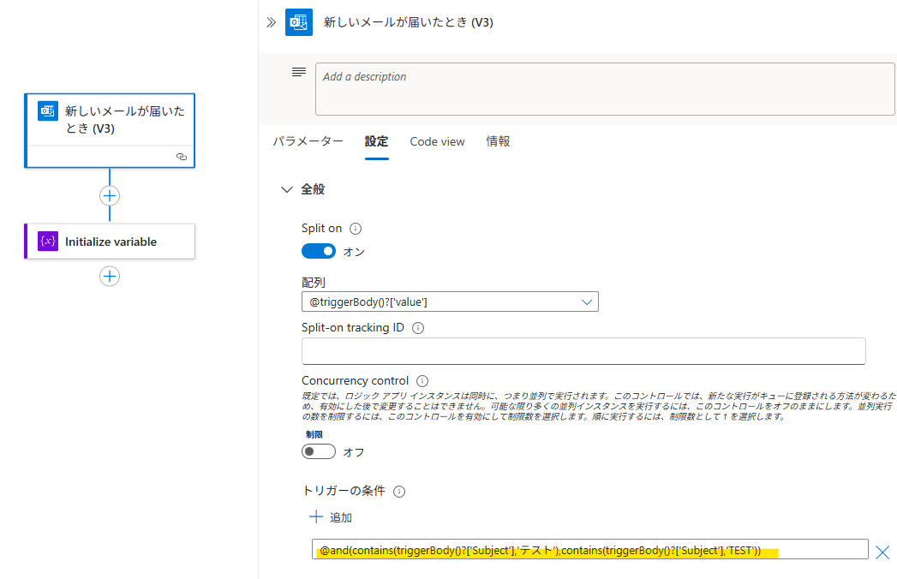
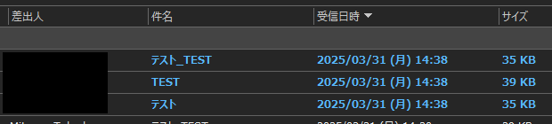
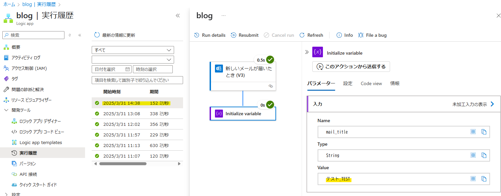
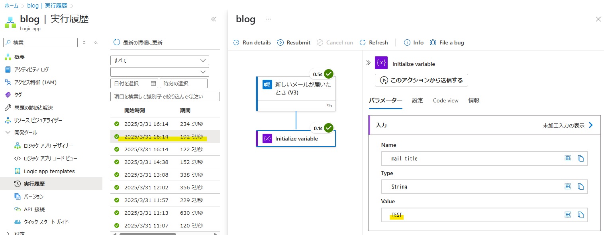

こんにちは。Azure Integration チームの武田です。 
本記事では、トリガー発火条件として、1 つの項目に複数の条件を設定する方法についてご案内させていただきます。<br>
なお、本記事では従量課金プランの Logic Apps を用いてご説明をしておりますが、Standard Logic Apps をご使用の場合でも、同じように設定をすることが可能です。

<!-- more -->

## 目次
- トリガーの発火条件に複数条件を設定する方法
- 基本的な設定例
    1. 同じ項目に AND 条件を指定
    2. 同じ項目に OR 条件を指定
- 応用的な設定方法
- まとめ


## トリガーの発火条件に複数条件を設定する方法
通常、トリガーの [パラメーター] タブにてトリガーの起動方法をご設定いただきますが、パラメーター欄では同じ項目に複数の条件を付けること、例えば 「メールの件名に『日報』か『月報』が含まれる場合」 のような条件設定はできません。
このような設定が必要な場合、[パラメーター] タブではなく、[設定] タブ内にございます [トリガーの条件] を使用して、トリガーの起動条件を設定していきます。<br>

この時、[パラメーター] タブでご設定いただくのと違い、[トリガーの条件] 欄にて指定いただきます条件はコードで記載します。
詳細な設定方法は後述いたしますが、比較したい項目の記載方法と条件式に使用できる関数について、弊社公開ドキュメントに概要をおまとめしております。ご一読いただけますと幸いです。<br>

- [トリガーとアクションの種類のスキーマ リファレンス - Azure Logic Apps | Microsoft Learn](https://learn.microsoft.com/ja-jp/azure/logic-apps/logic-apps-workflow-actions-triggers)
- [式関数のリファレンス ガイド - Azure Logic Apps | Microsoft Learn](https://learn.microsoft.com/ja-jp/azure/logic-apps/workflow-definition-language-functions-reference)


## 基本的な設定例
では、実際にトリガー条件を設定して Logic Apps を起動させてみます。
今回は例として、Office 365 Outlook コネクタより [新しいメールが届いたとき (V3)] トリガーを使用します。<br>

- [Office 365 Outlook - Connectors | Microsoft Learn # 新しいメールが届いたとき (V3)](https://learn.microsoft.com/ja-jp/connectors/office365/#%E6%96%B0%E3%81%97%E3%81%84%E3%83%A1%E3%83%BC%E3%83%AB%E3%81%8C%E5%B1%8A%E3%81%84%E3%81%9F%E3%81%A8%E3%81%8D-%28v3%29)<br>


まず、基本形として宛先メールアドレスと件名の条件を設定したトリガーの動作を確認します。
また、トリガーの挙動がわかりやすいよう、トリガーの後続処理として受信した (トリガー発火の起因となった) メールの件名を取得するアクションを設定しておきます。


宛先に設定したアドレス宛に、件名が『テスト』のメールを送ってみます。


トリガー発火条件を満たすメールを受信したことで、Logic Apps が起動していることが確認できます。

<br>

### 1. 同じ項目に AND 条件を指定
ここからは、トリガーの発火条件に複数条件を設定していきます。今回は、件名に複数条件を設定して動作確認をします。<br>

先述の通り、複数の条件を指定する場合、トリガーの [パラメーター] タブではなく、[設定] タブにございます [トリガーの条件] を使用します。
従いまして、[パラメーター] タブの [件名フィルター] には条件を記入いたしませんので、ご注意ください。


では、[設定] タブより『件名に "テスト" と "TEST" の表記が含まれる場合』というトリガー条件を設定してみます。
```
@and(contains(triggerBody()?['Subject'],'テスト'),contains(triggerBody()?['Subject'],'TEST'))
```


補足ですが、今回使用しております contains はコレクション関数のひとつで、この関数は指定したコレクションに特定の項目があるかどうかを返します。
文字列の中から特定の文字を探す、配列の中から特定の値を探す際などにご利用いただける、大変便利な関数ですので、頭の片隅に置いておいていただけますと幸いです。


- [式関数のリファレンス ガイド - Azure Logic Apps | Microsoft Learn # contains](https://learn.microsoft.com/ja-jp/azure/logic-apps/workflow-definition-language-functions-reference#contains)<br>


トリガー発火の確認をするため、それぞれ件名が『テスト』、『TEST』、『テスト_TEST』となっているメールを、宛先に指定したアドレス宛に送ります。


実行結果を確認しますと、件名が『テスト_TEST』のメールを受信した時だけトリガーが発火したことが確認できます。



### 2. 同じ項目に OR 条件を指定
同じように、OR 条件も設定してみます。
先ほど設定した条件を AND 条件から OR 条件に変更し、先ほどと同じ件名でメールを出してみます。
```
@or(contains(triggerBody()?['Subject'],'テスト'),contains(triggerBody()?['Subject'],'TEST'))
```


実行結果を確認しますと、OR 条件に変えたことで 3 通全てがトリガーの発火条件を満たすメールとなり、それぞれトリガーが発火していることが確認できます。




## 応用的な設定方法
さて、ここまでで同じ項目に AND 条件と OR 条件を指定する基本的な設定方法をご案内いたしましたが、設定の組み合わせによっては、より高度な条件を設定することができます。
例えば、「日次起動の Logic Apps で、祝祭日は起動させない」、「Logic Apps を毎日 11:00 と 12:30 に起動させる」などが可能となります。<br>

高度な条件の設定方法については、別途ブログ記事でご紹介をしております。
そちらも併せてご参照いただけますと幸いです。<br>

- [Logic Apps で日付や時刻を判定してワークフローを制御する | Japan Azure Integration Support Blog](https://jpazinteg.github.io/blog/LogicApps/LogicApps-Functions/)<br>


## まとめ
本記事では、以下についてご案内いたしました。<br>

- トリガーの発火条件に複数条件を設定する方法
- 複数条件の基本的な設定例
- 複数条件の応用的な設定方法


トリガーに複数条件を設定する方法として、本記事が少しでもお役に立ちましたら幸いです。
最後までお読みいただき、ありがとうございました。