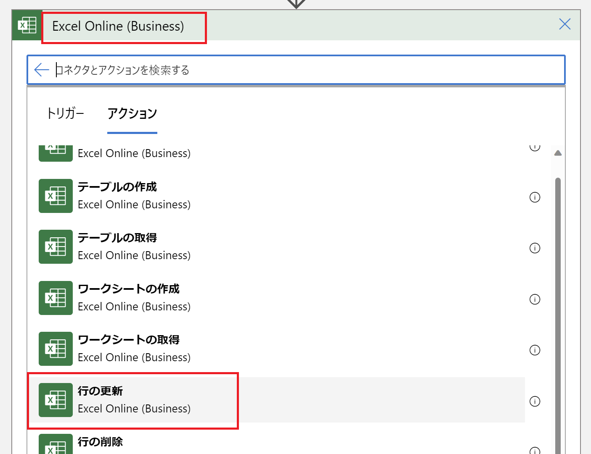
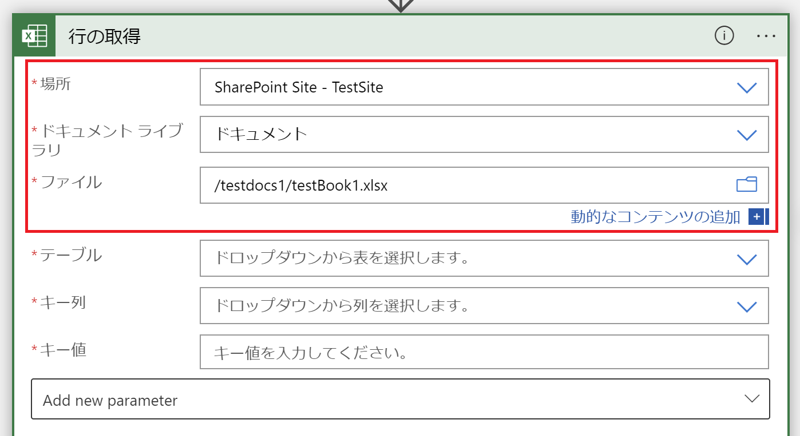
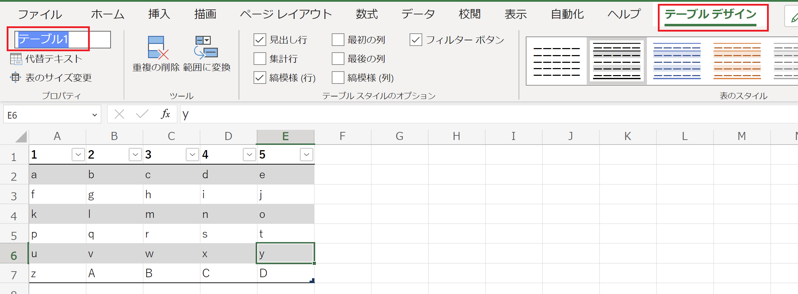
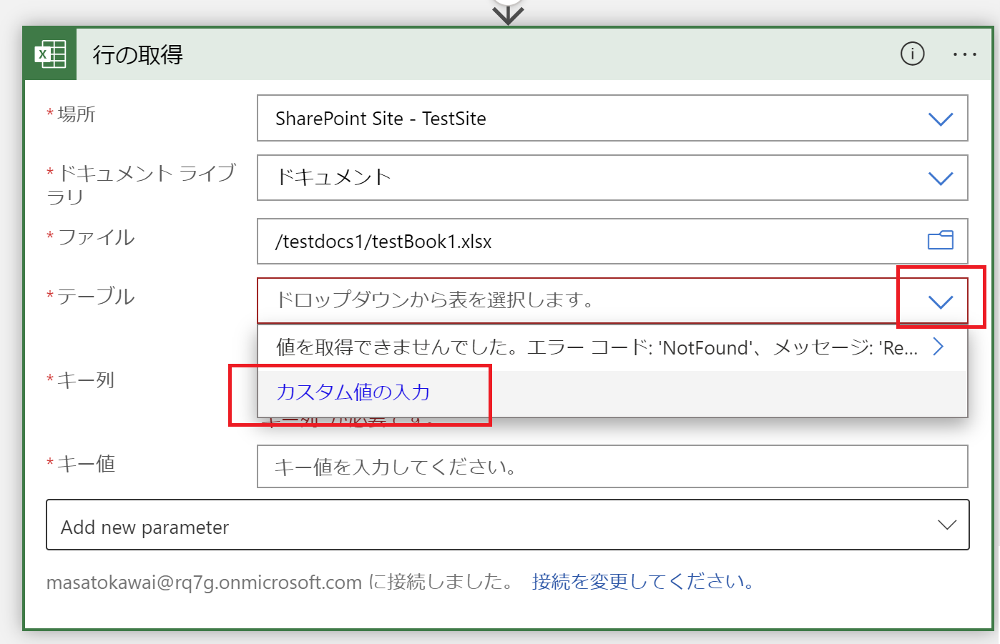
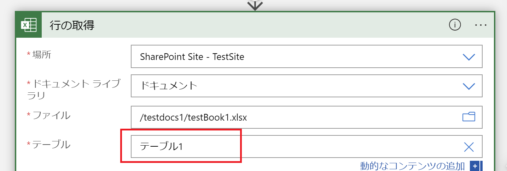

こんにちは！Azure Integration サポート チームの 川合 です。  
Logic Apps で利用できる Excel Online  (Business) コネクタにて、Excel の行の情報を取得する際にアクションの設定で対象のテーブルが表示されない場合がございます。

- [Excel Online (Business) - 行を取得する](https://learn.microsoft.com/ja-jp/connectors/excelonlinebusiness/#%E8%A1%8C%E3%82%92%E5%8F%96%E5%BE%97%E3%81%99%E3%82%8B)

今回は、その事象が発生した際の対処法についてご案内いたします。

<!-- more -->

## 目次
- 事象の詳細について
- 事象が発生した際の回避策について
- まとめ

## 事象の詳細について
本記事の事象につきましては、以下の操作を行った際に発生する事象となります。

１．コネクタを選択する。

２．対象の Excel ファイルが存在する "場所" "ドキュメントライブラリ" "ファイル" を選択する。

３．プルダウンより "テーブル" を選択するが、表示されない。

以上が本記事の事象となります。
なお、こちらにつきましては Logic Apps のみの既知の事象でございます。Power Automate では事象は発生いたしません。
また、お客様にはご不便をおかけしますが、上記の振る舞いについてはプログラムの変更等の予定はございません。
その為、事象が発生した際の回避策につきまして、以下に記載いたします。

## 事象が発生した際の回避策について
上記事象が発生した際の回避策につきましては、"テーブル" の項目に直接 Excel ファイルに設定いただいておりますテーブルの値をカスタム値として入力いただくことで、テーブルの設定および後続の項目について設定することが可能でございます。
具体的な操作方法につきましては以下の通りでございます。

＜操作方法＞
１．Excel ファイルに設定しているテーブルの値を控える。

２．コネクタを選択し、対象の Excel ファイルが存在する "場所" "ドキュメントライブラリ" "ファイル" を選択する。

３．"テーブル" のプルダウンより、行を取得したいテーブルの値をカスタム値入力する。

４．上記の通り設定し、対象の "キー列" が表示されることを確認する。

以上より、行の取得アクションにてテーブルの値を設定することが可能となります。
お手数をおかけして誠に申し訳ございませんが、本事象が発生しました際には、当ブログの手順にて回避策をお試しいただきますようお願い申し上げます。

## まとめ
本記事では、以下についてご案内いたしましたが、ご理解いただけましたでしょうか。
- 事象の詳細について
- 事象が発生した際の回避策について

本記事が少しでもお役に立ちましたら幸いです。最後までお読みいただき、ありがとうございました！

<Azure Logic Apps の参考サイト>
-- 概要 - Azure Logic Apps とは
https://docs.microsoft.com/ja-jp/azure/logic-apps/logic-apps-overview
Azure Logic Apps とは、ロジック アプリ デザイナーでフロー チャートを用いて作成したワークフローを自動実行するソリューションです。
Azure Logic Apps では、条件分岐などを実装することができ、ワークフローの実行状況に応じて実行する処理を分岐することが可能です。
