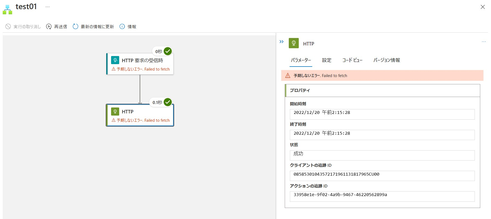
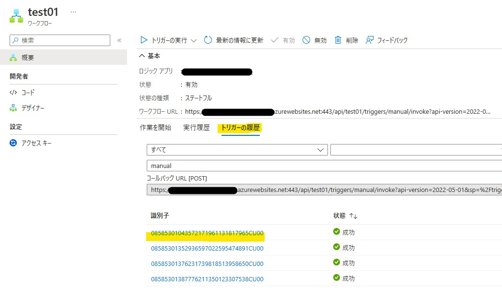
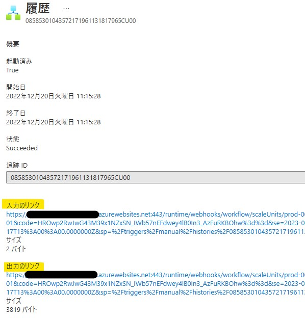
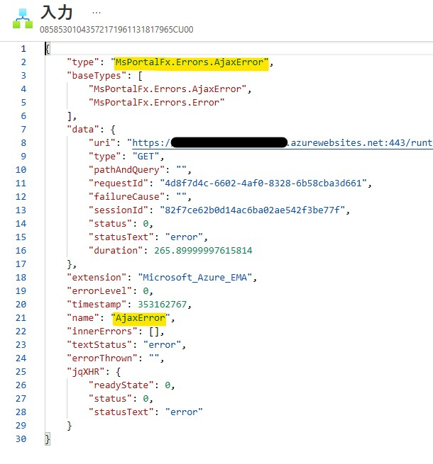
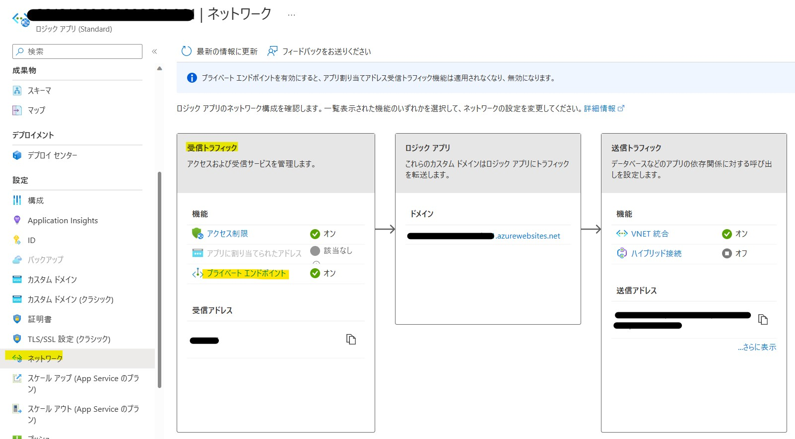
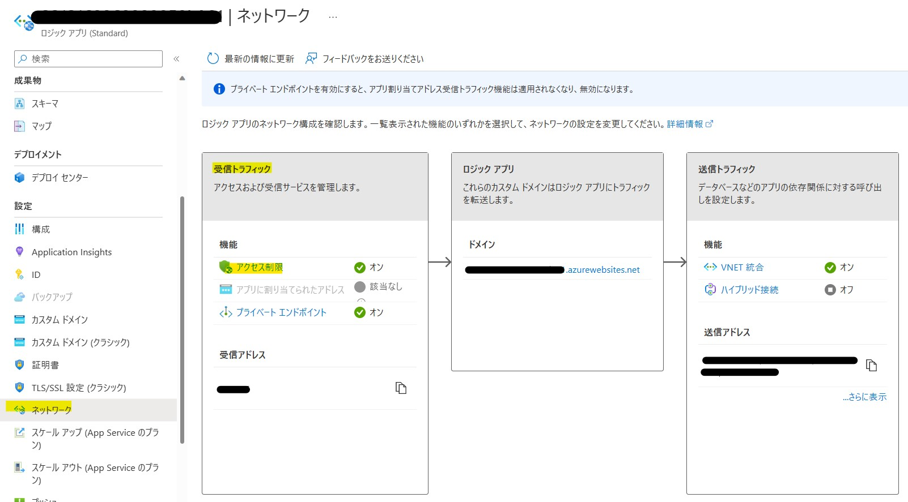

こんにちは。Azure Integration サポート チームの髙橋です。

Standard Logic Apps の実行履歴にて「Failed to fetch」というエラーが表示される原因と回避策について説明します。

<!-- more -->

## こんな方におすすめです
- Standard Logic Apps の実行履歴にて「Failed to fetch」というエラーが表示され、実行履歴が確認できずにお困りの方

## 関連情報
- Standard Logic Apps についての公開情報は以下になります。
  - 参考ドキュメント : [Azure Logic Apps でのシングルテナント、マルチテナント、統合サービス環境の比較](https://learn.microsoft.com/ja-jp/azure/logic-apps/single-tenant-overview-compare)
  - 参考ドキュメント : [シングルテナント Azure Logic Apps の Standard ロジック アプリ ワークフロー デザイナーについて](https://learn.microsoft.com/ja-jp/azure/logic-apps/designer-overview)

- プライベート エンドポイントの設定についての公開情報は以下になります。
  - 参考ドキュメント : [プライベート エンドポイントを使って Standard ロジック アプリと Azure 仮想ネットワーク間のトラフィックをセキュリティで保護する](https://learn.microsoft.com/ja-jp/azure/logic-apps/secure-single-tenant-workflow-virtual-network-private-endpoint)

- 英語表記となりますが、当該事象につきましては以下のブログにも記載がございます。
  - 参考ドキュメント : [Common errors in Azure Logic Apps (Standard) - Unexpected error. Failed to fetch](https://techcommunity.microsoft.com/t5/integrations-on-azure-blog/common-errors-in-azure-logic-apps-standard-unexpected-error/ba-p/3293197)

## 事象
Standard Logic Apps の実行履歴にて「Failed to fetch」というエラーが表示されることがございます。

以下のようにエラーが表示され、実行履歴の詳細が確認できません。

また、「トリガーの履歴」タブにて識別子を選択し、「入力のリンク」または「出力のリンク」を選択します。

以下のように「MsPortalFx.Errors.AjaxError」とエラー表示され、トリガーの履歴につきましても詳細が確認できません。

## 原因
通常原因としては、以下 2 点が挙げられます。

1. プライベート エンドポイントが有効化されている場合

Standard Logic Apps の「受信トラフィック」にて「プライベート エンドポイント」が有効化されている場合、
実行履歴に「予期しないエラー. Failed to fetch」と表示されますのは、想定動作となります。

※ [ロジック アプリ] - [<対象の ロジック アプリ>] - [設定 - ネットワーク] と遷移し、「受信トラフィック」にて設定状況をご確認いただけます。

プライベート エンドポイントを有効化したことにより、当該 Logic Apps に対しては、同一仮想ネットワークからのみのアクセスを許可している状態となります。
そのため、同一仮想ネットワーク外からのアクセスでは、「Failed to fetch」というエラーが表示され、実行履歴をご確認いただけません。
(実際のワークフローの「成功」、「失敗」に関わらず、こちらのエラーが表示されます。)
- 参考ドキュメント : [Azure App Service のアクセス制限](https://learn.microsoft.com/ja-jp/azure/app-service/overview-access-restrictions)

2. アクセス制限の設定を行っている場合

Standard Logic Apps の「受信トラフィック」にて「アクセス制限」を設定されている場合、「許可」に設定されているパブリック IP アドレス以外からのアクセスを拒否いたしますので、想定動作となります。
※ [ロジック アプリ] - [<対象の ロジック アプリ>] - [設定 - ネットワーク] と遷移し、「受信トラフィック」にて設定状況をご確認いただけます。

## 回避策
1. プライベート エンドポイントが有効化されている場合

Standard Logic Apps のプライベート エンドポイントが配置されている仮想ネットワークと、同一の仮想ネットワークに仮想マシンを作成します。
作成した仮想マシンにリモート デスクトップ接続を行い、Azure ポータルへアクセスしますと、実行履歴をご確認いただけます。

2. アクセス制限の設定を行っている場合

[ロジック アプリ] - [<対象の ロジック アプリ>] - [設定 - ネットワーク] と遷移し、「アクセス制限」にて当該 Logic Apps へアクセスしている端末のパブリック IP アドレスを許可します。
