こんにちは！Azure Integration サポート チームの 川合 です。  

Azure Logic Apps でファイルを操作する際、CSV から JSON、JSON から XML 等ファイルフォーマットを変換されたい場合があるかと思います。
今回は、Azure Logic Apps でいくつかのファイルフォーマットを変換する Tips をお届けします！

<!-- more -->

## 目次
- 1． JSON → XML
- 2． XML → JSON
- 3． JSON → CSV
- 4． CSV → JSON
- 5． CSV → XML
- 6． XML → CSV
- 7． HTML → TXT
- まとめ

## 1．JSON → XML
JSON から XML へのフォーマット変換につきましては、以下の xml 関数をご利用いただくことで変換可能でございます。

- [xml](https://learn.microsoft.com/ja-jp/azure/logic-apps/workflow-definition-language-functions-reference#xml)

例
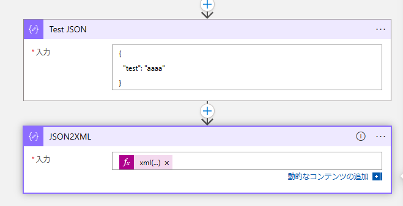
```
xml(outputs('Test_JSON'))
```

結果
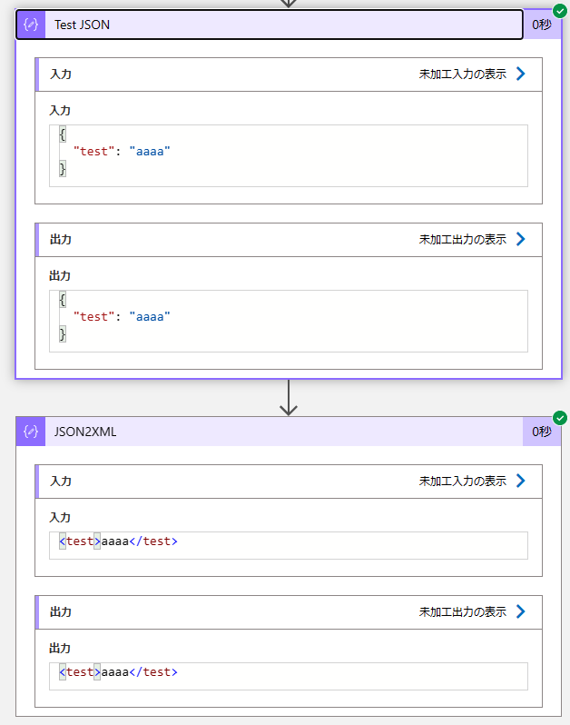

1 つ目の Tips については以上となります。


## 2．XML → JSON
XML から JSON へのフォーマット変換につきましては、以下の JSON 関数をご利用いただくことで変換可能でございます。

- [json](https://learn.microsoft.com/ja-jp/azure/logic-apps/workflow-definition-language-functions-reference#json)

例


xml についてはサンプルとして以下のように設定しております。
```
xml('<?xml version="1.0"?> <root> <person id="1"> <name>Sophia Owen</name> <occupation>Engineer</occupation> </person> </root>')
```

また、JSON 関数には以下の値を指定しております。
```
json(outputs('Test_XML'))
```

結果
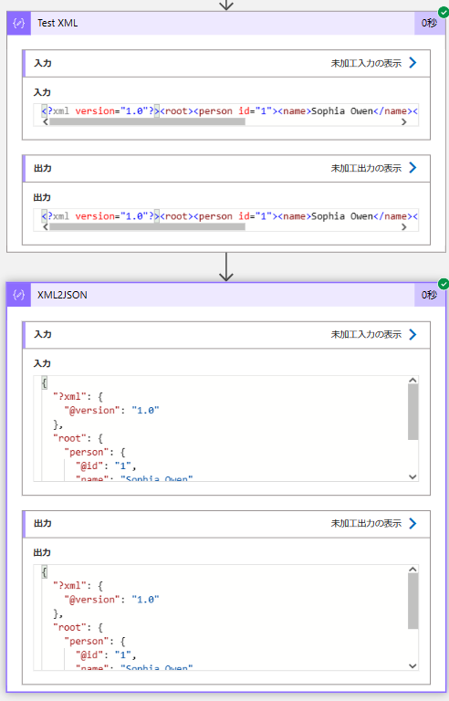

2 つ目の Tips については以上となります。

## 3．JSON → CSV
JSON から CSV へのフォーマット変換につきましては、CSV テーブルの作成アクションにて設定可能でございます。
- [Azure Logic Apps でデータの操作を実行する # CSV テーブルの作成アクション](https://learn.microsoft.com/ja-jp/azure/logic-apps/logic-apps-perform-data-operations#create-csv-table-action)


ただし、こちらのアクションにつきましては配列形式のインプットが必要となりますので、JSON プロパティを含む配列形式に設定いただく必要がございます。
例えば、以下図の例ですと、作成 2 アクション内で JSON オブジェクトを作成しておりますが、CSV テーブルの作成 アクションへ引き渡す値については array 関数にて配列形式に変換しております。

例
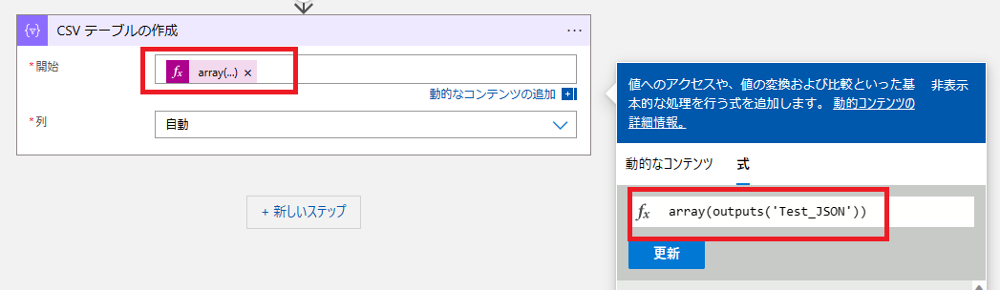
array(outputs('Test_JSON'))

結果


3 つ目の Tips については以上となります。

## 4．CSV → JSON
まず、CSV 形式を基にしたファイルフォーマットに関する関数やアクションはございません。その為、別途作り込みが必要になります。
参考までに、以下のように式関数とアクションを組み合わせて変換するサンプルフローをご案内いたします。
こちらはあくまでも参考情報ですので、商用環境でご利用になられる場合はお客様の責任のもと、お客様にて設計、試験等を実施頂き、お客様の判断にて採用要否の判断をお願い申し上げます。
※本テクニカルサポートとしましては本サンプルに関する構築支援は実施致しません。

例
1. CSV フォーマットのデータを取得する。本例では BLOB 上の CSV を取得します。
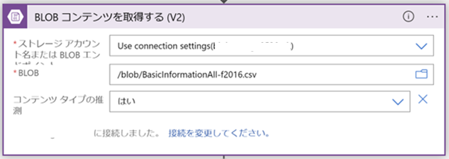

2. “変数を初期化する” アクションで “アレイ” を選択します。
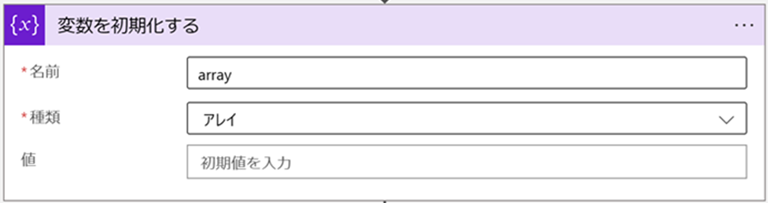

3. “変数を初期化する” アクションで “文字列” を選択し、動的コンテンツで “BLOB コンテンツを取得する (V2) ” のファイルコンテンツを指定します。


4. "選択" アクションを設定し、開始に以下の式関数を設定します。


・skip(split(variables('csv'),base64ToString('Cg==')),1)

- [skip](https://learn.microsoft.com/ja-jp/azure/logic-apps/workflow-definition-language-functions-reference#skip)

- [split](https://learn.microsoft.com/ja-jp/azure/logic-apps/workflow-definition-language-functions-reference#split)

- [variables](https://learn.microsoft.com/ja-jp/azure/logic-apps/workflow-definition-language-functions-reference#variables)

- [base64ToString](https://learn.microsoft.com/ja-jp/azure/logic-apps/workflow-definition-language-functions-reference#base64tostring)


※ base64ToString('Cg==') は改行文字 「/n」と同じ値であるため
利用中の CSV の改行文字が「\r\n」の場合は base64ToString('DQo=') に置き換える。

5. 上記図のマップの左側に CSV のカラム名を手動設定し、右側に以下のように式関数を設定します。(配列は0始まり)
・split(item(),',')[0]
・split(item(),',')[1]
・split(item(),',')[2]
・split(item(),',')[3]
・split(item(),',')[4]

※ [] 内の数字についてはカラム位置を指定します。

以上の通り実施いただくことで、以下のような JSON 形式の結果を取得することが可能でございます。

結果
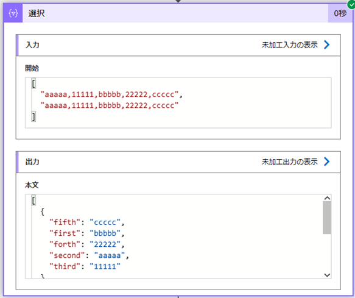

なお、カラムの順番につきましてはマップに指定している文字列に依存しますのでご留意ください。
必要に応じてカラム名に数字を付与する等の対応が必要になります。

4 つ目の Tips については以上となります。


## 5．CSV → XML
CSV 形式から XML 形式への変換につきましては、上記で作成した JSON 形式の値に対して、以下の通り For each ステートメントおよび “配列変数に追加” アクションを設定し、＜2. “変数を初期化する” アクションで “アレイ” を選択。＞で作成した配列に対して値を設定することで変換可能でございます。
こちらも以下に設定例を記載いたします。

例
1. For each ステートメントを手動で設定し、“配列変数に追加” アクションを追加後以下の値を設定します。
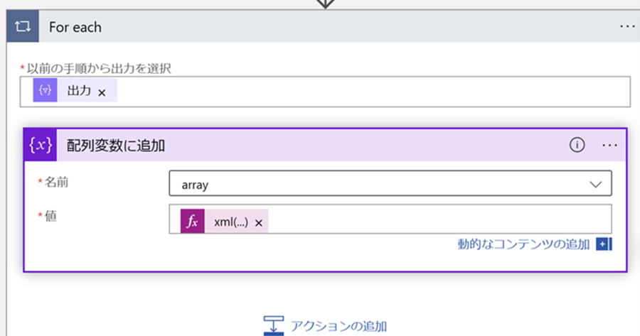

＜For each アクション＞
・以前の手順から出力を選択： 動的コンテンツ -  選択 - 出力

＜配列変数に追加＞
・名前：array ( "4．CSV → JSON" の手順 2. “変数を初期化する” アクションで指定した名前)
・値：xml(setProperty(json('{}'),'sample',items('For_each')))

2. "作成" アクション等、XML を出力したいアクションを利用し、以下の関数を設定します。
```
xml(concat('<test>',join(variables('array'),''),'</test>'))
```

結果


以上のように、作り込みをいただくことで、CSV からのファイルフォーマットの変換が可能でございます。

5 つ目の Tips については以上となります。

## 6．XML → CSV
XML から CSV につきましては、先にご案内申し上げました、XML から JSON にフォーマット変換いただいた後で、JSON からCSV へのフォーマット変換を実施いただくことで設定可能でございます。


## 7．HTML → TXT
最後に、HTML から TXT へのフォーマット変換につきましては、プレビュー機能ではございますが、以下の Content Conversion (プレビュー) コネクタをご利用いただくことで変換可能でございます。

- [Content Conversion (プレビュー)](https://learn.microsoft.com/ja-jp/connectors/conversionservice/)

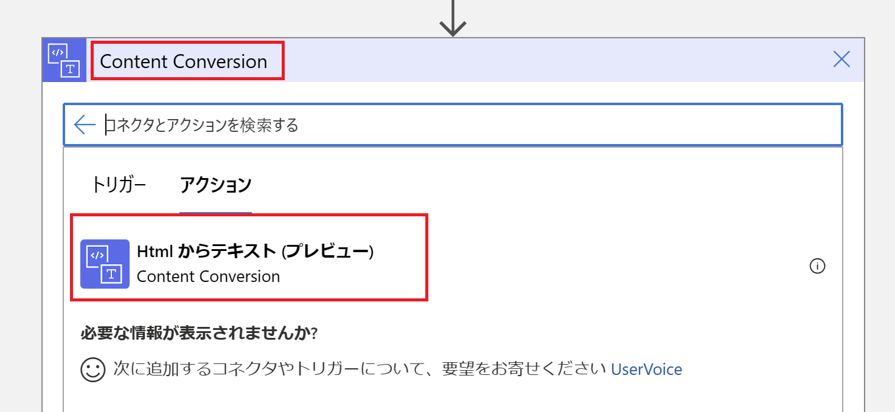

こちらにつきましては、直接 HTML の内容を入力するのではなく、以下のようにコネクタから取得できるような HTML コンテンツを指定いただく必要がございます。
例


結果
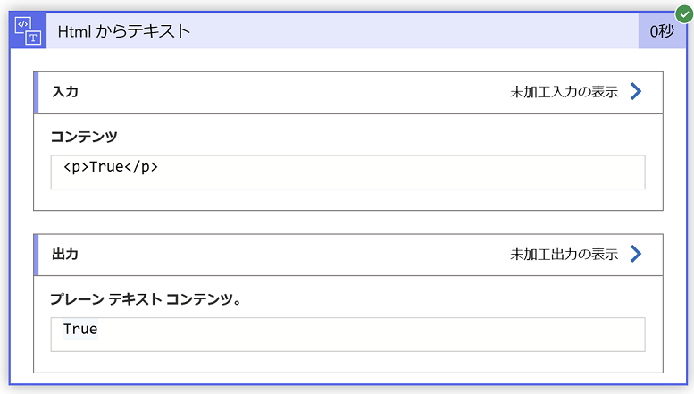

直接 HTML の内容をテキスト入力すると以下のような結果となります。


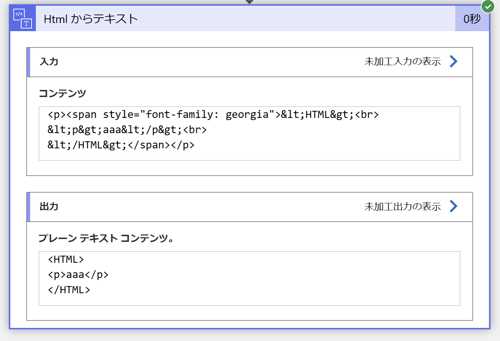

こちらのコネクタにつきましては、2023年 2 月現在プレビュー機能となっておりますため、今後予告なく仕様の変更が発生する可能性がございますのでご留意下さい。

なお、よくあるお問い合わせとして YAML 形式の変換は出来ないのかとご質問をいただくのですが、誠に申し訳なくも YAML 形式については 2023 年 2 月現在で対応しておりませんのでご了承いただきたく存じます。

## まとめ
本記事では、以下のファイルフォーマット変換についてご案内いたしましたが、ご理解いただけましたでしょうか。
- 1． JSON → XML
- 2． XML → JSON
- 3． CSV → JSON
- 4． CSV → XML
- 5． JSON → CSV
- 6． XML → CSV
- 7． HTML → TXT

本記事が少しでもお役に立ちましたら幸いです。最後までお読みいただき、ありがとうございました！

<Azure Logic Apps の参考サイト>
-- 概要 - Azure Logic Apps とは
https://learn.microsoft.com/ja-jp/azure/logic-apps/logic-apps-overview
Azure Logic Apps とは、ロジック アプリ デザイナーでフロー チャートを用いて作成したワークフローを自動実行するソリューションです。
Azure Logic Apps では、条件分岐などを実装することができ、ワークフローの実行状況に応じて実行する処理を分岐することが可能です。
