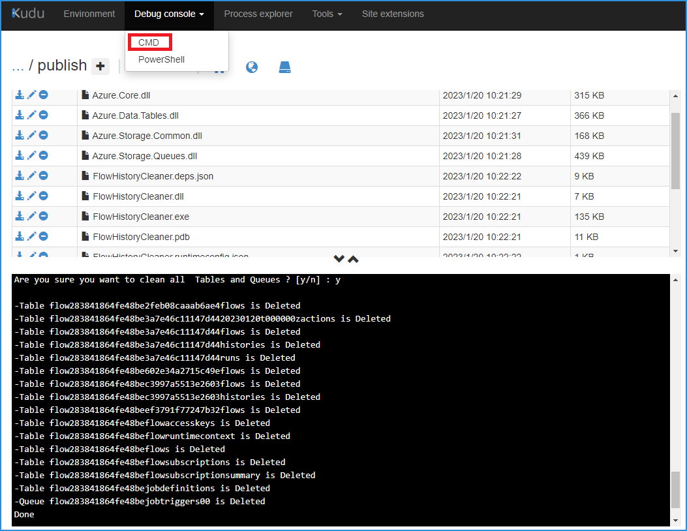
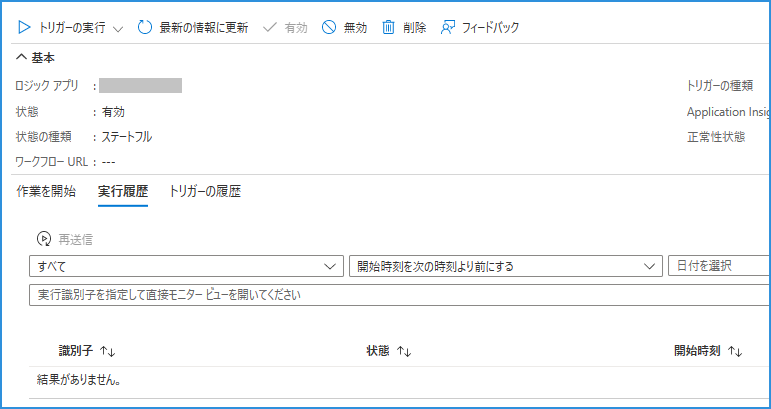

こんにちは。 Azure Integration サポート チームの山田です。 
本記事では、Standard Logic Apps のワークフロー実行ログを削除する便利ツールについて、ご紹介いたします。

<!-- more -->

## 前提条件

- Standard 版の Logic Apps で利用いただけるツールです。
- ログの保存期間に関しまして、正式なドキュメントは以下にございます。
    - [制約と構成の参考ガイド#実行継続時間および履歴保有の制限 - Azure Logic Apps | Microsoft Learn](https://learn.microsoft.com/ja-jp/azure/logic-apps/logic-apps-limits-and-config?tabs=consumption%2Cazure-portal#run-duration-and-history-retention-limits)
- 制限増減の設定箇所に関しても案内がございます。
    - [制約と構成の参考ガイド#実行継続時間とストレージでの履歴の保持期間を変更する - Azure Logic Apps | Microsoft Learn](https://learn.microsoft.com/ja-jp/azure/logic-apps/logic-apps-limits-and-config?tabs=standard%2Cazure-portal#change-run-duration-and-history-retention-in-storage)

## Standard Logic Apps のワークフロー実行ログを削除する「Flow History Clearner」

- 前提条件を踏まえた「削除」手段としての「便利ツール」をご紹介いたします。
- 手動でも削除が可能なことがご確認いただけます。

### Flow History Cleaner について

[Logic App Standard Flow History Cleaner - Microsoft Community Hub](https://techcommunity.microsoft.com/t5/integrations-on-azure-blog/logic-app-standard-flow-history-cleaner/ba-p/3582258)

> Application that deletes the Tables and the Queues in the Logic app Standard storage account.
> it will help you in the development process, especially if there are stuck flows in the running state 
>
> How to download the application
> Open the Kudo https://docs.microsoft.com/en-us/azure/app-service/resources-kudu from Logic app site

> <日本語訳>
>
> 「フロー履歴クリーナー」
> Logic Apps Standard のストレージアカウントにあるテーブルとキューを削除するアプリケーションです。
> 実行中のフローを停止させている場合において、開発工程に役立ちます。
>
> アプリケーションのダウンロード方法
> Logic Apps のサイトから Kudu を開きます。

### Kudu から Flow History Cleaner を利用する

[Kudu サービスの概要 - Azure App Service | Microsoft Learn](https://learn.microsoft.com/ja-jp/azure/app-service/resources-kudu)

Kudu は、以下のようにアクセスいたします。
`https://<Logic Apps Standard名>.scm.azurewebsites.net`

Kudu 上部から [Debug console] - [CMD] に遷移いたします。
 


下部 CLI 上にて、以下コマンドを用います。

```
git clone https://github.com/mbarqawi/FlowHistoryCleaner.git
```

```
Cd FlowHistoryCleaner
dotnet publish
Cd FlowHistoryCleaner\bin\Debug\netcoreapp3.1\publish
FlowHistoryCleaner.exe
```

上のコマンドにて clone した FlowHistoryCleaner フォルダ内で、`dotnet publish` を行いますと、`FlowHistoryCleaner.exe` が利用いただけるようになります。

```
C:\home\FlowHistoryCleaner\FlowHistoryCleaner\bin\Debug\netcoreapp3.1\publish>FlowHistoryCleaner.exe
will use the connection string DefaultEndpointsProtocol=https;AccountName=playgroundeastjapan9aea;AccountKey=uwx+LUhDpdjeqVf5riH0MMUwaDF4a1eJIx+0Yc2CRnZ49O09abVvpYobK3iWf4I/65CQumhq7GrD+ASt2DJaSg==;EndpointSuffix=core.windows.net 
Are you sure you want to clean all  Tables and Queues ? [y/n] : y
```




当方の手元では、例として、以下のようなワークフロー履歴につきまして確認しております。


 
実行後、以下のようにクリアされることをご覧いただけます。



あくまで「便利ツール」としてのご案内ではございますが、当記事がお力になれれば幸いです。


## まとめ
本記事では Logic Apps Standard でワークフロー実行ログを削除する方法について説明いたしました。本記事がお客様のシステム保守の一助になりますと幸いです。

## 参考情報
- [Logic App Standard Flow History Cleaner - Microsoft Community Hub](https://techcommunity.microsoft.com/t5/integrations-on-azure-blog/logic-app-standard-flow-history-cleaner/ba-p/3582258)
- [mbarqawi/FlowHistoryCleaner](https://github.com/mbarqawi/FlowHistoryCleaner)
