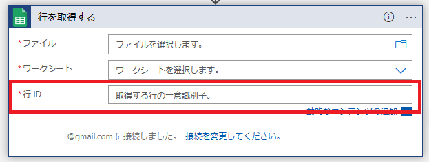
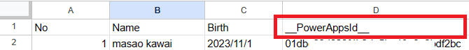
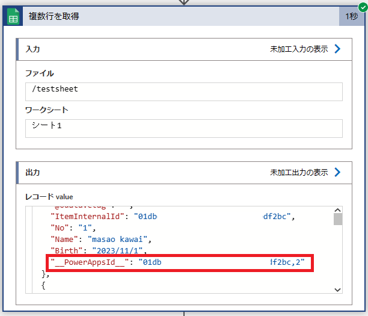
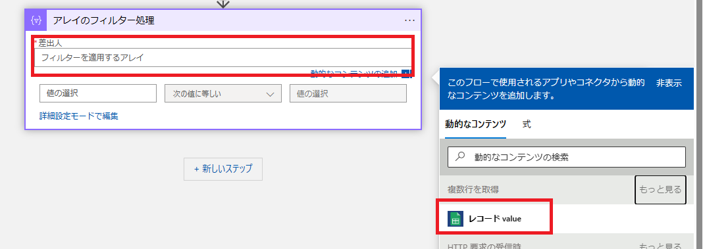
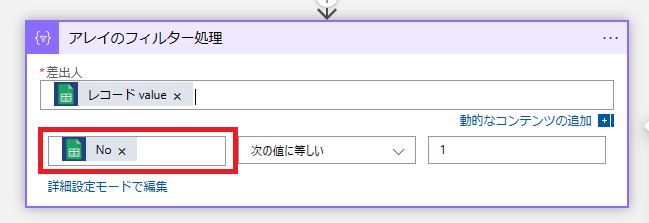
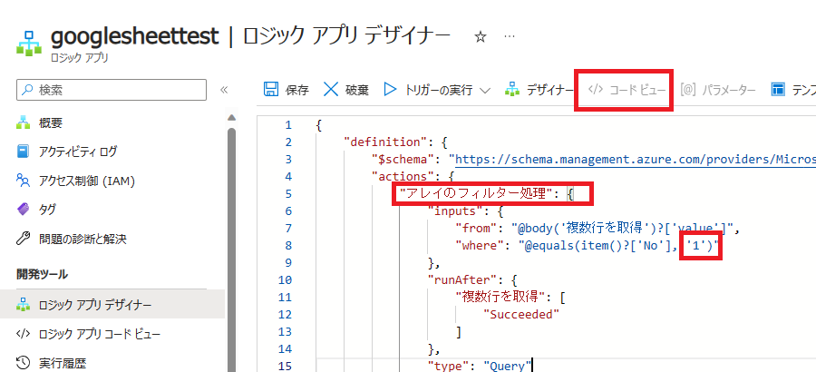
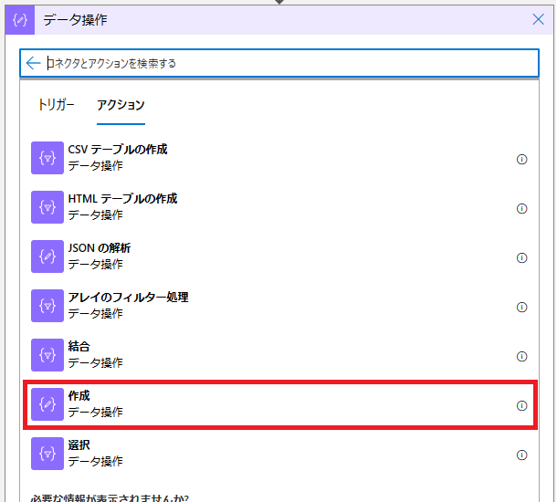
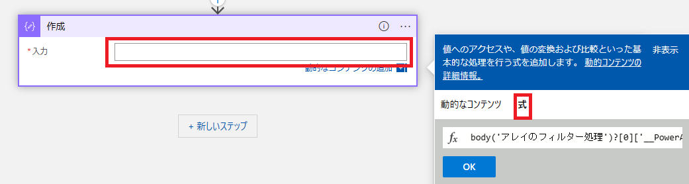
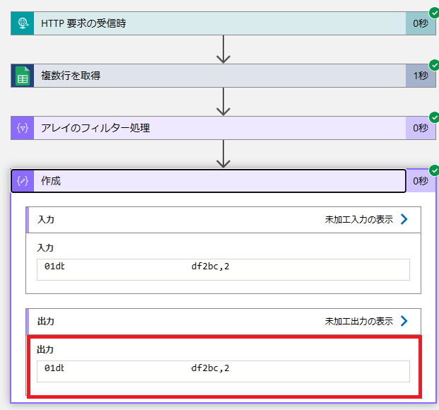

こんにちは！Azure Integration サポート チームの 川合 です。  

Logic Apps から Google Sheets に対して行の取得や更新等をされたい場合、以下の Google Sheets コネクタを利用することで実現可能です。

- [Google Sheets](https://learn.microsoft.com/ja-JP/connectors/googlesheet/)

しかしながら、こちらのアクションで利用する行 ID については、本日現在（2023 年 11 月現在）でプルダウンのようにシステム上で動的に指定が出来ない仕様でございます。

今回は、こちらのアクションを利用するにあたり、行 ID を取得する小技についてご案内申し上げます。
なお、本ブログでご案内する仕組みについてはあくまで参考情報となります。こちらをお客様の商用環境でご利用になる場合は十分にお客様環境で検証いただき、設計および製造、試験をお客様の責任で実施いただきますようお願い申し上げます。

<!-- more -->

## 目次
- 前提条件
- Google Sheets コネクタの設定
- アレイのフィルター処理
- まとめ

## 前提条件
今回の手順を実施する前に、Google Sheets 上に "\_\_PowerAppsId\_\_" という行 ID を格納する列が必要となります。

こちらの列については手動で作成いただかなくても、行の挿入アクションで行を挿入した際に自動的に挿入される列となります。
- [Google Sheets # 行の挿入](https://learn.microsoft.com/ja-JP/connectors/googlesheet/#%E8%A1%8C%E3%81%AE%E6%8C%BF%E5%85%A5)

また、こちらの値についてはランダムに設定される値となります。
以上の前提条件が整いましたら、後続のアクションの設定に移ります。

## Google Sheets コネクタの設定
こちらの ID についてですが、先に記載いたしました通り、行の取得アクションなどでシステムで動的な取得が出来ません。
その為、Google スプレッドシートの画面から値を確認し、ワークフローのアクションに手動で当該の ID を設定頂く必要がございますが、複数行を取得アクションを利用すると行 ID を取得することが可能でございます。

- [Google Sheets # 複数行を取得](https://learn.microsoft.com/ja-JP/connectors/googlesheet/#%E8%A4%87%E6%95%B0%E8%A1%8C%E3%82%92%E5%8F%96%E5%BE%97)

・コネクタの実行結果

上記の実行結果からも分かる通り、"\_\_PowerAppsId\_\_" の値がそのまま取得されるわけではなく、カンマ区切りで行番号が設定されていることが確認できます。
以上より、当該の行 ID が取得できますが、このままでは全ての行に対して "\_\_PowerAppsId\_\_" が取得されてしまいます。
その為、次に記載いたします通り アレイのフィルター処理 アクションにて取得したい行の値のみを取得致します。

## アレイのフィルター処理
Google Sheets コネクタの後続処理に "アレイのフィルター処理" アクションを設定いたします。

- [Azure Logic Apps でデータの操作を実行する # 配列のフィルター処理アクション](https://learn.microsoft.com/ja-jp/azure/logic-apps/logic-apps-perform-data-operations?tabs=consumption#filter-array-action)
上記の公開情報については比較的良く使うデータ操作のコネクタやテクニックがございますので、先頭から読み進めていただくことを推奨いたします。

次に、アレイのフィルター処理アクションに以下の値を設定いたします。

＜設定値＞
・差出人："動的なコンテンツ" より "レコード value" を選択

・左辺：行の主キーになる列の値。本例では No 列を指定します。
・条件：特定の一行を取得する任意の条件（お客様のデータに依存）
・右辺：特定の一行を取得する任意の値（お客様のデータに依存）

こちらで、一意の値のみを取得する条件を設定いただくことで、当該行の ID を取得することが可能でございます。
ただし、ここで注意が必要な点がございます。本例では No が数字となっておりますが、こちら "アレイのフィルター処理" アクションの右辺に直接数字を指定した場合、正常に取得できない場合がございます。
その場合、以下のようにコードビューにて直接 JSON の内容を修正し、シングルコーテーションで文字を囲う必要がございますのでご留意ください。

また、上記のままですと行 ID のみを利用することが出来ませんので、以下のように作成アクションなど、一時的に値を格納する変数のようなアクションを利用し、JSON プロパティから値を抜き出します。
式関数に、以下のような値を設定することで、データの取得が可能でございます。

＜式関数＞
body('アレイのフィルター処理')?[0]['\_\_PowerAppsId\_\_']
※上記式関数をブラウザ上でコピー＆ペーストした際に、文字コードの都合上そのまま利用できない場合があります。必要に応じてシングルコーテーションを入力し直して下さい。

こちらは、body 関数でアレイのフィルター処理から Body を指定し、[0] にて 0 番目の配列を指定いたします。（アレイのフィルター処理にて配列が1つのみ取得できる前提）
最後に、"\_\_PowerAppsId\_\_" のプロパティを指定します。

最後に、ワークフローを保存して実行すると、以下のように行 ID を取得することが可能でございます。

上記の出力を基に、Google Sheets コネクタにて特定行の更新や削除など、行 ID を利用する処理を行うことが可能でございます。

## まとめ
本記事では、以下についてご案内いたしましたが、ご理解いただけましたでしょうか。
- 前提条件
- Google Sheets コネクタの設定
- アレイのフィルター処理
- まとめ

本記事が少しでもお役に立ちましたら幸いです。最後までお読みいただき、ありがとうございました！

<Azure Logic Apps の参考サイト>
-- 概要 - Azure Logic Apps とは
https://learn.microsoft.com/ja-jp/azure/logic-apps/logic-apps-overview
Azure Logic Apps とは、ロジック アプリ デザイナーでフロー チャートを用いて作成したワークフローを自動実行するソリューションです。
Azure Logic Apps では、条件分岐などを実装することができ、ワークフローの実行状況に応じて実行する処理を分岐することが可能です。
