こんにちは。 Azure Integration サポート チームの大田です。 
Logic Apps の HTTP アクションから長時間の処理を伴うサービスをリクエストする場合、下図のようにタイムアウト エラーを生じます。


本エラーは下記の公開情報にございます HTTP 要求のタイムアウト期間に関する制限が原因となります。
- [HTTP 要求のタイムアウト期間に関する制限](https://docs.microsoft.com/ja-jp/azure/logic-apps/logic-apps-limits-and-config?tabs=azure-portal#http-request-limits)

本記事では非同期ポーリング パターンを用いて HTTP アクションのタイムアウト エラーを回避する方法をサンプルを用いてご紹介します。

<!-- more -->

## 前提条件
- 今回の記事では従量課金版ロジック アプリを利用しますが、スタンダード版のロジック アプリでも問題ありません。

## サンプルによる解説の流れ
本記事では、最終的に非同期ポーリング パターンにより HTTP アクションのタイムアウト エラーを回避するサンプルを構築いたします。

まずは タイムアウト エラーを生じる状況を再現するサンプルを構築いたします。
その後、サンプルを改修し非同期ポーリング パターンによってタイムアウト エラーが解消されることを確認いたします。
### 1. タイムアウト エラーが生じる状況の再現
タイムアウト エラーを生じる状況をクライアント側とサーバー側の 2 つのロジック アプリによって再現いたします。

#### 1-1. サーバー側ロジック アプリの構築
サーバー側のロジック アプリ（**SampleServerSide**）を、Azure portal から作成します。
> 今回の記事では従量課金版ロジック アプリを利用しております。

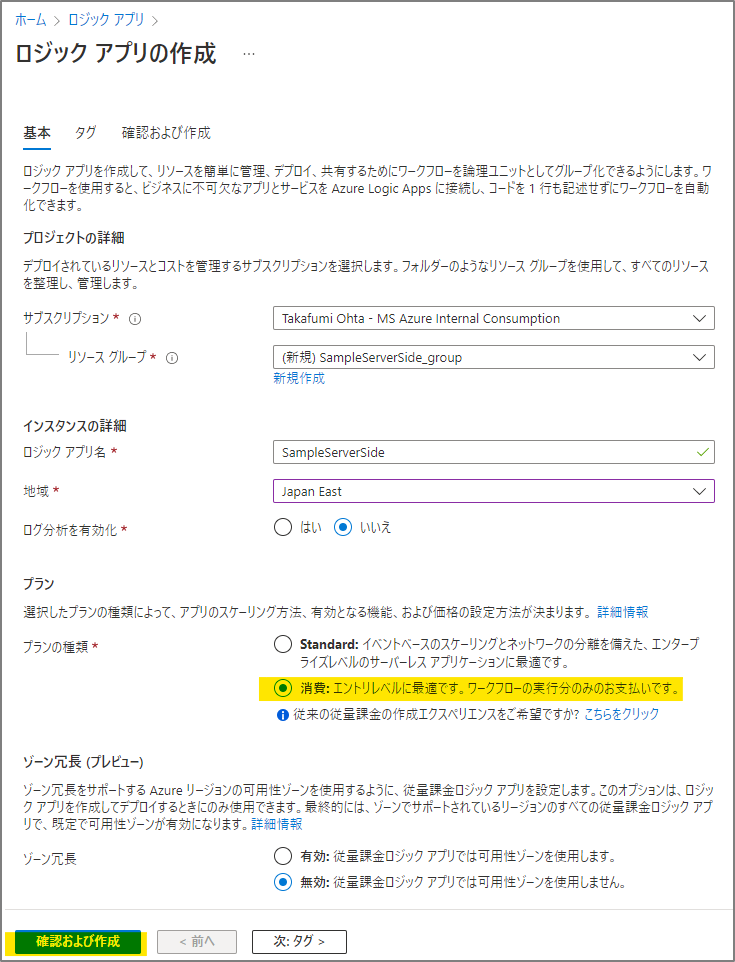

ロジックアプリ作成後にテンプレートから **HTTP 要求の受信時** を選択します。
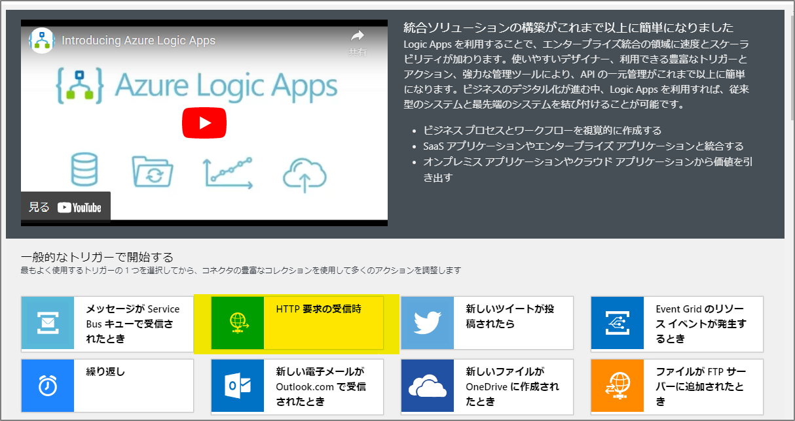

HTTP 要求の受信時 トリガーの **Add new parameter** から **メソッド** を選択します。
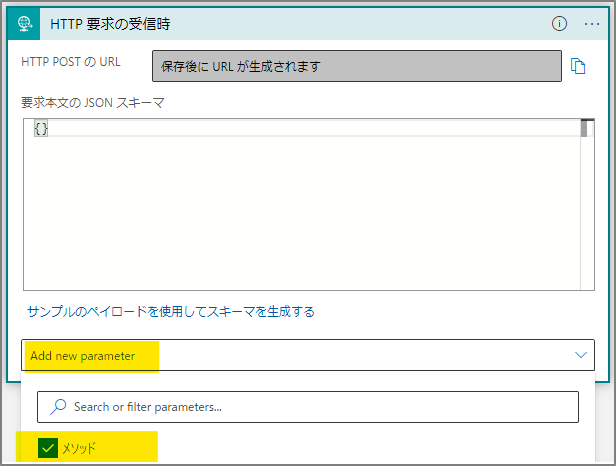

**メソッド** を **GET** に設定します。
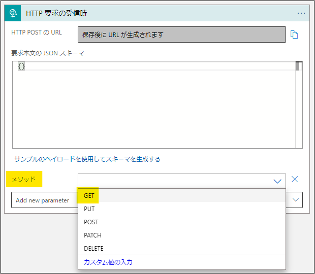

作成されたテンプレートに**応答アクション**を追加して、ワークフローを保存します。
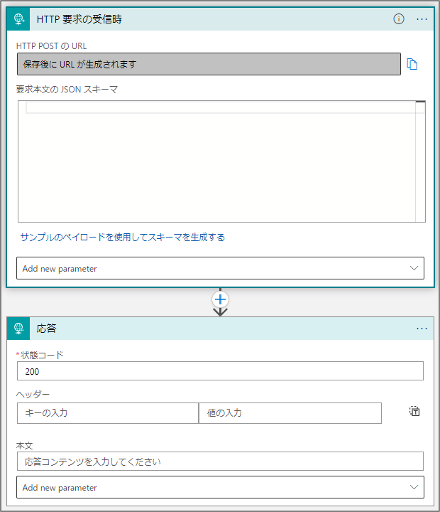

ワークフローを保存すると、本ロジック アプリへの HTTP アクセス用 URL が発行されます。
本 URL はクライアント側の設定で使用するのでメモをしておいてください。
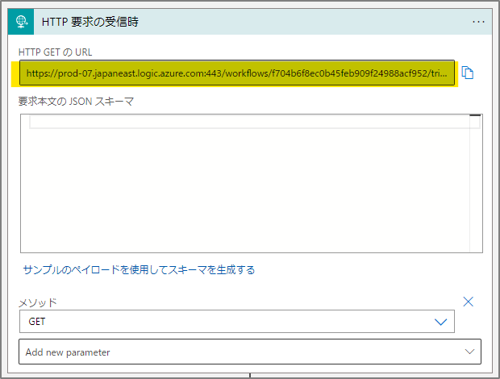

この URL にアクセスすることで、本ロジック アプリに設定したワークフローが実行されます。
タイムアウト エラーを起こすために、**応答アクション** の前に 3 分の **待ち時間アクション** を追加して保存します。
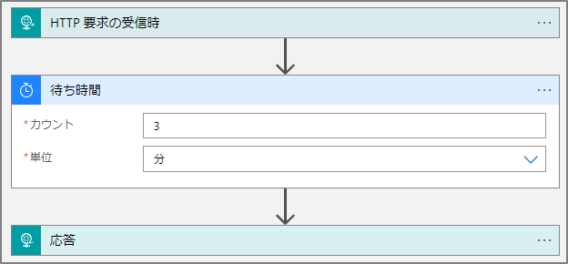
長時間の処理を疑似的に待ち時間アクションで再現したような状態となります。

本章における、サーバー側ロジック アプリの設定は以上となります。

#### 1-2. クライアント側ロジック アプリの構築
サーバー側のロジック アプリと同様に、クライアント側のロジック アプリ（**SampleClientSide**）を Azure portal から作成します。
> 今回の記事では従量課金版ロジック アプリを利用しております。

ロジックアプリ作成後にテンプレートから **繰り返し** を選択します。
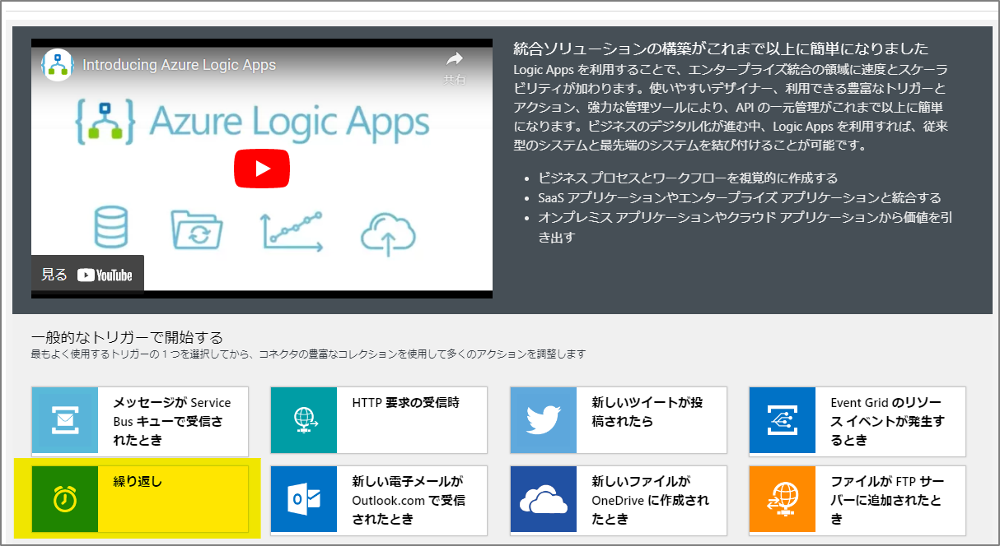

**繰り返し（Recurrence）トリガー** の頻度を **3 ヶ月** に設定してワークフローを保存します。
クライアント側ロジック アプリが短い間隔で自動起動しないように長期間の間隔を設定しております。
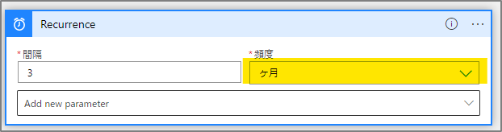

**HTTP アクション** を下記の設定で追加します。
- 方法 : GET
- URI : サーバー側ロジック アプリの URI（メモしたものを貼付）
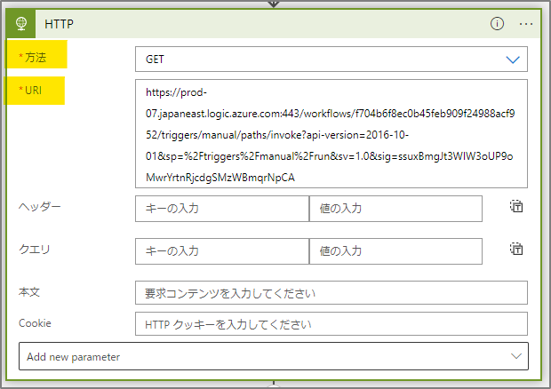

**HTTP アクション** の右上メニューから設定を開きます。
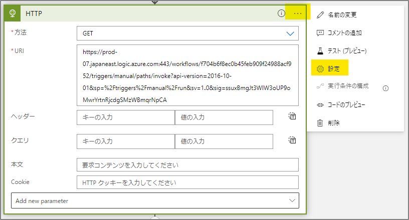

**再試行 ポリシー** を **なし** に設定して **完了** を押下します。
本設定は効率的にサンプルの検証を行う目的で設定しております。
本設定によりタイムアウト エラー後の HTTP アクションの再試行が抑制されます。
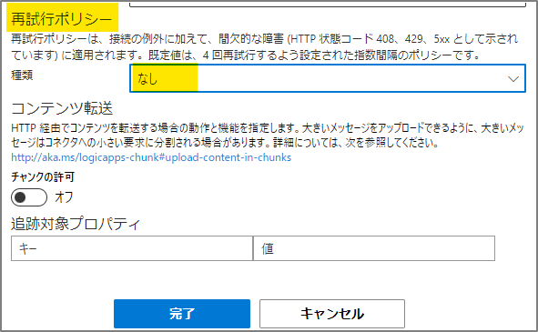

上記の設定完了後にワークフローを保存します。

本章における、クライアント側ロジック アプリの設定は以上となります。

#### 1-3. サンプルの実行
現時点のサンプルを実行し、タイムアウト エラーが発生する事を確認します。

クライアント側のロジック アプリの概要からトリガーの実行を行います。


**実行の履歴** タブから約 2 分の経過後に実行が失敗する事を確認できます。
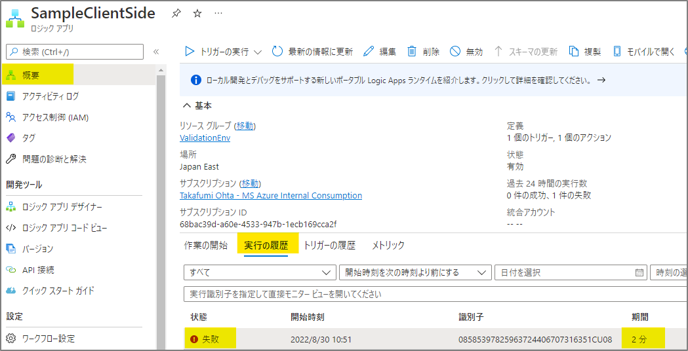

上図の失敗した実行を押下すると、失敗した実行の履歴を閲覧可能です。
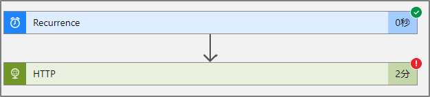

失敗したアクションの右上には赤色のアイコンでその旨がマークされます。
**HTTP アクション** を押下して詳細を確認するとタイムアウト エラーにて失敗した旨が表示されます。
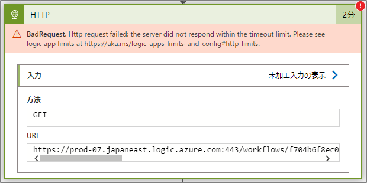

本エラーは下図（公開情報の抜粋）のマルチテナントの送信要求に関するタイムアウト期間制限のためとなります。
上図の通り、HTTP アクションが 2 分間を超える処理のリクエストにより失敗したことを確認可能です。
なお、マルチテナントとは従量課金ロジック アプリの事を表します。
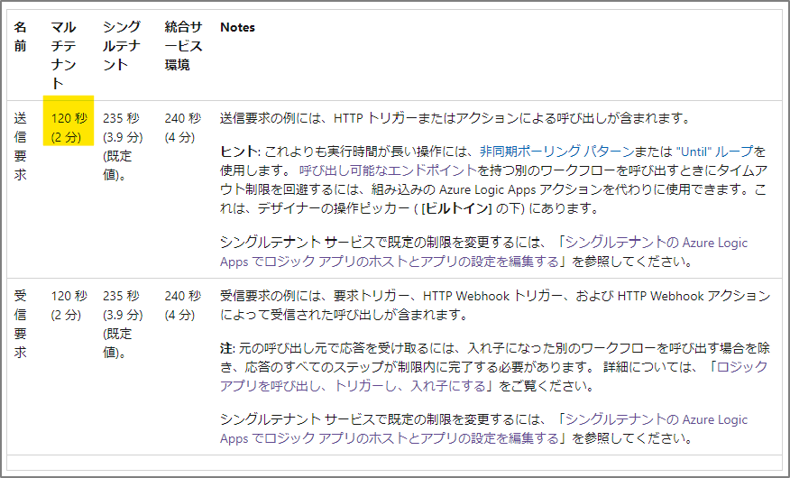

- [HTTP 要求のタイムアウト期間に関する制限](https://docs.microsoft.com/ja-jp/azure/logic-apps/logic-apps-limits-and-config?tabs=azure-portal#http-request-limits)

次に、サーバー側ロジック アプリの実行履歴を同様に確認します。
サーバー側ロジック アプリの **概要** メニューから **実行の履歴** タブを選択いたします。
実行が約 3 分の経過後に実行が失敗している事を確認できます。
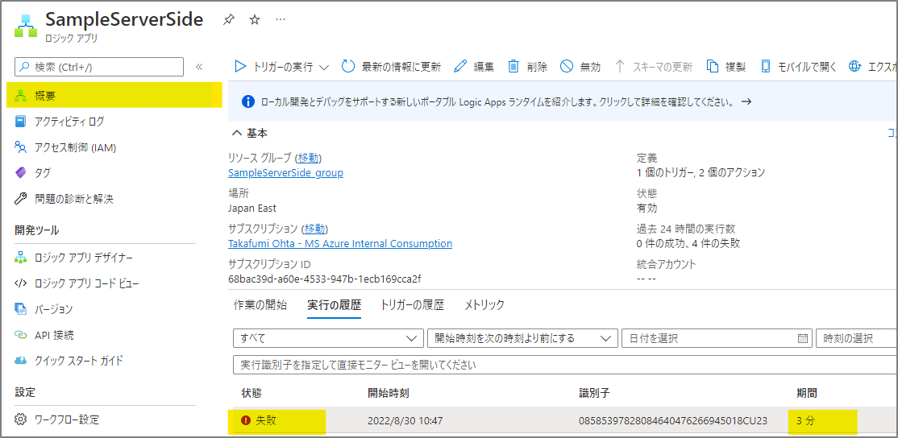

本エラーはクライアント側のタイムアウト エラーにより接続が閉じているために応答ができず生じたエラーとなります。

本章までの設定により、HTTP アクションがタイムアウト エラーにより失敗する状態を構築できました。
次章以降で、非同期ポーリング パターンによってタイムアウト エラーを解消するようにサンプルを改善していきます。

### 2. 非同期ポーリング パターンによる タイムアウト エラーの解消
本章では、Logic Apps の HTTP アクションにおける非同期ポーリング パターンの概念を簡単に説明した後に、前章までで構築したロジック アプリのタイムアウト エラーを解消するようにサンプルを改善していきます。

#### 2-1. 非同期ポーリング パターンの概要
Logic Apps の HTTP アクションにおける非同期ポーリング パターンはサーバー側の処理状況をクライアント側が定期的に確認するパターンとなります。
サーバーが処理中であれば一定時間の経過後に再度サーバーの状況を確認し、サーバーの処理が完了していればワークフローの後続のアクションを実行する動きとなります。

HTTP アクションはサーバーの処理状況をレスポンスのステータス コードによって判断します。
ステータス コードが 202 番であれば処理中と判断し、一定時間の経過後に再度サーバーの状態を確認します。
また、ステータス コードが 200 番であれば処理が完了したと判断し、ワークフローの後続アクションを実行いたします。

処理状況の確認先や処理状況の確認間隔などの制御はレスポンス ヘッダーにより行います。
サーバーは処理状況の確認先 URI を Location ヘッダーに設定し、確認間隔を Retry-after ヘッダーに設定することでクライアントにポーリング処理の動作を指示します。

下図は公開ドキュメントから抜粋した非同期ポーリング パターンの概念図となります。
上記で説明した内容の図示となります。
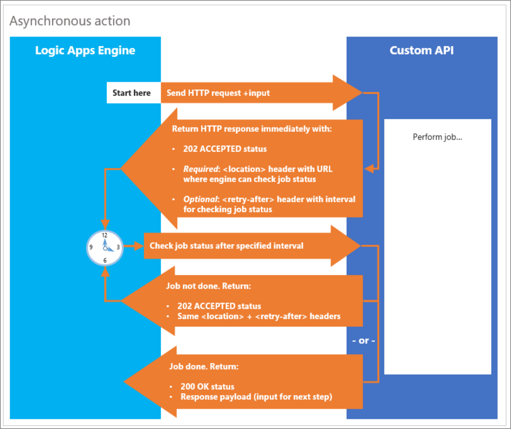

- [非同期ポーリング パターンで長時間タスクを実行する](https://docs.microsoft.com/ja-jp/azure/logic-apps/logic-apps-create-api-app#perform-long-running-tasks-with-the-polling-action-pattern)

非同期ポーリング パターンの実現に当たってはサーバーの処理状態を保存しておく仕組みと、サーバーが処理状態に応じてレスポンスを変更する仕組みの構築が必要となります。

#### 2-2. サーバー側の処理状態の保存先
まずは、サーバー側の処理状態を保持する仕組みを構築いたします。
今回は処理状態の保存先としてストレージ アカウントを使用いたします。

ストレージ アカウントを Azure portal から作成します。
本記事では、**testdata1234** という名称のストレージ アカウントを作成いたします。
ストレージ アカウント名は重複して作成できませんので、任意の名前をお使いください。
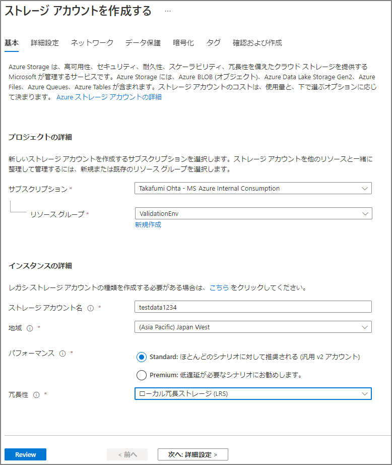

ストレージ アカウントのメニューからコンテナーを作成いたします。
本記事では、**logic-apps** という名前でサンプル用のコンテナを作成いたします。
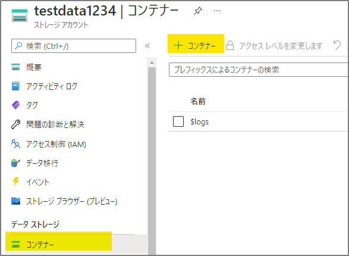

ロジック アプリからストレージ アカウントへ接続するための情報を取得します。
ストレージ アカウントの **アクセス キー** メニューから **キー** と **接続文字列** のペアをメモしておきます。
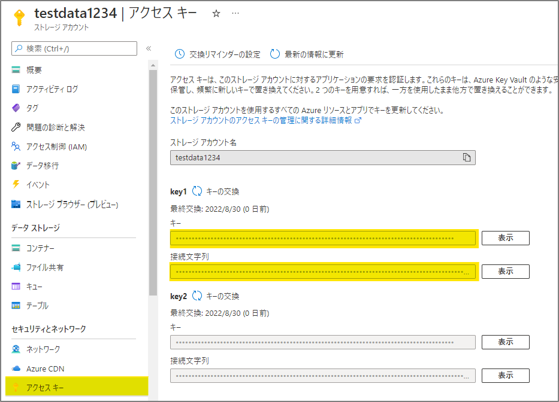

#### 2-3. クライアント側ロジック アプリの改修
クライアント側のロジック アプリを非同期ポーリング パターンに対応するように改修していきます。

HTTP アクションは非同期処理オプションが有効であれば、特別な設定をしなくても非同期ポーリング パターンに従って動作いたします。
非同期処理オプションはデフォルトで有効となっておりますが下記の手順によりご確認可能です。
HTTP アクションの設定を開いていただきます。
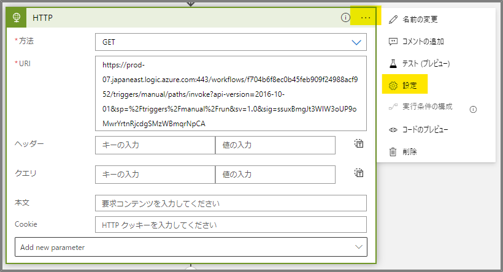
設定項目の非同期パターンが有効になっていることをご確認いただきます。
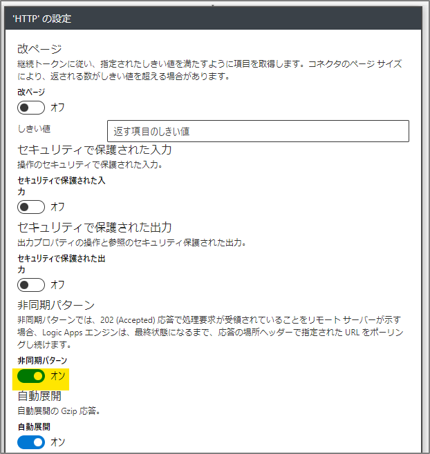

先述の通りレスポンスのステータス コードが 202 番であれば、HTTP アクションは一定時間の経過後に再度サーバーの処理状況を確認いたします。
具体的にはレスポンスの Retry-after ヘッダーに設定の時間が経過した後に Location ヘッダーに設定の URI 宛てに再度 HTTP リクエストを送信します。

つまり、クライアント側ロジック アプリの HTTP アクションに関する追加の改修は不要で、サーバー側で適切な情報をレスポンスとして設定すれば非同期ポーリング パターンによるタイムアウト エラーの回避を行えます。

また、HTTP アクションのレスポンスが 200 番となった場合にワークフローの後続処理が実施されるため確認用のアクションを下図のように設定いたします。
本アクションにより、HTTP アクションのレスポンスが 200 番だった場合の Body の内容を確認可能となります。
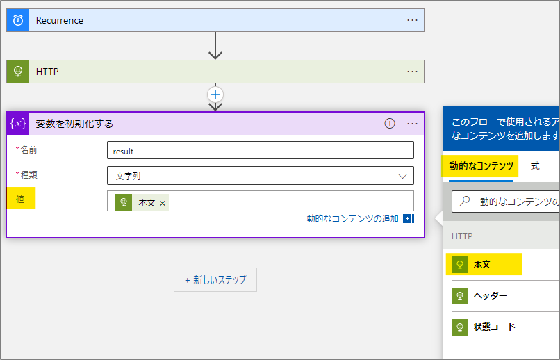

以上で、クライアント側ロジック アプリの改修は完了となります。

#### 2-4. サーバー側ロジック アプリの改修 - 処理状況の保存
次に、サーバー側のロジック アプリを改修していきます。
改修内容はサーバー処理状況を保存する仕組みならびに処理状況に応じてレスポンスを変更する仕組みの構築となります。

本小節では、サーバーの処理状況を保存できるようにワークフローの改修を行います。

一般的にサーバーへのリクエストは並列に行われるため、リクエスト毎に実行状態を管理する必要がございます。
本記事ではリクエストを特定する識別子としてクライアント側ロジック アプリの実行 ID を用います。

クライアント側ロジック アプリの実行 ID はリクエスト ヘッダーより取得可能です。
下図のように文字列変数 **id** にクライアント側ロジック アプリの実行 ID を格納いたします。
値に **@{triggerOutputs()[\'headers\'][\'x-ms-workflow-run-id\']}** を設定することで本処理を実現できます。
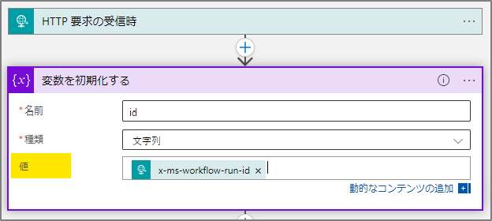

以上の設定により、id 変数を通じてサーバー側ロジック アプリからクライアント側ロジック アプリの実行 ID を利用可能となります。

次に、取得した ID を利用してサーバー側ロジック アプリの実行状態をストレージ アカウントに保存していきます。
**変数を初期化する** アクション（ID の取得処理）の後に **BLOB を作成する（V2）** アクションを追加します。

以前に BLOB ストレージへの接続情報を作成していない場合、Blob ストレージへの接続情報を求められるので下図のように入力し **作成** を押下いたします。
- 接続名 : 任意の名前
- 認証の種類 : Access Key
- Azure Storage のアカウント名 : 作成したストレージ アカウントの名前
- Azure Storage アカウントのアクセス キー : 前小節でメモしたキー情報
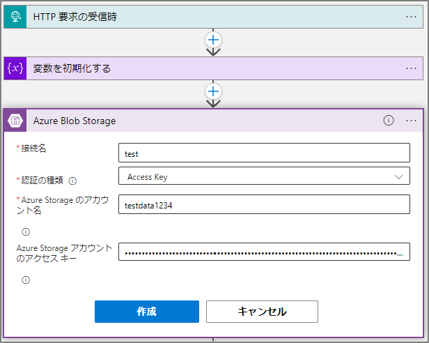

以前に BLOB ストレージへの接続情報を作成している場合でも、**接続を変更してください。** を押下いただければ今回のサンプル用に新規の接続を作成可能です。
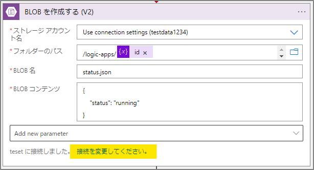

**BLOB を作成する（V2）** アクションのパラメータを下図の用に設定いたします。
- ストレージ アカウント名 : Use connection settings
- フォルダーのパス : /logic-apps/@{variables(\'id\')}
- BLOB 名 : status.json
- BLOB コンテンツ : 後述の json データ
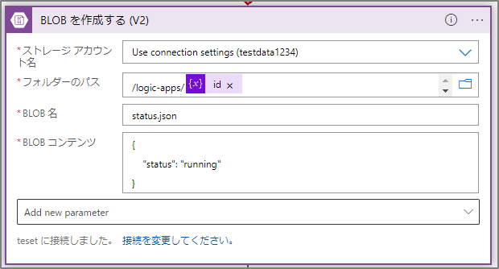

BLOB コンテンツについては下記の JSON データをそのままコピーしてご使用ください。
```json
{
    "status": "running"
}
```

次に、**待ち時間** アクションの後に **BLOB を作成する（V2）** アクションを追加します。
BLOB コンテンツは下記の JSON データをそのままコピーしてご使用いただき、その他のパラメータは上記の **BLOBを作成する（V2）** アクションで設定したパラメータと同様の内容をご設定ください。
```json
{
    "status": "finished"
}
```
本設定により、サーバー側の処理状態を **status.json** というファイル上で管理できるようになりました。
具体的には 待ち時間アクションの完了までは、json データの status 属性が running、待ち時間アクションの完了後は json データの status 属性が finished となります。

なお、本ファイルは BLOB ストレージに **/logic-apps/ [クライアント側ロジック アプリの実行 ID] /status.json** というパスで保存されます。
そのため、要求毎に実行状態を保持しておくことが可能となります。

現時点でのワークフローの全体図は下図の通りとなっております。
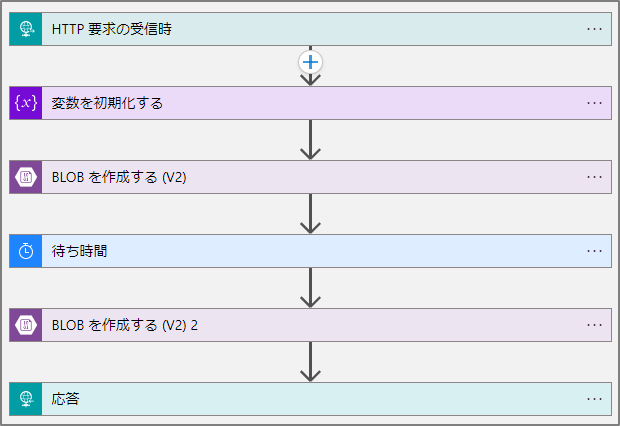

現時点でのワーク フローは処理状態に応じたレスポンスの設定が出来ていないため引き続きタイム アウトエラーを生じるものとなります。
次小節で本問題を解決いたします。

#### 2-5. サーバー側ロジック アプリの改修 - 処理状態に応じたレスポンス内容の設定
前小節まででサーバー側ロジック アプリの処理状態の保存までを構築いたしました。
本小節では、処理状態に応じてレスポンス内容を変更するようにワークフローを改修していきます。

まず、長時間の実行を伴う処理を行う前にクライアントに処理を受け付けた旨を示す応答を返します。
クライアント側ロジック アプリの **待ち時間** アクションの前に下図のような **応答** アクションを追加します。
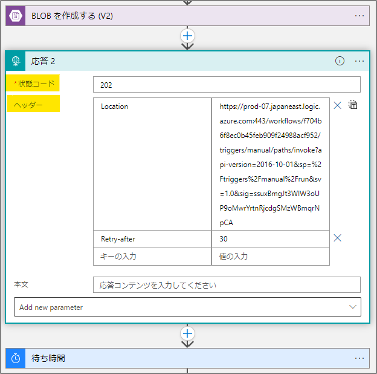

状態コードに 202 を、Location ヘッダーにサーバー側ロジック アプリの URL を設定いたします。
本設定によりクライアント側ロジック アプリからのリクエストを受けた際に、処理を受け付けた旨と処理状況の確認はサーバー側ロジック アプリを再度呼び出すことで確認して欲しい旨を即時に伝えられます。
また、Retry-after ヘッダーに 30 を設定しているため、クライアント側ロジック アプリからの処理状況の確認リクエストは 30 秒毎に行われることとなります。

クライアント側ロジック アプリはレスポンスを受けて、30 秒後に状況確認のためにサーバー側ロジック アプリを呼び出します。
現時点のワークフローですと、再度呼び出されたサーバー側ロジック アプリは 202 番応答をした後に待ち時間アクションを行います。
この動きは 1 回目のリクエストを受けた際の動きと同様となります。
つまり、実行状態を確認するだけのはずがサーバー側に再度処理の依頼を実施してしまっている状況となっております。

上記を踏まえますと、1 回目のリクエストでは処理を実施し 2 回目以降のリクエストでは処理状態の確認を行うようにワークフローを改修する必要がございます。
そのために、処理状況の管理ファイル（**status.json**）の存在有無によって処理を分岐させます。

下図のように 1 つめの **BLOB を作成する（V2）** アクションの前に **BLOB コンテンツを取得する（V2）** アクションを作成します。
BLOB パラメーターに **\/logic-apps/@{variables('id')}/status.json** を設定し、**status.json** の取得を試みます。
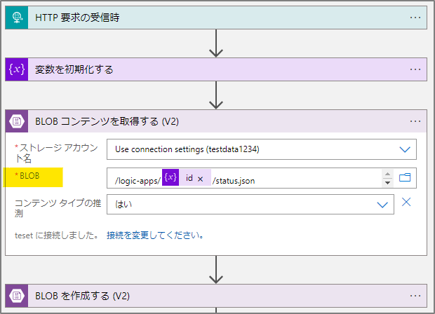

1 回目のリクエストでは **status.json** が作成されていないため 404 エラーを生じ、2 回目以降のリクエストでは **status.json** が存在するため実行が成功し **status.json** の内容が取得されます。
よって、**BLOB コンテンツを取得する（V2）** アクションの実行成否に応じて処理を分岐させることで 1 回目のリクエストと 2 回目以降のリクエストの区別が可能となります。

1 つめの **BLOB を作成する（V2）** アクションの設定メニューから **実行条件の構成** を押下いたします。
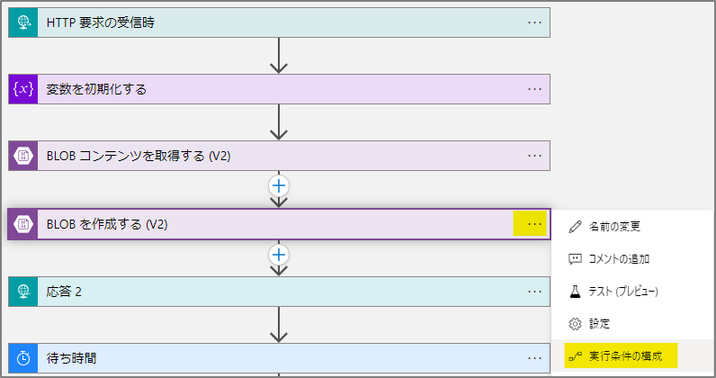

**BLOB　コンテンツを作成する（V2）** アクションが失敗した場合のみにチェックを入れて **完了** ボタンを押下する事で、以降の処理を 1 回目のリクエストのみ実行するような構成となります。
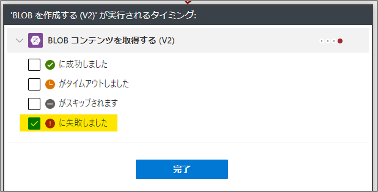

**BLOB　コンテンツを取得する（V2）** の成否によって実行を分岐する都合上、実行が成功しているにも関わらずエラー終了と表示されてしまいます。
本事象の回避のために 2 つめの **BLOB　コンテンツを作成する（V2）** アクションの後に **終了** アクションを下図のように追加いたします。
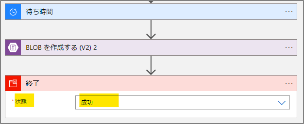

次に、2 回目以降のリクエストに対する処理、すなわちサーバー処理状態の確認を行う処理を追加いたします。
**BLOB　コンテンツを取得する（V2）** アクションと **BLOB を作成する（V2）** アクションの間をマウスオーバーすると **＋** ボタンが表示されます。
こちらのボタンを押下して並列分岐の追加を選択いただくと分岐が作成されます。
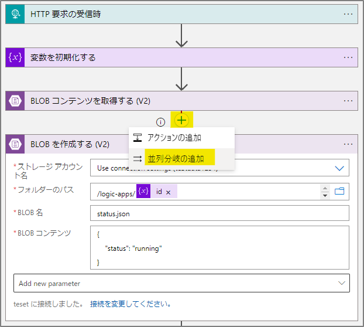

作成された分岐のアクションに **変数を初期化する** アクションを追加し、下図のように設定いたします。
値に **@{json(body(\'BLOB_コンテンツを取得する_(V2)\'))[\'status\']}** を設定することで **status.json** の status 属性を保持する文字列変数 **status** が作成されます。
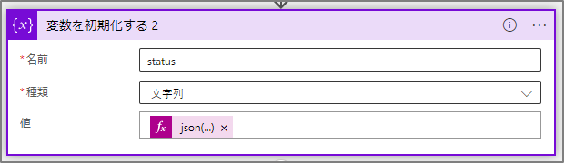

次に、下図のように status 変数が finished という文字列に等しいか否かを判定する **条件** アクションを追加したします。
条件部の左辺に **@variables(\'status\')** を右辺に **\"finished\"** を設定し、等しいか否かを判定いたします。
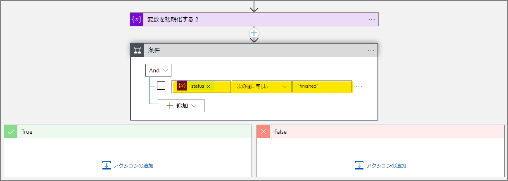

上記のアクションが True の場合はサーバー側の処理が終わっているため、その旨を返すアクションを追加いたします。
True 側の **アクションの追加** を押下し、下図のような **応答** アクションを追加いたします。
状態コードに 200 を、本文に処理が終了した旨を示すメッセージを設定いたします。
本応答を受けたクライアント側ロジック アプリはポーリング処理を終了し、HTTP アクション以降の処理を行います。
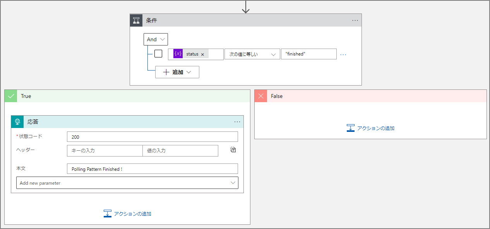

次に条件分岐が False の場合はサーバー側の処理が終わっていないため、その旨と再度の状況確認の依頼を返すアクションを追加いたします。
False 側の **アクションの追加** を押下し、下図のような **応答** アクションを追加いたします。
状態コードに 202 を、Location ヘッダーにサーバー側ロジック アプリの URL を設定いたします。
本設定により処理が継続中であるため、サーバー側ロジック アプリを再度呼び出すことで改めて処理状況を確認して欲しい旨をクライアント側ロジック アプリに伝えられます。
また、Retry-after ヘッダーに 30 を設定しているため、クライアント側ロジック アプリからの処理状況の確認リクエストは 30 秒毎に行われることとなります。
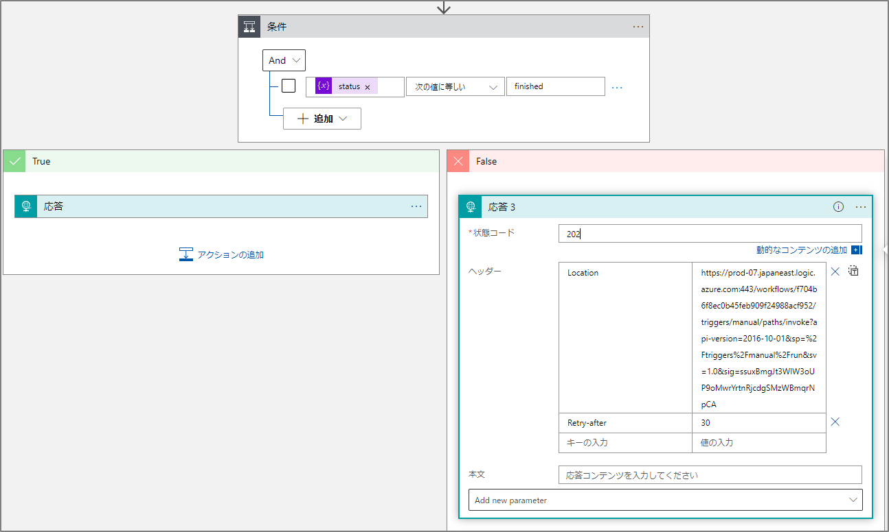

以上の設定により非同期ポーリング パターンに対応するようなサーバー側ロジック アプリの構築を行えました。
ワークフローの全体像は下図の通りとなります。
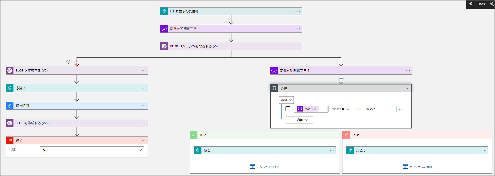

#### 2-6. サンプルの動作
構築したサンプルを実行し、タイムアウト エラーが解消した事を確認します。

クライアント側のロジック アプリの概要からトリガーの実行を行います。
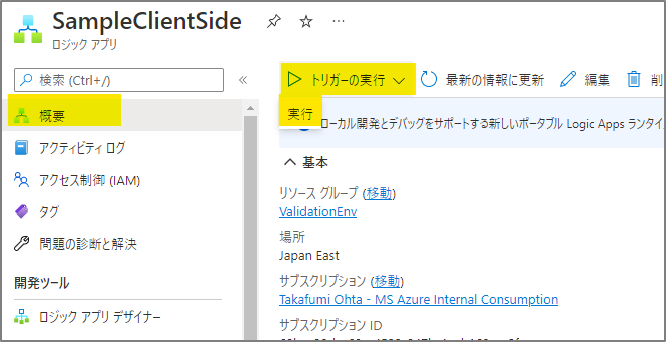

**実行の履歴** タブから約 3 分の経過後に実行が成功する事を確認できます。
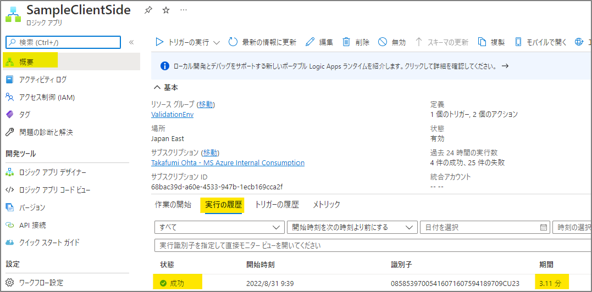

上図の成功した実行を押下すると、成功した実行の履歴を閲覧可能です。
HTTP アクションの実行が 3 分の経過後に成功し、サーバーからの処理完了の旨を示すメッセージを取得できたことを確認できます。
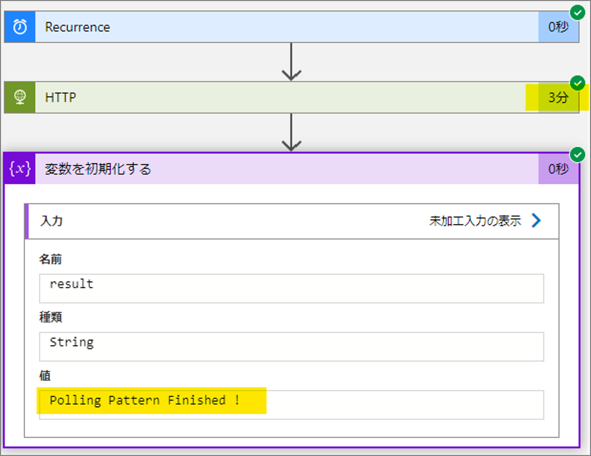

次に、サーバー側ロジック アプリの実行履歴を同様に確認します。
サーバー側ロジック アプリの **概要** メニューから **実行の履歴** タブを選択いたします。
約 3 分の経過後に成功する 1 つの実行と、1 秒未満に処理が成功する実行が 6 つ確認できます。
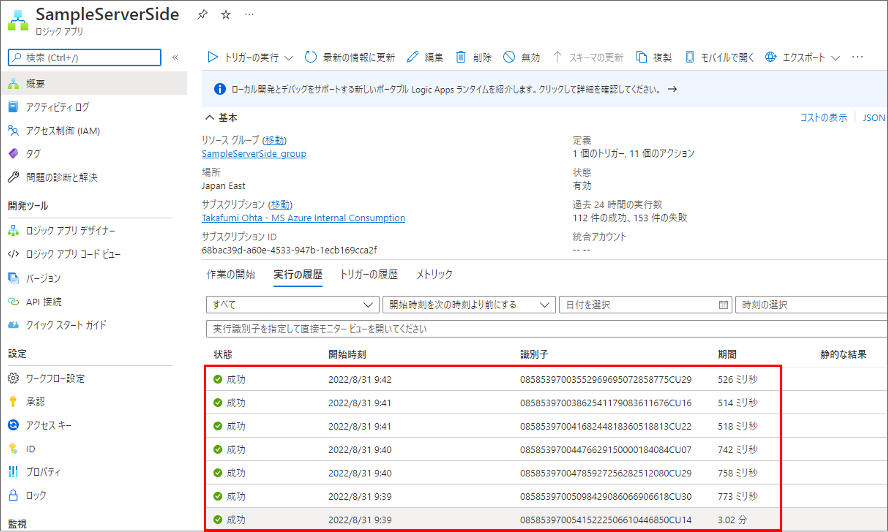

約 3 分の処理を行っている実行はサーバーの処理を行っている実行となります。
実行履歴を押下し、こちらの内容を確認していきます。
下図のように、3 分の待ち時間処理の前後に **BLOB を作成する（V2）** で BLOB ストレージ上の処理状態の管理ファイル（status.json）を更新している様子を確認できます。
3 分の待ち時間処理が終了すると処理状態を "finished" に変更して処理を終了します。
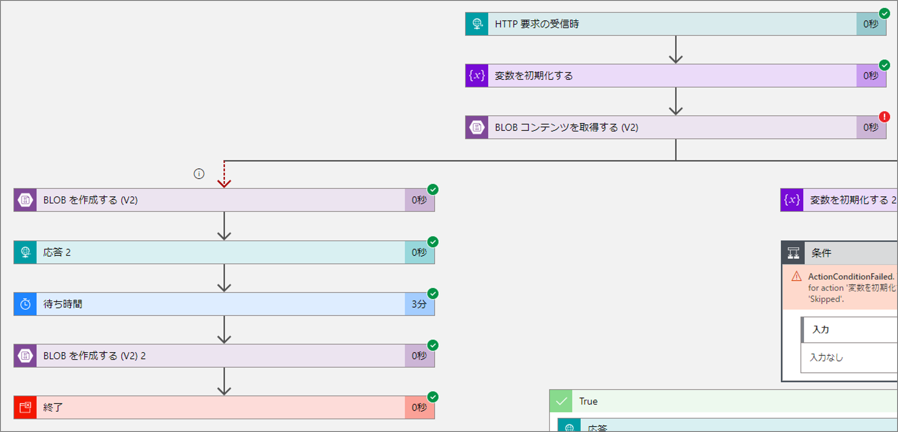

1 秒未満に処理が成功している 6 つの実行はクライアント側ロジック アプリがサーバーの処理状態を確認する際に行ったリクエストによるものとなります。
内訳は 5 回が処理中の旨を返しており、1 回が処理を完了した旨を返すものとなります。

処理中の旨を返す実行の履歴をピックアップして表示すると下図のようになります。
下図のように処理状態が "finished" でないため、クライアント側に再度の確認を要求していることを確認できます。
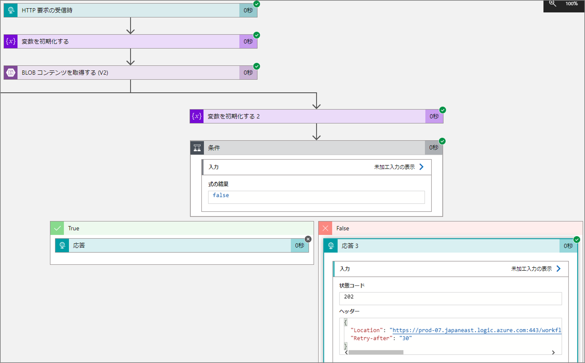

最後に、処理を完了した旨を返す実行について確認いたします。
実行履歴の内、一番新しいものが該当いたします。
詳細は下図の通りとなります。
処理状態が "finished" となっていることを確認できたため、クライアント側に処理が完了した旨とメッセージを返しております。
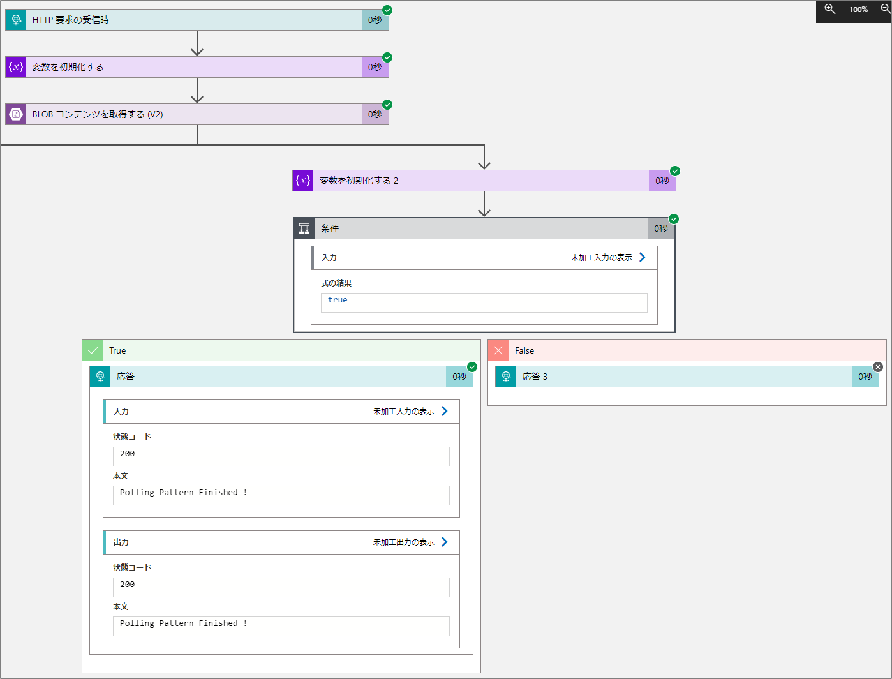

以上のように、非同期ポーリング パターンを用いる事で HTTP アクションのタイムアウト エラーを回避できることをサンプルにてご紹介いたしました。

## まとめ
本記事では、非同期ポーリング パターンを用いる事で HTTP アクションのタイムアウト エラーを回避できることをサンプルにてご紹介いたしました。
サーバー側の処理を HTTP アクションの非同期ポーリング パターンに沿うように工夫いただくことで HTTP アクションのタイムアウト期間の制限を超えるような処理も Logic Apps から呼び出し可能となります。
長時間の処理時間を伴う処理を Logic Apps から HTTP アクションで呼び出す場合は、非同期ポーリング パターンが有効となる可能性がございますのでご検討いただけますと幸いです。