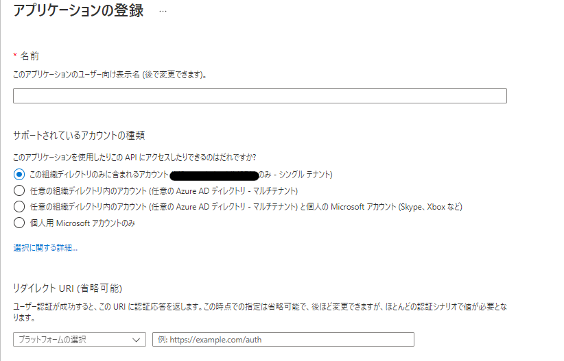
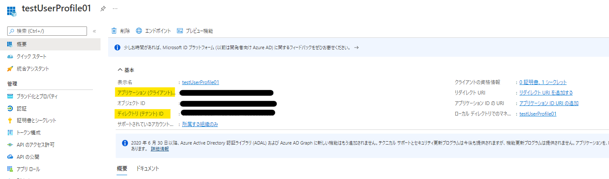
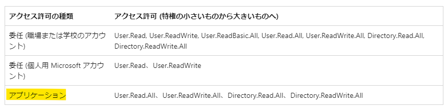
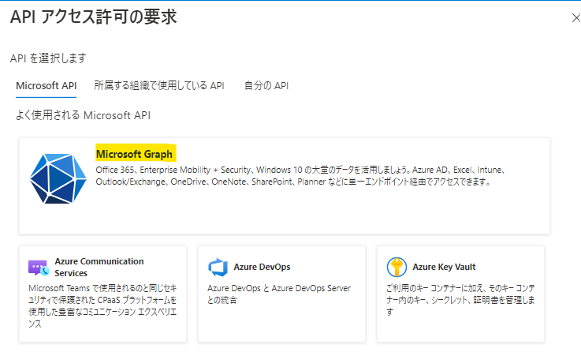
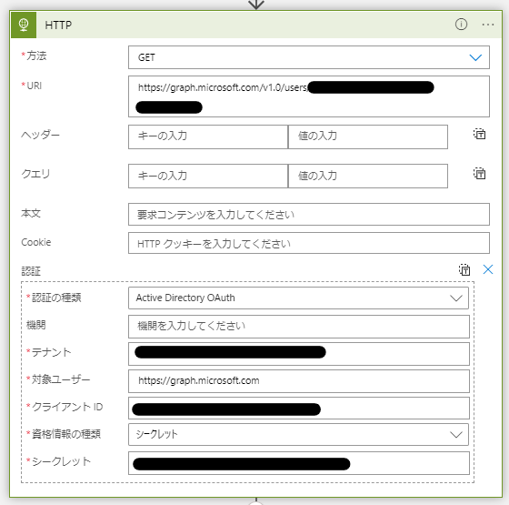
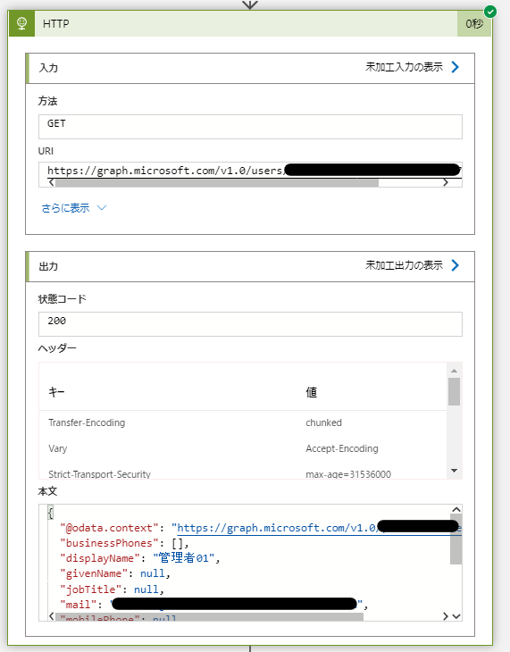

こんにちは。Azure Integration サポート チームの髙橋です。  
Logic Apps から Graph API を実行する方法について説明します。

# こんな方におすすめです
- Logic Apps から Graph API を実行したい方

# 前提条件
- 今回の記事では従量課金版ロジック アプリを利用します。ただし、スタンダード版のロジック アプリでも問題ありません。
- Graph API は「アプリケーション」のアクセス許可を使用しています。
  - 参考ドキュメント : [ユーザーなしでアクセスを取得](https://docs.microsoft.com/ja-jp/graph/auth-v2-service)
- 今回の記事では Azure Active Directory に登録されているユーザーの情報を取得する Graph API を利用しております。
  - 参考ドキュメント : [ユーザーの取得](https://docs.microsoft.com/ja-jp/graph/api/user-get?view=graph-rest-1.0&tabs=http)

# 流れ
Graph API の実行には、トークンが必要となります。
トークンを取得するため、まずはアプリの登録 (サービス プリンシパルの作成) を行います。
アプリには Graph API を実行するために必要なアクセス許可を付与します。

また、Logic Apps の「HTTP」アクションでは、リクエスト内容に認証情報を含めることが可能です。
そのため、アプリの認証情報を「HTTP」アクションに設定し、実行時にはその認証情報を用いてまずトークンを取得し、
そのトークンを持ちまして Graph API を実行する動作となります。

# 方法
## 1. アプリを登録する
Azure Active Directory にて、アプリの登録 (サービス プリンシパルの作成) を行います。
**[Azure Active Directory] - [管理 - アプリの登録]** と遷移し、「+ 新規登録」ボタンを押下します。

アプリの名前を任意に設定し、今回は「サポートされているアカウントの種類」にて「この組織ディレクトリのみに含まれるアカウント (<テナント名> のみ - シングル テナント)」を選択し、
「登録」ボタンを押下します。

作成が完了しましたら、**[管理 - アプリの登録]** にて該当するアプリを選択します。
**[概要]** にて「アプリケーション (クライアント) ID」、および「ディレクトリ (テナント) ID」をコピーし、控えておきます。

**[管理 - 証明書とシークレット]** に遷移し、「+ 新しいクライアント シークレット」を押下してシークレットを作成します。
作成されましたら、「値」をコピーし、こちらも控えておきます。
※ 「値」はシークレットを作成した直後のみに表示され、画面遷移等を行いますとマスクされますのでご注意ください。

**[管理 - API のアクセス許可]** に遷移します。
この画面で、Graph API に必要なアクセス許可を付与します。
Graph API によって必要なアクセス許可は異なりますので、ご利用の Graph API の公開情報の「アクセス許可」をご確認ください。
今回の記事では、以下が該当いたします。

- 参考ドキュメント : [ユーザーの取得](https://docs.microsoft.com/ja-jp/graph/api/user-get?view=graph-rest-1.0&tabs=http#permissions)

**「+ アクセス許可の追加」** を押下します。

「Microsoft API」タブにて **「Microsoft Graph」** を選択します。

**「アプリケーションの許可」** を選択し、公開情報に記載されている「アクセス許可」に従い、必要なアクセス許可にチェックを入れます。
完了しましたら **「アクセス許可の追加」** ボタンを押下します。

必要なアクセス許可をすべて追加しましたら、**「<テナント名> に管理者の同意を与えます」** を押下し、アクセス許可の「状態」が緑色になることを確認します。

## 2. Logic Apps で「HTTP」アクションを設定する。
**[ロジック アプリ] - [<対象の ロジック アプリ>] - [開発ツール - ロジック アプリ デザイナー]** と遷移します。
「HTTP」アクションを追加し、以下のように値を設定します。

- 方法 : GET
- URI : https://graph.microsoft.com/v1.0/users/<ユーザーのオブジェクト ID>
- 認証
 - 認証の種類 : Active Directory OAuth
 - 機関 : 空欄
 - テナント : 1. で控えておきました「ディレクトリ (テナント) ID」をペーストします。
 - 対象ユーザー : https://graph.microsoft.com
 - クライアント ID : 1. で控えおきました「アプリケーション (クライアント) ID」をペーストします。
 - 資格情報の種類 : シークレット
 - シークレット : 1. で控えておきましたシークレットの「値」をペーストします。
※ 「HTTP」アクションの「Add new paramter」を押下し、「認証」にチェックを入れますと「認証」の設定が行えます。
※ 「方法」および「URI」の設定内容につきましては、ご利用いただく Graph API の公開情報をご参照ください。

Logic Apps を保存し実行いたしますと、正常に実行が完了いたしました。

