こんにちは。  Azure Integration サポート チームの北山です。  
ログ アラート発報時に出力されるデータに含まれた URL から、アラート発報時に評価されたクエリの結果を取得する方法について説明します。


# こんな方におすすめです
- ログ アラート発報時に、ロジック アプリを使ってメール通知されたい方、通知されるメールにクエリの結果を含めたい方
- アラート発報時に評価されたクエリの結果を別のシステムへ連携されたい方


# 前提条件
- 今回の記事では従量課金版ロジック アプリを利用します。ただし、スタンダード版のロジック アプリでも問題ありません。
- ログ アラート ルールの API バージョンは、2022 年 6 月 30 日時点で最新版の 2021-08-01 を想定しています。
  - これはアラート スキーマが **monitoringService = Log Alerts V2** を想定しております。
  - 参考ドキュメント : [共通アラート スキーマ定義](https://docs.microsoft.com/ja-jp/azure/azure-monitor/alerts/alerts-common-schema-definitions#monitoringservice--log-alerts-v2)


# 方法
## 1. アラート発報時に実行されるロジック アプリの作成
アラート発報時に実行されるロジック アプリを、Azure portal から作成します。  
> 今回の記事では従量課金版ロジック アプリを利用しております。

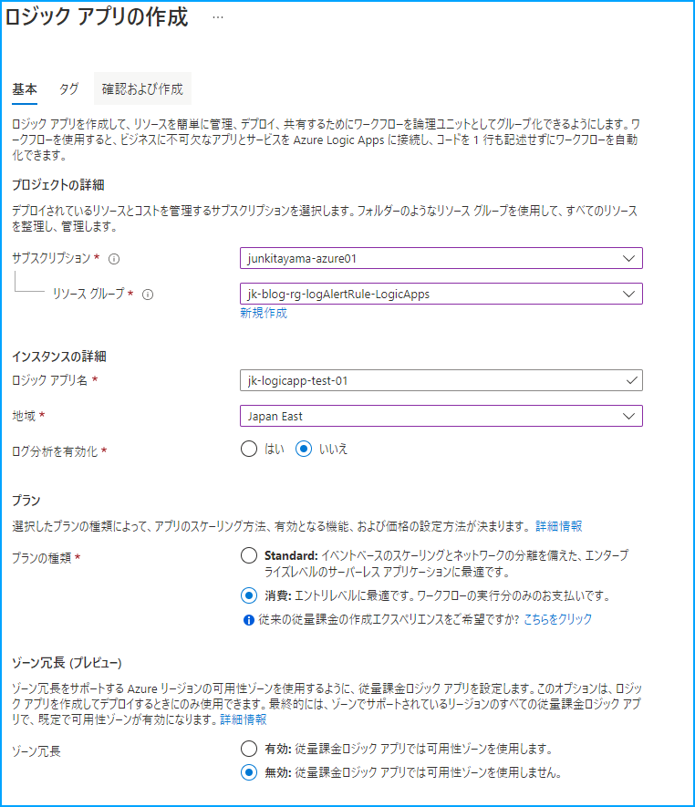


ロジック アプリ作成後に、テンプレートとして **[HTTP 要求の受信時]** を選択します。

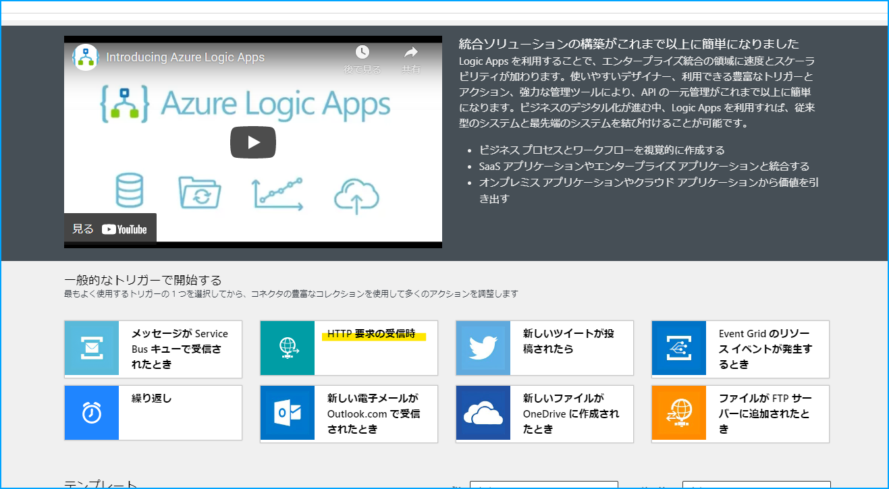


**[サンプルのペイロードを使用してスキーマを生成する]** をクリックします。


下記の JSON データをそのままコピー & ペーストして、**[完了]** をクリックします。

```json
{
    "schemaId": "azureMonitorCommonAlertSchema",
    "data": {
        "essentials": {
            "alertId": "/subscriptions/SUBSCRIPTION_ID/providers/Microsoft.AlertsManagement/alerts/8f29da04-5533-c8d1-d84d-b76efde41881",
            "alertRule": "test-log-alert-forBlog",
            "severity": "Sev3",
            "signalType": "Log",
            "monitorCondition": "Fired",
            "monitoringService": "Log Alerts V2",
            "alertTargetIDs": [
                "/subscriptions/SUBSCRIPTION_ID/resourcegroups/RESOURCEGROUP_NAME/providers/microsoft.hybridcompute/machines/RESOURCE_NAME"
            ],
            "configurationItems": [
                "/subscriptions/SUBSCRIPTION_ID/resourcegroups/RESOURCEGROUP_NAME/providers/microsoft.hybridcompute/machines/RESOURCE_NAME"
            ],
            "originAlertId": "eeb6feef-927a-4b69-8d56-bfa33f6bb32d",
            "firedDateTime": "2022-06-20T22:20:00.1015418Z",
            "description": "",
            "essentialsVersion": "1.0",
            "alertContextVersion": "1.0"
        },
        "alertContext": {
            "properties": null,
            "conditionType": "LogQueryCriteria",
            "condition": {
                "windowSize": "PT15M",
                "allOf": [
                    {
                        "searchQuery": "Heartbeat\n",
                        "metricMeasureColumn": null,
                        "targetResourceTypes": "['Microsoft.OperationalInsights/workspaces']",
                        "operator": "LessThan",
                        "threshold": "10",
                        "timeAggregation": "Count",
                        "dimensions": [
                            {
                                "name": "_ResourceId",
                                "value": "/subscriptions/SUBSCRIPTION_ID/resourcegroups/RESOURCEGROUP_NAME/providers/microsoft.hybridcompute/machines/RESOURCE_NAME"
                            }
                        ],
                        "metricValue": 9,
                        "failingPeriods": {
                            "numberOfEvaluationPeriods": 1,
                            "minFailingPeriodsToAlert": 1
                        },
                        "linkToSearchResultsUI": "https://portal.azure.com#XXXXXXXXX",
                        "linkToFilteredSearchResultsUI": "https://portal.azure.com#XXXXXXXXXXXX",
                        "linkToSearchResultsAPI": "https://api.loganalytics.io/v1/subscriptions/XXXXXXXXXXXXX",
                        "linkToFilteredSearchResultsAPI": "https://api.loganalytics.io/v1/subscriptions/XXXXXXXXXXXXX"
                    }
                ],
                "windowStartTime": "2022-06-20T22:02:28Z",
                "windowEndTime": "2022-06-20T22:17:28Z"
            }
        },
        "customProperties": null
    }
}
```


その後ワークフローを保存します。  
これでロジック アプリのスケルトンの作成は完了です。後ほどクエリを実行するための必要なアクションなどについて説明します。


## 2. ログ クエリを実行するためのマネージド ID を作成する
クエリの実行結果の取得は、下記の公開情報に記載がある Log Analytics API を用いて取得します。
- [共通アラート スキーマ定義](https://docs.microsoft.com/ja-jp/azure/azure-monitor/alerts/alerts-common-schema-definitions#monitoringservice--log-alerts-v2)

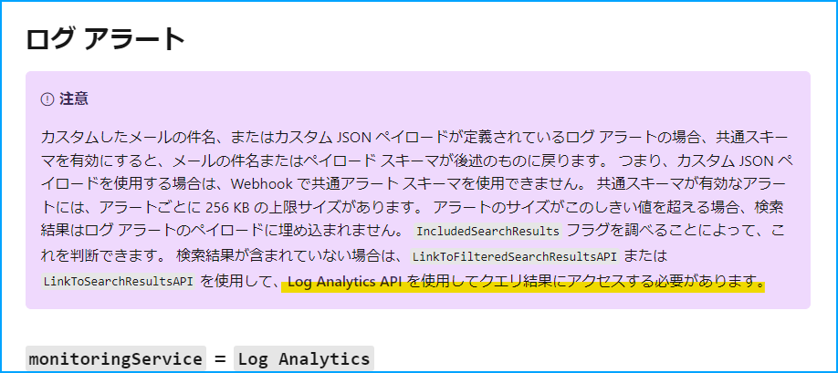

Log Analytics API を使用するためには Azure への認証が必要です。  
今回はロジック アプリのマネージド ID を用いて認証する方法を選択します。  

有効化するために、当該ロジック アプリのページへ移動し、左側ペインより **[ID]** をクリックします。  
その後、状態の箇所をオフからオンに変更します。

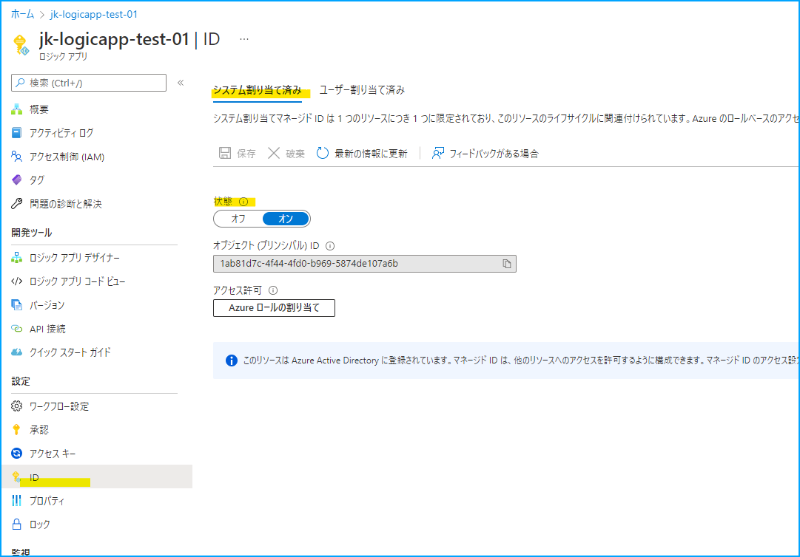

有効化したマネージド ID に対してロールを付与するために、**[Azure ロールの割り当て]** をクリックします。

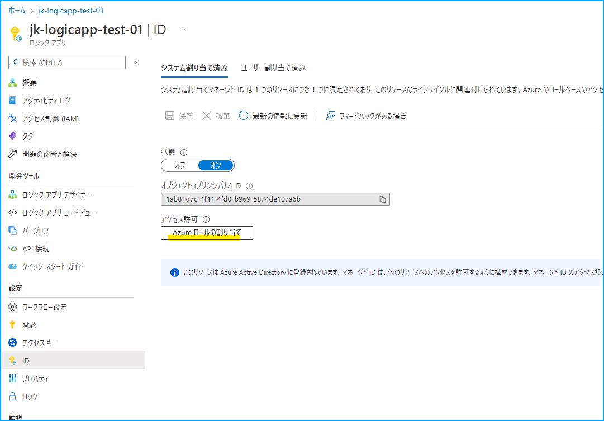


**[ロールの割り当ての追加]** をクリックし、ログが保存された Log Analytics ワークスペースを管理しているリソース グループをスコープに、**[閲覧者]** ロールを指定します。  
> 検索対象のワークスペースが Log Analytics ではなく Application Insights の場合は、当該 Application Insights リソースを管理しているリソース グループをスコープとしてください。

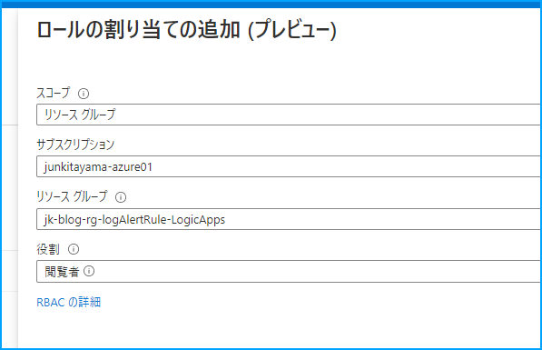

その後保存して、マネージド ID の有効化作業は完了です。


## 3. Log Analytics API にアクセスし、クエリ結果を取得するワークフローを作成する
当該ロジック アプリ ページから **[ロジック アプリ デザイナー]** をクリックし、ワークフローを編集する画面へ移動します。

HTTP 組み込みコネクタの **[HTTP]** アクションを追加します。

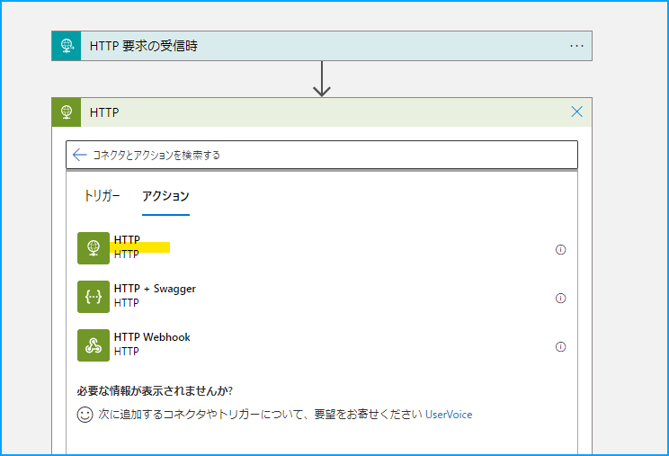

方法の箇所には **[GET]** をご指定いただき、URI の箇所には **[動的なコンテンツ - linkToSearchResultsAPI]** を指定します。


その後、自動的に **[For each]** が追加されますが、そのままで問題ありません。  
これは、linkToSearchResultsAPI オブジェクトを保持している親オブジェクト (allOf オブジェクト) のデータ型が配列であるため、自動的に For each が作成され配列内のオブジェクト一つ一つにアクセスする必要があるためです。  
ログ アラート ルールが出力する JSON データの allOf オブジェクトは要素数が必ず 1 つであるため、そのままで問題ありません。


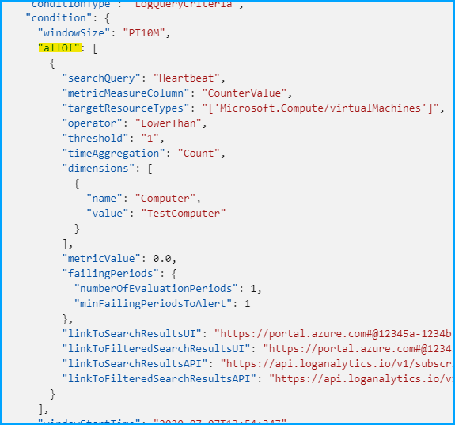


引き続き HTTP アクションの編集画面に戻り、**[Add new parameter]** から **[認証]** をクリックします。

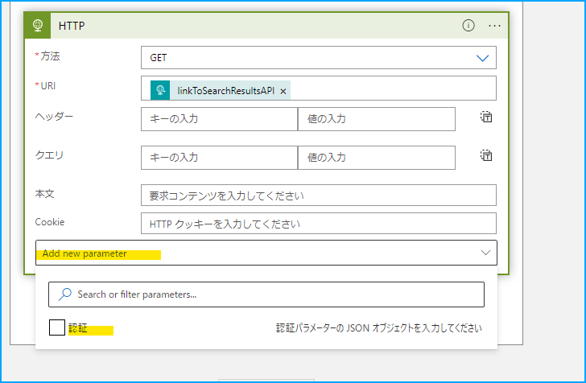

認証の種類に **[マネージド ID]**、マネージド ID に **[システム割り当てマネージド ID]**、対象ユーザー に **[https://api.loganalytics.io]** を指定します。

> Application Insights のログ アラート ルールの場合は、対象ユーザーに [https://api.applicationinsights.io] をご指定ください。


その後、編集した内容を保存して完了です。


試しに、意図的にログ アラートを発報してみます。  
すると、下図のようにデータの取得が確認できました。

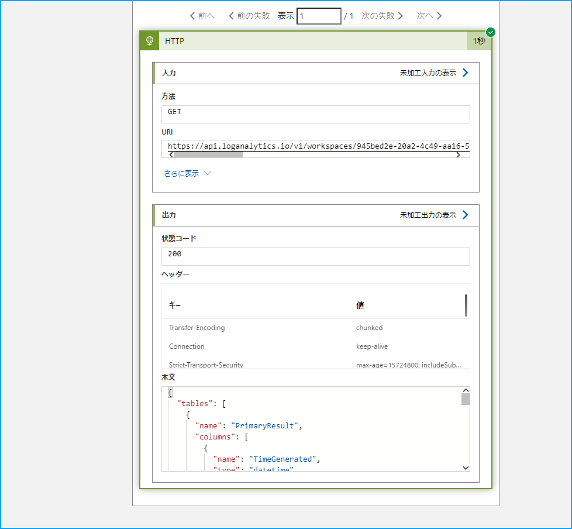

参考までに、実際に実行されたクエリと HTTP アクションによって取得出来たデータを下記に記載します。


ログ アラート ルールに指定したクエリ
```
Heartbeat
| project TimeGenerated, Computer, OSType, ResourceGroup, Resource
```

HTTP アクションの出力結果
```
{
    "statusCode": 200,
    "headers": {
        "Transfer-Encoding": "chunked",
        "Connection": "keep-alive",
        "Strict-Transport-Security": "max-age=15724800; includeSubDomains",
        "X-Content-Type-Options": "nosniff",
        "Access-Control-Allow-Origin": "*",
        "Access-Control-Expose-Headers": "Retry-After,Age,WWW-Authenticate,x-resource-identities,x-ms-status-location",
        "Vary": "Accept-Encoding",
        "Date": "Thu, 30 Jun 2022 01:07:22 GMT",
        "Via": "1.1 draft-oms-7b456954c5-bww9q",
        "Content-Type": "application/json; charset=utf-8",
        "Content-Length": "1056"
    },
    "body": {
        "tables": [
            {
                "name": "PrimaryResult",
                "columns": [
                    {
                        "name": "TimeGenerated",
                        "type": "datetime"
                    },
                    {
                        "name": "Computer",
                        "type": "string"
                    },
                    {
                        "name": "OSType",
                        "type": "string"
                    },
                    {
                        "name": "ResourceGroup",
                        "type": "string"
                    },
                    {
                        "name": "Resource",
                        "type": "string"
                    }
                ],
                "rows": [
                    [
                        "2022-06-30T00:50:14.933Z",
                        "mylab-mc-02",
                        "Linux",
                        "jk-rg-azurearc-myLab01",
                        "mylab-mc-02"
                    ],
                    [
                        "2022-06-30T01:04:14.927Z",
                        "mylab-mc-02",
                        "Linux",
                        "jk-rg-azurearc-myLab01",
                        "mylab-mc-02"
                    ],
                    [
                        "2022-06-30T00:52:14.953Z",
                        "mylab-mc-02",
                        "Linux",
                        "jk-rg-azurearc-myLab01",
                        "mylab-mc-02"
                    ],
                    [
                        "2022-06-30T00:55:15.057Z",
                        "mylab-mc-02",
                        "Linux",
                        "jk-rg-azurearc-myLab01",
                        "mylab-mc-02"
                    ],
                    [
                        "2022-06-30T00:58:14.94Z",
                        "mylab-mc-02",
                        "Linux",
                        "jk-rg-azurearc-myLab01",
                        "mylab-mc-02"
                    ],
                    [
                        "2022-06-30T01:02:14.923Z",
                        "mylab-mc-02",
                        "Linux",
                        "jk-rg-azurearc-myLab01",
                        "mylab-mc-02"
                    ],
                    [
                        "2022-06-30T00:53:15.227Z",
                        "mylab-mc-02",
                        "Linux",
                        "jk-rg-azurearc-myLab01",
                        "mylab-mc-02"
                    ],
                    [
                        "2022-06-30T00:56:14.947Z",
                        "mylab-mc-02",
                        "Linux",
                        "jk-rg-azurearc-myLab01",
                        "mylab-mc-02"
                    ],
                    [
                        "2022-06-30T01:00:14.93Z",
                        "mylab-mc-02",
                        "Linux",
                        "jk-rg-azurearc-myLab01",
                        "mylab-mc-02"
                    ]
                ]
            }
        ]
    }
}
```

このように HTTP アクションをご利用いただく事で、アラート発報時に評価されたログが取得可能です。  
この方法をもとに、お客様の要件にあったワークフローを作成いただければ幸いです。


## 番外編. ログ クエリの結果が記載されたメールを通知する
ここでは、**[HTML テーブルの作成]** アクションと **[Office 365 Outlook]** コネクタを用いて、ログ クエリの結果が記載されたメールを通知する方法について説明します。

まず、データ操作組み込みコネクタの **[HTML テーブルの作成]** を追加します。

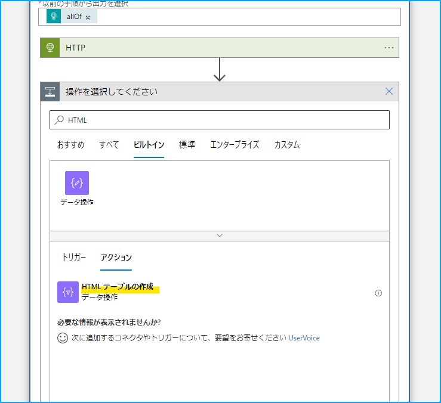


開始の箇所をクリックし、式に対して下記のコードをコピー & ペーストします。

```
array(outputs('HTTP')['body']['tables'][0]['rows'])
```

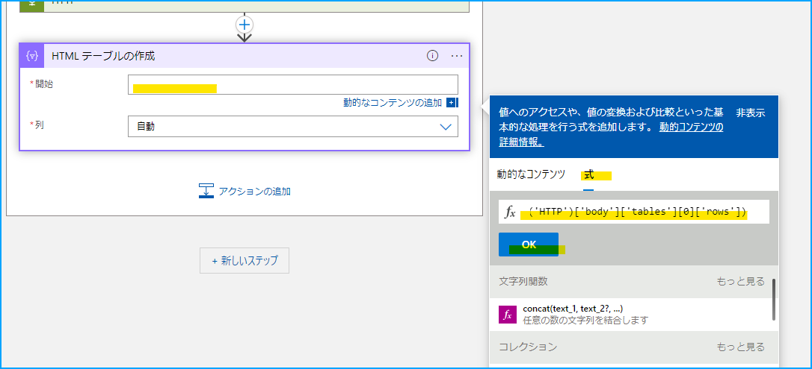


列に **[カスタム]** を指定し、ヘッダーに対して下記のコードをコピー & ペーストします。

```
outputs('HTTP')['body']['tables'][0]['columns'][0]['name']
```
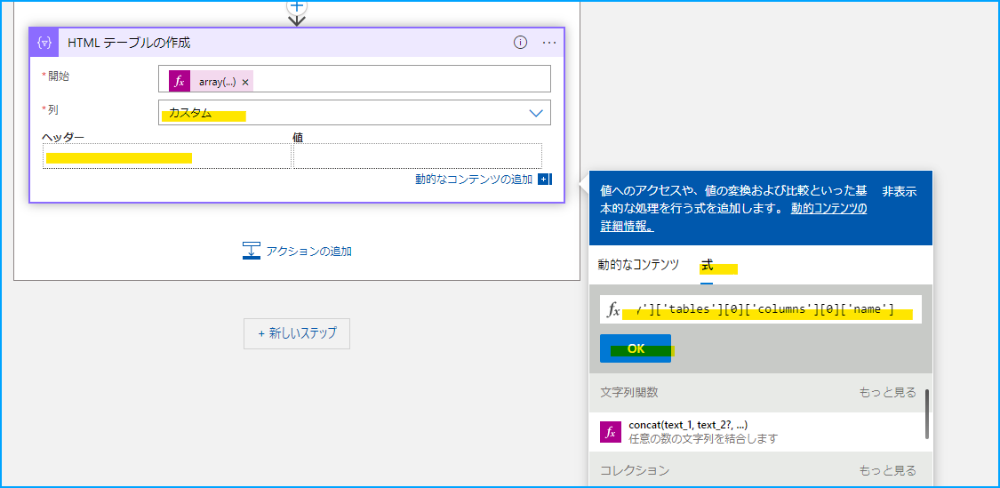


値に対して下記のコードをコピー & ペーストします。

```
item()[0]
```

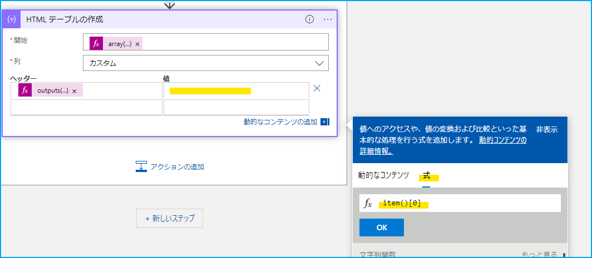


このヘッダーと値の組み合わせを、ログ アラート ルールで指定したクエリで取得できる列の数だけ追加します。  
私がログ アラート ルールに指定した下記のクエリの場合は、project 句に 5 種類の列を指定しています。  
そのため、ヘッダーと値の組み合わせを 5 つ作成する必要があります。

```
Heartbeat
| project TimeGenerated, Computer, OSType, ResourceGroup, Resource
```


ヘッダーと値の組み合わせを追加する際は、配列に指定する要素数を変更する必要がありますので、予めご留意ください。

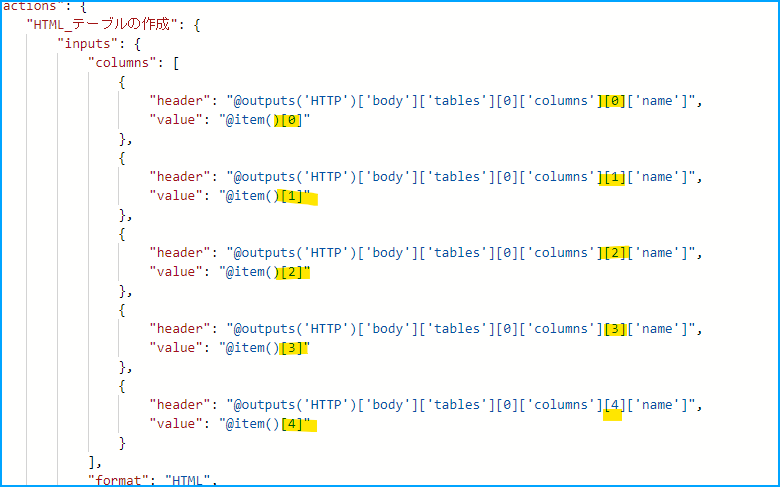


その後、Office 365 Outlook コネクタの **[メールの送信 (V2)]** アクションを使って、**[HTML テーブルの作成]** アクションで作成した HTML オブジェクトを含めたメールを送信します。

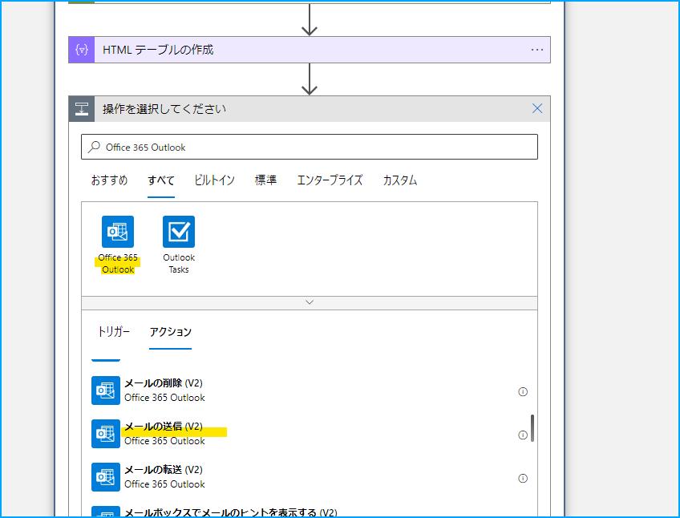


下図のように、本文の箇所に **[HTML テーブルの作成]** アクションの出力を指定します。
> 出力が表示されない場合は、[もっと見る] をクリックしてみてください。

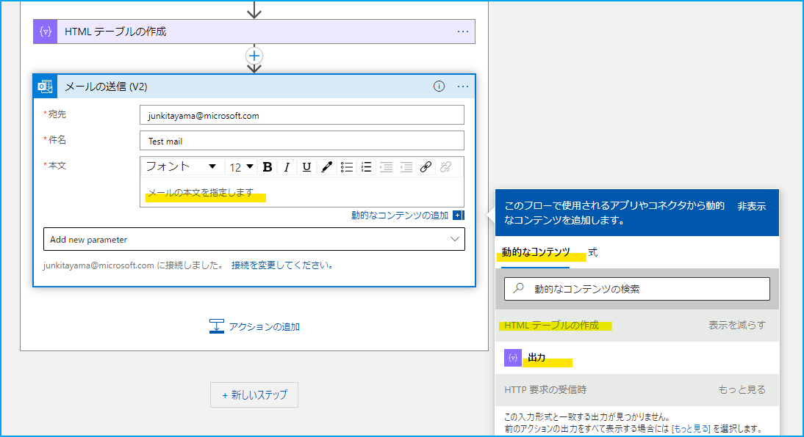


その後ワークフローを保存し、意図的にログ アラートを発報させます。  
すると下図のような、クエリ実行結果が HTML テーブル形式で記載されたメールが通知される事を確認しました。

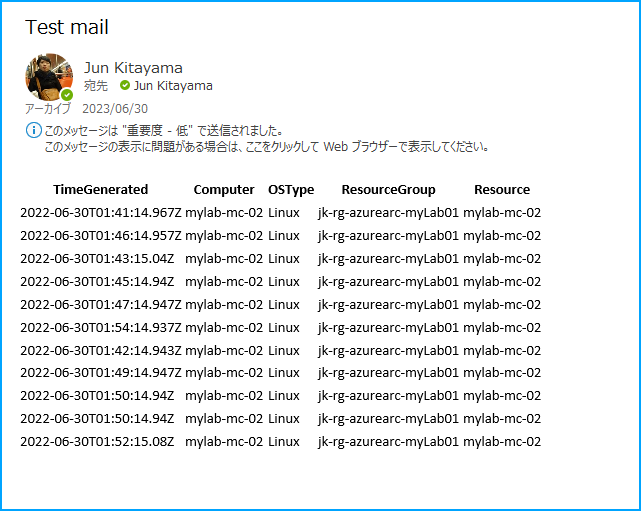

こちらは、単純にクエリ実行結果を記載したのみのメールですが、お客様の要件を満たすようなメール内容にカスタマイズいただけますと幸いです。

