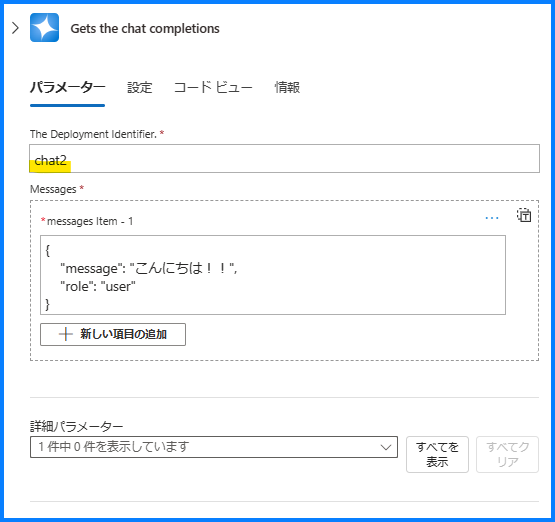
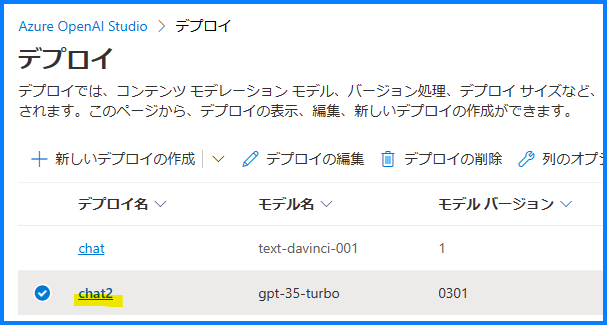
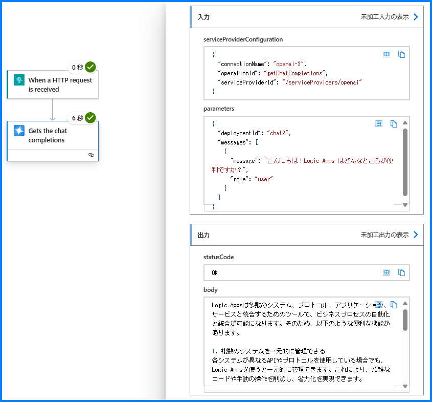

こんにちは！ Azure Integration サポート チームの山田です。
今回は、Azure Logic Apps でパブリック プレビューとなっている Azure OpenAI コネクタを利用する方法を、英語記事を引用する形でご紹介いたします。

参考: [Public Preview of Azure OpenAI and AI Search in-app connectors for Logic Apps (Standard)](https://techcommunity.microsoft.com/t5/azure-integration-services-blog/public-preview-of-azure-openai-and-ai-search-in-app-connectors/ba-p/4049584) 


<!-- more -->

## 目次
- Standard Logic Apps で Azure OpenAI アプリ内コネクタがパブリック プレビュー
    - 紹介
    - ワークフロー
    - 認証
    - その他のリソース
- まとめ

## Standard Logic Apps で Azure OpenAI アプリ内コネクタがパブリック プレビュー

### 紹介

「[Public Preview of Azure OpenAI and AI Search in-app connectors for Logic Apps (Standard)](https://techcommunity.microsoft.com/t5/azure-integration-services-blog/public-preview-of-azure-openai-and-ai-search-in-app-connectors/ba-p/4049584)」

この記事は、Azure OpenAI と Azure AI Search の2つの新しい組み込みコネクタの紹介記事です。


> Azure OpenAI と AI Search を使用することで、Logic Apps 内で Azure Open-AI と AI Search サービスによって提供されるジェネレーティブ AI 機能とエンタープライズ データとサービスを統合し、強力な自動化を構築できるようになります。

> これらの新しいコネクタは、接続キー、AAD、マネージド ID など複数の認証タイプをサポートしているほか、ファイアウォール内で Azure OpenAI および Azure Search エンドポイントへの接続もサポートしています。


### ワークフロー

> Azure OpenAI Service は、GPT-4、GPT-4 Turbo with Vision、GPT-3.5-Turbo、Embeddingsモデルシリーズを含むOpenAIの強力な言語モデルへのアクセスを提供します。

以下のようなアクションが用意されています。

- Gets multiple embeddings
- Gets a single embedding
- Gets the chat completions

ここでは「Gets the chat completions」でチャット メッセージをやり取りしてみます。


パラメーター The Deployment Identifier は Azure OpenAI の「デプロイ名」と対応します。






Message Item には以下形式でチャット メッセージを入力します。

```
{
    "message": "こんにちは！Logic Apps はどんなところが便利ですか？",
    "role": "user"
}
```

以下のようにメッセージが返ってきました。




### 認証

以下認証をご利用いただけます。


- キーベース: キーベースの認証として Azure OpenAI サービスで生成されたキーを用います。
- Azure Active Directory OAuth: テナント、クライアント識別子、パスワードなどの Active Directory パラメータを使用して、コネクタを認証できます。
- マネージドID: AI サービス用にマネージド ID を作成し、その ID を使用してコネクタを認証できます。


### その他のリソース

[Public Preview of Azure OpenAI and AI Search in-app connectors for Logic Apps (Standard)](https://techcommunity.microsoft.com/t5/azure-integration-services-blog/public-preview-of-azure-openai-and-ai-search-in-app-connectors/ba-p/4049584) に紹介されておりますとおり、GitHub、Youtube に関連リソースがございます。

- [logicapps/ai-sample at master · Azure/logicapps](https://github.com/Azure/logicapps/tree/master/ai-sample)
- [(240) Learn how to build AI applications using logic apps - YouTube](https://www.youtube.com/watch?v=tiU5yCvMW9o)

## まとめ

本記事では、[Public Preview of Azure OpenAI and AI Search in-app connectors for Logic Apps (Standard)](https://techcommunity.microsoft.com/t5/azure-integration-services-blog/public-preview-of-azure-openai-and-ai-search-in-app-connectors/ba-p/4049584) の記事を基に、Standard Logic Apps でパブリック プレビューとなった Azure OpenAI アプリ内コネクタのごくシンプルなご利用方法をご紹介しました。Logic Apps のワークフローと皆様の Azure OpenAI テクノロジーの活用に、ご参考になれば幸いです。

