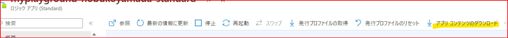

こんにちは。  Azure Integration サポート チームの山田です。  
今回は、Logic Apps のワークフローにおけるバックアップについていくつかご紹介いたします。

<!-- more -->

## 目次
- Logic Apps (Standard) でのバックアップ取得
    - アプリ コンテンツのダウンロード
    - 関数アプリ ファイルのダウンロード
- Logic Apps (従量課金) では
- まとめ

## Logic Apps (Standard) でのバックアップ取得

### アプリ コンテンツのダウンロード

1. Azure Portal から該当のLogic Apps (Standard) に移動します。
2. 概要 をご覧いただきます。



上部に [アプリ コンテンツのダウンロード] というメニューがございます。
こちらから zip ファイル形式でダウンロードいただけます。

### 関数アプリ ファイルのダウンロード

Azure Functions のドキュメント内、「関数アプリ ファイルをダウンロードする」という説明があり、こちらをご利用可能でございます。

[Azure Functions の zip プッシュ デプロイ | Microsoft Learn](https://learn.microsoft.com/ja-jp/azure/azure-functions/deployment-zip-push#download-your-function-app-files)


> REST API の使用:
> 
> <function_app> プロジェクトからファイルをダウンロードするには、以下の展開の GET API を使用します。
https://<function_app>.scm.azurewebsites.net/api/zip/site/wwwroot/

したがいまして、この URL を Curl コマンドなどでご利用いただく場合は以下となります。

`curl -X GET -H "Authorization: Bearer <Token>" https://<function_app>.azurewebsites.net/api/zip/site/wwwroot/ -o download.zip`


`<Token>` は取得した Bearer Token を入力いただきます。

Token の扱いには例として Azure CLI など、以下ドキュメントなどを参照いただけます。

[az account | Microsoft Learn](https://learn.microsoft.com/ja-jp/cli/azure/account?view=azure-cli-latest#az-account-get-access-token)

```
az account get-access-token [--name]
                            [--resource]
                            [--resource-type {aad-graph, arm, batch, data-lake, media, ms-graph, oss-rdbms}]
                            [--scope]
                            [--tenant]
```

またこのダウンロードした zip ファイルは zip デプロイでも使用できます。

[Standard ロジック アプリの DevOps を設定する - Azure Logic Apps | Microsoft Learn](https://learn.microsoft.com/ja-jp/azure/logic-apps/set-up-devops-deployment-single-tenant-azure-logic-apps?tabs=azure-cli#deploy-logic-app)

## Logic Apps (従量課金) では

[Azure portal でロジック アプリを管理する - Azure Logic Apps | Microsoft Learn](https://learn.microsoft.com/ja-jp/azure/logic-apps/manage-logic-apps-with-azure-portal#manage-logic-app-versions)


ロジック アプリのメニューで、 [開発ツール] の下にある [バージョン] を選択します。こちらから履歴ごとにコードを確認可能です。


## まとめ

本記事では、Logic Apps のワークフローにおけるバックアップについてご紹介しました。バージョン管理の必要場面において、参考になれば幸いです。

- [Azure Functions の zip プッシュ デプロイ | Microsoft Learn](https://learn.microsoft.com/ja-jp/azure/azure-functions/deployment-zip-push#download-your-function-app-files)
- [Standard ロジック アプリの DevOps を設定する - Azure Logic Apps | Microsoft Learn](https://learn.microsoft.com/ja-jp/azure/logic-apps/set-up-devops-deployment-single-tenant-azure-logic-apps?tabs=azure-cli#deploy-logic-app)
- [Azure portal でロジック アプリを管理する - Azure Logic Apps | Microsoft Learn](https://learn.microsoft.com/ja-jp/azure/logic-apps/manage-logic-apps-with-azure-portal#manage-logic-app-versions)
