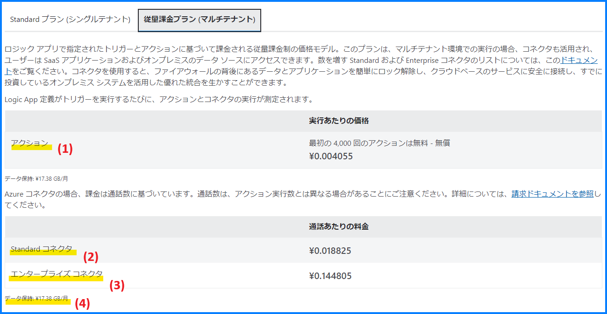
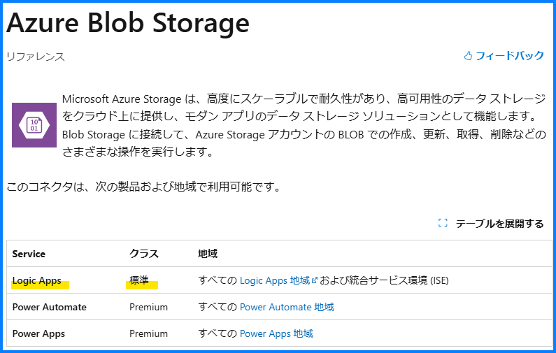
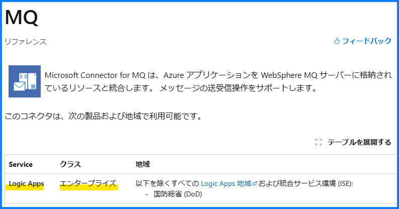
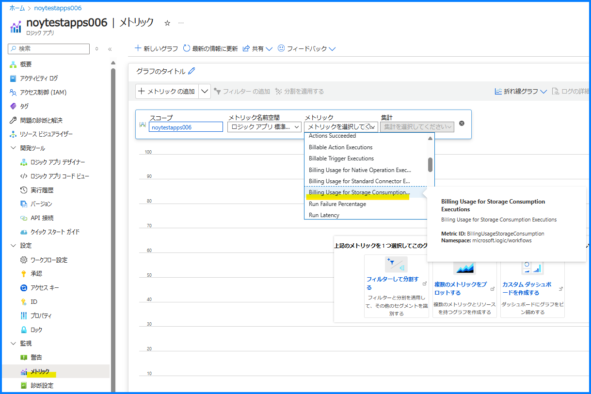
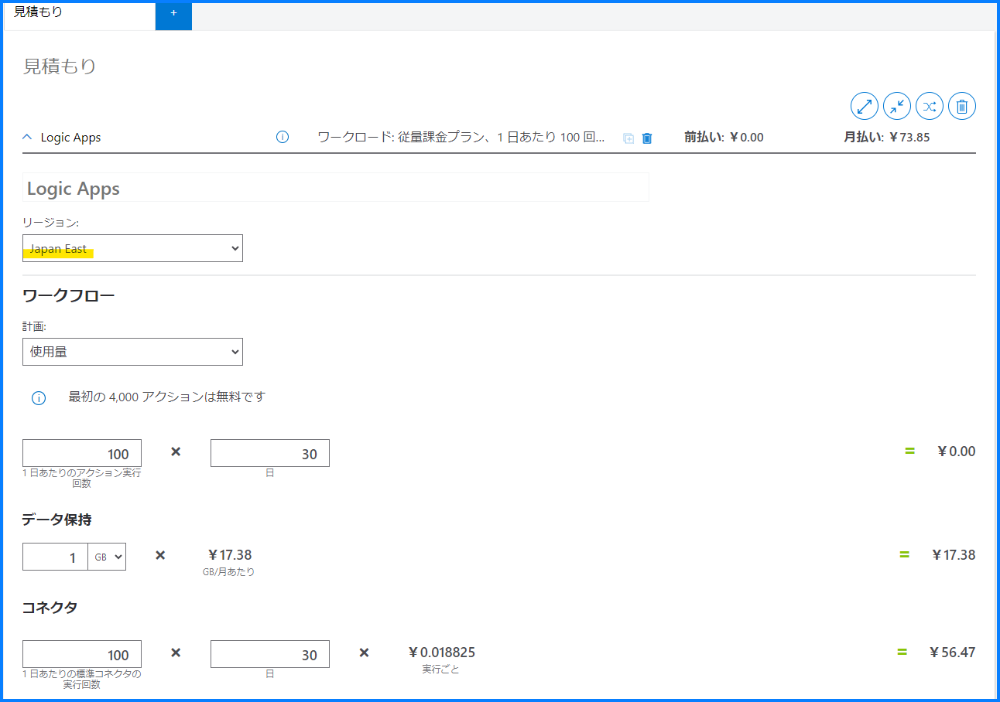

こんにちは！ Azure Integration サポート チームの山田です。
Azure Logic Apps には 従量課金版 と Standard 版がございますが、本記事は 従量課金版 について記載しております。今回は、従量課金版 Azure Logic Apps で料金をお見積りいただく際に、各資料を読み解いて理解するためのポイントをご紹介してまいります。

<!-- more -->

## 目次
- 従量課金版 Azure Logic Apps の料金体系を理解するポイント
    - Logic Apps の価格表 (2024 年 10 月の例) 
    - アクション と コネクタ について
    - データ保持 について
    - メトリック について
    - Azure Logic Apps の使用量の計測、課金、価格のしくみ
    - 料金計算ツール について
- まとめ

## 従量課金版 Azure Logic Apps の料金体系を理解するポイント

### Logic Apps の価格表 (2024 年 10 月の例) 

[価格 - Logic Apps | Microsoft Azure](https://azure.microsoft.com/ja-jp/pricing/details/logic-apps/)

以下例では 2024 年 10 月の料金に基づいて記載しております。主要なところを (1)～(4) に分けてお考えいただけます。

1. アクション = ¥0.004055 × 実行回数 (ただし、組み込みアクションの最初の 4000 回は毎月無料です。)
2. Standard コネクタ = ¥0.018825 × 通話 (呼び出し) 回数
3. エンタープライズ コネクタ = ¥0.144805 × 通話 (呼び出し) 回数
4. データ保持 = ¥17.38 GB/月

通話 とはチャンクなどにより 1 つのアクションで複数回呼び出し (Call、通信) される場合があるための単位とお考えください。

価格表: 

### アクション と コネクタ について

前提といたしまして、Logic Apps のコネクタには、組み込みコネクタとマネージド コネクタがあります。
従量課金版における価格記載の「アクション」(価格表の (1)) とは、組み込みコネクタの実行数を意味した記述となります。一方の「Standard コネクタ」、「エンタープライズ コネクタ」はマネージド コネクタとなります。
組み込みコネクタとマネージド コネクタの機能的な比較は以下にございます。

[コネクタとは - Azure Logic Apps | Microsoft Learn](https://learn.microsoft.com/ja-jp/azure/connectors/introduction#built-in-connectors-versus-managed-connectors)

> 組み込みコネクタは、直接 Azure Logic Apps 内でネイティブで動作するよう作られています。
> マネージド コネクタは、Microsoft によって Azure でデプロイ、ホスト、管理されます。
> マネージド コネクタはほとんどが、基になるサービスまたはシステムが Azure Logic Apps と通信するために使用する API のプロキシまたはラッパーを提供します。

マネージド コネクタのうち、コネクタの種類が Standard コネクタ (価格表の (2)) であるか、エンタープライズ コネクタ (価格表の (3)) であるかにつきましては、コネクタの公開情報から確認いただけます。

Standard コネクタ 例: [Azure Blob Storage - Connectors | Microsoft Learn](https://learn.microsoft.com/ja-jp/connectors/azureblob/)

エンタープライズ コネクタ 例: [MQ - Connectors | Microsoft Learn](https://learn.microsoft.com/ja-jp/connectors/mq/)

これを トリガー と アクション に分けておまとめしますと以下となります。

**<トリガー>**
- 組み込みコネクタのトリガー：無課金
- Standard コネクタのトリガー：**価格表の (2)** に該当
- エンタープライズ コネクタのトリガー： **価格表の (3)** に該当

**<アクション>**
- 組み込みコネクタのアクション： **価格表の (1)** に該当
- Standard コネクタのアクション： **価格表の (2)** に該当
- エンタープライズ コネクタのアクション： **価格表の (3)** に該当

### データ保持 について

**価格表の(4)** 、データ保持 については以下となります。

[Azure Logic Apps のコストの管理を計画する - Azure Logic Apps | Microsoft Learn](https://learn.microsoft.com/ja-jp/azure/logic-apps/plan-manage-costs#storage-operations-and-costs)

>Azure Logic Apps では、すべてのストレージ操作に Azure Storage を使用します。 マルチテナントの Azure Logic Apps では、すべてのストレージの使用およびコストがロジック アプリに関連付けられます。 データ保持とストレージ消費によって固定価格モデルを使用するコストが発生します。 たとえば、実行履歴からの入力と出力はバックグラウンド ストレージに保持されます。これは、ロジック アプリから独立して作成、管理、アクセスするストレージ リソースとは異なります。

メトリックの Billing Usage for Storage Consumption Executions が、課金対象のデータを保持した際のデータ サイズとなります。
またこのデータ サイズは、Logic Apps 実行履歴のアクションの入力と出力のテキスト サイズからも計算いただけます。

以上 (1)～(4) が、従量課金版 Azure Logic Apps の料金体系の主要なところとなります。

### メトリック について

ここまでの内容を踏まえメトリックにて、以下を確認いただけます。

[サポートされているメトリック - Microsoft.Logic/Workflows - Azure Monitor | Microsoft Learn](https://learn.microsoft.com/ja-jp/azure/azure-monitor/reference/supported-metrics/microsoft-logic-workflows-metrics)

- 課金対象のアクションの実行 ... Billable Action Executions
- 課金対象のトリガーの実行 ... Billable Trigger Executions
- ネイティブ操作実行の利用状況に応じた課金 ... Billing Usage for Native Operation
- 標準コネクタ実行の利用状況に応じた課金 ... Billing Usage for Standard Connector
- ストレージ消費の利用状況に応じた課金 ... Billing Usage for Storage Consumption
- 課金対象の実行の合計数 ... Total Billable Executions

例:

### Azure Logic Apps の使用量の計測、課金、価格のしくみ

また Azure Logic Apps および関連リソースにおける、測定、課金、および各価格モデルのしくみについて、以下ドキュメントにて網羅的にご覧いただけます。

[使用量の測定、課金、価格 - Azure Logic Apps | Microsoft Learn](https://learn.microsoft.com/ja-jp/azure/logic-apps/logic-apps-pricing)

> Azure Logic Apps を使用して、スケーリング可能な自動化された統合ワークフローをクラウドに作成して実行できます。この記事では、Azure Logic Apps および関連リソースにおける、測定、課金、および各価格モデルのしくみについて説明します。具体的な価格、コスト計画、さまざまなホスティング環境などの情報については、次のコンテンツを確認してください。

### 料金計算ツール について

ほか 料金計算ツール にて概算を確認いただけます。

[料金計算ツール | Microsoft Azure](https://azure.microsoft.com/ja-jp/pricing/calculator/?service=logic-apps)

例:

最後にはなりますが、ツールに基づくお見積りは概算となり、具体的なリソースのご利用状況によって増減する可能性もございます。Logic Apps の調査をご依頼の際は以下記事もご参考に、本テクニカル サポートへお問合せいただければ大変うれしく思います。

[Logic Apps の調査時にサポート エンジニアへ連携するログの取得方法について | Japan Azure Integration Support Blog](https://jpazinteg.github.io/blog/LogicApps/TroubleLogCollection/)

## まとめ

本記事では、[価格 - Logic Apps | Microsoft Azure](https://azure.microsoft.com/ja-jp/pricing/details/logic-apps/) のドキュメントを基に、従量課金版 Azure Logic Apps で料金をお見積りいただく際に、各資料を読み解いて理解するためのポイントをご紹介しました。Logic Apps のご利用検討時、皆様のご参考になれば幸いです。

