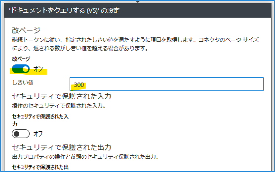

こんにちは！ Azure Integration サポート チームの山田です。
今回は、Azure Logic Apps で Azure Cosmos DB から 「ドキュメントをクエリする」 方法をご紹介いたします。

<!-- more -->

## 目次
- Logic Apps で Cosmos DB からドキュメントをクエリする
    - 基本
    - 「ドキュメントをクエリする」アクション
    - 「改ページ」に関して調整する

- まとめ

## Logic Apps で Cosmos DB からドキュメントをクエリする

### 基本

Logic Apps から Cosmos DB へ接続しての処理を行う方法については、以下ドキュメントがございます。

[Azure Cosmos DB への接続 - Azure Logic Apps | Microsoft Learn](https://learn.microsoft.com/ja-jp/azure/connectors/connectors-create-api-cosmos-db?tabs=consumption)

[Azure Cosmos DB - Connectors | Microsoft Learn](https://learn.microsoft.com/ja-jp/connectors/documentdb/)

### 「ドキュメントをクエリする」アクション

ここでは例として、「ドキュメントをクエリする」アクション をご紹介いたします。以下がご利用いただけます。

Cosmos DB のデータ エクスプローラー画面と、以下のように対応しています。

### 「改ページ」に関して調整する

Cosmos DB で大量データをクエリすると、結果が複数のページにわたる場合があります。 Logic Apps ではこれに対し、以下設定で改ページ位置のしきい値を変更することが可能です。以下、参考ドキュメントがございます。

[Azure Cosmos DB での改ページ | Microsoft Learn](https://learn.microsoft.com/ja-jp/azure/cosmos-db/nosql/query/pagination)

[改ページ位置の自動修正で項目やレコードを増やす - Azure Logic Apps | Microsoft Learn](https://learn.microsoft.com/ja-jp/azure/logic-apps/logic-apps-exceed-default-page-size-with-pagination#turn-on-pagination)

上のように [改ページ位置の自動修正] 設定を [オフ] から [オン] に変更します。 [しきい値] プロパティに、そのアクションで返す結果の目標数として整数値を指定します。

#### しきい値を設定しない場合

#### しきい値を設定した場合

このように、値を調整してデータを取り扱うことが可能となります。ほかにも [ストアド プロシージャを実行 (V2)](https://learn.microsoft.com/ja-jp/connectors/documentdb/#%E3%82%B9%E3%83%88%E3%82%A2%E3%83%89-%E3%83%97%E3%83%AD%E3%82%B7%E3%83%BC%E3%82%B8%E3%83%A3%E3%82%92%E5%AE%9F%E8%A1%8C-(v2)) や [ドキュメントを作成または更新 (V3)](https://learn.microsoft.com/ja-jp/connectors/documentdb/#%E3%83%89%E3%82%AD%E3%83%A5%E3%83%A1%E3%83%B3%E3%83%88%E3%82%92%E4%BD%9C%E6%88%90%E3%81%BE%E3%81%9F%E3%81%AF%E6%9B%B4%E6%96%B0-(v3)) などのアクションが用意されております。

## まとめ

本記事では、Logic Apps で Cosmos DB からドキュメントをクエリする方法についてご紹介しました。より柔軟なデータ連携フロー構築において、参考になれば幸いです。

- [Azure Cosmos DB への接続 - Azure Logic Apps | Microsoft Learn](https://learn.microsoft.com/ja-jp/azure/connectors/connectors-create-api-cosmos-db?tabs=consumption)
- [Azure Cosmos DB - Connectors | Microsoft Learn](https://learn.microsoft.com/ja-jp/connectors/documentdb/)
- [Azure Cosmos DB | Microsoft Learn](https://learn.microsoft.com/ja-jp/azure/cosmos-db/introduction)