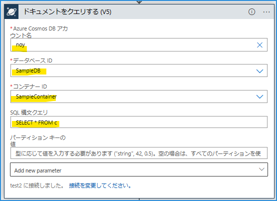
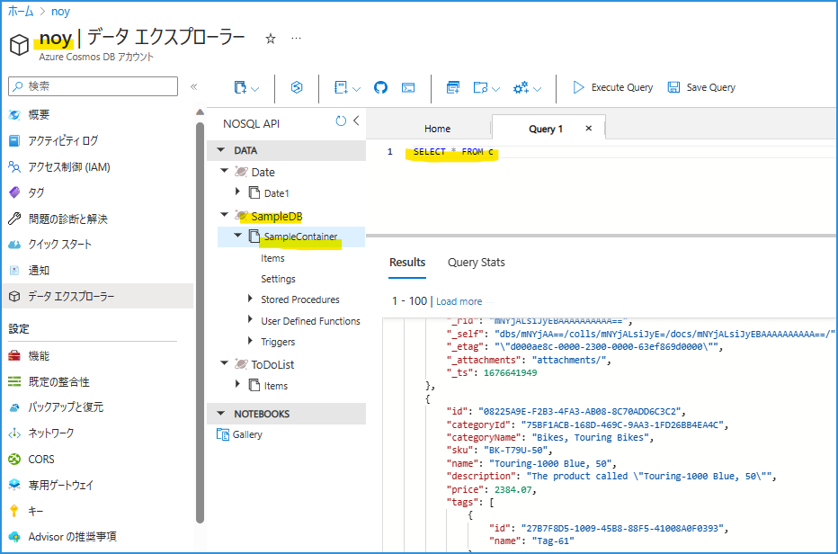
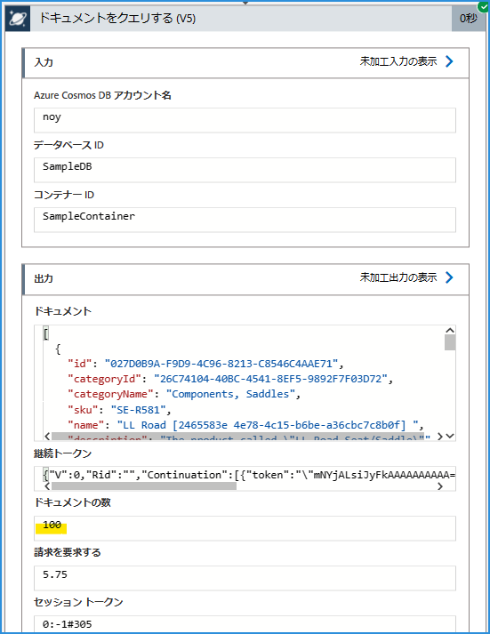
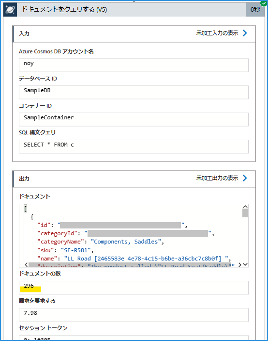

こんにちは！ Azure Integration サポート チームの山田です。
今回は、Azure Logic Apps で Azure Cosmos DB の「ドキュメントをクエリする」方法をご紹介いたします。

<!-- more -->

## 目次
- Logic Apps で Cosmos DB からドキュメントをクエリする
    - 基本
    - 「ドキュメントをクエリする」アクション
    - 「改ページ」に関して調整する

- まとめ

## Logic Apps で Cosmos DB からドキュメントをクエリする

### 基本

[Azure Cosmos DB への接続 - Azure Logic Apps | Microsoft Learn](https://learn.microsoft.com/ja-jp/azure/connectors/connectors-create-api-cosmos-db?tabs=consumption)

[Azure Cosmos DB - Connectors | Microsoft Learn](https://learn.microsoft.com/ja-jp/connectors/documentdb/)

### 「ドキュメントをクエリする」アクション

「ドキュメントをクエリする」コネクタがご利用いただけます。

Cosmos DB のデータエクスプローラー画面と以下のように対応しています。

### 「改ページ」に関して調整する

[Azure Cosmos DB での改ページ | Microsoft Learn](https://learn.microsoft.com/ja-jp/azure/cosmos-db/nosql/query/pagination)

Logic Apps ではこれに対し、以下設定で改ページ位置のしきい値を変更することが可能です。

[改ページ位置の自動修正で項目やレコードを増やす - Azure Logic Apps | Microsoft Learn](https://learn.microsoft.com/ja-jp/azure/logic-apps/logic-apps-exceed-default-page-size-with-pagination#turn-on-pagination)

#### しきい値を設定しない場合

#### しきい値を設定した場合

## まとめ

本記事では、Logic Apps で Cosmos DB からドキュメントをクエリする方法についてご紹介しました。Azure のより柔軟なデータ連携において、参考になれば幸いです。

- [はじめに - Azure Cosmos DB | Microsoft Learn](https://learn.microsoft.com/ja-jp/azure/cosmos-db/introduction)