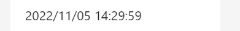

こんにちは。  Azure Integration サポート チームの山田です。  
今回は、 Logic Apps における日付や時刻の取り扱いについて、特に日本国内での利用に便利な Tips をご紹介いたします！

<!-- more -->

## 目次
- Logic Apps で日付や時刻を用いる
- タイム ゾーンの変換を行う
- フォーマットを指定して日時を表示する
- 期間計算を行う

## Logic Apps で日付や時刻を用いる

大きく以下の操作方法がございます。
- 日付/時刻 コネクタ: [組み込みコネクタの概要 - Azure Logic Apps | Microsoft Learn](https://learn.microsoft.com/ja-jp/azure/connectors/built-in#manage-or-manipulate-data)
- 関数: [式関数のリファレンス ガイド - Azure Logic Apps | Microsoft Learn](https://learn.microsoft.com/ja-jp/azure/logic-apps/workflow-definition-language-functions-reference#date-and-time-functions)

## タイム ゾーンの変換を行う

[日付/時刻 コネクタ](https://learn.microsoft.com/ja-jp/azure/connectors/built-in#manage-or-manipulate-data) から「タイム ゾーンの変換」が行えます。

 

ほか、[convertTimeZone](https://learn.microsoft.com/ja-jp/azure/logic-apps/workflow-definition-language-functions-reference#converttimezone)、[convertFromUtc](https://learn.microsoft.com/ja-jp/azure/logic-apps/workflow-definition-language-functions-reference#convertFromUtc)､[converttoUtc](https://learn.microsoft.com/ja-jp/azure/logic-apps/workflow-definition-language-functions-reference#converttoutc) という関数を利用できます。

## フォーマットを指定して日時を表示する
[convertFromUtc](https://learn.microsoft.com/ja-jp/azure/logic-apps/workflow-definition-language-functions-reference#convertFromUtc) という関数を利用できます。

- 例: `convertFromUtc(utcNow(),'Tokyo Standard Time','yyyy/MM/dd HH:mm:ss')`

 

## 期間計算を行う

対象日時同士の比較を行える [dateDifference](https://learn.microsoft.com/ja-jp/azure/logic-apps/workflow-definition-language-functions-reference#datedifference) という関数を利用できます。
- 例: `int(split(dateDifference(formatDateTime('10/01/2022'),utcNow()),'.')[0])`

 

 

 

## まとめ

以上、簡単にご案内いたしました。

- 日付/時刻 コネクタ: [組み込みコネクタの概要 - Azure Logic Apps | Microsoft Learn](https://learn.microsoft.com/ja-jp/azure/connectors/built-in#manage-or-manipulate-data)
- 関数: [式関数のリファレンス ガイド - Azure Logic Apps | Microsoft Learn](https://learn.microsoft.com/ja-jp/azure/logic-apps/workflow-definition-language-functions-reference#date-and-time-functions)

本記事が少しでも理解の足がかりになりましたら幸いです。最後までお読みいただき、ありがとうございました！