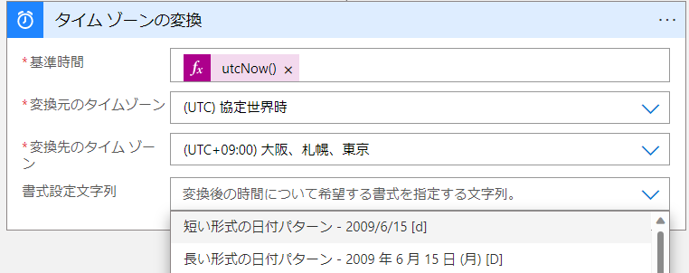
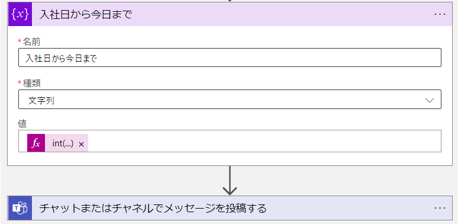

こんにちは。  Azure Integration サポート チームの山田です。  
今回は、 Logic Apps における日付や時刻の取り扱いについてご紹介いたします。  

<!-- more -->

## 目次
- Logic Apps で日付や時刻を用いる
- タイム ゾーンの変換を行う
- 期間計算を行う

## Logic Apps で日付や時刻を用いる

- 大きく以下の操作方法がございます。
    - 日付/時刻 コネクタ: [組み込みコネクタの概要 - Azure Logic Apps | Microsoft Learn](https://learn.microsoft.com/ja-jp/azure/connectors/built-in#manage-or-manipulate-data)
    - 関数: [式関数のリファレンス ガイド - Azure Logic Apps | Microsoft Learn](https://learn.microsoft.com/ja-jp/azure/logic-apps/workflow-definition-language-functions-reference#date-and-time-functions)

## タイム ゾーンの変換を行う

- [日付/時刻 コネクタ](https://learn.microsoft.com/ja-jp/azure/connectors/built-in#manage-or-manipulate-data) から「タイム ゾーンの変換」が行えます。

 

## 期間計算を行う

対象日時同士の比較を行える `dateDifference` という関数がございます。

例: `int(split(dateDifference(formatDateTime('10/01/2022'),body('日本時間の現在時刻')),'.')[0])`

 

 

 

## まとめ

本記事では、以下についてご案内いたしました。

- 日付/時刻 コネクタ: [組み込みコネクタの概要 - Azure Logic Apps | Microsoft Learn](https://learn.microsoft.com/ja-jp/azure/connectors/built-in#manage-or-manipulate-data)
- 関数: [式関数のリファレンス ガイド - Azure Logic Apps | Microsoft Learn](https://learn.microsoft.com/ja-jp/azure/logic-apps/workflow-definition-language-functions-reference#date-and-time-functions)

本記事が少しでもお役に立ちましたら幸いです。最後までお読みいただき、ありがとうございました！