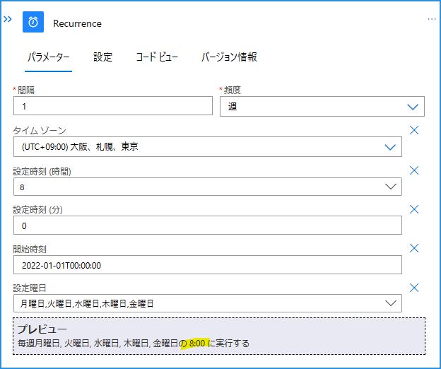
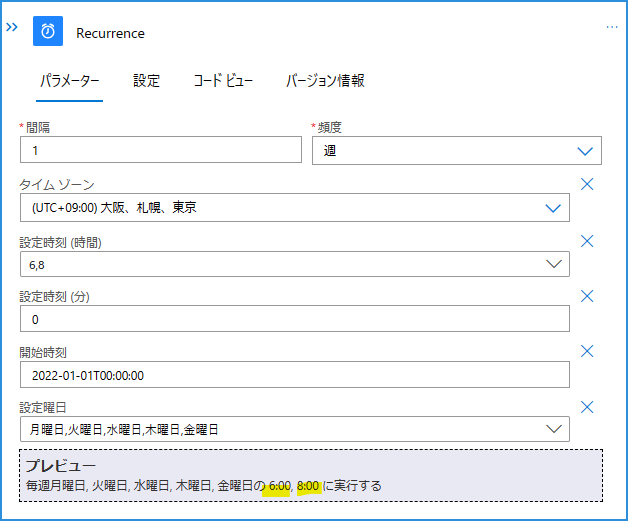
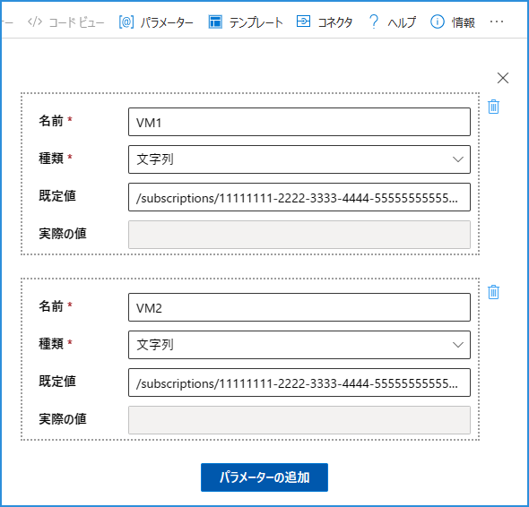
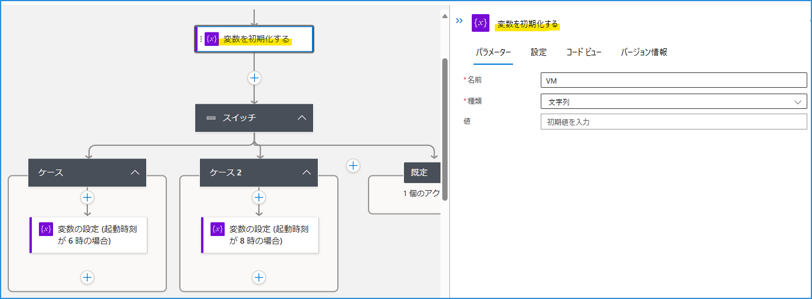
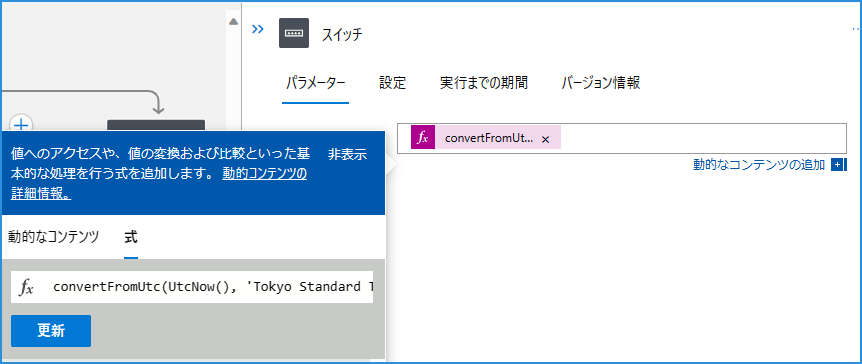
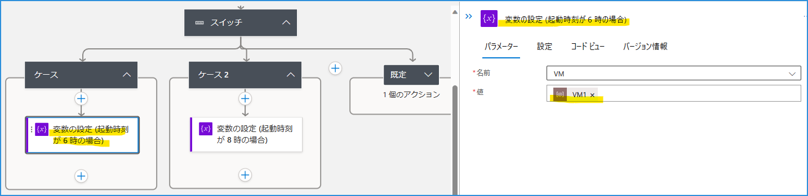
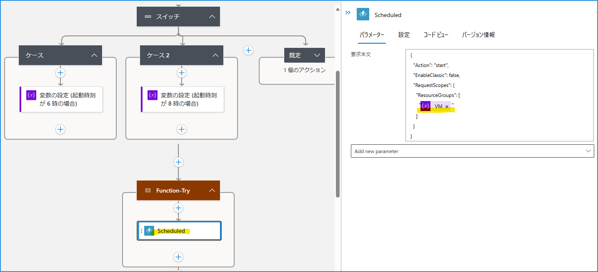

こんにちは！  Azure Integration サポート チームの 山田 です。

[Start/Stop VMs v2](https://learn.microsoft.com/ja-jp/azure/azure-functions/start-stop-vms/deploy) をご利用いただく際に、「もう少し柔軟に日付や時刻を条件判定して利用したい」というケースが多くあると思います。

今回はそうしたときに便利な、 Logic Apps における日付や時刻の判定に使えるシナリオをご紹介いたします。


<!-- more -->

## 前提条件

今回の記事では従量課金版 Logic Apps を利用しますが、Standard 版 Logic Apps でも問題ありません。

## 目次
- シナリオ 1: 平日 8 時に VM を起動したい。ただし 特定の日 (祝日) を除外したい
- シナリオ 2: 平日 8 時に VM1 を起動し、9 時に VM2 を起動したい
- 関連ドキュメント
- まとめ

## シナリオ 1: 平日 8 時に VM を起動したい。ただし 特定の日 (祝日) を除外したい

「平日 8 時に VM を起動したい。ただし 特定の日 (祝日) を除外したい」。例としてこの場合、以下のように毎週 月曜日 ～ 金曜日 の 8:00 にワークフローを動作させるよう、繰り返しトリガーを設定しておきます。



参考: [繰り返しワークフローをスケジュール設定および実行する - Azure Logic Apps | Microsoft Learn](https://learn.microsoft.com/ja-jp/azure/connectors/connectors-native-recurrence?tabs=consumption)

### トリガーの条件

一方トリガーには条件式というものを設定できます。


こちらに「月曜日 ～ 金曜日、ただし 特定の日 (祝日) を除外する」を満たす式を記述します。以下フォーラムとドキュメントを引用いたします。

参考: [What you need to know about trigger conditions?](https://techcommunity.microsoft.com/t5/integrations-on-azure-blog/what-you-need-to-know-about-trigger-conditions/ba-p/2320757)


> Trigger conditions is a trigger setting used to specify one or more conditional expressions which must be true for the trigger to fire.
Trigger conditions can be set using logic app designer or manually using code view; for schema reference for trigger conditions
>1. Go to your logic app.
>2. On the trigger, click on the three dots (...) at the top right corner.
>3. Select Settings.
>4. Scroll down to Trigger Conditions.
>5. Specify your conditional expression.
>6. Click Done.

><翻訳>
トリガーの条件は、トリガーが起動するために true でなければならない 1 つ以上の条件式を指定します。
トリガーの条件は、ロジック アプリ デザイナーを使用して設定することも、コード ビューを使用して手動で設定することもできます。

>1. ロジック アプリに移動します。
>2. トリガーで、右上隅にある3つのドット(...)をクリックします。
>3. [設定]を選択します。
>4. [トリガー条件]まで下にスクロールします。
>5. 条件式を指定します。
>6. [完了]をクリックします。

参考: [Azure Logic Apps でのトリガーとアクションの種類のスキーマ リファレンス ガイド # トリガーの条件](https://learn.microsoft.com/ja-jp/azure/logic-apps/logic-apps-workflow-actions-triggers#trigger-conditions)

> どのトリガーにも、ワークフローを実行するかどうかを決める条件を表した 1 つまたは複数の式を含む配列を追加できます。

フォーラムにありますとおり、トリガーの条件を用いることで以下メリットがあります。
- Logic Apps のフロー自体をシンプルにできる。
- 条件により実行が判断されることで、不要な実行を排除でき、運用上の負担を軽減できる。
- 実行数を減らすことでコストを削減できる。


### 条件式

上記を踏まえ、「今日が 2023 年の日本の祝日ではない」という条件式を設定します。まず日本時間の「月日」 (MMdd) は以下となります。

```
convertFromUtc(UtcNow(), 'Tokyo Standard Time', 'MMdd')
```

また例として 2023 年の日本の祝日 (MMdd) を示すアレイを示すと、以下となります。

参考: [国民の祝日について - 内閣府](https://www8.cao.go.jp/chosei/shukujitsu/gaiyou.html)


```
createArray('0101',
        '0102',
        '0109',
        '0211',
        '0223',
        '0321',
        '0429',
        '0503',
        '0504',
        '0505',
        '0717',
        '0811',
        '0918',
        '0923',
        '1009',
        '1103',
        '1123'
    )
```

以上を用いると、「今日が 2023 年の祝日ではない」ことを表す判定式は以下となります。こちらを「トリガーの条件」欄に記載致します。「トリガーの条件」欄では式の先頭に ＠ を記載します点をご注意ください。

```
not(contains( 
    createArray('0101',
        '0102',
        '0109',
        '0211',
        '0223',
        '0321',
        '0429',
        '0503',
        '0504',
        '0505',
        '0717',
        '0811',
        '0918',
        '0923',
        '1009',
        '1103',
        '1123'
    ), 
    convertFromUtc(UtcNow(), 'Tokyo Standard Time', 'MMdd')
))
```

参考: 
- [Azure Logic Apps および Power Automate のワークフロー式関数のリファレンス ガイド # convertFromUtc](https://learn.microsoft.com/ja-jp/azure/logic-apps/workflow-definition-language-functions-reference#convertFromUtc)
- [Azure Logic Apps および Power Automate のワークフロー式関数のリファレンス ガイド # createArray](https://learn.microsoft.com/ja-jp/azure/logic-apps/workflow-definition-language-functions-reference#createArray)
- [Azure Logic Apps および Power Automate のワークフロー式関数のリファレンス ガイド # contains](https://learn.microsoft.com/ja-jp/azure/logic-apps/workflow-definition-language-functions-reference#contains)


またここでは「日本の祝日」となる日付を静的にアレイに記述しましたが、カレンダーなどから取得して構築することも考えられます。詳細割愛いたしますが以下などがご活用いただけます。

参考: [Office 365 Outlook - Connectors | Microsoft Learn # イベントのカレンダー ビューの取得 (V3)](https://learn.microsoft.com/ja-jp/connectors/office365/#%E3%82%A4%E3%83%99%E3%83%B3%E3%83%88%E3%81%AE%E3%82%AB%E3%83%AC%E3%83%B3%E3%83%80%E3%83%BC-%E3%83%93%E3%83%A5%E3%83%BC%E3%81%AE%E5%8F%96%E5%BE%97-(v3)))

ほか 2024 年の日本の祝日 (MMdd) を示すアレイは以下となります。
```
createArray('0101',
    '0108',
    '0211',
    '0212',
    '0223',
    '0320',
    '0429',
    '0503',
    '0504',
    '0505',
    '0506',
    '0715',
    '0811',
    '0812',
    '0916',
    '0922',
    '0923',
    '1014',
    '1103',
    '1104',
    '1123'
  )

```


## シナリオ 2: 平日 6 時に VM1 を起動し、8 時に VM2 を起動したい

「平日 6 時に VM1 を起動し、8 時に VM2 を起動したい」。例としてこの場合は、以下のように毎週 月曜日 ～ 金曜日 の 6:00、8:00 にワークフローを動作させるよう繰り返しトリガーを設定しておきます。



前提として、パラメーターにて VM1 を起動する際のパラメーター、VM2 を起動する際のパラメーターを作成しておきます。


参考: [ワークフロー入力ためのパラメーターを作成する - Azure Logic Apps | Microsoft Learn](https://learn.microsoft.com/ja-jp/azure/logic-apps/create-parameters-workflows?tabs=consumption)

またこちらも前処理として、VM の引数を格納する変数を初期化しておきます。



そのうえで スイッチ を利用してまいります。スイッチするための式は、ここでは以下のようにしています。

`convertFromUtc(UtcNow(), 'Tokyo Standard Time', 'HH')`

これでワークフローが動作した際の現在時刻が 6 時ならば「06」、8 時ならば「08」などという文字列が取得できます。



踏まえ、ここではケース の判定を「"06"」と等しい場合とします。


ケース内では "06"、つまり 6 時に「VM1」を起動する際の引数をセットします。同様、"08" の時に「VM2」を起動する際の引数をセットすれば「平日 6 時に VM1 を起動し、8 時に VM2 を起動」という条件を利用して、日付に応じて意図した VM を起動する制御ができます。



例:


## 関連ドキュメント

Logic Apps と日付関数に言及したドキュメントや記事には、以下のようなものがございます。

- [Logic Apps で簡単に日付や時刻を用いる | Japan Azure Integration Support Blog](https://jpazinteg.github.io/blog/LogicApps/LogicApps-DateTime/)
- [「繰り返し (Recurrence)」トリガーの起動時刻の差異について | Japan Azure Integration Support Blog](https://jpazinteg.github.io/blog/LogicApps/ScheduleTriggerStrattime/)
- [Logic Apps の式関数で Unix Time を取得する方法 | Japan Azure Integration Support Blog](https://jpazinteg.github.io/blog/LogicApps/UnixTime/)


また今回の「Start/Stop VMs v2」に関する参考ドキュメントや記事は、以下のようなものがございます。

- [Start/Stop VMs v2 を Azure サブスクリプションにデプロイする | Microsoft Learn](https://learn.microsoft.com/ja-jp/azure/azure-functions/start-stop-vms/deploy)
- [Start/Stop VMs v2 のご紹介 - Japan PaaS Support Team Blog](https://jpazpaas.github.io/blog/2021/11/29/introduce-Start-Stop-VMs-v2.html)


## まとめ

本記事では、[Start/Stop VMs v2](https://learn.microsoft.com/ja-jp/azure/azure-functions/start-stop-vms/deploy) をはじめとした繰り返しトリガー利用時に便利な、日付や時刻の判定方法についてご紹介しました。引き続き皆様のお役に立てる情報を発信してまいります。

