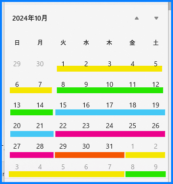

こんにちは！  Azure Integration サポート チームの 山田 です。

[Start/Stop VMs v2](https://learn.microsoft.com/ja-jp/azure/azure-functions/start-stop-vms/deploy) をご利用いただく際などに、「もう少し柔軟に日付や時刻を条件判定して利用したい」というケースが多くあると思います。

当ブログでは以前に [Logic Apps で日付や時刻を判定してワークフローを制御する | Japan Azure Integration Support Blog](https://jpazinteg.github.io/blog/LogicApps/LogicApps-Functions/) にて、Logic Apps で日付や時刻を判定してワークフローを制御する方法をいくつかご紹介いたしました。

今回はさらに Logic Apps における日付や時刻の判定に使えるシナリオとして「毎月第 1 月曜日に起動したい」場合の設定例をご紹介いたします。


<!-- more -->

## 前提条件

今回の記事では従量課金版 Logic Apps を利用しますが、Standard 版 Logic Apps でもご利用いただけます。

## 目次
- シナリオ: 毎月第 1 月曜日の午前 8 時にワークフローを起動したい
- 関連ドキュメント
- まとめ

## シナリオ: 毎月第 1 月曜日の午前 8 時にワークフローを起動したい

「毎月第 1 月曜日の午前 8 時にワークフローを起動したい」。例としてこの場合、まずは以下のように毎週月曜日の 8:00 にワークフローを起動させるよう、繰り返しトリガーを設定しておきます。


参考: [繰り返しワークフローをスケジュール設定および実行する - Azure Logic Apps | Microsoft Learn](https://learn.microsoft.com/ja-jp/azure/connectors/connectors-native-recurrence?tabs=consumption)

### トリガーの条件

トリガーには条件式というものを設定できることを、以前の記事でもご紹介いたしました。

参考: [Logic Apps で日付や時刻を判定してワークフローを制御する | Japan Azure Integration Support Blog](https://jpazinteg.github.io/blog/LogicApps/LogicApps-Functions/) 

今回はこちらに「第 1 月曜日」を満たす式を記述します。
カレンダーからは以下のように 第 1 月曜日 (または月曜日以外の任意の曜日) は必ず 1 以上 7 以下の日付となることが分かります。



これは同様に、以下のように各週の条件を考えることができます。

- 第 2 月曜日 (または月曜日以外の任意の曜日) は必ず 8 以上 14 以下の日付となる。
- 第 3 月曜日 (または月曜日以外の任意の曜日) は必ず 15 以上 21 以下の日付となる。
- 第 4 月曜日 (または月曜日以外の任意の曜日) は必ず 22 以上 28 以下の日付となる。
- 第 5 月曜日 (または月曜日以外の任意の曜日) は必ず 29 以上の日付となる。


### 条件式

上記を踏まえ、日本時間にて「今日が第 1 月曜日である (= 1 以上 7 以下の日付である)」という条件式を設定すると、以下のようになります。


```
@and(greaterOrEquals(dayOfMonth(convertFromUtc(utcNow(), 'Tokyo Standard Time')), 1), lessOrEquals(dayOfMonth(convertFromUtc(utcNow(), 'Tokyo Standard Time')), 7))
```

`greaterOrEquals` (以上)  と `lessOrEquals` (以下) の利用方法についてご参考になれば幸いです。また関連する関数について、以下ご覧いただけます。

参考: 
- [Azure Logic Apps および Power Automate のワークフロー式関数のリファレンス ガイド # convertFromUtc](https://learn.microsoft.com/ja-jp/azure/logic-apps/workflow-definition-language-functions-reference#convertFromUtc)
- [Azure Logic Apps および Power Automate のワークフロー式関数のリファレンス ガイド # dayOfMonth](https://learn.microsoft.com/ja-jp/azure/logic-apps/workflow-definition-language-functions-reference#dayOfMonth)
- [Azure Logic Apps および Power Automate のワークフロー式関数のリファレンス ガイド # lessOrEquals](https://learn.microsoft.com/ja-jp/azure/logic-apps/workflow-definition-language-functions-reference#lessOrEquals)
- [Azure Logic Apps および Power Automate のワークフロー式関数のリファレンス ガイド # greaterOrEquals](https://learn.microsoft.com/ja-jp/azure/logic-apps/workflow-definition-language-functions-reference#greaterOrEquals)
- [Azure Logic Apps および Power Automate のワークフロー式関数のリファレンス ガイド # and](https://learn.microsoft.com/ja-jp/azure/logic-apps/workflow-definition-language-functions-reference#and)

これにより、「毎月第 1 月曜日に起動したい」とするワークフローを制御できるようになりました。上に基づいて、お客様業務上の任意の後続処理を行うための、条件設定に応用いただけます。


## 関連ドキュメント

本文中でもご紹介いたしましたが、ほか Logic Apps と日付関数に言及した記事には、以下のようなものがございます。

- [Logic Apps で簡単に日付や時刻を用いる | Japan Azure Integration Support Blog](https://jpazinteg.github.io/blog/LogicApps/LogicApps-DateTime/)
- [「繰り返し (Recurrence)」トリガーの起動時刻の差異について | Japan Azure Integration Support Blog](https://jpazinteg.github.io/blog/LogicApps/ScheduleTriggerStrattime/)
- [Logic Apps の式関数で Unix Time を取得する方法 | Japan Azure Integration Support Blog](https://jpazinteg.github.io/blog/LogicApps/UnixTime/)
- [Logic Apps で日付や時刻を判定してワークフローを制御する | Japan Azure Integration Support Blog](https://jpazinteg.github.io/blog/LogicApps/LogicApps-Functions/)


## まとめ

本記事では、繰り返しトリガー利用時に便利な、日付や時刻の判定方法についてご紹介しました。引き続き皆様のお役に立てる情報を発信してまいります。

