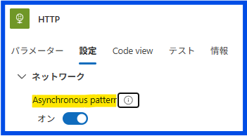
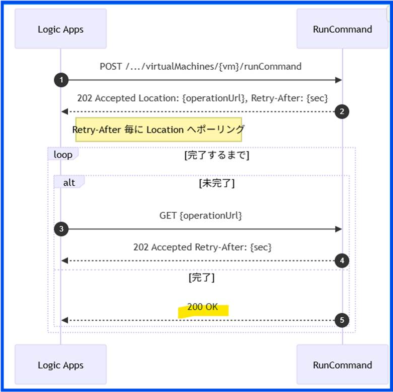
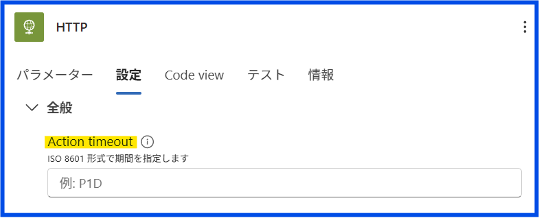

こんにちは。Azure Integration サポート チームの中田です。

Logic Apps の HTTP アクションを利用したワークフローでは、「HTTP アクションのタイムアウトは 120 秒」という情報を目にする機会が多くあります。一方で、実行履歴を確認すると、120 秒を超えているように見えるにもかかわらず、アクションが成功しているケースもあり、挙動に疑問を持たれることがあります。

本記事では、HTTP アクションにおける同期応答 / 非同期応答の違いに着目し、タイムアウトの考え方について整理します。

# こんな方におすすめです

- Logic Apps の HTTP アクションのタイムアウト挙動が分かりづらいと感じている方
- 120 秒を超えて HTTP アクションが成功している理由を理解したい方 

## 目次

1. [HTTP アクションのタイムアウトに関する前提](#header1)
2. [同期応答の HTTP アクション](#header2)
3. [非同期応答 (非同期操作パターン) の HTTP アクション](#header3)
4. [まとめ](#header4)

---

### 1. HTTP アクションのタイムアウトに関する前提 

Logic Apps における HTTP アクションには、同期的な応答を待つ場合の既定タイムアウト時間が定められています。

#### [HTTP 要求の制限 - タイムアウト時間]
| 名前 | マルチテナント (従量課金) | シングルテナント (Standard) |
|--------|--------|--------|
| 送信要求 | 120 秒 (2 分) | 225 秒 (3 分 45 秒) (既定値・変更可) |
| 受信要求 | 120 秒 (2 分) | 225 秒 (3 分 45 秒) (既定値・変更可) |

[制限と構成リファレンス ガイド - Azure Logic Apps | Microsoft Learn#HTTP 要求の制限](https://learn.microsoft.com/ja-jp/azure/logic-apps/logic-apps-limits-and-config?tabs=consumption#http-request-limits)

一般的に参照される「HTTP アクションのタイムアウトは 120 秒」という値は、Logic Apps (従量課金) のこの同期応答を前提とした制限を指しています。そのため、この数値だけを見ると、120 秒を超えた HTTP アクションは必ず失敗すると理解されがちですが、実際の挙動は呼び出し先 API の応答方式によって異なります。

---

### 2. 同期応答の HTTP アクション 

呼び出し先の API が、リクエストを受信してから処理を完了し、最終結果を 1 回の HTTP 応答で返却する場合、Logic Apps はその応答を同期的に待機します。

この場合、応答がタイムアウト時間内に返却されなければ、HTTP アクションはタイムアウト エラーとして失敗します。比較的処理時間の短い REST API を呼び出す場合は、この同期応答の挙動になることが一般的です。

---

### 3. 非同期応答 (非同期操作パターン) の HTTP アクション 

一方で、呼び出し先 API が、リクエストを受信した時点で 202 Accepted を返却し、あわせて Location ヘッダーに処理結果取得用の URL を返すケースがあります。

このような API は、処理をバック グラウンドで継続する非同期操作パターンを採用しています。
Logic Apps の HTTP アクションは、この応答を検知すると、内部的に Location ヘッダーに指定された URL に対してポーリングを行い、最終的な処理結果として 200 OK が返却されるまで待機します。

HTTP アクションでは、この非同期操作パターンを利用するかどうかを**Asynchronous pattern** の設定で制御できます。
この設定は既定で有効 (オン) になっており、特別な設定を行わなくても、202 Accepted + Location ヘッダーを返す API に対しては、自動的にポーリングが実行されます。

具体例として、Azure Virtual Machines の Run Command API が挙げられます。Run Command API のレスポンス仕様では、コマンドの実行が即時に完了しない場合、HTTP ステータス コードとして 202 Accepted が返却され、レスポンス ヘッダーの Location に、実行結果を取得するための URL が設定されます。その後、当該 URL に対して状態確認を行い、処理が完了したタイミングで最終的な結果が取得できる仕様となっています。

[Virtual Machines - Run Command - REST API (Azure Compute) | Microsoft Learn#応答](https://learn.microsoft.com/ja-jp/rest/api/compute/virtual-machines/run-command?view=rest-compute-2025-04-01&tabs=HTTP#response)

[処理例]

**非同期操作の待機中は、同期応答時の 120 秒タイムアウトは適用されず、HTTP アクションは成功または失敗が確定するまで継続されます。**

なお、「非同期処理は利用したいが、一定時間以上かかる場合はアクションを失敗として扱いたい」といった要件がある場合には、HTTP アクションの **Action timeout** を利用することで、アクションの最大実行時間を制御できます。

非同期操作パターンの詳細は下記ブログで説明しておりますので、併せてご参照ください。

[HTTP アクションでのタイムアウト エラーの回避方法 - 非同期ポーリング パターン](https://jpazinteg.github.io/blog/LogicApps/HttpAction-AsyncPattern-Polling/)

---

### 4. まとめ 

本記事では、Logic Apps の HTTP アクションにおけるタイムアウトの考え方について、同期応答と非同期応答の違いを中心に整理しました。

- HTTP アクションの 120 秒タイムアウトは、同期応答を前提とした制限である
- 202 Accepted と Location ヘッダーを返す API は、非同期操作パターンとして扱われる
- 非同期操作パターンでは、120 秒を超えてもアクションが成功する

HTTP アクションの挙動は、単なる秒数の制限ではなく、呼び出し先 API の応答方式と関係しています。本記事が、ワークフロー設計やトラブルシューティングの理解整理の一助となれば幸いです。
