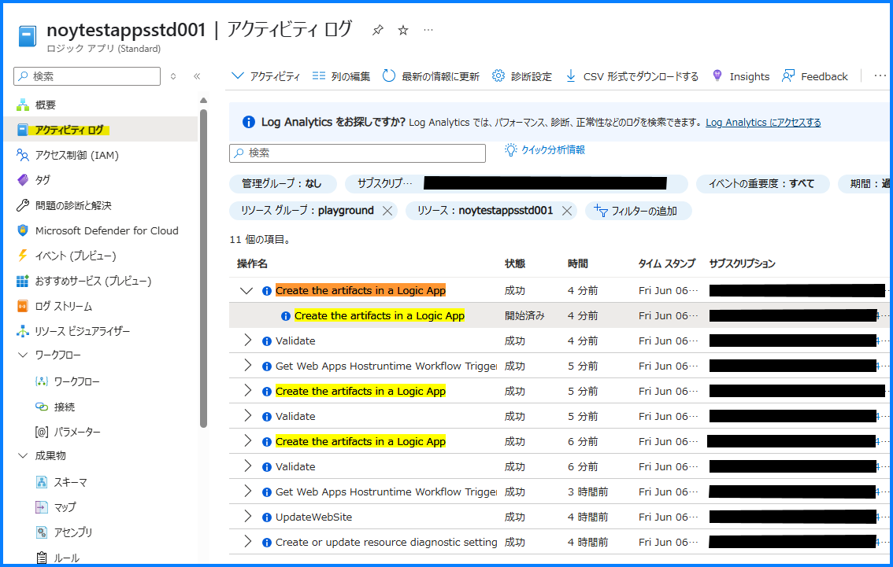
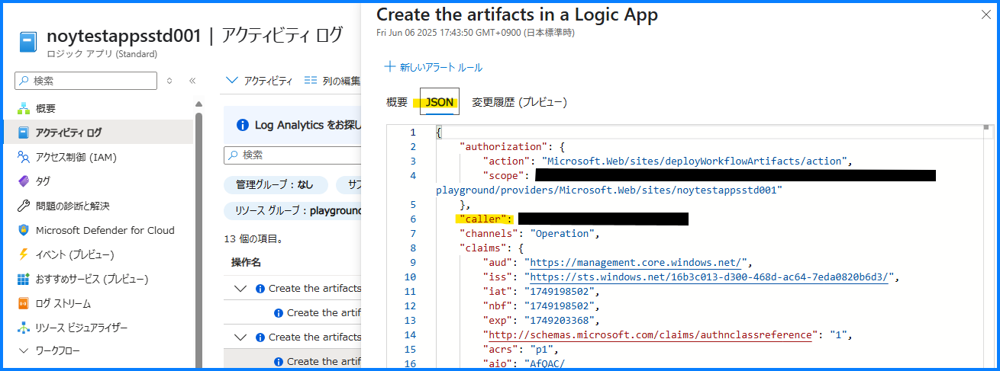

こんにちは！ Azure Integration サポート チームの山田です。  
今回は、Standard Logic Apps のワークフローを誤って削除してしまった際の調査、リカバリ手段についてご紹介いたします。

<!-- more -->

## 目次

- アクティビティ ログからの調査
- Standard Logic Apps バックアップからの復元
- Azure Files 共有スナップショットからの復元
- まとめ

## アクティビティ ログからの調査

Standard Logic Apps でも確認いただけます [アクティビティ ログ] にて、ユーザー情報を参照できる可能性があります。

一例では Standard Logic Apps のワークフローを削除した際に、[Create the artifacts in a Logic App] というアクティビティ ログが出力されることが確認できます。

こちらのレコードを選択することで、[JSON] タブより、"Caller" などにてユーザー情報がご確認いただけます。

 
この [Create the artifacts in a Logic App] というアクティビティ ログ自体は、ワークフローを編集した場合に出力されますため、これだけでは削除か更新かの判断がつかないという留意点はあるものの、削除された時間がある程度分かるようであれば、このアクティビティ ログが一助になる可能性があります。

## Standard Logic Apps バックアップからの復元

Standard Logic Apps のワークフローは、バックアップ済みのアプリ コンテンツから復元できます。こちらについては関連する以下記事がご参考になれば幸いです。

[Logic Apps のバックアップ | Japan Azure Integration Support Blog](https://jpazinteg.github.io/blog/LogicApps/LogicApps-Backup/)

> Azure Portal から該当の Standard Logic Apps に移動し、概要 をご覧いただきます。
> 上部に [アプリ コンテンツのダウンロード] というメニューがございます。こちらから zip ファイル形式でダウンロードいただけます。

上記で取得されたアプリ コンテンツ (zip ファイル) を zip デプロイすることによって、削除されたワークフローの復元が可能です。

[シングルテナントの Azure Logic Apps に Standard ロジック アプリの DevOps デプロイを設定する # ロジック アプリをデプロイする](https://learn.microsoft.com/ja-jp/azure/logic-apps/set-up-devops-deployment-single-tenant-azure-logic-apps?tabs=azure-cli#deploy-logic-app)

もちろん、Azure DevOps 等を利用してソースのバージョンを管理されている場合には、そちらからの復元も考えられます。こちらは以下記事がご参考になれば幸いです。

[Standard Logic Apps と Azure DevOps で CI/CD 環境を構成する | Japan Azure Integration Support Blog](https://jpazinteg.github.io/blog/LogicApps/StandardLogicAppsCdci/)

## Azure Files 共有スナップショットからの復元

Standard Logic Apps のワークフロー情報は、当該 Logic Apps が紐づくストレージ アカウントのファイル共有に保存されているため、ファイル共有側にてスナップショットを作成いただいている場合には、そちらから復元できる可能性があります。

[Azure Files の共有スナップショットを使用する | Microsoft Learn # SMB ファイル共有のスナップショット](
https://learn.microsoft.com/ja-jp/azure/storage/files/storage-snapshots-files?tabs=portal#smb-file-share-snapshots)
 
Logic Apps と紐づくストレージ アカウント、およびファイル共有名は、[設定 - 環境変数] より以下の環境変数から確認いただけます。

- `WEBSITE_CONTENTAZUREFILECONNECTIONSTRING`: ストレージ アカウントの接続文字列より "AccountName=" にてストレージ アカウント名が確認いただけます。
- `WEBSITE_CONTENTSHARE`： ファイル共有名が確認いただけます。

こちらについては以下記事がご参考になれば幸いです。

[Logic Apps Standard と関連するストレージ アカウント | Japan Azure Integration Support Blog](https://jpazinteg.github.io/blog/LogicApps/StandardLogicApps-StorageAccount/)

## まとめ

本記事では、Standard Logic Apps のワークフローを誤って削除してしまった際の調査と、リカバリ手段についてご紹介いたしました。定期的なバックアップのご検討含め、万が一の際のリカバリ手段としてご活用いただければと思います。最後までお読みいただきありがとうございました！