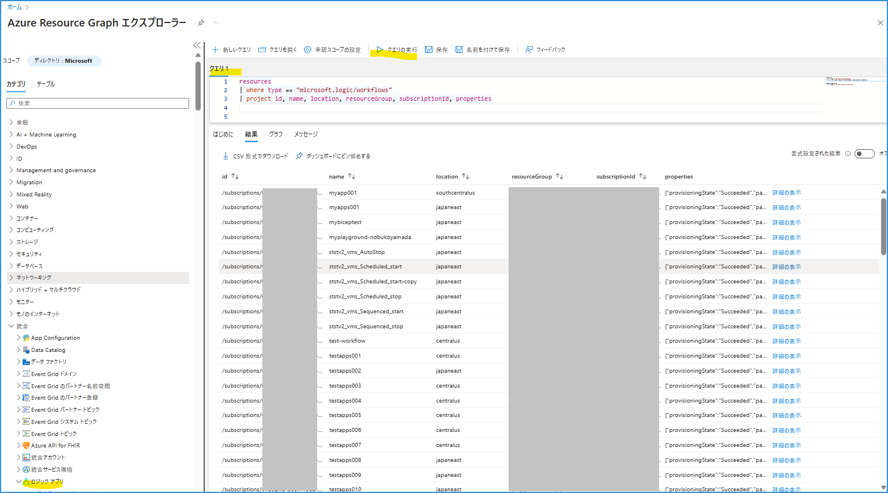
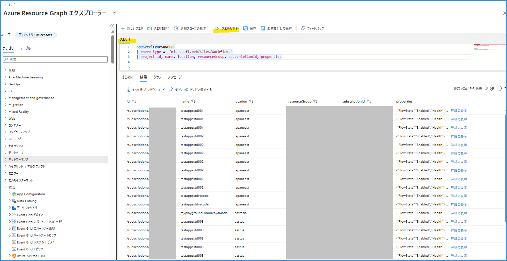
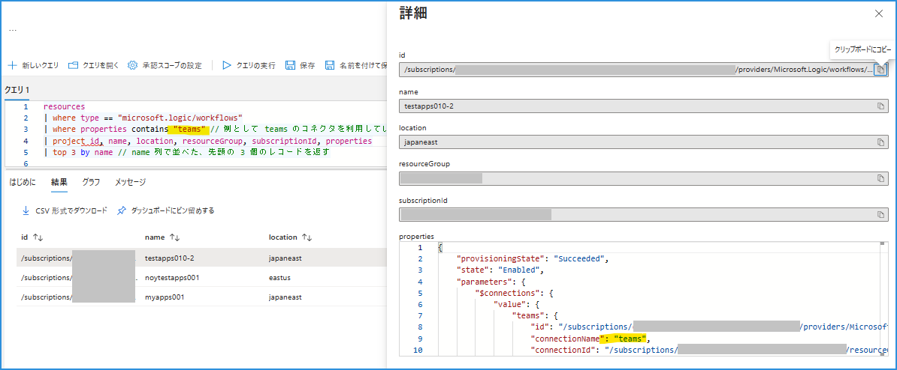
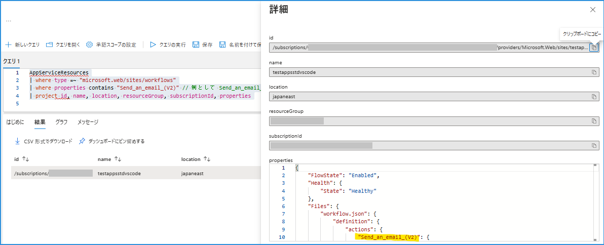
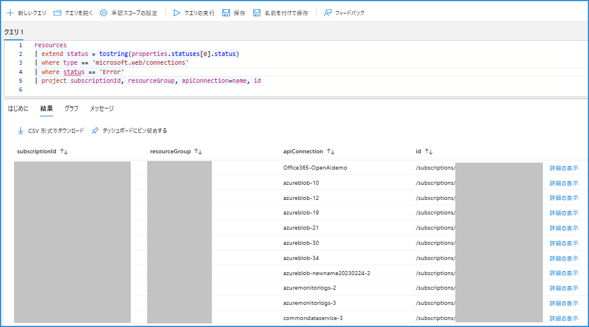

こんにちは！  Azure Integration サポート チームの 山田 です。

今回は、ある特定の条件の Logic Apps ワークフローや API 接続を検索したいときに便利な Azure Resource Graph エクスプローラー と クエリ に関する Tips をご紹介いたします。

<!-- more -->

## 目次
- 前提
- シナリオ 1: 従量課金版 Logic Apps を検索する
- シナリオ 2: Standard 版 Logic Apps を検索する
- シナリオ 3: 特定のコネクタを利用している Logic Apps を検索する
- シナリオ 4: API 接続を検索する
- 関連ドキュメント
- まとめ

## 前提

前提として、Logic Apps を含む各種リソースを検索する際は、Azure Resource Graph エクスプローラー をご利用いただけます。以下ドキュメントに概要がございます。

[クイック スタート:初めてのポータル クエリ - Azure Resource Graph | Microsoft Learn](https://learn.microsoft.com/ja-jp/azure/governance/resource-graph/first-query-portal#run-your-first-resource-graph-query)


## シナリオ 1: 従量課金版 Logic Apps を検索する

まずは基本として、従量課金版 Logic Apps を Azure Resource Graph エクスプローラーから検索いただく方法です。左側 カテゴリ から、「ロジック アプリ」がございます。

例として以下クエリにて、リソースが表示されます。

```
resources
| where type == "microsoft.logic/workflows"
| project id, name, location, resourceGroup, subscriptionId, properties
```


参考: https://learn.microsoft.com/ja-jp/azure/governance/resource-graph/reference/supported-tables-resources#resources

## シナリオ 2: Standard 版 Logic Apps を検索する

Standard 版 Logic Apps は上と異なり、「AppServiceResources」からご覧いただけます。

例として以下クエリにて、リソースが表示されます。

```
AppServiceResources
| where type == "microsoft.web/sites/workflows"
| project id, name, location, resourceGroup, subscriptionId, properties
```


参考: https://learn.microsoft.com/ja-jp/azure/governance/resource-graph/reference/supported-tables-resources#appserviceresources


## シナリオ 3: 特定のコネクタを利用している Logic Apps を検索する

踏まえまして、特定のコネクタを利用しているなど、プロパティに応じた Logic Apps を検索したいケースがあるかと思います。

例として以下のようなクエリにて、対象を絞り込むことができます。

```
resources
| where type == "microsoft.logic/workflows"
| where properties contains "teams" // 例として teams のコネクタを利用しているもの
| project id, name, location, resourceGroup, subscriptionId, properties
| top 3 by name // name 列で並べた、先頭の 3 個のレコードを返す

```


Standard Logic Apps の場合は以下のようになります。

```
AppServiceResources
| where type == "microsoft.web/sites/workflows"
| where properties contains "Send_an_email_(V2)" // 例として Send_an_email_(V2) というアクション名を使用しているもの
| project id, name, location, resourceGroup, subscriptionId, properties

```



## シナリオ 4: API 接続を検索する

ここまでの内容に加え、API 接続を検索するには以下クエリがご利用いただけます。

```
resources
| extend status = tostring(properties.statuses[0].status)
| where type == 'microsoft.web/connections'
| where status == 'Error' // 例として Error 状態のもの
| project subscriptionId, resourceGroup, apiConnection=name, id
```




上記の API 接続をもとに、対象の Logic Apps を見つけることができます。

```
resources
| where type == "microsoft.logic/workflows"
| where properties contains "azureblob-24" // API 接続名で検索する
| project id, name, location, resourceGroup, subscriptionId, properties
```


## 関連ドキュメント

[Azure Logic Apps の コネクタにおける不要な接続情報の削除方法について | Japan Azure Integration Support Blog](https://jpazinteg.github.io/blog/LogicApps/ApiConnectionsDelete/)

[クイック スタート:初めてのポータル クエリ - Azure Resource Graph | Microsoft Learn](https://learn.microsoft.com/ja-jp/azure/governance/resource-graph/first-query-portal#run-your-first-resource-graph-query)


## まとめ

本記事では、Logic Apps ワークフローや API 接続を検索したいときに便利な Azure Resource Graph エクスプローラー と クエリ についてご紹介しました。引き続き皆様のお役に立てる情報を発信してまいります。

