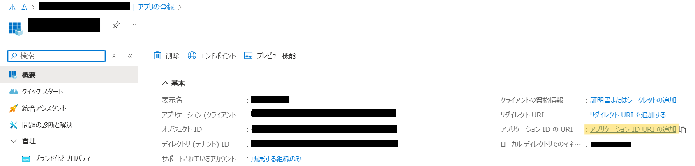
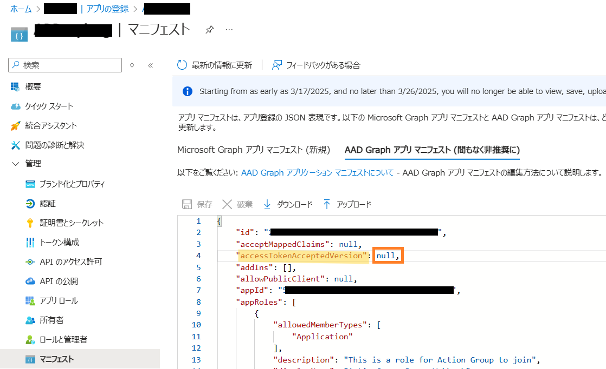

こんにちは！Azure Integration サポート チームの 飯野 です。<br>
<br>
Azure Monitor のアクション グループは、Azure Monitor のデータによってインフラストラクチャやアプリケーションに問題が発生したことを検知した際に、アラートをトリガーするための機能です。<br>
アクション グループを使用することで、アラートがトリガーされた際に、通知（音声通話、SMS、プッシュ通知、メールなど）を送信し、あらかじめ指定したアクションを実行することが可能となります。<br>
アアラートがトリガーされたときに実行されるアクションのうち [ロジック アプリ] と [セキュリティ保護された Webhook] がロジック アプリを呼び出すことができるアクションとなります。<br>
<br>
この記事では Azure Monitor のアクション グループから [セキュリティで保護された Webhook] によってロジック アプリを呼び出すための手順をご紹介します。<br>
<!-- more -->

## 目次
- アクション グループからの呼び出しの受信トリガー
- セキュリティで保護された Webhook の設定方法

    1. 保護された Web API 用の Microsoft Entra アプリケーションを作成
    1. ロジック アプリ側で [Azure Active Directory 承認ポリシー] を設定
    1. ロジック アプリのエンドポイント URL を取得
    1. アクション グループを設定
    1. アクション グループが Microsoft Entra アプリケーションを使用できるようにするための PowerShell スクリプトを実行

## アクション グループからの呼び出しの受信トリガー
アクション グループから従量課金タイプのロジック アプリを呼び出す際、通常は認証方法を意識することなく、アクション グループの [アクション タイプ] に [ロジック アプリ] を選択いただいてから、呼び出し先のロジック アプリを指定されてアクション グループからロジック アプリを呼び出すことが多いかと思います。
<br>


この場合、内部的にはロジック アプリの [When a HTTP request is received] トリガーに設定されているエンドポイント URL に対するリクエストが送信されています。<br>
このエンドポイント URL 文字列にはアクセス キーを利用した SAS (共有アクセス署名) 認証情報が含まれているため、[ロジック アプリ] を選択した場合のロジック アプリの呼び出しは SAS 認証によって行われることとなります。<br><br>
従量課金ワークフローの [When a HTTP request is received] トリガーのエンドポイント URL の呼び出しに利用できる認可方式は、以下セクションの記載のとおり、Microsoft Entra ID を使用した OAuth 2.0 または Shared Access Signature (SAS) のいずれか 1 つのみとなります。

- [ワークフロー内のアクセスとデータをセキュリティで保護する - Azure Logic Apps | Microsoft Learn ＃ Microsoft Entra ID を使用した OAuth 2.0 を有効にする前の考慮事項]

(https://learn.microsoft.com/ja-jp/azure/logic-apps/logic-apps-securing-a-logic-app?tabs=azure-portal#considerations-before-you-enable-oauth-20-with-microsoft-entra-id)<br>


[When a HTTP request is received] トリガーを呼び出す際の認証方式として SAS 認証を使いたくない場合に利用できる認証方法が OAuth 認証の有効化による認証となります。<br>
アクション グループのアクション タイプに [ロジック アプリ] を選択してしまうと内部的に SAS 認証呼び出しの形式をとるため、OAuth 認証によってロジック アプリを呼び出す場合、アクション タイプには [セキュリティで保護された Webhook] を選択する必要があります。<br>

アクション グループでアクション タイプに [保護された Webhook] を指定する場合、OAuth 認証を用いるための設定が必要となりますので、その手順の詳細を以降からご説明いたします。<br>

## セキュリティで保護された Webhook の設定方法
アクション グループで [セキュリティで保護された Webhook] を設定いただくためには、サービス プリンシパルを作成し
Webhook 配信をセキュリティで保護するための Microsoft Entra Webhook アプリケーション ロールのメンバーにサービス プリンシパルを作成
また、ロジック アプリ側の認証方法を OAuth 認証に設定しておき、アクション グループで [セキュリティで保護された Webhook] を選択して呼び出します。

設定手順につきましては以下の公開情報もございますので、併せてご確認ください。<br>
Azure Monitor のアクション グループ - Azure Monitor | Microsoft Learn # セキュリティで保護された Webhook の認証を構成する
https://learn.microsoft.com/ja-jp/azure/azure-monitor/alerts/action-groups#configure-authentication-for-secure-webhook

おおまかな手順は以下となります。

1. 保護された Web API 用の Microsoft Entra アプリケーションを作成
1. ロジック アプリ側で [Azure Active Directory 承認ポリシー] を設定
1. ロジック アプリのエンドポイント URL を取得
1. アクション グループを設定
1. アクション グループが Microsoft Entra アプリケーションを使用できるようにするための PowerShell スクリプトを実行

以降から詳細をご説明します。

### 1. 保護された Web API 用の Microsoft Entra アプリケーションを作成
[Microsoft Entra ID] - [管理 - アプリの登録] と遷移し、「+ 新規登録」を押下します。
　　　　　　　　　　　　　　　　　　　　　　　　　　　　　　　　　　　　　　　　　　　　　　　　　　　　　　　　　　　　　　　　　　　　　　　　　　　　　　


 
アプリケーションを作成しましたら、以下のように [概要] を開き、「アプリケーション ID の URI の追加」を押下します。
 


 
以下の画面の「追加」を押下し、表示されます「アプリケーション ID の URI」をコピーして控えておき、そのまま保存します。


 
 
以降の手順で使用するため、テナント ID とアクセス トークンの形式を確認しておきます。
- テナント ID<br>
登録したアプリの [概要] ページにてコピーのうえ、テキスト エディタなどに貼り付けて控えておきます。


 
- アクセス トークンの形式<br>
アプリ登録のマニフェストの AccessTokenAcceptedVersion の値の確認し、アクセス トークンの形式を判断します。<br>
1 または null の場合：アクセス トークンの形式は v1<br>
2 の場合：アクセス トークンの形式は v2 となります。
 


 
以下の技術情報もご参考いただけます。<br>
[Microsoft ID プラットフォームのアクセス トークン - Microsoft identity platform | Microsoft Learn ＃ トークンの形式]<br>
(https://learn.microsoft.com/ja-jp/entra/identity-platform/access-tokens#token-formats)


### 2. ロジック アプリ側で [Azure Active Directory 承認ポリシー] を設定
[ロジック アプリ] - [<対象の ロジック アプリ>] - [設定 – 認可] と遷移し、 [ポリシーの追加] を押下し、以下の値を設定します
 
[ポリシー名] : 任意<br>
[ポリシー タイプ] : AAD<br>
[クレーム]<br>
 - クレーム名 : issuer <br>
アクセス トークンの形式が v1 の場合は https://sts.windows.net/{テナントID}/<br>
(文字列の末尾が / で終了することにご注意ください)<br>
アクセス トークンの形式が v2 の場合は https://login.microsoftonline.com/{テナントID}/v2.0 <br>
 
さらに [標準要求の追加] を押下して、次のクレーム名とクレームの値の組み合わせを追加します。<br>
 
 - クレーム名 : audience<br>
api://XXXXXXXX-XXXX-XXXX-XXXX-XXXXXXXXXXXX の形式の文字列<br>
(手順 1. で控えたアプリケーション ID の URI)
 
上記を設定して [保存] します。

 


 
 
アプリ登録時にマニフェストにて確認したトークンの形式によって issuer (発行者) の設定値が異なることについて、以下の公開技術情報の記載がご参考いただけます。
 
[ワークフロー内のアクセスとデータをセキュリティで保護する - Azure Logic Apps | Microsoft Learn # Microsoft Entra ID を使用した OAuth 2.0 を有効にする前の考慮事項]<br>
(https://learn.microsoft.com/ja-jp/azure/logic-apps/logic-apps-securing-a-logic-app?tabs=azure-portal#disable-sas)<br>


--- 抜粋 ---<br>
承認ポリシーには少なくとも発行者のクレームが含まれている必要があります。<br>
その Microsoft Entra ID の発行者の値は、https://sts.windows.net/ または https://login.microsoftonline.com/ (OAuth V2) のいずれかで始まります。<br>
--- 抜粋 ---<br>
 
ロジック アプリにおける AAD ポリシーの有効化手順については、以下の公開技術情報がご参考いただけます。<br>
[Azure AD OAuth を有効にする前の考慮事項 # ロジック アプリに対して OAuth Azure AD を有効にする]<br>
(https://learn.microsoft.com/ja-jp/azure/logic-apps/logic-apps-securing-a-logic-app?tabs=azure-portal#enable-azure-ad-oauth-for-your-logic-app)
 
 ### 3. ロジック アプリのエンドポイント URL を取得
以下の技術情報のセクションで解説している手順となります。<br>
[ワークフロー内のアクセスとデータをセキュリティで保護する - Azure Logic Apps | Microsoft Learn ＃ 従量課金ロジック アプリ リソースに Microsoft Entra ID を使用した OAuth を有効にする]<br>
(https://learn.microsoft.com/ja-jp/azure/logic-apps/logic-apps-securing-a-logic-app?tabs=azure-portal#enable-oauth-with-microsoft-entra-id-for-your-consumption-logic-app-resource)
 
[ロジック アプリ] - [<対象の ロジック アプリ>] - [開発ツール - ロジック アプリ デザイナー] と遷移し、 [HTTP 要求の受信時] トリガーを開き、URL を取得します。<br>
 


 
 
取得した URL をメモ帳等に貼り付けます。<br>
sp や sv 、sigといったパラメーター値は SAS 認証のために使用され、AAD 認証の場合には不要となるため、削除します。<br>
具体的には以下のようにSAS認証情報を含む URL 文字列から水色箇所を削除し、黄色箇所のみとなるようにします。<br>
 

 
[ワークフロー内のアクセスとデータをセキュリティで保護する - Azure Logic Apps | Microsoft Learn
＃ Shared Access Signature (SAS) 認証を無効にする (従量課金のみ)]<br>
(https://learn.microsoft.com/ja-jp/azure/logic-apps/logic-apps-securing-a-logic-app?tabs=azure-portal#disable-shared-access-signature-sas-authentication-consumption-only)
 

### 4. アクション グループを設定
Azure Monitor 側のアクション グループを開き、以下のように [アクション] にて [セキュリティで保護された Webhook] を選択します。<br>
[セキュリティで保護された Webhook] 画面にて [オブジェクト ID] 手順 1. で登録したアプリケーションを指定します。(アプリの登録が反映されるまで時間がかかる場合がございます。)<br>
[URI] 手順 3. で SAS 認証の情報を削除した URL を指定します。<br>
 


 
なお、アクション グループで [セキュリティで保護された Webhook] アクションを作成または変更できるようにするには、
Microsoft Entra アプリケーションの所有者ロールをサービス プリンシパルに割り当てる必要があります。
 


 
以下は [Azure Monitor のアクション グループ - Azure Monitor | Microsoft Learn]<br>
(https://learn.microsoft.com/ja-jp/azure/azure-monitor/alerts/action-groups#configure-authentication-for-secure-webhook) からの抜粋となります。


### 5. アクション グループが Microsoft Entra アプリケーションを使用できるようにするための PowerShell スクリプトを実行
以下の技術情報のセクションの手順に従い、スクリプトを実行します。<br>
[Azure Monitor のアクション グループ - Azure Monitor | Microsoft Learn ＃ Secure Webhook PowerShell スクリプト]<br>
(https://learn.microsoft.com/ja-jp/azure/azure-monitor/alerts/action-groups#secure-webhook-powershell-script)
 
前提条件として以下技術情報の Microsoft Graph PowerShell SDK を作業端末にインストールしておく必要がございます。
[Install the Microsoft Graph PowerShell SDK | Microsoft Learn]<br>
(https://learn.microsoft.com/ja-jp/powershell/microsoftgraph/installation?view=graph-powershell-1.0&preserve-view=true)
 
スクリプトの実行方法は以下となります。
[Azure Monitor のアクション グループ - Azure Monitor | Microsoft Learn ＃実行手順]<br>
(https://learn.microsoft.com/ja-jp/azure/azure-monitor/alerts/action-groups#how-to-run)
 
1. 以下のスクリプトをコピーして作業端末上でテキスト エディタに貼り付け、tenantId と、アプリ登録の ObjectID を置き換えます。<br>
tenantIdt と アプリ登録の ObjectID の文字列は 登録したアプリの [概要] ページにて [ディレクトリ(テナント)ID] と [オブジェクト ID] にてご確認いただけます。
1. *.ps1 ファイルとして任意の名称でファイルを保存します。
1. 作業端末上で PowerShell コマンドを開き、*.ps1 スクリプトを実行します。
 
```
Write-Host "================================================================================================="
$scopes = "Application.ReadWrite.All"
$myTenantId = "<<Customer's tenant id>>"
$myMicrosoftEntraAppRegistrationObjectId = "<<Customer's object id from the app registration>>"
$actionGroupRoleName = "ActionGroupsSecureWebhook"
$azureMonitorActionGroupsAppId = "461e8683-5575-4561-ac7f-899cc907d62a" # Required. Do not change.
 
Connect-MgGraph -Scopes $scopes -TenantId $myTenantId
 
Function CreateAppRole([string] $Name, [string] $Description)
{
    $appRole = @{
        AllowedMemberTypes = @("Application")
        DisplayName = $Name
        Id = New-Guid
        IsEnabled = $true
        Description = $Description
        Value = $Name
    }
    return $appRole
}
 
$myApp = Get-MgApplication -ApplicationId $myMicrosoftEntraAppRegistrationObjectId
$myAppRoles = $myApp.AppRoles
$myActionGroupServicePrincipal = Get-MgServicePrincipal -Filter "appId eq '$azureMonitorActionGroupsAppId'"
 
Write-Host "App Roles before addition of new role.."
foreach ($role in $myAppRoles) { Write-Host $role.Value }
 
if ($myAppRoles.Value -contains $actionGroupRoleName)
{
    Write-Host "The Action Group role is already defined. No need to redefine.`n"
    # Retrieve the application again to get the updated roles
    $myApp = Get-MgApplication -ApplicationId $myMicrosoftEntraAppRegistrationObjectId
    $myAppRoles = $myApp.AppRoles
}
else
{
    Write-Host "The Action Group role is not defined. Defining the role and adding it."
    $newRole = CreateAppRole -Name $actionGroupRoleName -Description "This is a role for Action Group to join"
    $myAppRoles += $newRole
    Update-MgApplication -ApplicationId $myApp.Id -AppRole $myAppRoles
 
    # Retrieve the application again to get the updated roles
    $myApp = Get-MgApplication -ApplicationId $myMicrosoftEntraAppRegistrationObjectId
    $myAppRoles = $myApp.AppRoles
}
 
$myServicePrincipal = Get-MgServicePrincipal -Filter "appId eq '$($myApp.AppId)'"
 
if ($myActionGroupServicePrincipal.DisplayName -contains "AzNS AAD Webhook")
{
    Write-Host "The Service principal is already defined.`n"
    Write-Host "The action group Service Principal is: " + $myActionGroupServicePrincipal.DisplayName + " and the id is: " + $myActionGroupServicePrincipal.Id
}
else
{
    Write-Host "The Service principal has NOT been defined/created in the tenant.`n"
    $myActionGroupServicePrincipal = New-MgServicePrincipal -AppId $azureMonitorActionGroupsAppId
    Write-Host "The Service Principal is been created successfully, and the id is: " + $myActionGroupServicePrincipal.Id
}
 
# Check if $myActionGroupServicePrincipal is not $null before trying to access its Id property
# Check if the role assignment already exists
$existingRoleAssignment = Get-MgServicePrincipalAppRoleAssignment -ServicePrincipalId $myActionGroupServicePrincipal.Id | Where-Object { $_.AppRoleId -eq $myApp.AppRoles[0].Id -and $_.PrincipalId -eq $myActionGroupServicePrincipal.Id -and $_.ResourceId -eq $myServicePrincipal.Id }
 
# If the role assignment does not exist, create it
if ($null -eq $existingRoleAssignment) {
    Write-Host "Doing app role assignment to the new action group Service Principal`n"
    New-MgServicePrincipalAppRoleAssignment -ServicePrincipalId $myActionGroupServicePrincipal.Id -AppRoleId $myApp.AppRoles[0].Id -PrincipalId $myActionGroupServicePrincipal.Id -ResourceId $myServicePrincipal.Id
} else {
    Write-Host "Skip assigning because the role already existed."
}
 
Write-Host "myServicePrincipalId: " $myServicePrincipal.Id
Write-Host "My Azure AD Application (ObjectId): " $myApp.Id
Write-Host "My Azure AD Application's Roles"
foreach ($role in $myAppRoles) { Write-Host $role.Value }
 
Write-Host "================================================================================================="
```
 
このスクリプトの実行は Microsoft Entra アプリケーション管理者ロールが割り当てられているユーザーが行う必要があります。


## まとめ
本記事では、以下についてご案内いたしました。

- アクション グループからの呼び出しの受信トリガー
- セキュリティで保護された Webhook の設定方法
おおまかな手順として以下をご案内いたしました。

1. 保護された Web API 用の Microsoft Entra アプリケーションを作成
1. ロジック アプリ側で [Azure Active Directory 承認ポリシー] を設定
1. ロジック アプリのエンドポイント URL を取得
1. アクション グループを設定
1. アクション グループが Microsoft Entra アプリケーションを使用できるようにするための PowerShell スクリプトを実行

 のご理解の一助として、本記事が少しでもお役に立ちましたら幸いです。最後までお読みいただき、ありがとうございました！
