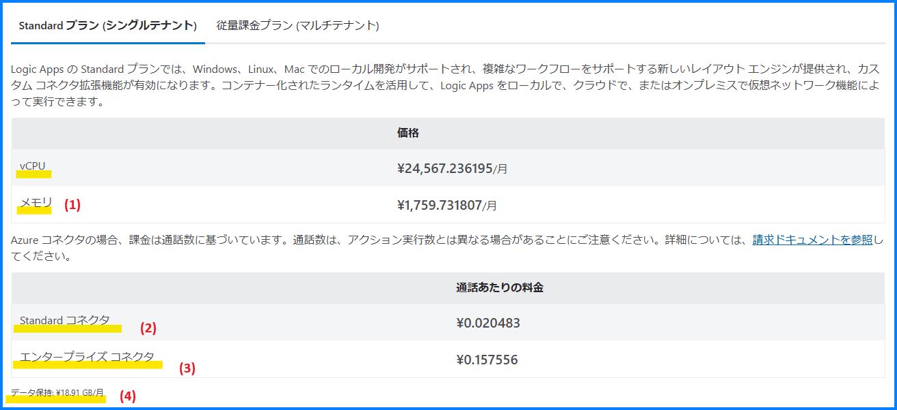
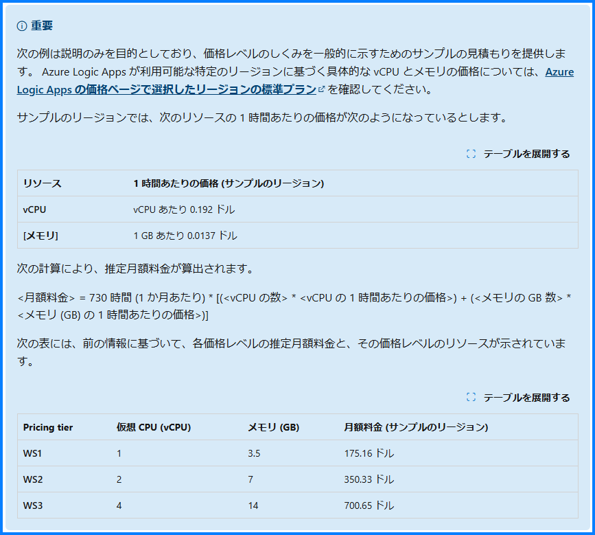
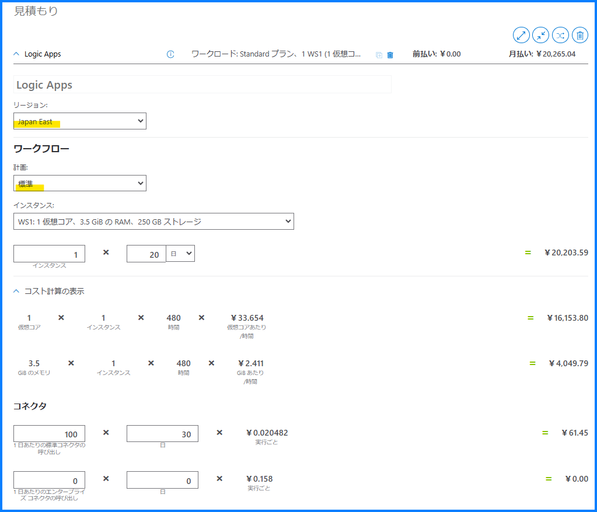

こんにちは！ Azure Integration サポート チームの山田です。
Azure Logic Apps には 従量課金版 と Standard 版がございますが、本記事は Standard 版 について記載しております。以前、以下記事をご案内いたしました。

[従量課金版 Azure Logic Apps の料金体系を理解するポイント | Japan Azure Integration Support Blog](https://jpazinteg.github.io/blog/LogicApps/LogicApps-ConsumptionPricing/)

今回の記事では続編として、Standard 版 Azure Logic Apps で料金をお見積りいただく際に、各資料を読み解いて理解するためのポイントをご紹介してまいります。

<!-- more -->

## 目次
- Standard 版 Azure Logic Apps の料金体系を理解するポイント
    - Logic Apps の価格表 (2025 年 1 月の例) 
    - vCPU および メモリ について
    - アクション と コネクタ について
    - データ保持 について
    - Azure Logic Apps の使用量の計測、課金、価格のしくみ
    - 料金計算ツール について
- まとめ

## Standard 版 Azure Logic Apps の料金体系を理解するポイント

### Logic Apps の価格表 (2025 年 1 月の例) 

[価格 - Logic Apps | Microsoft Azure](https://azure.microsoft.com/ja-jp/pricing/details/logic-apps/)

以下例では 2025 年 1 月の料金に基づいて記載しております。主要なところを (1)～(4) に分けてお考えいただけます。

1. vCPU および メモリ
2. Standard コネクタ = ¥0.020483 × 通話 (呼び出し) 回数
3. エンタープライズ コネクタ = ¥0.157556 × 通話 (呼び出し) 回数
4. データ保持 = ¥18.91 GB/月

通話 とはチャンクなどにより 1 つのアクションで複数回呼び出し (Call、通信) される場合があるための単位とお考えください。

価格表: 

### vCPU および メモリ について

価格表の (1) の通り、Standard Logic Apps の利用料金では、割り当てられた VM インスタンスのリソース (vCPU、および メモリ) の利用時間によっても課金が発生いたします。こちらはアプリケーションを停止しても待機インスタンスとして最低 1 インスタンスの課金が発生しますことをご留意ください。

[標準 (シングルテナント)](https://learn.microsoft.com/ja-jp/azure/logic-apps/logic-apps-pricing#standard-single-tenant)

> 次の表は、シングルテナント Azure Logic Apps のロジック アプリとワークフローで次のコンポーネントを使用した場合に、標準モデルでそれらに対して測定と課金がどのように処理されるかをまとめたものです。

また 1 か月のコストのシミュレーションが以下のページに公開されております。2025 年 1 月時点の記載より引用しておりますこと念のためご留意ください。

[標準モデルの価格レベル](https://learn.microsoft.com/ja-jp/azure/logic-apps/logic-apps-pricing#pricing-tiers-in-the-standard-model)

> ロジック アプリ (Standard) の測定と課金のために選択する価格レベルには、仮想 CPU (vCPU) とメモリ リソースの特定の量のコンピューティングが含まれます。 

### アクション と コネクタ について

[標準モデルでのトリガーとアクションの操作](https://learn.microsoft.com/ja-jp/azure/logic-apps/logic-apps-pricing#standard-operations)

> ワークフローを実行できる無制限の無料の組み込み操作を除き、標準モデルでは、ワークフロー全体が正常に実行、完了、またはインスタンス化されるかどうかに関係なく、"呼び出しごと" に操作が測定されて課金されます。

前提として Logic Apps のコネクタには、組み込みコネクタとマネージド コネクタがあります。Standard 版 Logic Apps におけるマネージド コネクタをコネクタ価格レベルで分類すると「Standard コネクタ」、「エンタープライズ コネクタ」となります。
このコネクタの種類が Standard コネクタ (価格表の (2)) であるか、エンタープライズ コネクタ (価格表の (3)) であるかにつきましては、コネクタの公開情報から確認いただけます。詳細は以下 従量課金版 におけるコネクタと同様になりますため、以下記事がご参考になりましたら幸いです。

[従量課金版 Azure Logic Apps の料金体系を理解するポイント | Japan Azure Integration Support Blog # アクション と コネクタ について](https://jpazinteg.github.io/blog/LogicApps/LogicApps-ConsumptionPricing/#%E3%82%A2%E3%82%AF%E3%82%B7%E3%83%A7%E3%83%B3-%E3%81%A8-%E3%82%B3%E3%83%8D%E3%82%AF%E3%82%BF-%E3%81%AB%E3%81%A4%E3%81%84%E3%81%A6)

### データ保持 について

Standard Logic Apps ではストレージ アカウントを使用します。

[ストレージ操作](https://learn.microsoft.com/ja-jp/azure/logic-apps/logic-apps-pricing#storage-operations)

冒頭の価格表の(4) 、データ保持 について以下とお考えいただけます。

[Azure Logic Apps のコストの管理を計画する - Azure Logic Apps | Microsoft Learn](https://learn.microsoft.com/ja-jp/azure/logic-apps/plan-manage-costs#storage-operations-and-costs)

> Azure Logic Apps では、すべてのストレージ操作に Azure Storage を使用します。

> シングルテナントの Azure Logic Apps では、独自の Azure ストレージ アカウントを使用できます。 この機能により、Azure Logic Apps データの制御と柔軟性が向上します。 "ステートフル" ワークフローで操作を実行すると、Azure Logic Apps ランタイムによってストレージ トランザクションが作成されます。 たとえば、キューはスケジュール設定に使用され、テーブルと BLOB はワークフローの状態の格納に使用されます。 ストレージのコストは、ワークフローのコンテンツに基づいて変化します。 トリガー、アクション、ペイロードが異なると、ストレージ操作とニーズも異なります。 ストレージ トランザクションは、Azure Storage の価格モデルに従います。 ストレージ コストは、Azure の請求書に個別に一覧表示されます。

> シングルテナントの Azure Logic Apps では、Logic Apps ストレージ計算ツールを使用して、ワークフローで実行される可能性があるストレージ操作の数とそのコストをいくらか把握できます。 サンプル ワークフローを選択するか、既存のワークフロー定義を使用することができます。 最初の計算では、ワークフロー内のストレージ操作の数を推定します。 その後、これらの数値を使用して、Azure 料金計算ツールを使用して考えられるコストを見積もることができます。 詳細については、シングルテナントの Azure Logic Apps でのワークフローのストレージ ニーズとコストの推定に関する記事を参照してください。

詳細はドキュメントをご覧いただけます。

[シングルテナント Azure Logic Apps のストレージ コストを見積もる - Azure Logic Apps | Microsoft Learn](https://learn.microsoft.com/ja-jp/azure/logic-apps/estimate-storage-costs)

以上 (1)～(4) が、Standard 版 Azure Logic Apps の料金体系の主要なところとなります。

### Azure Logic Apps の使用量の計測、課金、価格のしくみ

Azure Logic Apps および関連リソースにおける、測定、課金、および各価格モデルのしくみについて、以下ドキュメントにて網羅的にご覧いただけます。

[使用量の測定、課金、価格 - Azure Logic Apps | Microsoft Learn](https://learn.microsoft.com/ja-jp/azure/logic-apps/logic-apps-pricing)

この点も詳細は以下 従量課金版 におけるしくみと同様になります。以下記事にてご参考になりましたら幸いです。

[従量課金版 Azure Logic Apps の料金体系を理解するポイント | Japan Azure Integration Support Blog # Azure Logic Apps の使用量の計測、課金、価格のしくみ](https://jpazinteg.github.io/blog/LogicApps/LogicApps-ConsumptionPricing/#Azure-Logic-Apps-%E3%81%AE%E4%BD%BF%E7%94%A8%E9%87%8F%E3%81%AE%E8%A8%88%E6%B8%AC%E3%80%81%E8%AA%B2%E9%87%91%E3%80%81%E4%BE%A1%E6%A0%BC%E3%81%AE%E3%81%97%E3%81%8F%E3%81%BF)

### 料金計算ツール について

ほか Standard Logic Apps に関しても 料金計算ツール にて概算を確認いただけます。ワークフローから計画を「標準」と選択ください。またストレージ コストは [シングルテナント Azure Logic Apps のストレージ コストを見積もる - Azure Logic Apps | Microsoft Learn # ストレージ コストを見積もる](https://learn.microsoft.com/ja-jp/azure/logic-apps/estimate-storage-costs#estimate-storage-costs) を参考ください。

[料金計算ツール | Microsoft Azure](https://azure.microsoft.com/ja-jp/pricing/calculator/?service=logic-apps)

例:

最後になりますが、ツールに基づくお見積りは概算となり、具体的なリソースのご利用状況によって増減する可能性もございます。Logic Apps の調査をご依頼の際は以下記事もご参考に、本テクニカル サポートへお問合せいただければ大変うれしく思います。

[Logic Apps の調査時にサポート エンジニアへ連携するログの取得方法について | Japan Azure Integration Support Blog](https://jpazinteg.github.io/blog/LogicApps/TroubleLogCollection/)

## まとめ

本記事では、[価格 - Logic Apps | Microsoft Azure](https://azure.microsoft.com/ja-jp/pricing/details/logic-apps/) のドキュメントを基に、Standard 版 Azure Logic Apps で料金をお見積りいただく際に、各資料を読み解いて理解するためのポイントをご紹介しました。[従量課金版 Azure Logic Apps の料金体系を理解するポイント | Japan Azure Integration Support Blog](https://jpazinteg.github.io/blog/LogicApps/LogicApps-ConsumptionPricing/) と合わせまして Logic Apps のご利用検討時、皆様のご参考になれば幸いです。

