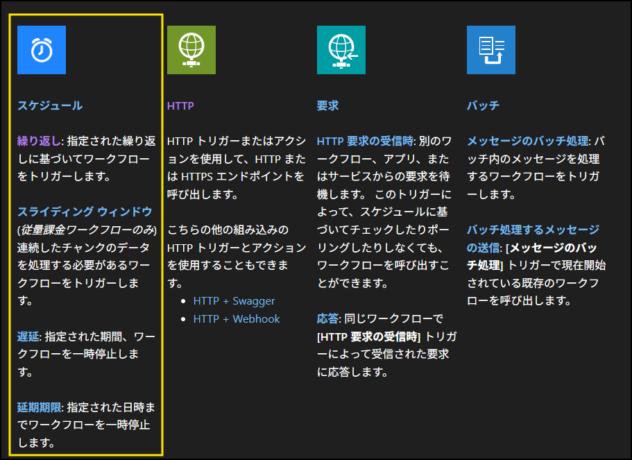
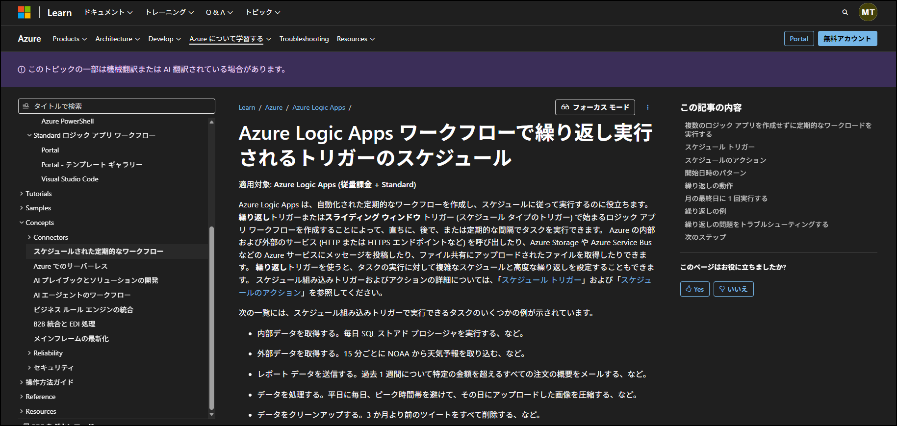
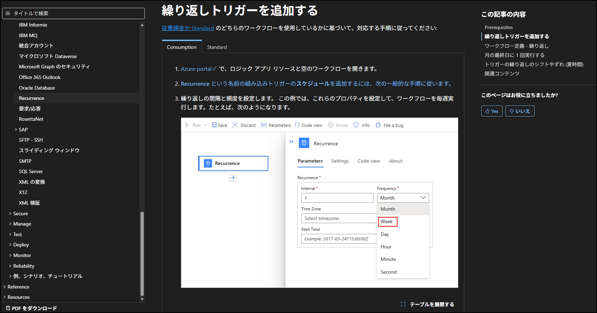
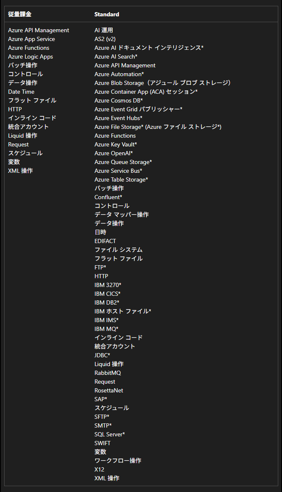
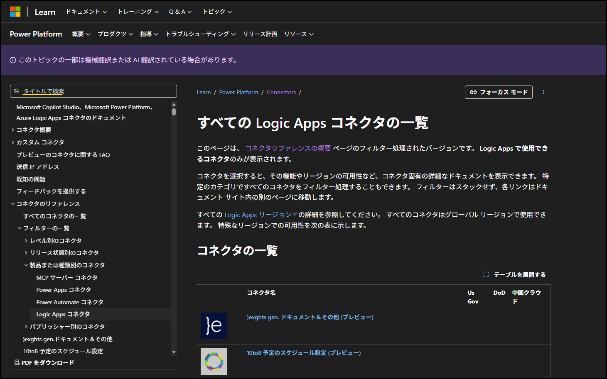
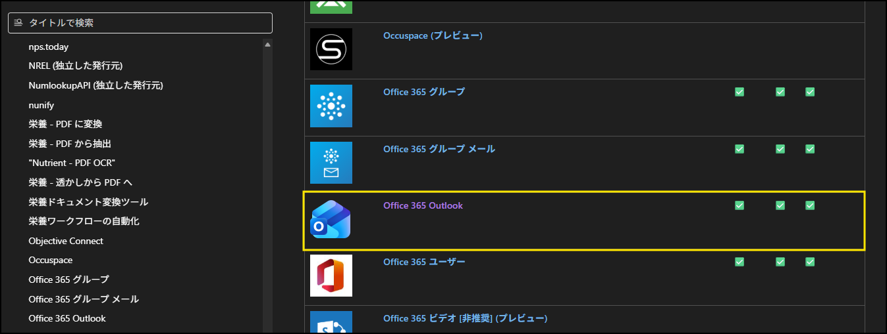
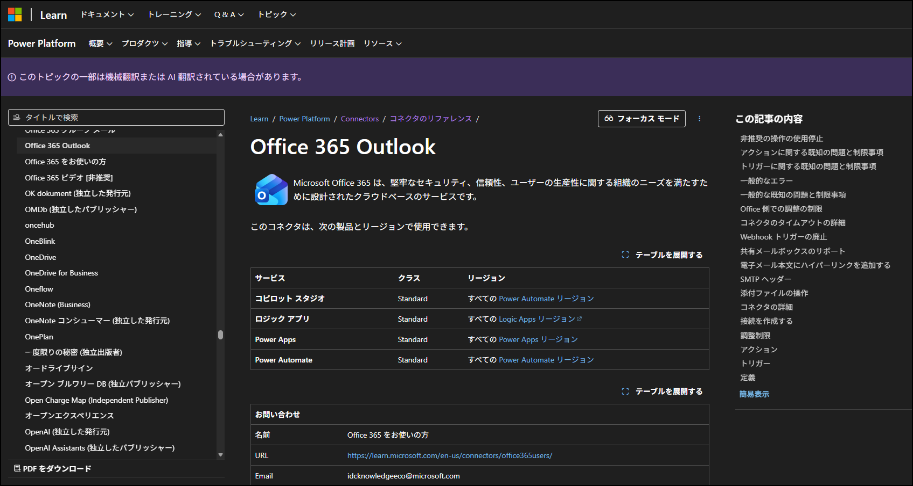
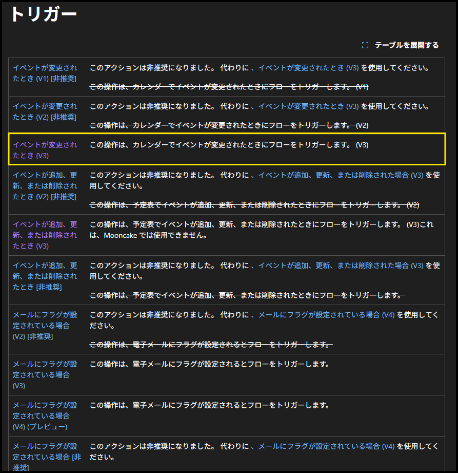
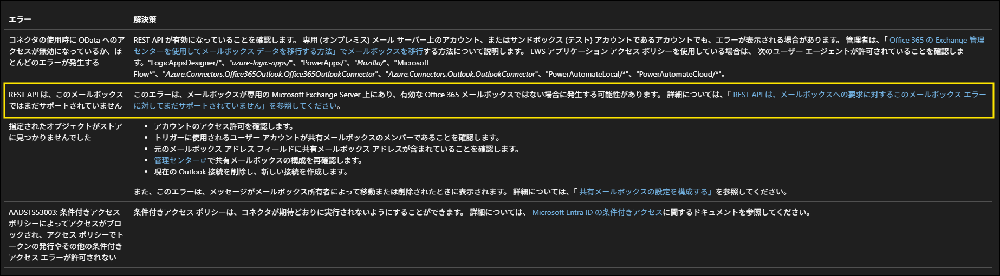

こんにちは！ Azure Integration サポート チームの 武田 です。 
Logic Apps では、実に多くのコネクタと、コネクタに含まれるトリガーとアクションをご用意しております。
そこで今回は、Logic Apps でご使用いただけるコネクタと、各種コネクタで用意されているトリガーとアクションを確認する方法を紹介させていただきます。
<!-- more -->
 

## 目次
- コネクタとは
- 組み込みコネクタ
- マネージド コネクタ
- マネージド コネクタで発生する問題について
- まとめ

 

## コネクタとは
用語のおさらいとなりますが、コネクタとは特定のアプリケーションなどへの操作をひとまとめにしたもののことを指し、トリガーないしはアクション、もしくはその両方を含むことがございます。
[Office 365 Outlook] コネクタを例にとりますと、このコネクタには以下のようなトリガーまたはアクションをご用意しています。

<b>トリガー</b>
　・新しいメールが届いたとき (V3)
　・イベントが変更されたとき (V3)

<b>アクション</b>
　・メールを送信する (V2)
　・イベントの作成 (V4)

上記は [Office 365 Outlook] コネクタでご用意しているトリガーとアクションの、ほんの一例です。
これらの操作をまとめたものを「コネクタ」と呼んでおりますことを、お心に留めておいていただけますと幸いです。
なお、本記事ではカスタム コネクタについてのご説明は割愛させていただきます。

コネクタの詳細、および組み込みコネクタとマネージド コネクタの違いについては、本記事の趣旨から外れますためご説明を控えます。
一方、弊社公開ドキュメントにて詳細をご案内しておりますので、そちらをご参照いただけますと幸いです。
- [コネクタとは - Azure Logic Apps | Microsoft Learn](https://learn.microsoft.com/ja-jp/azure/connectors/introduction)
- [マネージド コネクタの概要 - Azure Logic Apps | Microsoft Learn](https://learn.microsoft.com/ja-jp/azure/connectors/managed)

 

## 組み込みコネクタ
では早速、Logic Apps で使用できるコネクタにはどのようなものがあるのか、その探し方をご紹介させていただきます。

まず、組み込みコネクタについてご紹介をさせていただきます。
ご用意している組み込みコネクタ (Built-in コネクタ) は、以下ページにて一覧をご確認いただけます。
一覧にて、それぞれのコネクタでご用意しているトリガーないしはアクションの概要、各コネクタ名より遷移するリンク先にて詳細や実装例をご紹介しております。

- [組み込みコネクタの概要 - Azure Logic Apps | Microsoft Learn](https://learn.microsoft.com/ja-jp/azure/connectors/built-in)

例：スケジュール コネクタの場合
組み込みコネクタの一覧より。
スケジュール コネクタでご用意しているトリガーもしくはアクションについて、簡単な説明を記載しております。

先頭の「スケジュール」を押下しますと、スケジュール (繰り返し) 処理に関する詳細ページへ遷移します。

- [ワークフローで繰り返し実行されるトリガーのスケジュールについて - Azure Logic Apps | Microsoft Learn](https://learn.microsoft.com/ja-jp/azure/logic-apps/concepts-schedule-automated-recurring-tasks-workflows)
 

「繰り返し」を押下しますと、繰り返しトリガー (Reccurence トリガー) の実装例をご案内するページへ遷移します。
※ 遷移先の記載内容がわかりやすいよう、カーソル位置をずらしています。

- [繰り返しワークフローをスケジュール設定および実行する - Azure Logic Apps | Microsoft Learn](https://learn.microsoft.com/ja-jp/azure/connectors/connectors-native-recurrence?tabs=consumption)

一方、サービス プロバイダーベースの組み込みコネクタに関しては、別途コネクタの詳細ページをご用意しております。
※ 2026 年 1 月 29 日現在、英語のみでのご案内となります。

- [Azure Logic Apps (Standard) built-in service provider connectors - Connectors | Microsoft Learn](https://learn.microsoft.com/ja-jp/azure/logic-apps/connectors/built-in/reference/)
 

サービス プロバイダーベースの組み込みコネクタの概要については、以下をご参照ください。
- [組み込みコネクタの概要 - Azure Logic Apps | Microsoft Learn](https://learn.microsoft.com/ja-jp/azure/connectors/built-in#service-provider-based-built-in-connectors)
- [サービス プロバイダー接続について | Japan Azure Integration Support Blog](https://jpazinteg.github.io/blog/LogicApps/serviceProviderConnection/)

<b>注意事項</b>
[こちらのブログ記事](https://jpazinteg.github.io/blog/LogicApps/serviceProviderConnection/) でもご案内をしておりますが、サービス プロバイダーベースの組み込みコネクタをはじめ、従量課金版の Logic Apps と Standard Logic Apps では、使用できる組み込みコネクタに違いがございます。
ご使用されたい組み込みコネクタがある場合、どちらかの SKU でのみ提供している組み込みコネクタではないかを、あらかじめご確認ください。

- [組み込みコネクタの概要 - Azure Logic Apps | Microsoft Learn](https://learn.microsoft.com/ja-jp/azure/connectors/built-in#built-in-connectors-in-consumption-versus-standard)

 

## マネージド コネクタ
マネージド コネクタの場合、Logic Apps で使用できるコネクタの一覧ページをご用意してございます。
- [すべての Logic Apps コネクタの一覧 | Microsoft Learn](https://learn.microsoft.com/ja-jp/connectors/connector-reference/connector-reference-logicapps-connectors)

非常に多くのコネクタをご用意しておりますので、アプリケーションの名称などで、タイトルを検索いただくことも可能です。

コネクタ名を選択いただきますと、そのコネクタの詳細ページへ遷移します。
本記事では、[Office 365 Outlook] コネクタの詳細ページへ遷移してみます。

[Office 365 Outlook] コネクタの詳細ページです。
マネージド コネクタによりますが、詳細ページの作りはおおよそ共通して以下となっております。
　・既知の問題と制限事項
　・一般的なエラー
　・コネクタの詳細
　・調整制限
　・アクション
　・トリガー
　・定義

アクションとトリガーについては、最初に一覧、後続にトリガーもしくはアクションの詳細をご案内しております。
例：[イベントが変更されたとき (V3)] トリガー

トリガーの詳細です。

このようにして、操作したいアプリケーションに対してコネクタが用意されているか、用意されている場合、どのようなトリガーもしくはアクションが用意されているかを確認いただくことができます。

 

## マネージド コネクタで発生する問題について
ここまで、組み込みコネクタもしくはマネージド コネクタには、どのようなものが用意されているかを確認する方法をご案内してきましたが、最後にトラブルシュートのためのご案内をさせていただきます。
先の通り、マネージド コネクタによっては、詳細ページに「既知の問題と制限事項」や「一般的なエラー」、「調整制限」といった項目がございます。

いずれも、項目の名称通り、該当のコネクタで確認されている事象やコネクタ使用時の制限事項、当該コネクタ使用時によく発生するエラーとその解決方法、当該コネクタ使用時の調整に関するご案内などをまとめております。
お手元でなんらかの問題が確認された場合、該当の問題がコネクタ詳細ページに記載されていることがございますので、初動調査として是非ご活用ください。

例：[Office 365 Outlook] コネクタの、トリガーに関する既知の問題と制限事項
指定のトリガーにおいて、トリガーの起動遅延が発生する可能性をご案内しております。

- [Office 365 Outlook - Connectors | Microsoft Learn # トリガーに関する既知の問題と制限事項](https://learn.microsoft.com/ja-jp/connectors/office365/#known-issues-and-limitations-with-triggers)

例：[Office 365 Outlook] コネクタの、一般的なエラー
「REST API は、このメールボックスではまだサポートされていません」というエラーが発生する原因と対応方法が記載されています。

- [Office 365 Outlook - Connectors | Microsoft Learn # 一般的なエラー](https://learn.microsoft.com/ja-jp/connectors/office365/#common-errors)

 

## まとめ
本記事では、以下についてご案内いたしましたが、ご理解いただけましたでしょうか。
- Logic Apps で使用できる組み込みコネクタを確認する方法
- Logic Apps で使用できるマネージド コネクタを確認する方法
- マネージド コネクタで発生しうる問題を確認する方法

本記事が少しでもお役に立ちましたら幸いです。最後までお読みいただき、ありがとうございました！

<Azure Logic Apps の参考サイト>
-- 概要 - Azure Logic Apps とは
https://learn.microsoft.com/ja-jp/azure/logic-apps/logic-apps-overview
Azure Logic Apps とは、ロジック アプリ デザイナーでフロー チャートを用いて作成したワークフローを自動実行するソリューションです。
Azure Logic Apps では、条件分岐などを実装することができ、ワークフローの実行状況に応じて実行する処理を分岐することが可能です。
