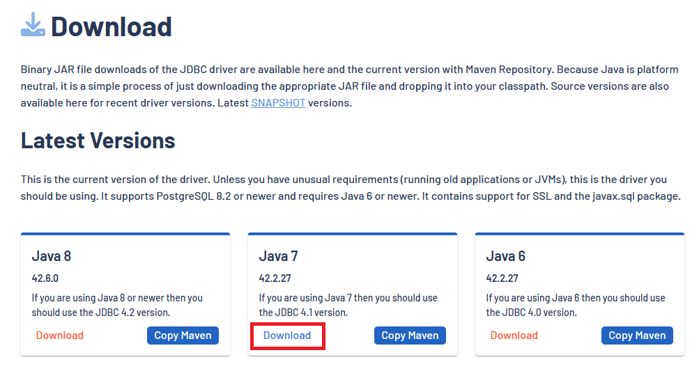
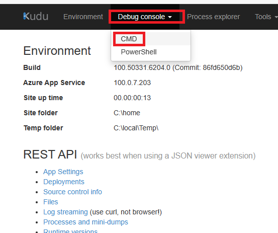
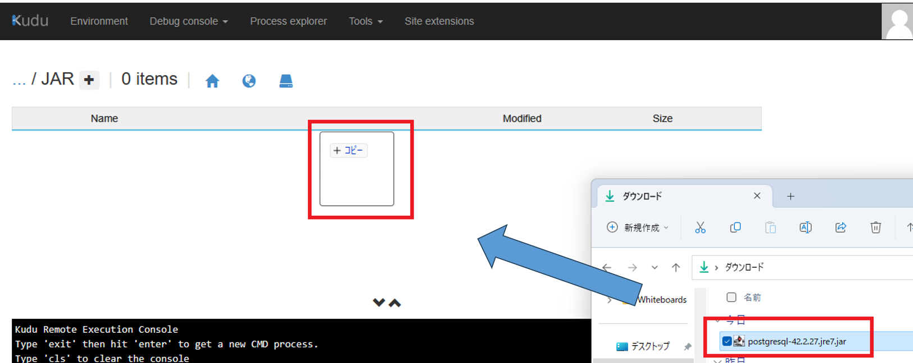
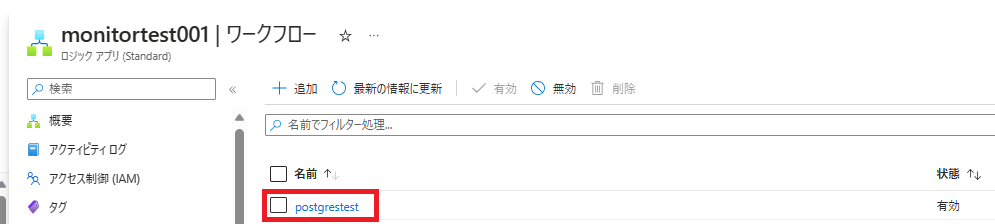
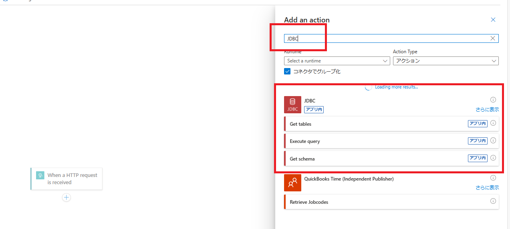
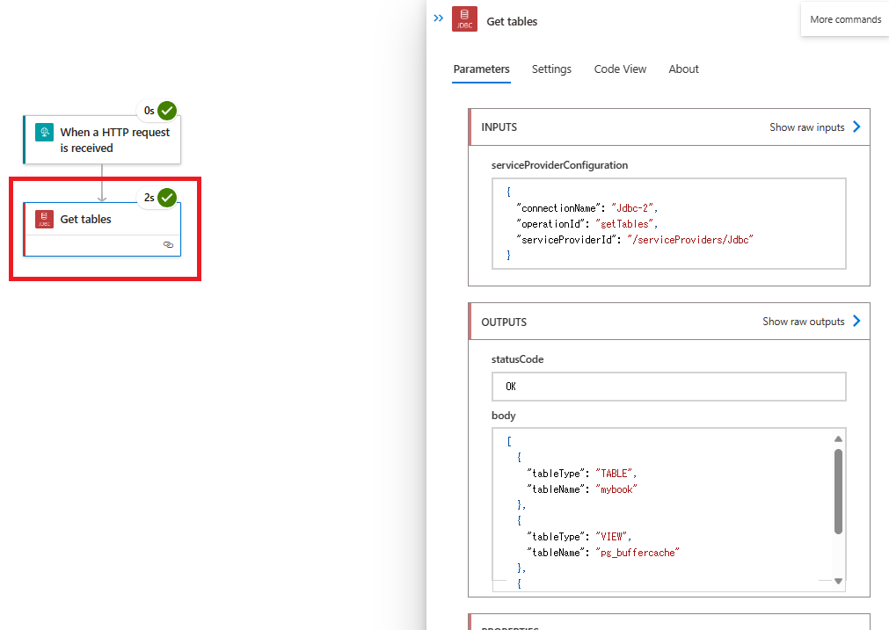

こんにちは！Azure Integration サポート チームの 川合 です。 

本記事は弊社海外ブログを日本語向けに解説した記事となります。
- [Configure PostgreSQL Connection in Logic Apps (Standard) with JDBC, call Function with Execute Query](https://techcommunity.microsoft.com/t5/integrations-on-azure-blog/configure-postgresql-connection-in-logic-apps-standard-with-jdbc/ba-p/3784988)

Azure Logic Apps では、以下の PostgreSQL コネクタを利用してオンプレミス環境の PostgreSQL に接続することが可能です。
- [PostgreSQL](https://learn.microsoft.com/ja-jp/connectors/postgresql/)

しかしながら、上記コネクタでは Azure Database for PostgreSQL への接続は本日 2023 年 6 月現在で不可でございます。
今回は、 Standard Logic Apps と JDBC コネクタを利用して、Azure Database for PostgreSQL へ接続する方法についてご案内します。

<!-- more -->
## こんな方におすすめです
- Logic Apps から Azure Database for PostgreSQL へ接続されたい方

## 目次
- JDBC コネクタについて
- 事前準備
- 設定例と実行結果

## JDBC コネクタについて
本ブログでは以下の JDBC コネクタを利用して、 Azure Database for PostgreSQL へ接続いたします。
- [JDBC](https://learn.microsoft.com/ja-JP/azure/logic-apps/connectors/built-in/reference/jdbc/)

JDBC コネクタについては本日 2023 年 6 月現在で全てのアクションがプレビュー機能として提供されております。その為、今後予告なく仕様変更が発生する場合がございますので予めご了承下さい。

## 事前準備
上記コネクタを利用するにあたり、以下の事前準備が必要となります。

- 1. Azure Database for PostgreSQL の設定
- 2. PostgreSQL の JDBC ドライバのダウンロード
- 3. Standard Logic Apps へ JDBC ドライバの配置

詳細については以下に記載していきます。

1. Azure Database for PostgreSQL の設定
初めに、Azure Database for PostgreSQL の設定を実施致します。
なお、こちらについてはデータベースやテーブルは既に作成されている前提で進めて参ります。

Standard Logic Apps から Azure Database for PostgreSQL にアクセス可能にするために、[設定] - [接続のセキュリティ] より、以下の通り設定いたします。

・パブリック ネットワーク アクセスの拒否：いいえ
・ファイアウォール規則：はい
・SSL 接続を強制する：無効

以上で Azure Database for PostgreSQL の設定は完了です。

2. PostgreSQL の JDBC ドライバのダウンロード

参考基のブログ記事にもございます通り、以下のサイトより PostgreSQL の JDBC ドライバをダウンロード致します。
- [PostgreSQL JDBC Driver](https://jdbc.postgresql.org/)

本ブログ記事では Java 7 の資材をダウンロード致します。

以上で JDBC ドライバのダウンロードは完了です。

3. Standard Logic Apps へ JDBC ドライバの配置
これより、取得したドライバを Standard Logic Apps へ配置いたします。
ドライバを配置することにより JDBC コネクタで対象のドライバを呼び出し、Azure Database for PostgreSQL へ接続することが可能となります。

まず、作成いただいている Standard Logic Apps のリソースを表示し、[開発ツール] - [高度なツール] より [移動→] のリンクを押下します。

次に、画面上部の [Debug console] より、"CMD" を選択します。

site\wwwroot ディレクトリへ遷移し、＋ マークを押下して以下のディレクトリを作成いたします。

・作成するパス
lib\builtinOperationSdks\JAR（C:\home\site\wwwroot\lib\builtinOperationSdks\JAR がフルパス）

JAR ディレクトリを作成出来たらダウンロードした JDBC ドライバをドラッグアンドドロップします。

以上で、事前準備の完了となります。

## 設定例と実行結果
それでは、Standard Logic Apps の設定に移ります。
まず、ワークフローを作成し、以下の通り JDBC コネクタを検索いたします。

API 接続の設定について、以下の内容を設定いたします。

・接続名：任意の値
・URL：Azure Database for PostgreSQL の [設定] - [接続文字列] より、JDBC の値を設定

{your_database}：設定いただいたデータベース
{your_password}：設定いただいたパスワード
User Identifier：ユーザー名
Password：設定いただいたパスワード

＜実行結果＞

以上より、JDBC コネクタを利用し、Azure Database for PostgreSQL へ接続することが可能でございます。

なお、先にも申し上げました通り、本コネクタについてはプレビュー機能で提供されております。今後将来的に予告なく内容が変更される場合がございますので予めご了承下さい。

こちらの仕組みをご利用になられる場合、お客様にて十分に検証を実施いただいたうえで採用要否についてご検討をいただきますようお願い申し上げます。

## まとめ
本記事では、以下についてご案内いたしましたが、ご理解いただけましたでしょうか。
- JDBC コネクタについて
- 事前準備
- 設定例と実行結果

本記事が少しでもお役に立ちましたら幸いです。最後までお読みいただき、ありがとうございました！

<Azure Logic Apps の参考サイト>
-- 概要 - Azure Logic Apps とは
https://learn.microsoft.com/ja-jp/azure/logic-apps/logic-apps-overview
Azure Logic Apps とは、ロジック アプリ デザイナーでフロー チャートを用いて作成したワークフローを自動実行するソリューションです。
Azure Logic Apps では、条件分岐などを実装することができ、ワークフローの実行状況に応じて実行する処理を分岐することが可能です。
