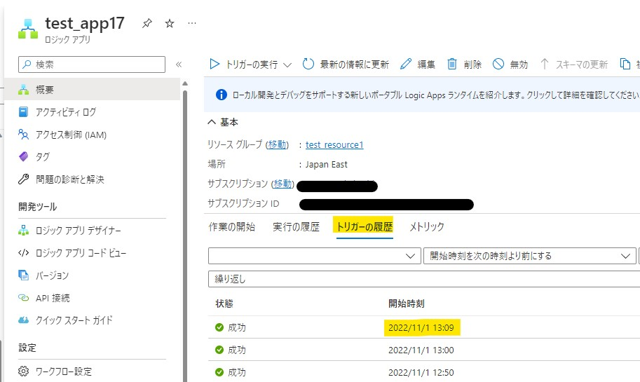
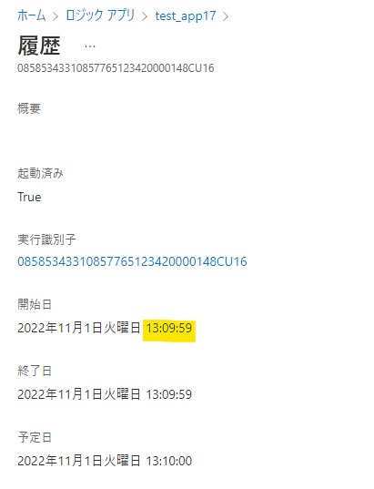

こんにちは。Azure Integration サポート チームの髙橋です。  
「繰り返し (Recurrence)」トリガーの想定される起動時刻と、実際の起動時刻に差異が生じる仕様の動作について説明します。

## こんな方におすすめです
- 「繰り返し (Recurrence)」トリガーの想定される起動時刻と、実際の起動時刻に差異が生じる原因を知りたい方

## 前提条件
- 「繰り返し (Recurrence)」トリガーに関連する公開情報は以下になります。
  - 参考ドキュメント : [Azure Logic Apps ワークフローで繰り返し実行されるトリガーのスケジュール](https://learn.microsoft.com/ja-jp/azure/logic-apps/concepts-schedule-automated-recurring-tasks-workflows)
  - 参考ドキュメント : [Azure Logic Apps で Recurrence トリガーを使用して繰り返しワークフローをスケジュール設定および実行する](https://learn.microsoft.com/ja-jp/azure/connectors/connectors-native-recurrence?tabs=consumption)

## 事象
「繰り返し (Recurrence)」トリガーでは、想定される起動時刻よりも、稀に 0.5 秒 ～ 1 秒程度前後して起動することがございます。

## 仕様
「実行の履歴」タブでご確認いただける履歴では、分単位までの表示のため、1 分の差異が生じているように見受けられることがございます。
※ 以下の例ですと、想定起動時刻は 13:10 ですが、「実行の履歴」タブのログでは 13:09 に起動しております。

「トリガーの履歴」タブにて該当履歴の詳細をご確認いただきますと、1 秒程度の差となっております。
こちらは当該トリガーの仕様の動作となります。

Logic Apps では、定刻に処理を開始できるよう、トリガー起動時刻の約 1 秒前にストレージの読み込みを開始いたしますが、
その読み込み処理が想定より早く終わった、または遅く終わったことにより、このような差異が生じることがございます。

## 回避策
たとえば Logic Apps で現在時刻を取得し、日付によってその後の処理を分岐させるような処理の場合には、後続処理に影響が出る可能性がございます。

例) 本来 10/1 0:00 に起動するところを、9/30 23:59:59 に起動したことにより、現在の日付が 9/30 と取得され、後続処理に影響が出る等

そのため、たとえば当該トリガーの開始時刻を「10/1 0:00:00」ではなく、5 秒程度加算した「10/1 0:00:05」とする方法が考えられます。

または、分岐処理にて現在時刻に 5 秒程度加算し、その上で日付を取得するような方法も考えられます。
現在時刻に 5 秒加算するには、addSeconds 関数もご用意もございます。
- 参考ドキュメント : [addSeconds](https://learn.microsoft.com/ja-jp/azure/logic-apps/workflow-definition-language-functions-reference#addSeconds)

