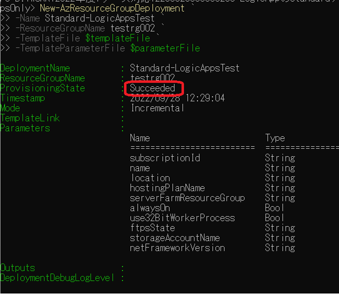
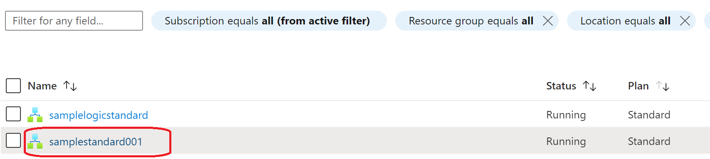

こんにちは！Azure Integration サポート チームの 川合 です。  
Standard Logic Apps （シングルテナント） を作成するにはストレージ アカウントを利用する必要がございます。
しかし、ファイアウォールで通信制御を行ったストレージ アカウント配下には Azure Portal から Standard Logic Apps を構築することが出来ません。
今回は ARM テンプレートを用いて ファイアウォール設定を有効にした既存のストレージ アカウント配下に Standard Logic Apps を構築する方法についてご案内します。

<!-- more -->

## 目次
- 前提
- ARM テンプレートの編集
- まとめ

## 前提
今回の記事については以下の情報を参考にしております。

- [Azure portal または Visual Studio Code を使用してデプロイする](https://learn.microsoft.com/ja-jp/azure/logic-apps/deploy-single-tenant-logic-apps-private-storage-account#deploy-using-azure-portal-or-visual-studio-code)

- [Deploy Logic App with Secured storage account having Private Endpoints](https://github.com/VeeraMS/LogicApp-deployment-with-Secure-Storage)

なお、今回の手順では ARM テンプレートを Azure PowerShell にてデプロイ致します。

また、予めストレージ アカウントおよび Standard Logic Apps を構築する VNet を作成いただく必要がございます。
- [ストレージ アカウントを作成する](https://learn.microsoft.com/ja-jp/azure/storage/common/storage-account-create?tabs=azure-portal)
- [仮想ネットワークの作成、変更、削除](https://learn.microsoft.com/ja-jp/azure/virtual-network/manage-virtual-network)

上記の環境が構築されており、かつストレージ アカウントがプライベート エンドポイントに接続されていることを前提に本手順を実施いただきます。
テーブル、キュー、BLOB、ファイル ストレージ サービスごとに異なるプライベート エンドポイントを作成することで、プライベートな環境から接続することが可能となります。

- [Azure portal または Visual Studio Code を使用してデプロイする](https://learn.microsoft.com/ja-jp/azure/logic-apps/deploy-single-tenant-logic-apps-private-storage-account#deploy-using-azure-portal-or-visual-studio-code)

- [Azure Storage のプライベート エンドポイントを使用する](https://learn.microsoft.com/ja-jp/azure/storage/common/storage-private-endpoints)


## ARM テンプレートの編集
本手順では、以下の通り ARM テンプレートを作成いたします。
・Parameters.json
・DeployResources.json

Parameters.json についてはお客様環境に併せて変更を加えていただく必要がございますが、DeployResources.json については特に変更は不要でございます。


＜Parameters.json＞
```
{
    "$schema": "https://schema.management.azure.com/schemas/2015-01-01/deploymentParameters.json#",
    "contentVersion": "1.0.0.0",
    "parameters": {
        "logicAppFEname": {
            "value": "Standard-LogicAppsTest"
        },
        "appInsightName": {
            "value": "TestAppInsight"
        },
        "fileShareName": {
            "value": "Standard-LogicAppsTest-Share"
        },
        "location": {
            "value": "Central US"
        },
        "use32BitWorkerProcess": {
            "value": true
        },
        "serverFarmId": {
            "value": "/subscriptions/（お客様のサブスクリプション ID）/resourceGroups/（お客様のリソースグループ）/providers/Microsoft.Web/serverfarms/（お客様の App Service プラン）"
        },
        "contentStorageAccountName": {
            "value": "teststorageaccount"
        },
        "vnetName": {
            "value": "StandardLogicAppsNW"
        },
        "subnetName": {
            "value": "LogicAppsSubnet"
        }
    }
}
```

＜Parameters.json の各設定値＞
・logicAppFEname : 作成する Standard Logic Apps 名
・appInsightName : Standard Logic Apps が接続する既存の Application Insights 名
・fileShareName : 既存のファイル共有名
・location : Standard Logic Apps を構築するリージョン
・use32BitWorkerProcess : そのままで問題ありません
・serverFarmId: 利用する既存の App service プランのリソース ID
・contentStorageAccountName : 利用する既存のストレージアカウント名
・vnetName : ストレージアカウントおよび Standard Logic Apps が接続する既存の Vnet 名
・subnetName : Logic Apps が接続する既存のサブネット名 


＜DeployResources.json（こちらは変更を加えなくても結構です）＞
```
{
    "$schema": "https://schema.management.azure.com/schemas/2019-04-01/deploymentTemplate.json#",
    "contentVersion": "1.0.0.0",
    "parameters": {
        "logicAppFEname": {
            "type": "String"
        },
        "fileShareName": {
            "type": "String"
        },
        "appInsightName": {
            "type": "String"
        },
        "use32BitWorkerProcess": {
            "type": "Bool"
        },
        "location": {
            "defaultValue": "[resourceGroup().location]",
            "type": "String",
            "metadata": {
                "description": "Location to deploy resources to."
            }
        },
        "serverFarmId": {
            "type": "String"
        },
        "contentStorageAccountName": {
            "type": "String"
        },
        "vnetName": {
            "defaultValue": "VirtualNetwork",
            "type": "String",
            "metadata": {
                "description": "Name of the VNET that the Function App and Storage account will communicate over."
            }
        },
        "subnetName": {
            "type": "String"
        }
    },
    "resources": [
        {
            "type": "Microsoft.Web/sites",
            "apiVersion": "2018-11-01",
            "name": "[parameters('logicAppFEname')]",
            "location": "[parameters('location')]",
            "tags": {},
            "kind": "functionapp,workflowapp",
            "identity": {
                "type": "SystemAssigned"
            },
            "properties": {
                "name": "[parameters('logicAppFEname')]",
                "siteConfig": {
                    "appSettings": [
                        {
                            "name": "FUNCTIONS_EXTENSION_VERSION",
                            "value": "~3"
                        },
                        {
                            "name": "FUNCTIONS_WORKER_RUNTIME",
                            "value": "node"
                        },
                        {
                            "name": "APPINSIGHTS_INSTRUMENTATIONKEY",
                            "value": "[reference(resourceId('Microsoft.Insights/components', parameters('appInsightName')), '2015-05-01').InstrumentationKey]"
                        },
                        {
                            "name": "APPLICATIONINSIGHTS_CONNECTION_STRING",
                            "value": "[reference(resourceId('Microsoft.Insights/components', parameters('appInsightName')), '2015-05-01').ConnectionString]"
                        },
                        {
                            "name": "AzureWebJobsStorage",
                            "value": "[concat('DefaultEndpointsProtocol=https;AccountName=',parameters('contentStorageAccountName'),';AccountKey=',listKeys(resourceId('Microsoft.Storage/storageAccounts', parameters('contentStorageAccountName')), '2019-06-01').keys[0].value,';EndpointSuffix=','core.windows.net')]"
                        },
                        {
                            "name": "WEBSITE_CONTENTAZUREFILECONNECTIONSTRING",
                            "value": "[concat('DefaultEndpointsProtocol=https;AccountName=',parameters('contentStorageAccountName'),';AccountKey=',listKeys(resourceId('Microsoft.Storage/storageAccounts', parameters('contentStorageAccountName')), '2019-06-01').keys[0].value,';EndpointSuffix=','core.windows.net')]"
                        },
                        {
                            "name": "WEBSITE_CONTENTSHARE",
                            "value": "[toLower(parameters('fileShareName'))]"
                        },
                        {
                            "name": "APP_KIND",
                            "value": "workflowApp"
                        },
                        {
                            "name": "WEBSITE_VNET_ROUTE_ALL",
                            "value": "1"
                        },
                        {
                            "name": "AzureFunctionsJobHost__extensionBundle__id",
                            "value": "Microsoft.Azure.Functions.ExtensionBundle.Workflows",
                            "slotSetting": false
                        },
                        {
                            "name": "AzureFunctionsJobHost__extensionBundle__version",
                            "value": "[1.*, 2.0.0)",
                            "slotSetting": false
                        },
                        {
                            "name": "WEBSITE_CONTENTOVERVNET",
                            "value": "1",
                            "slotSetting": false
                        }
                    ],
                    "use32BitWorkerProcess": "[parameters('use32BitWorkerProcess')]",
                    "cors": {
                        "allowedOrigins": [
                            "https://afd.hosting.portal.azure.net",
                            "https://afd.hosting-ms.portal.azure.net",
                            "https://hosting.portal.azure.net",
                            "https://ms.hosting.portal.azure.net",
                            "https://ema-ms.hosting.portal.azure.net",
                            "https://ema.hosting.portal.azure.net",
                            "https://ema.hosting.portal.azure.net"
                        ]
                    }
                },
                "serverFarmId": "[parameters('serverFarmId')]",
                "clientAffinityEnabled": true
            },
            "resources": [
                {
                    "type": "networkconfig",
                    "apiVersion": "2018-11-01",
                    "name": "virtualNetwork",
                    "location": "[parameters('location')]",
                    "dependsOn": [
                        "[parameters('logicAppFEname')]"
                    ],
                    "properties": {
                        "subnetResourceId": "[resourceId('Microsoft.Network/virtualNetworks/subnets',parameters('vnetName'), parameters('subnetName'))]",
                        "swiftSupported": true
                    }
                }
            ]
        }
    ]
}
```

CORS の設定につきましては、特に必須の設定ではございませんので、変更しなくてもデプロイ可能です。お客様のご要件に合わせまして適宜ご変更ください。

上記ファイルを作成いただきましたら、任意のフォルダにファイルを格納し、以下のようにコマンドを実行いただきます。

・ARM テンプレート デプロイ サンプルコマンド
```
New-AzResourceGroupDeployment -Name DeployTest01 -ResourceGroupName kymiwaTestLogicApps2 -TemplateFile .\DeployResources.json -TemplateParameterFile .\Parameters.json
```

New-AzResourceGroupDeployment コマンドの詳細については以下の公開情報に記載がございますので、併せてご確認いただければと存じます。

- [New-AzResourceGroupDeployment](https://learn.microsoft.com/ja-jp/powershell/module/az.resources/new-azresourcegroupdeployment?view=azps-8.3.0)

コマンド実行後、以下のように ProvisioningState が "Succeeded" になっていることが確認できれば成功となります。
 

Azure Portal でも Standard Logic Apps が作成されていることを確認いただけます。
 


以上の手順にて、ファイアウォール設定配下の既存ストレージ アカウントに Standard Logic Apps を作成することが可能でございます。
なお、上記のテンプレートについてはあくまでも本記事におけるサンプルとなります。
商用環境でご利用いただく場合につきましては、お客様の責任において十分に設計および検証をいただいたうえで採用要否について判断をいただければと存じます。

## まとめ
本記事では、以下についてご案内いたしましたが、ご理解いただけましたでしょうか。
- 事前準備
- ARM テンプレートの編集


本記事が少しでもお役に立ちましたら幸いです。最後までお読みいただき、ありがとうございました！

<Azure Logic Apps の参考サイト>
-- 概要 - Azure Logic Apps とは
https://docs.microsoft.com/ja-jp/azure/logic-apps/logic-apps-overview
Azure Logic Apps とは、ロジック アプリ デザイナーでフロー チャートを用いて作成したワークフローを自動実行するソリューションです。
Azure Logic Apps では、条件分岐などを実装することができ、ワークフローの実行状況に応じて実行する処理を分岐することが可能です。
