こんにちは！Azure Integration サポート チームの 川合 です。  
以前、ARM テンプレートを用いて ファイアウォール設定を有効にした既存のストレージ アカウント配下に Standard Logic Apps を構築する方法についてご案内いたしました。

[ファイアウォール設定配下の既存ストレージ アカウントに Standard Logic Apps を作成](https://jpazinteg.github.io/blog/LogicApps/SecBlobStandardLA/)

今回は、Azure Portal から手動で Standard タイプの Logic Apps をファイアウォール配下のストレージ アカウント配下に接続する方法についてご案内します。

<!-- more -->

## 目次
- 前提条件
- Standard Logic Apps のデプロイ
- ストレージ アカウントの設定
- VNet 統合の設定
- まとめ

## 前提条件
本ブログ記事の前提として、予め VNet を作成し、サブネットを二つ用意いたします。これは、ストレージ アカウント側のプライベート エンドポイントと Standard Logic Apps 側の VNet 統合で利用するものになります。
- [仮想ネットワークの作成、変更、削除](https://learn.microsoft.com/ja-jp/azure/virtual-network/manage-virtual-network)
 

ストレージ アカウントについては汎用 V2 アカウントを利用します。その為、ストレージ アカウントが汎用 V1 の場合は以下のようにストレージ アカウントの種類を変更いたします。
- [汎用 v2 ストレージ アカウントにアップグレードする](https://learn.microsoft.com/ja-jp/azure/storage/common/storage-account-upgrade?tabs=azure-portal)
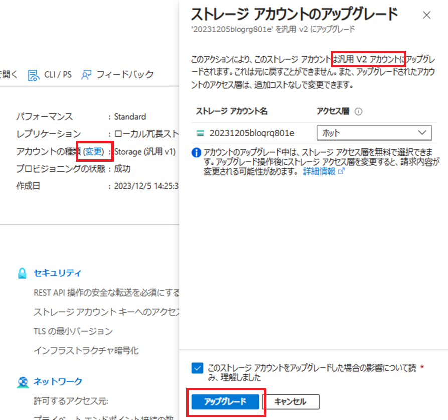 

また、Standard Logic Apps をデプロイするまでは、対象のストレージ アカウントについてはパブリック アクセスを許可しておく必要がございます。
プライベート エンドポイントの作成や VNet 統合の設定については本記事の中で説明します。

## Standard Logic Apps のデプロイ
始めに、Azure Portal の [ロジック アプリ] のメニューより、Standard Logic Apps のリソースをデプロイします。リージョンや 価格プランなどは任意ですが、[プラン] - [プランの種類] は 消費ではなく Standard を選択してください。
 

ホスティング タブではストレージ アカウントを指定する画面になりますが、こちらはお客様の任意のストレージ アカウントを選択してください。
本例では新規作成し、作成後にストレージ アカウントの種類を汎用 V2 に変更します。（Standard Logic Apps のリソース作成画面で構築するストレージ アカウントについては、2023 年 12 月現在で汎用 V1 で作成されるため。）
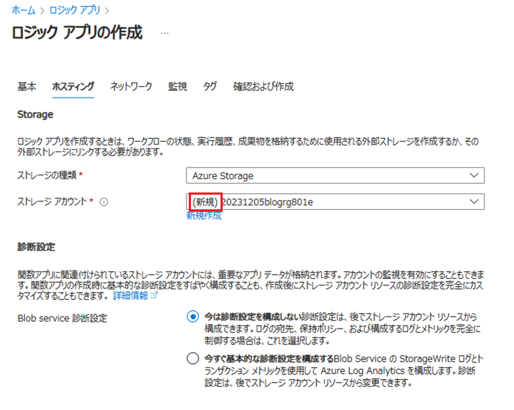 

ネットワーク、監視、タグについては本例ではデフォルトのまま設定し、[確認および作成] 画面にてリソースを作成します。
 


以下のように Standard Logic Apps のリソースが構築できていれば完了です。
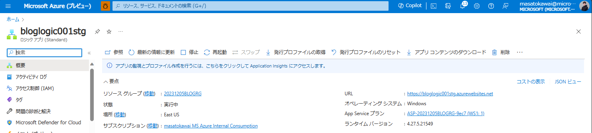 

## ストレージ アカウントの設定
次に、ストレージ アカウントの種類を汎用 V2 に変更した後、ファイアウォール設定およびプライベート エンドポイントの設定を実施します。今回は、パブリック ネットワーク アクセスを [無効] に設定します。
 

このタイミングで少し時間を置き、Standard Logic Apps を再起動すると、以下のように概要画面で接続エラーが発生するかと思います。
 

```System.Private.CoreLib: Access to the path 'C:\home\data\Functions\secrets\Sentinels' is denied.```

このメッセージは、Standard Logic Apps がネットワークのルーティングやアプリケーション設定など、何らかの原因でストレージ アカウントに正しく接続できていない為に発生するエラーとなります。
その為、当該エラーメッセージが確認された際には、Standard Logic Apps が正しくストレージ アカウントに疎通できるようなネットワーク設定になっているかを確認いただく必要がございますので、参考までに言及いたします。
今回の記事ではこれからプライベート エンドポイントを設定してまいりますのでこちらは想定される通りのエラー メッセージとなります。

次に、ストレージ アカウントにプライベート エンドポイントを設定します。
 

プライベート エンドポイントについては、前回の記事でもご案内しました通り、[blob] [table] [queue] [file] の四つが必須になります。GUI ではこれらを一度に作成することが出来ませんので、お手数ですが、それぞれに対してのリソース作成操作をお願いします。
- [Azure Storage のプライベート エンドポイントを使用する](https://learn.microsoft.com/ja-jp/azure/storage/common/storage-private-endpoints)

＜設定例＞
・対象サブリソースを選択する。
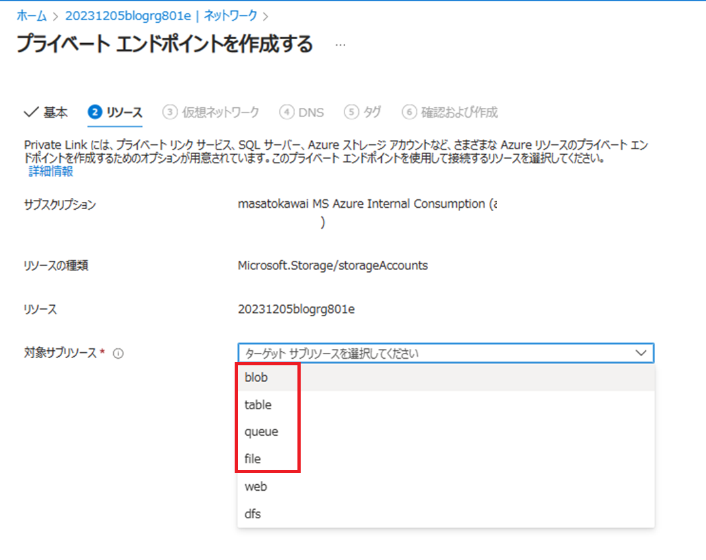

・サブネットを選択する。
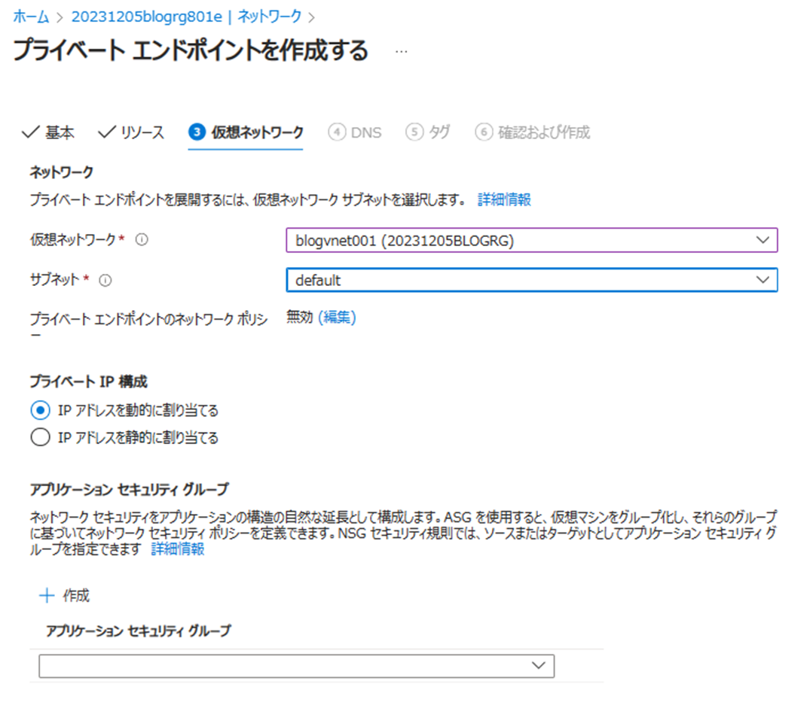

・プライベート DNS 統合を実施するか選択する。
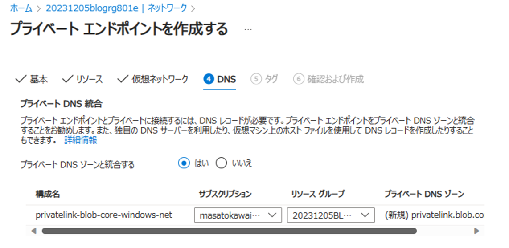

全てのプライベート エンドポイントが設定できると以下のように四つリソースが表示されます（プライベート エンドポイント名は任意）。
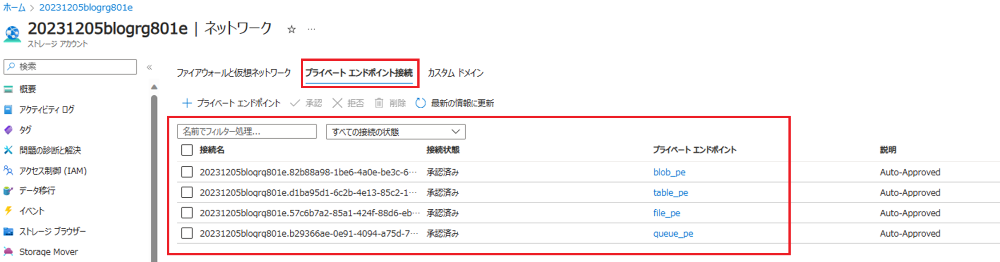

以上でストレージ アカウント側の設定は完了です。

##  VNet 統合の設定
次に、Standard Logic Apps のリソースの画面に遷移し、[設定] - [ネットワーク] より、[送信トラフィックの構成] の [仮想ネットワーク統合] のリンク (未構成) を選択します。
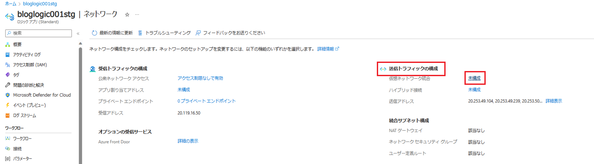

その後、[仮想ネットワーク統合の追加] ボタンを選択し、任意のサブネットを選択し、[接続] ボタンを選択します。その際、空のサブネットを選択する必要がございますのでご留意ください。
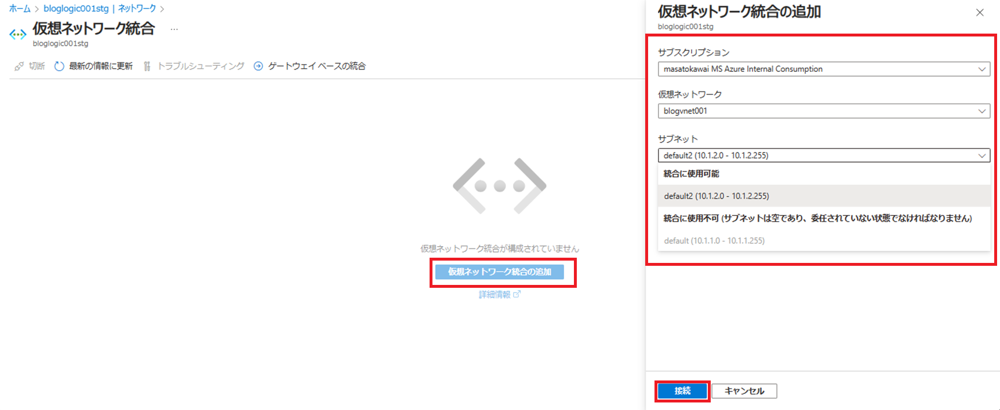

以下のような画面が表示されましたら設定は完了です。


最後に、VNet 統合にかかる環境変数の設定を行い、画面下部の [適用] ボタンを選択して保存します。
Standard Logic Apps の [設定] - [環境変数] より、[アプリ設定] を選択し、以下の値を設定します。
**・設定値：WEBSITE_CONTENTOVERVNET**
**・値：1**

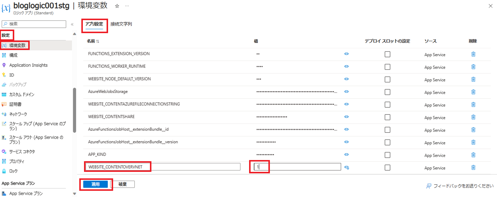

こちらは Standard Logic Apps が接続するストレージ アカウントが VNet に制限されている場合に設定する値となります。詳しくは以下の App Service の環境変数に関する公開情報をご覧ください。
[Azure App Service の環境変数とアプリ設定](https://learn.microsoft.com/ja-jp/azure/app-service/reference-app-settings?tabs=kudu%2Cdotnet#networking)

環境変数を保存し、少し時間を置いて概要画面より [最新の情報に更新] ボタンにて画面を更新すると、最初に表示されていたエラーメッセージ (System.Private.CoreLib: Access to the path 'C:\home\data\Functions\secrets\Sentinels' is denied.) が表示されなくなり、Standard Logic Apps のワークフローの作成や実行が可能となります。


ワークフローも問題なく作成できることを確認。
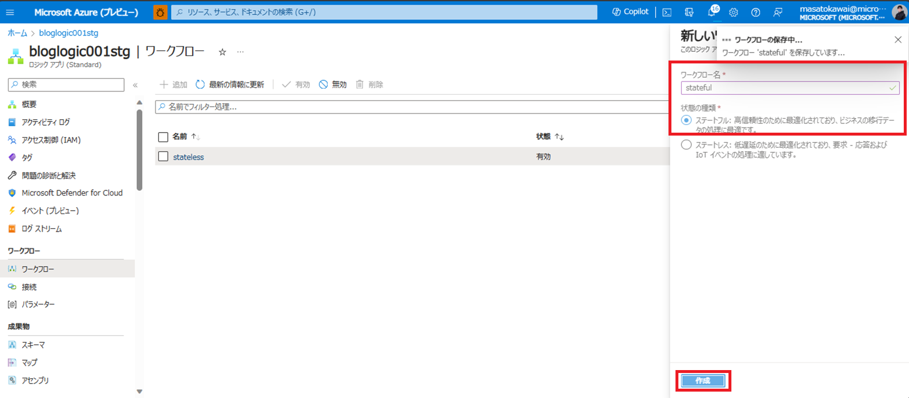

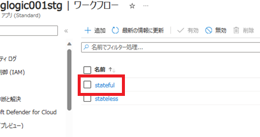

以上の手順にて、ファイアウォール設定配下のストレージ アカウントに Standard Logic Apps を作成することが可能でございます。
ただし、前回との違いについては、Standard Logic Apps を作成する際に、事前にストレージ アカウントのパブリック アクセスを許可しておく必要が有ります。
前回は既にファイアウォール設定を有効化しているストレージ アカウントに対してデプロイを実施しておりましたが、Azure Portal より新規で Standard Logic Apps を構築する際は、ストレージ アカウントを予めパブリック アクセスが可能な状態とし、Standard Logic Apps をデプロイしてから、ファイアウォール設定やプライベート エンドポイントの設定、VNet 統合の設定を有効化する必要がございますので予めご留意ください。

なお、上記の手順についてはあくまでも本記事におけるサンプルとなります。
商用環境でご利用いただく場合につきましては、お客様の責任において十分に設計および検証をいただいたうえで採用要否について判断をいただければと存じます。

## まとめ
本記事では、以下についてご案内いたしましたが、ご理解いただけましたでしょうか。
- 前提条件
- Standard Logic Apps のデプロイ
- ストレージ アカウントの設定
- VNet 統合の設定
- まとめ

本記事が少しでもお役に立ちましたら幸いです。最後までお読みいただき、ありがとうございました！

<Azure Logic Apps の参考サイト>
-- 概要 - Azure Logic Apps とは
https://learn.microsoft.com/ja-jp/azure/logic-apps/logic-apps-overview
Azure Logic Apps とは、ロジック アプリ デザイナーでフロー チャートを用いて作成したワークフローを自動実行するソリューションです。
Azure Logic Apps では、条件分岐などを実装することができ、ワークフローの実行状況に応じて実行する処理を分岐することが可能です。

