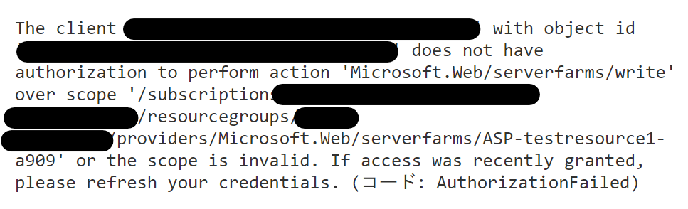

こんにちは。  Azure Integration サポート チームの継松です。  
Azure では各ユーザーやグループなどに対して特定の権限を付与し、Azure リソースへのアクセスを制御することが可能です。
今回は、 Logic Apps (Standard) を作成するために割り当てが必要な Azure 組み込みロールについてご紹介します。

<!-- more -->

## こんな方におすすめです
- 初めて Logic Apps (Standard) での開発をされる方
- Azure リソースの管理者

## 目次
- 権限が不足している場合に発生するエラーの例
- 必要となる組み込みロールについて
- 組み込みロールの付与方法について
- まとめ

## 権限が不足している場合に発生するエラー例

権限が不足した状態で Logic Apps (Standard) のデプロイをしますと下図のようなエラーが発生します。

## 必要となる組み込みロール

- Logic App Contributor (ロジック アプリの共同作成者)
- Storage Account Contributor (ストレージ アカウントの共同作成者)
- Web Plan Contributor (Web プラン共同作成者)
- Website Contributor (Web サイト共同作成者)

参考資料 : 
Azure 組み込みロール - Azure RBAC | Microsoft Docs # Logic App Contributor (ロジック アプリの共同作成者)
https://docs.microsoft.com/ja-jp/azure/role-based-access-control/built-in-roles#logic-app-contributor

Azure 組み込みロール - Azure RBAC | Microsoft Docs # Storage Account Contributor (ストレージ アカウントの共同作成者)
https://docs.microsoft.com/ja-jp/azure/role-based-access-control/built-in-roles#storage-account-contributor 

Azure 組み込みロール - Azure RBAC | Microsoft Docs # Web Plan Contributor (Web プラン共同作成者)
https://docs.microsoft.com/ja-jp/azure/role-based-access-control/built-in-roles#web-plan-contributor 

Azure 組み込みロール - Azure RBAC | Microsoft Docs # Website Contributor (Web サイト共同作成者)
https://docs.microsoft.com/ja-jp/azure/role-based-access-control/built-in-roles#website-contributor 

## 組み込みロールの付与方法について

実際に組み込みロールを付与するにあたっては、以下が必要です。
- Microsoft.Authorization/roleAssignments/write アクセス許可 (ユーザー アクセス管理者や所有者など)

また、スコープについては、サブスクリプション全体での制御を許可するのか、または特定のリソース グループに対してのみに対しての制御とするのか、ご検討の上ご指定ください。
Standard Logic Apps と同じリソースグループ内に API 接続を作成する仕様のため、リソース スコープではなくリソースグループ スコープ以上でのロールの割り当てを推奨しております。

詳しくは下記の公開資料をご参考ください。

Azure portal を使用して Azure ロールを割り当てる - Azure RBAC | Microsoft Docs
https://docs.microsoft.com/ja-jp/azure/role-based-access-control/role-assignments-portal?tabs=current

## まとめ

本記事では、Logic Apps Standard タイプを作成するにあたって割り当てが必要な Azure 組み込みロールについてご紹介しました。
他にも、 Azure リソースを作成・制御・管理するにあたって必要な権限を含む Azure 組み込みロールを確認する必要がありましたら、下記の公開資料をご参考くださいませ。

Azure 組み込みロール - Azure RBAC | Microsoft Docs
https://docs.microsoft.com/ja-jp/azure/role-based-access-control/built-in-roles
