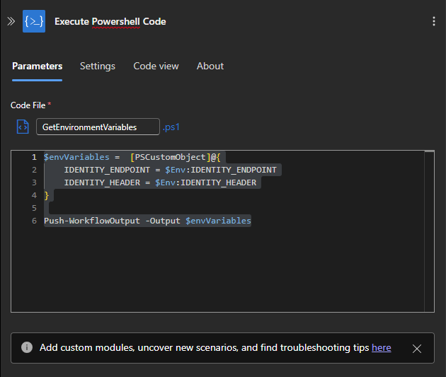

Azure Integration サポート チームの長坂です。

Azure Logic Apps では多くのコネクタをサポートしており、様々な Azure サービスへの認証と接続を行うことが可能です。

ただし、Azure Logic Apps の標準の機能として提供されるコネクタを使えないサービスやユース―ケースにおいては、認証と接続をワークフローの中で明示的に行うほかない場合があります。<br>
例えば、Azure Logic Apps Standard を使用して仮想ネットワーク統合の機能を有効化し、Logic Apps から他の Azure サービスへの接続をプライベートなネットワーク経路で行う、といったユースケースでコネクタがその状況に対応していないということが起こり得ます。<br>
コネクタが使えない状況で特定のサービスに対して REST API の要求を行うときは、多くの場合代替手段として HTTP アクションを使用することが考えられます。

HTTP アクションの Authentication 機能でマネージド ID を選択することにより、Logic Apps の マネージド ID を使って取得したアクセストークンを [RFC 6750](https://datatracker.ietf.org/doc/html/rfc6750#section-2.1) で定められた形式のヘッダーとして追加することが可能です。

RFC 6750 に沿って Authorization ヘッダーを Bearer `token value` のような形式で定めている Azure サービスの REST API 要求であれば、HTTP アクションの機能でマネージド ID を選択することで有効なリクエスト形式の要求を送信することが可能です。<br>
しかし、Azure サービスのデータプレーンへの要求では一部 Authorization ヘッダーが前述のものとは異なる形式となっている場合があり、そのようなサービスへの要求では HTTP アクションの Authentication 機能でマネージド ID を選択したとしても、Authorization ヘッダーの形式が合っていないために要求が失敗します。

こういった状況に遭遇した場合の対処としては、アクセストークンも HTTP アクションによって取得した上で、アクセストークンの値を要求先のサービスが定めるヘッダー形式に合うように加工して後続の HTTP アクションで REST API の要求を行うという手法が有効です。

以下、Azure Logic Apps Standard プランを使用する前提でこれを実現する方法についてご紹介いたします。

<!-- more -->

## 目次

1. [Logic Apps Standard (App Service) でマネージド ID の資格情報を使用してアクセストークンを取得する方法](#header1)
2. [アクセストークンを要求するエンドポイントとヘッダー](#header2)
3. [エンドポイントとヘッダーを取得する](#header3)
4. [レスポンスの値をワークフローの動的コンテンツとして取り扱う](#header4)
5. [HTTP アクションによるアクセストークンの要求](#header5)
6. [まとめ](#header7)

<h2 id="header1">1. Logic Apps Standard (App Service) でマネージド ID の資格情報を使用してアクセストークンを取得する方法</h2>

Azure Logic Apps Standard (シングルテナント) は、ホスト環境を独自に指定する場合を除いて基本的には App Service プラン上で動作します。<br>
App Service は環境変数として、ローカルのトークン要求エンドポイントを持っており、この URL に対して GET リクエストを送信することでアクセストークンを取得することができます。

トークン要求のリクエストについては以下を参照してください。

[マネージド ID - Azure App Service | Microsoft Learn](https://learn.microsoft.com/ja-jp/azure/app-service/overview-managed-identity?tabs=portal%2Chttp#rest-endpoint-reference)

Azure Logic Apps Standard は App Service プラン上で動作するため、この仕組みを利用してアクセストークを取得することが可能です。

<h2 id="header2">2. アクセストークンを要求するエンドポイントとヘッダー</h2>

[マネージド ID - Azure App Service | Microsoft Learn](https://learn.microsoft.com/ja-jp/azure/app-service/overview-managed-identity?tabs=portal%2Chttp#rest-endpoint-reference) に記載の通り、以下の環境変数にそれぞれエンドポイント URL とヘッダーの値が設定されております。

> - `IDENTITY_ENDPOINT` - ローカル トークン サービスに対する URL。
> - `IDENTITY_HEADER` - サーバー側のリクエスト フォージェリ (SSRF) 攻撃を回避するために使用するヘッダー。 値は、プラットフォームによってローテーションされます。

<h2 id="header3">3. エンドポイントとヘッダーを取得する</h2>

環境変数の値を取得する方法は別の記事でご紹介しております。

[Azure Logic Apps Standard がホストされた App Service の OS 情報を取得してワークフロー内で使用する方法 | Japan Azure Integration Support Blog](https://jpazinteg.github.io/blog/LogicApps/StandardLogicApps-GetEnvironmentVariables/#header3)

一例として、`Execute Powershell Code` アクションで環境変数を取得するコードを記載します。

```powershell
$envVariables =  [PSCustomObject]@{
    IDENTITY_ENDPOINT = $Env:IDENTITY_ENDPOINT
    IDENTITY_HEADER = $Env:IDENTITY_HEADER
}

Push-WorkflowOutput -Output $envVariables
```



値はアクションの出力で JSON として返されます。


後述する`Parse JSON`アクションなどで、JSON に含まれる値を動的コンテンツとして扱えるようにすると、後続のアクションでの値の指定が便利になります。

<h2 id="header4">4. レスポンスの値をワークフローの動的コンテンツとして取り扱う</h2>

`Parse JSON`等のデータ操作向けのアクションを使用します。
使用例は以下のドキュメントをご参照ください。Parse JSON 以外にもデータ形式や特定のデータ型に適したアクションが提供されております。

- [データの操作の実行 - Azure Logic Apps | Microsoft Learn](https://learn.microsoft.com/ja-jp/azure/logic-apps/logic-apps-perform-data-operations?tabs=consumption#parse-json-action)
- [JSON の解析アクション](https://learn.microsoft.com/ja-jp/azure/logic-apps/logic-apps-workflow-actions-triggers#parse-json-action)

例えば、[3. エンドポイントとヘッダーを取得する](#header3) の出力 JSON のスキーマが以下の通りであるため、これを Parse JSON の Schema とすれば、前のアクションから受け取った Schema に一致する出力の JSON の各値を動的コンテンツとして扱えるようになります。

```json
{
  "type": "object",
  "properties": {
    "body": {
      "type": "object",
      "properties": {
        "IDENTITY_ENDPOINT": {
          "type": "string"
        },
        "IDENTITY_HEADER": {
          "type": "string"
        }
      }
    }
  }
}
```


<h2 id="header5">5. HTTP アクションによるアクセストークンの要求</h2>

`IDENTITY_ENDPOINT` の URL に対して、`X-IDENTITY-HEADER`ヘッダーに`IDENTITY_HEADER`の値を入れて GET リクエストを送信することで、レスポンスでアクセストークンを取得できます。

HTTP リクエストの送信には、HTTP アクションを使用します。

参考

- [外部エンドポイントまたはその他のワークフローを呼び出すワークフローを作成する - Azure Logic Apps | Microsoft Learn](https://learn.microsoft.com/ja-jp/azure/connectors/connectors-native-http?tabs=standard#add-an-http-action)
- [HTTP アクション](https://learn.microsoft.com/ja-jp/azure/logic-apps/logic-apps-workflow-actions-triggers#http-action)

例えば、HTTP アクションの設定でトークン要求エンドポイントや`X-IDENTITY-HEADER` を以下のように入力すると、GET リクエストを送信します。


レスポンスは JSON のため、 [4. レスポンスの値をワークフローの動的コンテンツとして取り扱う](#header4) と同様の方法でアクセストークンの値も動的コンテンツとして扱えるようにすることで、後続のアクションでトークンを使用したリクエストを送信する HTTP アクションにおける値の指定が便利になります。

取得したアクセストークンを適宜加工することで、認可を伴う他のサービスへの要求において任意のヘッダー形式でリクエストを送信することができます。

<h2 id="header7">6. まとめ</h2>

本記事では、Azure Logic Apps Standard のマネージド ID 資格情報で HTTP アクションにより明示的にアクセストークンの値を取得する方法をご紹介しました。

今回ご紹介した内容は Microsoft ID プラットフォームにおけるトークン (JWT) の仕組みを基礎としております。
承認サーバーである Microsoft Entra へアクセストークンを要求する仕組みについては以下の Microsoft ID プラットフォームの公開情報に記載されておりますので、ご参照いただくことでより理解が深まるかと存じます。

[トークンと要求の概要 - Microsoft identity platform | Microsoft Learn](https://learn.microsoft.com/ja-jp/entra/identity-platform/security-tokens)

Logic Apps では様々なサービスとの接続用にコネクタが提供されているため、基本的にはコネクタで認証と接続が可能かを先に確認いただくことを推奨いたします。
Logic Apps で提供されているいずれのコネクタも要件やユースケースに合わず、独自のヘッダー形式でアクセストークンを指定して他のサービスに要求を送信する必要があるような場合に、今回ご紹介した方法が役に立つかと存じます。

皆様の開発のご参考になれば幸いです。

---

本記事の情報は、2025 年 6 月 2 日時点の内容となります。

---
