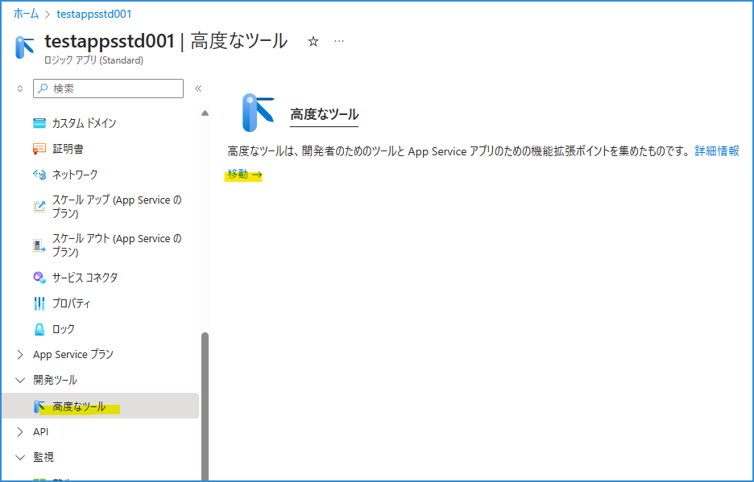
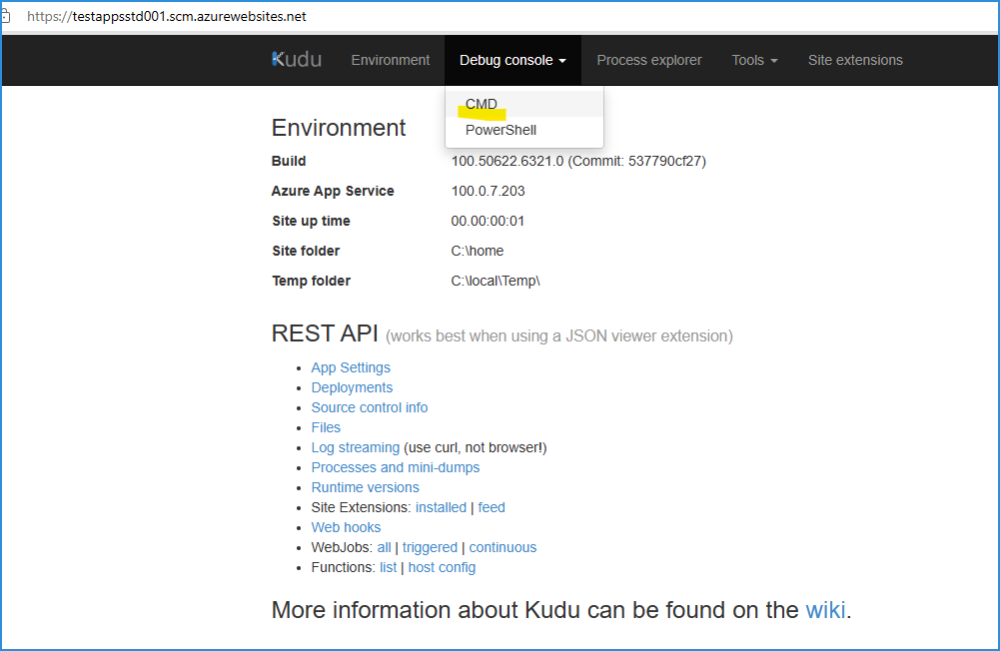
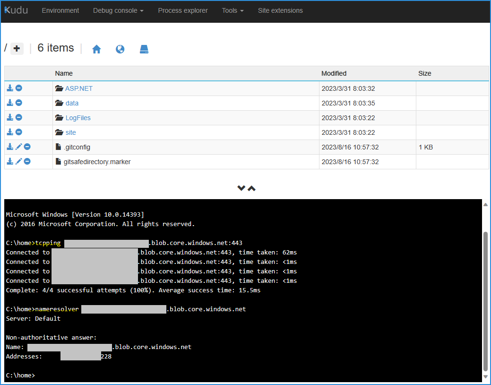

こんにちは！  Azure Integration サポート チームの 山田 です。今回は、Standard Logic Apps から、関わるストレージ アカウントに対して、ツールにて接続の疎通を確認する方法をご紹介いたします。

<!-- more -->

## こんな時に

- 閉域ネットワーク構成にて Standard Logic Apps を管理したい。
- Azure ポータルから Standard Logic Apps を開いた際に予期しないエラーが出るのでトラブルシューティングしたい。

## 目次
- Standard Logic Apps とストレージ アカウント
- 「高度なツール」
- 関連ドキュメント
- まとめ

## Standard Logic Apps とストレージ アカウント

前提として、Standard Logic Apps を作成した際に合わせてストレージ アカウントに作成されるコンテナやファイルは、ワークフロー情報や、実行履歴情報が格納されているものとなります。以下記事にて概要をご覧いただけます。

- [Standard Logic Apps と関連するストレージ アカウント | Japan Azure Integration Support Blog](https://jpazinteg.github.io/blog/LogicApps/StandardLogicApps-StorageAccount/)

ここでは後述のツールのために、対象のストレージ アカウントに対して [Azure ポータル] - [ストレージ アカウント] - [<対象の ストレージ アカウント>] - [設定 - エンドポイント] と遷移し、以下のように Blob、File、Queue、Table の 4 つのエンドポイントを取得しておきます。

## 「高度なツール」

本題となるツールです。下記「高度なツール」から、Kudu というものに移動することができます。

- [Kudu サービスの概要 - Azure App Service | Microsoft Learn](https://learn.microsoft.com/ja-jp/azure/app-service/resources-kudu)

Kudu 上で、Debug console から CMD へ進みます。

ここで、下部に現出します CLI より、tcpping コマンド、nameresolver コマンドの実施が可能となります。

例: 

`tcpping <先に取得したストレージ Blob、File、Queue、Table の各エンドポイント>:443 `

`nameresolver <先に取得したストレージ Blob、File、Queue、Table の各エンドポイント>`

無事 Success および IP が確認できました。以上の形で、宛先ストレージ アカウントに疎通が取れているか確認いただくことができます。

なお留意点としまして、作業端末よりツールへのアクセス許可が必要となります。以下 Error 403 となります場合は、まずは Azure ポータル より、作業端末から Standard Logic Apps へのアクセスが十分かご確認ください。
 

- 参考: [Azure App Service のアクセス制限 - Azure App Service | Microsoft Learn](https://learn.microsoft.com/ja-jp/azure/app-service/app-service-ip-restrictions?tabs=azurecli)

## 関連ドキュメント

Standard Logic Apps とストレージ アカウントに言及したドキュメントや記事には、以下のようなものがございます。

- [Standard ロジック アプリをプライベート ストレージ アカウントにデプロイする - Azure Logic Apps | Microsoft Learn](https://learn.microsoft.com/ja-jp/azure/logic-apps/deploy-single-tenant-logic-apps-private-storage-account)
- [Azure Functions のネットワーク オプション # トラブルシューティング | Microsoft Learn](https://learn.microsoft.com/ja-jp/azure/azure-functions/functions-networking-options?tabs=azure-cli#troubleshooting)
- [ファイアウォール設定配下の既存ストレージ アカウントに Standard Logic Apps を作成 | Japan Azure Integration Support Blog](https://jpazinteg.github.io/blog/LogicApps/SecBlobStandardLA/)

## まとめ

本記事では、Standard Logic Apps を閉域ネットワーク構成にて管理する際、知っておくと便利なツール「高度なツール Kudu」についてご紹介しました。引き続き皆様のお役に立てる情報を発信してまいります。

