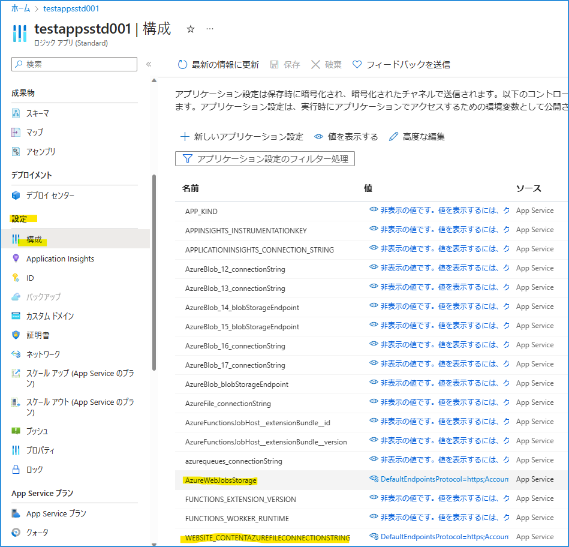

こんにちは。  Azure Integration サポート チームの山田です。  
今回は、Logic Apps Standard を作成した際に一緒に作成されるストレージ アカウントについて、基礎知識からご紹介いたします。

<!-- more -->

## こんな方におすすめです
- 初めて Logic Apps Standard での開発をされる方
- Azure リソースの管理者

## 目次
- Logic Apps Standard を作成した際に一緒に作成されるストレージ アカウントの役割
- Logic Apps Standard と関連するストレージ アカウント名
- 関連ドキュメント
- まとめ

## Logic Apps Standard を作成した際に一緒に作成されるストレージ アカウントの役割

端的に、Logic Apps Standard を作成した際に一緒に作成されるコンテナやファイルは、Logic Apps Standard をご利用の際のワークフロー情報や、実行履歴情報が格納されているものとなります。「flow*」などという名称のテーブルをご覧いただけます。

## Logic Apps Standard と関連するストレージ アカウント名

ストレージ アカウントと Logic Apps Standard の結びつきは以下から参照いただけます。

1. Azure Portal から該当の Logic Apps Standard に移動します。
2. 左部 [設定] から [構成] の、[アプリケーション設定] タブを選択します。 

- AzureWebJobsStorage
- WEBSITE_CONTENTAZUREFILECONNECTIONSTRING

上 2 つがストレージ アカウント名に関わるパラメーターとなります。

## 関連ドキュメント

Logic Apps Standard とストレージ アカウントに言及したドキュメントには、以下のようなものがございます。

- [シングルテナントの Standard ロジック アプリをプライベート エンドポイントを使用してプライベート ストレージ アカウントにデプロイする](https://learn.microsoft.com/ja-jp/azure/logic-apps/deploy-single-tenant-logic-apps-private-storage-account)
- [シングルテナント Azure Logic Apps の Standard ロジック アプリ ワークフローのストレージ コストを見積もる](https://learn.microsoft.com/ja-jp/azure/logic-apps/estimate-storage-costs)

## まとめ

本記事では、Logic Apps Standard タイプを作成するにあたって理解しておくと安心な、ストレージ アカウントとの関係にまつわる基礎知識についてご紹介しました。ほか関連記事は以下を参照くださいませ。引き続き皆様のお役に立てる情報を発信してまいります。

[Logic Apps Standard のワークフロー実行ログを削除する](https://jpazinteg.github.io/blog/LogicApps/FlowHistoryClearner/)
