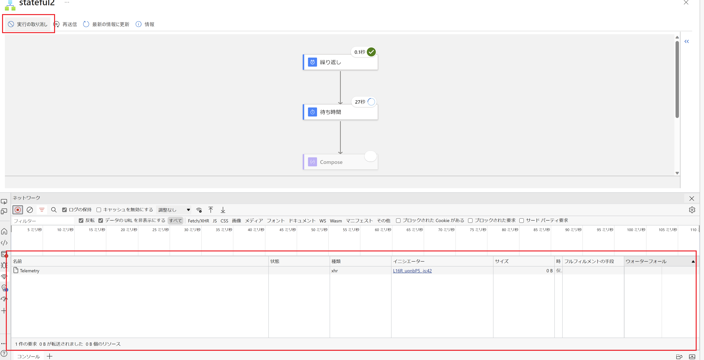
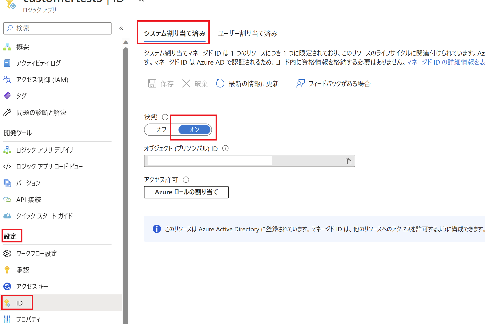
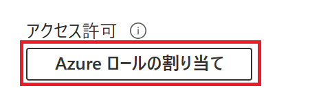
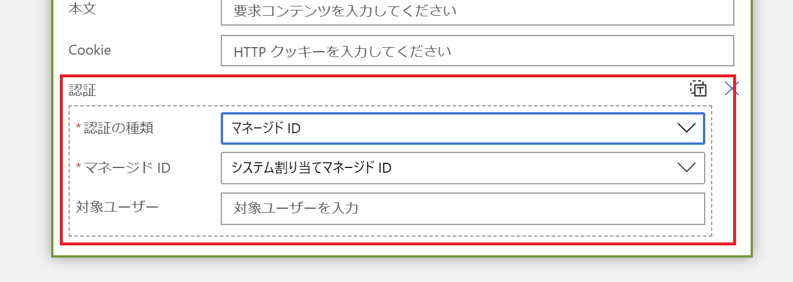
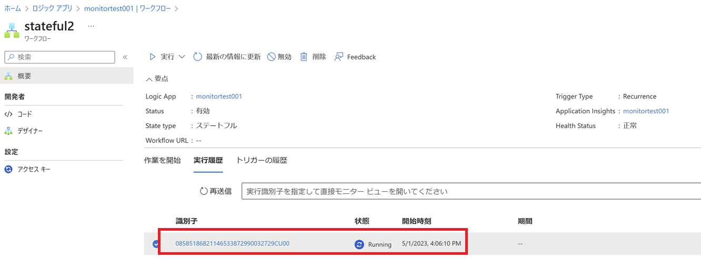
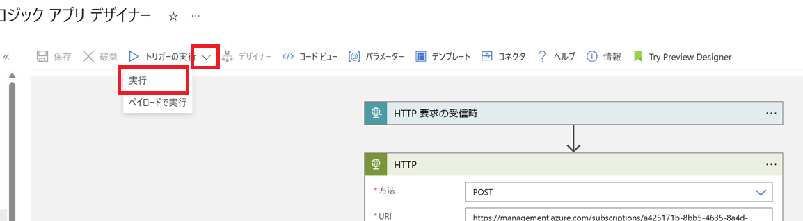
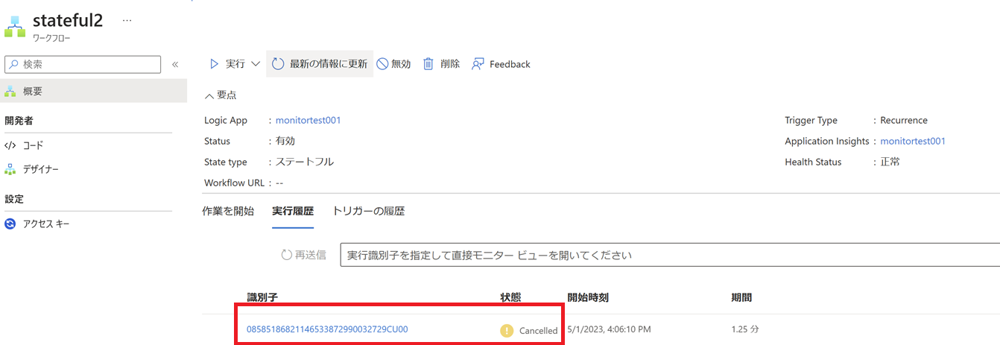

こんにちは！Azure Integration サポート チームの 川合 です。 

API 操作による Standard Logic Apps の処理のキャンセル方法についてご説明いたします。

まず、従量課金タイプの Logic Apps では以下の API を利用することでワークフローを API 操作でキャンセルすることが可能です。

- [Workflow Runs - Cancel](https://learn.microsoft.com/ja-jp/rest/api/logic/workflow-runs/cancel?tabs=HTTP)

しかしながら、Standard Logic Apps のワークフローについては特に API を用意しておりません。
そこで今回は、Standard Logic Apps の実行中のワークフローを API を用いてキャンセルする方法についてご案内致します。

<!-- more -->
## こんな方におすすめです
- Standard Logic Apps の実行中のワークフローを REST API で停止したい方

## 目次
- キャンセル処理の API の確認方法
- 設定例と実行結果

## キャンセル処理の API の確認方法
まず、Standard Logic Apps のワークフローを停止するような API については公開情報はございません。
その為、今回の記事では以下のリソースプロバイダに対してキャンセル処理の API を直接実行することで、ワークフローのキャンセル処理を実装致します。

- [Microsoft.Web sites/hostruntime/webhooks/api/workflows/runs](https://learn.microsoft.com/en-US/azure/templates/microsoft.web/sites/hostruntime/webhooks/api/workflows/runs?pivots=deployment-language-arm-template)

実際にどのような方法で設定するかにつきましてですが、こちらブラウザの開発者ツールにて GUI 操作時のリクエストを解析することで確認可能でございます。
確認方法につきまして、以下に参考例を記載いたします。

＜確認方法＞
1. ブラウザを起動し、開発者ツール (F12) を実行します。本例では chromium 版 Edge を利用しております。

2.  実際に実行中のワークフローを [実行の取り消し] ボタンで停止いたします。
 

3. 実際のリクエストとして "cancel?api-version=2018-11-01" の実行結果が出力されますので、こちらのヘッダに記載されている要求 URL を確認します。
 

以上より、以下のような API が実行されていることを確認出来ます。

＜実際に実行されている API＞
```
https://management.azure.com/subscriptions/{SubscriptionId}/resourceGroups/{ResourceGroupName}/providers/Microsoft.Web/sites/{LogicAppsName}/hostruntime/runtime/webhooks/workflow/api/management/workflows/{WorkFlowName}/runs/{RunId}/cancel?api-version=2018-11-01
```

・SubscriptionId：Standard Logic Apps の存在するサブスクリプション ID
・ResourceGroupName：Standard Logic Apps の存在するリソース グループ名
・LogicAppsName：Standard Logic Apps 名
・WorkFlowName：Standard Logic Apps 内に作成した ワークフロー名
・RunId：実行 ID

なお、こちらの API の内容については 2023/05/01 現在の内容となります。
今後将来的に予告なく内容が変更される場合がございますので予めご了承下さい。

これらを基に、以下の通りキャンセル処理の設定例を記載いたします。

## 設定例と実行結果
本例では、マネージド ID を有効にした従量課金タイプの Logic Apps より、上記 API を実行して処理のキャンセルを実装いたします。
まず、Standard Logic Apps とは別で従量課金タイプの Logic Apps を用意し、事前にマネージド ID を有効に致します。
 

次に、そのまま同一画面上の [Azure ロールの割り当て] ボタンを選択し、マネージド ID に "Web サイト共同作成者" ロールを付与します。
 

 

- [Azure 組み込みロール # Website Contributor](https://learn.microsoft.com/ja-JP/azure/role-based-access-control/built-in-roles#website-contributor)

次に、従量課金タイプのワークフローにて、HTTP アクションを設定いたします。

- [Azure Logic Apps から HTTP または HTTPS でサービス エンドポイントを呼び出す](https://learn.microsoft.com/ja-jp/azure/connectors/connectors-native-http)

以下の通りパラメーターを指定し、認証方法にマネージド ID を指定いたします。
 
 

以上の設定より、マネージド ID を基にリクエストを行うことで API を実行し、ワークフローを停止することが可能でございます。

＜実行例＞
・Standard Logic Apps にてワークフロー実行中。
 

・従量課金タイプよりワークフローを実行。
 

・結果
 

以上より、API 操作を基に Standard Logic Apps のワークフローの実行をキャンセルすることが可能でございます。
なお、先にも申しました通り、こちら公開情報がございませんことと、2023/05/01 現在の情報となりますので、今後内容が変更される可能性が十分にございます。
お手数をおかけして申し訳ございませんが、上記を踏まえまして、お客様にて十分に検証を実施いただいたうえで採用要否についてご検討をいただきますようお願い申し上げます。

## まとめ
本記事では、以下についてご案内いたしましたが、ご理解いただけましたでしょうか。
- キャンセル処理の API の確認方法
- 設定例と実行結果

本記事が少しでもお役に立ちましたら幸いです。最後までお読みいただき、ありがとうございました！

<Azure Logic Apps の参考サイト>
-- 概要 - Azure Logic Apps とは
https://learn.microsoft.com/ja-jp/azure/logic-apps/logic-apps-overview
Azure Logic Apps とは、ロジック アプリ デザイナーでフロー チャートを用いて作成したワークフローを自動実行するソリューションです。
Azure Logic Apps では、条件分岐などを実装することができ、ワークフローの実行状況に応じて実行する処理を分岐することが可能です。
