こんにちは！Azure Integration サポート チームの 川合 です。 

近年の技術動向として、DevOps のように環境構築の自動化が進んでおりますが、Standard Logic Apps についても以下の公開情報のとおり DevOps の仕組みを利用して CI/CD の環境を構築することが可能でございます。

- [シングルテナントの Azure Logic Apps への DevOps のデプロイ](https://learn.microsoft.com/ja-jp/azure/logic-apps/devops-deployment-single-tenant-azure-logic-apps)

今回は、Azure DevOps を利用して、Standard Logic Apps にて CI/CD 環境を構築する方法についてご案内いたします。

<!-- more -->
## こんな方におすすめです
- Azure DevOps を利用して Standard Logic Apps のワークフローをデプロイしたい方

## 目次
- Azure DevOps を利用した Standard Logic Apps の CI/CD 環境の概要
- Standard Logic Apps 側の設定
- Azure DevOps 側の設定
- 実際の動作

## Azure DevOps を利用した Standard Logic Apps の CI/CD 環境の概要
始めに、本ブログ記事につきましては Logic Apps 製品としての内容となります。そのため、Azure DevOps、Azure Functions、Azure App Service の製品に関する詳細については説明を割愛いたします。詳細な操作方法についてはそれぞれの製品観点で別途弊社サポートへお問合せ下さい。
また、本ブログ記事でご案内する内容としては手動でのデプロイ、かつ最低限の操作方法となります。そのため、各設定についてはお客様のビジネス要件に合わせて別途カスタマイズいただく必要があることと、本ブログ記事の内容については弊社サポートとしてお客様のビジネス要件に合わせたカスタマイズの対応は実施致しませんので予めご了承下さい。

まず、Standard Logic Apps での DevOps の設定方法については以下の公開情報を基に設定を進めて参ります。

- [シングルテナントの Azure Logic Apps に Standard ロジック アプリ ワークフローの DevOps デプロイを設定する](https://learn.microsoft.com/ja-jp/azure/logic-apps/set-up-devops-deployment-single-tenant-azure-logic-apps?tabs=azure-devops)

上記の公開情報にもございます通り、Azure Logic Apps 製品としましては デプロイ スロットをサポートしておりません。
Azure Logic Apps にて環境を構築するにあたり、以下の通り Azure Functions のデプロイ タスクを利用し、Standard Logic Apps へデプロイする必要がございます。

- [AzureFunctionApp@1 - v1 タスクのAzure Functions](https://learn.microsoft.com/ja-jp/azure/devops/pipelines/tasks/reference/azure-function-app-v1?view=azure-pipelines&viewFallbackFrom=azure-devops&preserve-view=true)

- [Azure Pipelines を使用した継続的デリバリー](https://learn.microsoft.com/ja-jp/azure/azure-functions/functions-how-to-azure-devops?tabs=csharp%2Cyaml&pivots=v1)

大まかな構成の概要としましては以下の構成となります。
1. Azure DevOps 上の Repos にワークフローの構成ファイルを格納
2. 1 で格納したファイルを基に Pipelines にて App Service Plan (Standard Logic Apps) にワークフローをデプロイ

また、上記の操作を実施するにあたり、Git を利用しますので、予め Git を利用可能な状態に環境設定をお願いいたします。
本例では Visual Studio Code より Git 操作を実施いたします。
[Visual Studio Code](https://code.visualstudio.com/)

## Standard Logic Apps 側の設定
始めに、Azure Portal より [ロジック アプリ] - [追加] より [ロジック アプリの作成] 画面を表示し、Standard Logic Apps を新規作成します。こちらは任意の設定で作成いただければと思います。
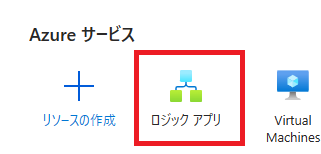 
 

次に、[ワークフロー] - [ワークフロー] より、任意のワークフローを作成します。
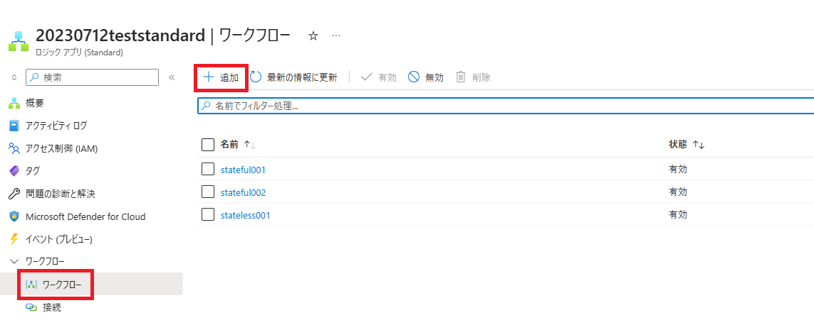 

・サンプル
 

ワークフローを作成しましたら、Standard Logic Apps の概要画面より、[アプリ コンテンツのダウンロード] を選択します。
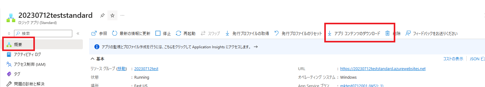 

今回の設定方法では "サイトのコンテンツ" を指定いただき、"ダウンロードにアプリ設定を含める" のチェックを外した状態で "ダウンロード" ボタンを押下してください。
 

ダウンロードされた Zip コンテンツについては後程利用しますので、別途退避してください。

また、[デプロイメント] - [デプロイ センター] より、"Setting"　に何も設定されていないことを確認いたします。
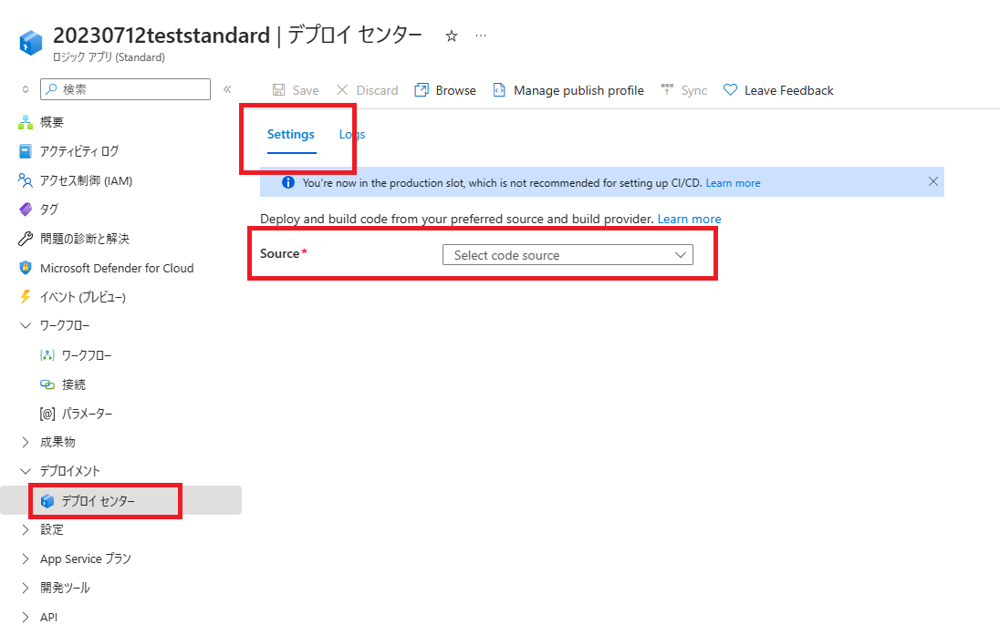 

こちらの設定がされていると、Standard Logic Apps のソースがプッシュされる度に差分で自動デプロイが実行される場合がございますため、今回の設定ではこちらの設定を無効とします。

Standard Logic Apps 側の設定については一旦以上となります。

## Azure DevOps 側の設定
始めに、Azure DevOps へログインし、[Organization setting] を表示します。
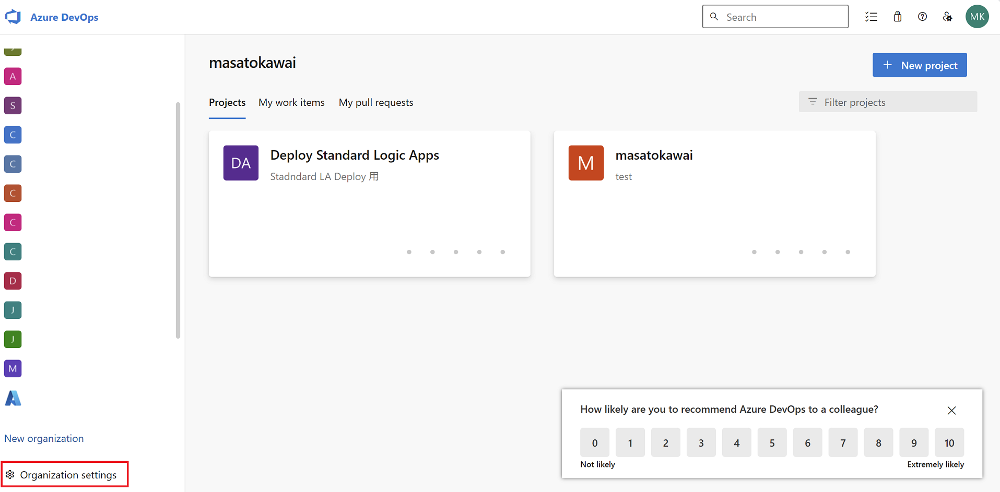 

次に、[Billing] を確認し、対象の Standard Logic Apps のリソースが存在するサブスクリプションが指定されているかを確認します。
 

指定されていない場合、"Change billing" より設定を変更します。
また、[Azure Active Directory] より、接続しているテナントについても同様に確認します。
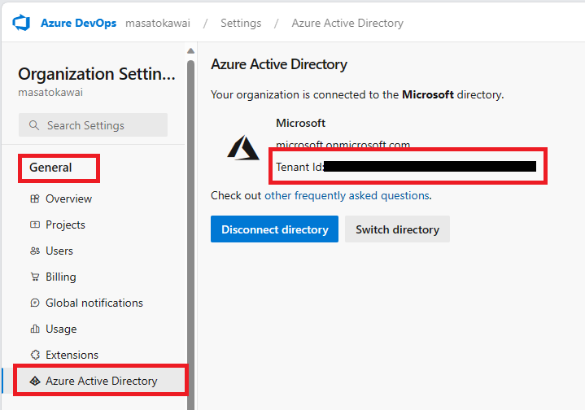 

設定の確認が完了しましたら、トップ画面にもどり、[+ New Project] より、任意のプロジェクトを作成します。
 

本例では "Visibility" を "Private"、"Version control" を "Git" に設定します。
 

次に、Repos の画面より、作成したプロジェクトのリポジトリをローカルにクローンします。今回は "Clone in VS Code" を選択します。
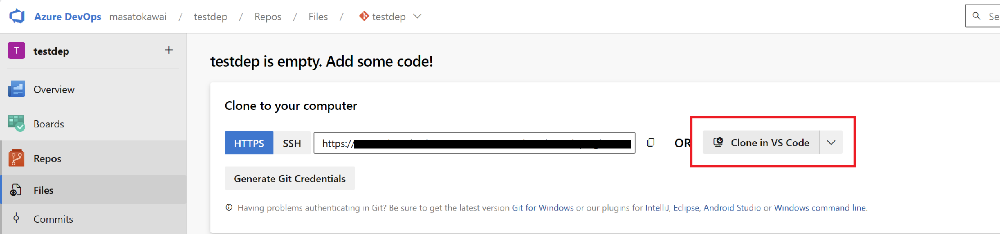 

リポジトリのクローン先フォルダを確認されるため、任意のフォルダを選択し、[リポジトリの宛先として選択] ボタンを押下します。
 
 
 

クローン先のフォルダの中で Standard Logic Apps の資材を格納するフォルダを作成します。
今回は "sample" という名前のフォルダを作成しますが、任意の名前のフォルダを作成してください。
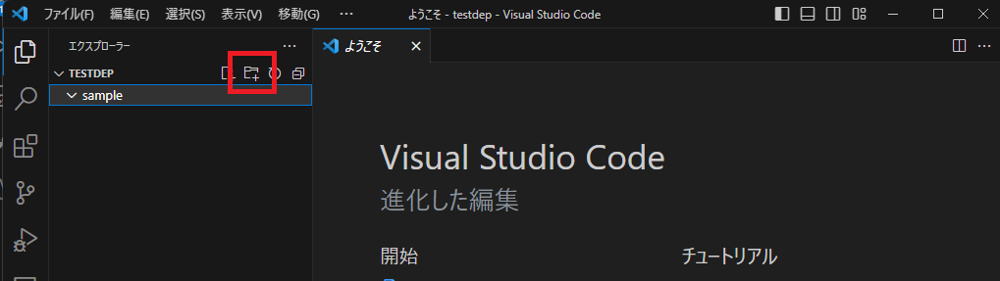 

次に、[アプリ コンテンツのダウンロード] で取得した Zip ファイルの中身を展開し、上記で作成したフォルダにコピーします。
 

各フォルダ、ファイルについての詳細は以下の公開情報をご確認下さい。
[シングルテナントの Azure Logic Apps で Standard ロジック アプリのホストとアプリの設定を編集する](https://learn.microsoft.com/ja-jp/azure/logic-apps/edit-app-settings-host-settings?tabs=azure-portal)

フォルダの構成が整いましたら、Azure DevOps の画面にてメッセージの入力後、"コミットしてプッシュ" を選択します。
ブランチの指定や直接プッシュしたくないというお客様については別途個別に操作いただければ問題ありません。
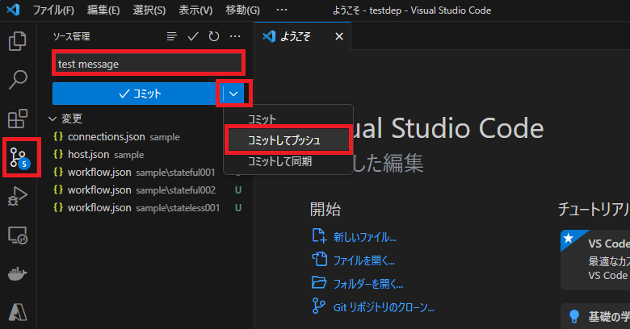 

以下の警告メッセージについて、今回は直接コミット、プッシュ操作をするため "はい" を選択します。
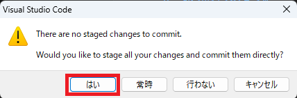 

上記の操作で、Repos 上にワークフローの構成ファイルが格納されていることが確認出来ればリポジトリの設定としては完了です。
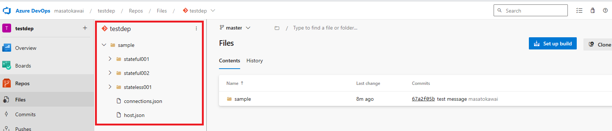 

次に、Pipelines の設定を実施します。
[+ New Project] より今回作成したプロジェクトの画面に遷移いただき、画面下部の [Project settings] を選択します。
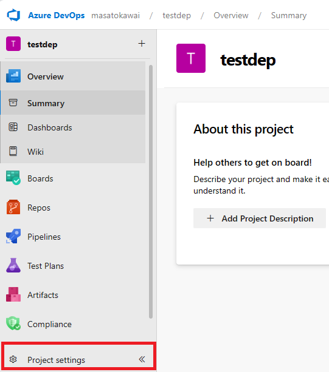 

[Pipelines] - [Service connections] より、[Create service connections] を選択します。
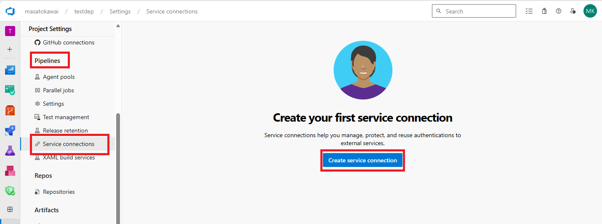 

[New service connection] の画面より、[Azure Resource Manager] を選択します。
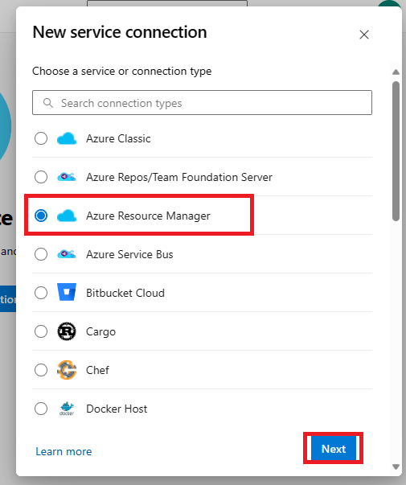 

[Service principal (automatic)] を選択します。
 

[Scope level] にて [Subscription] を選択し、対象の Logic Apps が存在するサブスクリプション、およびリソースグループを選択します。
また、任意の [Service connection name] を指定いたします。こちらの Service connection name については後程利用しますので notepad 等へ退避して下さい。
[Security] - [Grant access permissin to all Pipelines] にチェックを設定し、[Save] ボタンを押下します。
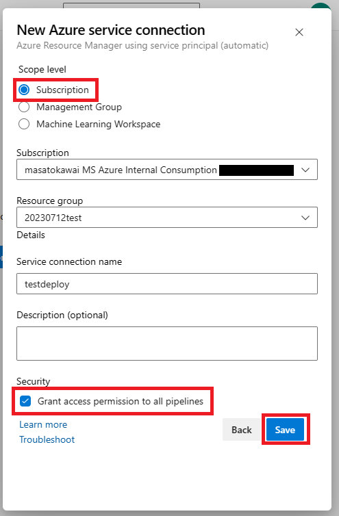 

設定が完了すると、以下のように Service connections が作成されます。
 

また、Standard Logic Apps を作成したテナントの Azure Portal に遷移いただき、[Azure Active Directory] - [管理] - [アプリの登録] を確認いただくと、以下のようにアプリが登録されます。
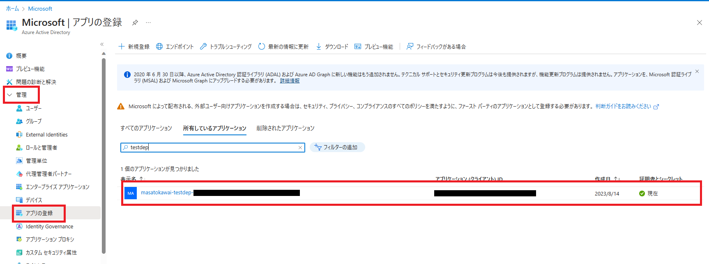 

Azure Pipelines では、こちらのアプリに付与されている権限を基にリソースを操作することとなりますので削除しないようお願いいたします。

ここまで設定が出来ましたら、[Pipelines] より [Create Pipline] を実施します。
 

[Select a repository] では先ほど作成したリポジトリを選択します。
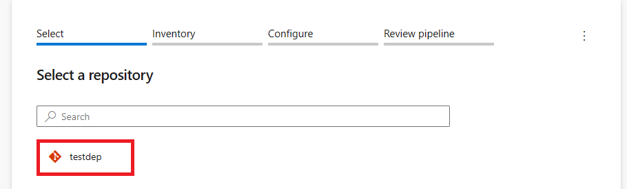 

[Inventory] が表示される場合はお客様組織の要件に合わせて設定いただきます。

[Configure your pipline] では [Starter Pipline] を選択し、[Review pipline] を選択します。
 
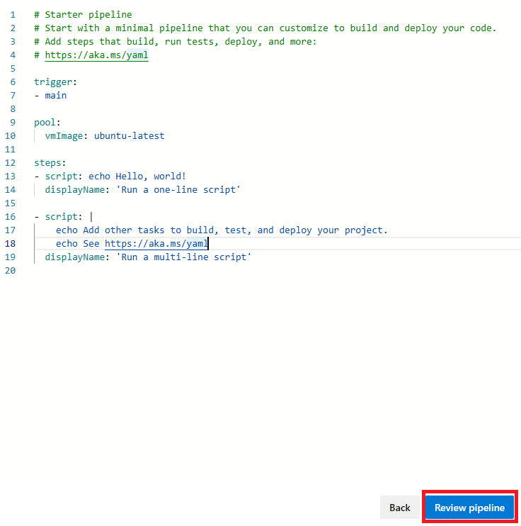 

最後に、任意のパイプラインの定義ファイル名、パイプライン名を入力し、一旦 [Save] を選択し、yml ファイルを保存します。
コミットメッセージについても任意の内容を入力いただければ問題ありません。

 
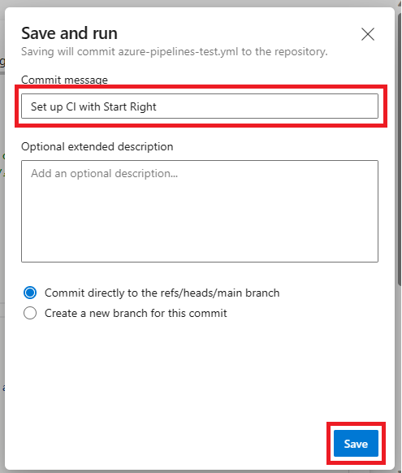 

上記操作が完了しましたら、Repos の Contents 内にパイプラインの定義ファイルが作成されていることを確認します。
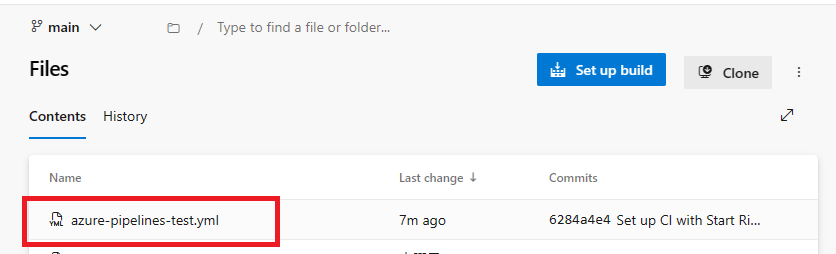 

パイプラインの定義が作成出来ましたら、以下の通り編集を行います。
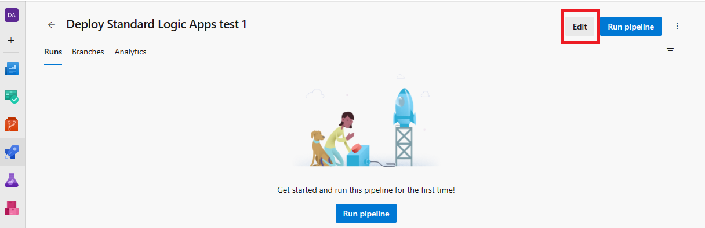 

参考までに、以下の yml 定義を設定します。

```
# Starter pipeline
# Start with a minimal pipeline that you can customize to build and deploy your code.
# Add steps that build, run tests, deploy, and more:
# https://aka.ms/yaml

trigger:
- none

pool:
  vmImage: ubuntu-latest
steps:
- task: ArchiveFiles@2
  inputs:
    rootFolderOrFile: '$(System.DefaultWorkingDirectory)/sample'
    includeRootFolder: false
    archiveType: 'zip'
    archiveFile: '$(Build.ArtifactStagingDirectory)/$(Build.BuildId).zip'
    replaceExistingArchive: true
- task: PublishPipelineArtifact@0
  inputs:
    artifactName: 'drop'
    targetPath: '$(Build.ArtifactStagingDirectory)/$(Build.BuildId).zip'
- task: AzureFunctionApp@1
  inputs:
    azureSubscription: 'testdeploy'
    appType: 'functionApp'
    appName: '20230712teststandard'
    package: '$(Build.ArtifactStagingDirectory)/$(Build.BuildId).zip'
    deploymentMethod: 'zipDeploy'
```

Azure Pipelines の yml 定義に関する詳細については Azure Pipelines 製品の公開情報をご確認下さい。
[パイプラインをカスタマイズする](https://learn.microsoft.com/ja-jp/azure/devops/pipelines/customize-pipeline?view=azure-devops#understand-the-azure-pipelinesyml-file)

上記テンプレートの概要について、以下の通り説明いたします。

・trigger
→パイプラインの起動について、自動ではなく手動での設定としております。この値を "none" から "main" に変更すると、Repos の main ブランチに変更が発生したことを契機とし、自動的にパイプラインを起動することが可能です。今回は、手動での実行としますので "none" で設定しております。

・pool
→パイプラインの裏側で処理する VM (ビルドする為のプラットフォーム) を Ubuntu に指定しております。

・ArchiveFiles@2
→System.DefaultWorkingDirectory (Repos のワーキングディレクトリ) 上に先ほど作成した sample フォルダの中身を zip ファイルとして作成いたします。

・PublishPipelineArtifact@0
→実際に Zip Deploy した際の zip ファイルを後程確認するための設定です。必須ではございません。

・AzureFunctionApp@1
→azureSubscription には Service connections の値を指定します。
 appType は 'functionApp' を指定します。 (Logic Apps ではありませんが問題ありません。)
 appName は デプロイ先の Standard Logic Apps 名を指定します。
 package は ArchiveFiles@2 で作成した zip ファイルを指定します。
 deploymentMethod は 'zipDeploy' を指定します。

以上より、パイプラインを実行いただくことで、対象の Standard Logic Apps に対してワークフローをデプロイすることが可能となります。
なお、以下のように Tasks より GUI で操作いただくことも可能でございます。
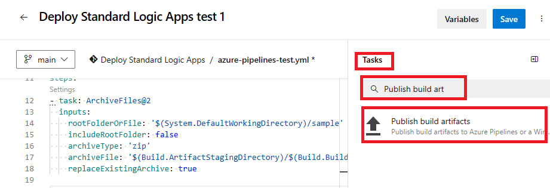 


## 実際の動作
参考までに、既存のワークフローを一つ削除します。
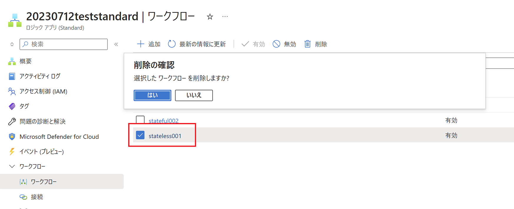 

リポジトリ上の sample フォルダに削除前の構成でワークフローの資材が格納されていることを確認します。
 

[Pipelines] - [All] より対象のパイプラインを選択し、[Run Pipline] ボタンを押下しパイプラインを実行します。
 

[Run Pipelines] の画面が表示されますが、デフォルトのまま [Run] ボタンを押下いただければ問題ありません。
 

パイプライン初回実行時には、以下のように承認処理が必要となりますので承認処理をお願いします。
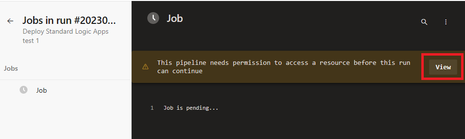 
 
 

パイプラインが完了するまで待機します。 Azure FunctionApp のタスクで warning が表示されますが問題ありません。
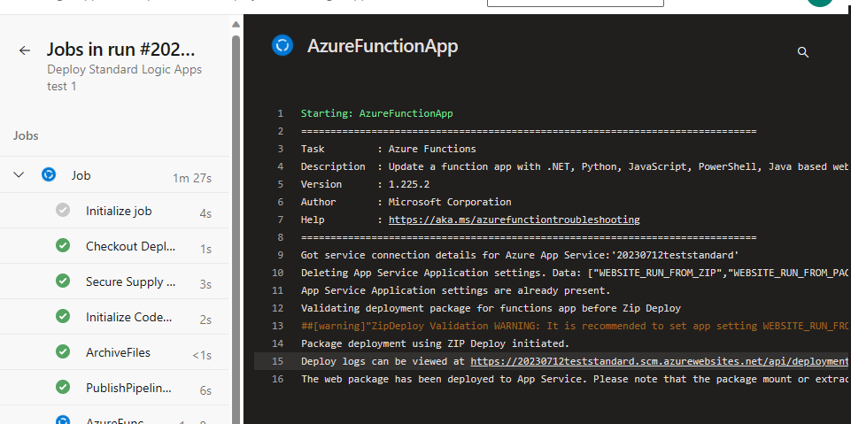 

パイプラインが完了しましたら、Azure Logic Apps を確認し、削除したワークフローが復元していることを確認します。

 
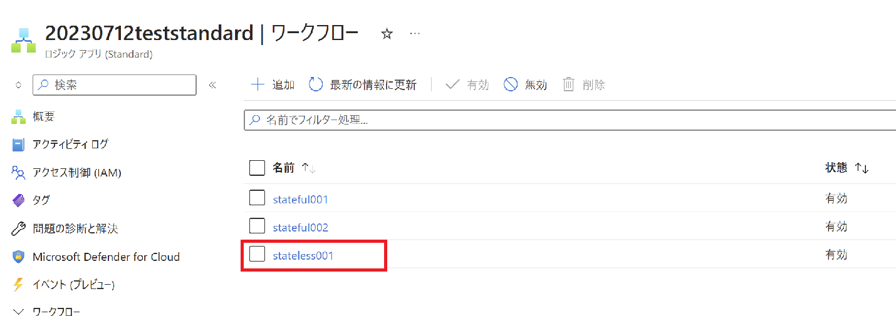 


なお、実際にどの Zip ファイルをデプロイしたかについては、以下の実行ログの [Related] の部分に 1 published とリンクがございますのでそちらを押下いただければ確認可能です。
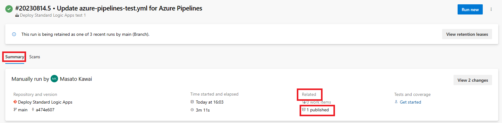 

以上より、Azure DevOps を利用して Standard Logic Apps のデプロイが可能となります。
なお、こちらの設定につきましてはあくまでも参考までに最低限の動作方法をご案内する内容となります。
その他の設定については別途お客様環境に併せて CI/CD 環境の要件定義を実施いただき、別途設計、設定をお願いいたします。
また、先にも記載しておりますが、本ブログ記事につきましては Logic Apps 製品としての内容となりますため、本ブログ記事で記載しました各製品の詳細な操作方法についてはそれぞれの製品観点で別途弊社サポートへお問合せ下さい。

## まとめ
本記事では、以下についてご案内いたしましたが、ご理解いただけましたでしょうか。
- Azure DevOps を利用した Standard Logic Apps の CI/CD 環境の概要
- Standard Logic Apps 側の設定
- Azure DevOps 側の設定
- 実際の動作

本記事が少しでもお役に立ちましたら幸いです。最後までお読みいただき、ありがとうございました！

<Azure Logic Apps の参考サイト>
-- 概要 - Azure Logic Apps とは
https://learn.microsoft.com/ja-jp/azure/logic-apps/logic-apps-overview
Azure Logic Apps とは、ロジック アプリ デザイナーでフロー チャートを用いて作成したワークフローを自動実行するソリューションです。
Azure Logic Apps では、条件分岐などを実装することができ、ワークフローの実行状況に応じて実行する処理を分岐することが可能です。
