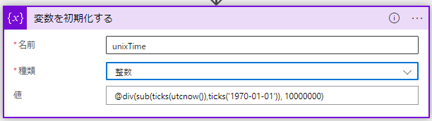
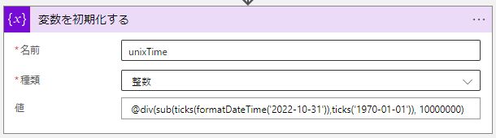

こんにちは。 Azure Integration サポート チームの大田です。 
本記事では、Logic Apps の式関数を組み合わせて Unix Time を取得する方法について説明いたします。

<!-- more -->

## 前提条件
- 今回の記事では従量課金版ロジック アプリを利用しますが、スタンダード版のロジック アプリでも問題ありません。

## Unix Time の取得サンプル
Logic Apps が備える Unix Time と類似の機能として ticks 関数がございます。
- [ticks 関数に関する公開情報](https://learn.microsoft.com/ja-jp/azure/logic-apps/workflow-definition-language-functions-reference#ticks)

1 tick はグレゴリオ暦の 0001 年 1 月 1 日午前 12 時 00 分 00 分からの 100 ナノ秒単位の経過時間を表します。
ticks 関数は指定のタイムスタンプの tick 数を返す関数でございます。

また、Unix Time は UTC 時間の 1970 年 1 月 1 日午前 12 時 00 分 00 分からの経過秒数を表します。
そのため、1970 年 1 月 1 日午前 12 時 00 分 00 分の tick 数と対象日時の tick 数に関する差分を 100ナノ秒単位から秒単位に変換する事で対象日時の Unix Time を取得する事が可能です。
100 ナノ秒単位から秒単位への変換は 10^7 で割る事により行えます。

下記が現在日時（UTC 時間）の Unix Time を取得するサンプルとなります。

- 名前：unixTime
- 種類：整数
- 値：@div(sub(ticks(utcnow()),ticks('1970-01-01')), 10000000)

また下記のように値を設定する事で、指定日付の Unix Time の取得を行えます。
本サンプルでは UTC 時間の 2022 年 10 月 31 日午前 12 時 00 分 00 分の Unix Time を取得しております。

- 名前：unixTime
- 種類：整数
- 値：@div(sub(ticks(formatDateTime('2022-10-31')),ticks('1970-01-01')), 10000000)

## まとめ
本記事では Logic Apps の式関数で Unix Time を取得する方法について説明いたしました。 Unix Time は Rest API で多く活用されているため、本記事がお客様のシステム構築の一助になりますと幸いです。

## 参考情報
- [ticks 関数に関する公開情報](https://learn.microsoft.com/ja-jp/azure/logic-apps/workflow-definition-language-functions-reference#ticks)
- [sub 関数に関する公開情報](https://learn.microsoft.com/ja-jp/azure/logic-apps/workflow-definition-language-functions-reference#sub)
- [div 関数に関する公開情報](https://learn.microsoft.com/ja-jp/azure/logic-apps/workflow-definition-language-functions-reference#div)
- [formatDateTime 関数に関する公開情報](https://learn.microsoft.com/ja-jp/azure/logic-apps/workflow-definition-language-functions-reference#formatdatetime)