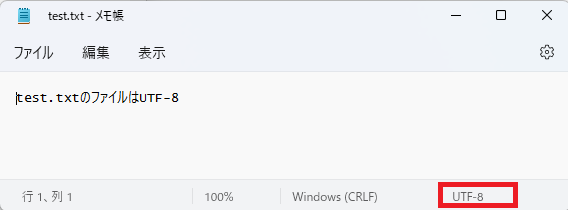
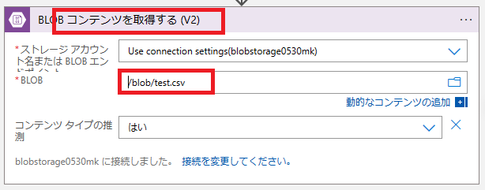
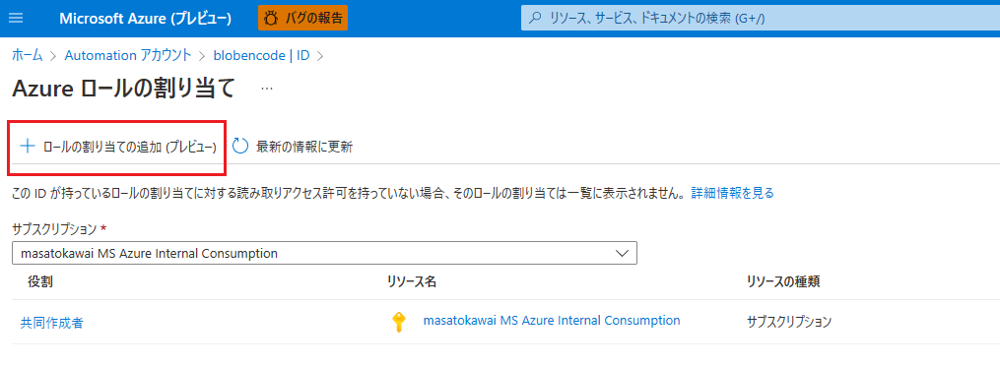
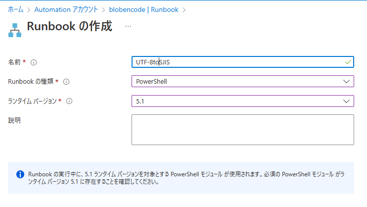

こんにちは！Azure Integration サポート チームの 川合 です。  

Azure Logic Apps でファイル コンテンツを取り扱う場合に文字コードを任意の文字コードに設定されたい場合があるかと思います。
しかしながら、Azure Logic Apps では文字コードを変更することが出来かねる仕様となっております。

例えば、以下のように Azure Portal のデザイナーからファイルを新規作成した場合はデザイナーの仕様上、ファイルは UTF-8 として作成されます。


作成されたファイル


一方、以下の "BLOB コンテンツを取得する (V2)" ように既に作成されているファイルをコンテンツとして取得した場合、元の文字コードが維持されます。例えば、"test.csv" の文字コードが SJIS だった場合、SJIS のコンテンツとして扱われ、Azure Logic Apps では文字コードを変更することが出来ません。


今回は Azure Logic Apps と Azure Automation を用いて、ファイルの文字コードを変更する小技をご案内しようと思います。
なお、本ブログでご案内する仕組みについてはあくまで参考情報となります。こちらをお客様の商用環境でご利用になる場合は十分にお客様環境で検証いただき、設計および製造、試験をお客様の責任で実施いただきますようお願い申し上げます。

<!-- more -->

## 目次
- 前提条件
- Azure Automation の設定方法とサンプルコード
- Azure Logic Apps の設定方法
- まとめ

## 前提条件
今回ご案内させていただく小技では、ファイルの格納先をストレージ アカウント (Blob コンテナー)とします。
また、Azure Automation ではストレージ アカウントのモジュールを有効にし、Runbook の種類として PowerShell (ランタイム バージョン 5.1) を利用します。
Azure Logic Apps については従量課金タイプを利用致します。

## Azure Automation の設定方法とサンプルコード
まず、Azure Automation で Automation アカウントを構築いただき、[アカウント設定] - [ID] より "システム割り当て済み" のマネージド ID の状態を オンにします。


その後、"ストレージ アカウント共同作成者" 等のストレージ アカウントを操作可能な権限を付与いたします。本構成では "共同作成者" の権限を付与しております。


次に、任意の名前で Runbook を作成いただきます。


＜設定値＞
・名前 : 任意
・Runbook の種類 : PowerShell
・ランタイム バージョン : 5.1 (2023/01/17 現在で 7.1 がプレビューであるため)
・説明 : 任意

作成できましたら、以下のサンプルコードを基にスクリプトを構築いたします。

・RunBook のサンプル（※こちらはあくまでもサンプルでございます。お客様の責任にて採用判断をお願いいたします。）
```
Param
(
  [Parameter (Mandatory= $true)]
  [String] $Blob,
  [Parameter (Mandatory= $true)]
  [String] $Container
)

# マネージド ID による認証
Disable-AzContextAutosave -Scope Process
$AzureContext = (Connect-AzAccount -Identity).context
Set-AzContext -SubscriptionName $AzureContext.Subscription -DefaultProfile $AzureContext

# Storage Acount information (任意のものに変更)
$resourceGroup = "●●●●" #ストレージアカウントのリソースグループ名 
$storageaccountName = "●●●●" #ストレージアカウント名

# ファイル変換設定
$CurrentPath = (pwd).path
$EncodeTo = "Shift-JIS"
$EncodingFrom = "UTF-8"
$inputFileName = "${CurrentPath}\${Blob}"
$outputFileName = "${CurrentPath}\SJIS_${Blob}"
# Get csv from Storage Account
$storageAccount = Get-AzStorageAccount -ResourceGroupName $resourceGroup -Name $storageaccountName
$ctx = $storageAccount.Context
Get-AzStorageBlobContent -Context $ctx -Blob $Blob -Container $Container -Path $CurrentPath

# Transform
$enc_t = [Text.Encoding]::GetEncoding($EncodeTo)
$enc_f = [Text.Encoding]::GetEncoding($EncodingFrom)

# 変換元ファイルをStreamReaderオブジェクトで読み込み
$reader = New-Object IO.StreamReader($inputFileName, $enc_f)

# 保存先ファイルをStreamWriterオブジェクトでオープン
$writer = New-Object IO.StreamWriter($outputFileName, $false, $enc_t)

# 変換元ファイルを順に読み込み、保存先ファイルに書き込み
while(!$reader.EndOfStream){$writer.WriteLine($reader.ReadLine())}

# ファイルをすべてクローズ
$reader.Close()
$writer.Close()

# Upload file
Set-AzStorageBlobContent -File ".\SJIS_${Blob}" -Container $Container -Blob "SJIS_${Blob}" -Context $ctx
```

以上のスクリプトをご利用いただくことで、ストレージ アカウントからファイルを取得し、文字コードを変更後にリネームして再度ストレージ アカウントへアップロードすることが可能でございます。

Azure Automation の設定としましては以上となります。

## Azure Logic Apps の設定方法
次に、Azure Logic Apps 側の設定となります。
本記事では従量課金タイプの Azure Logic Apps にて、以下のアクションを利用いたします。

- [Azure Automation # ジョブを作成する](https://learn.microsoft.com/ja-jp/connectors/azureautomation/#ジョブを作成する)

こちらの設定につきましては以下の通りの設定を実施いただきます。


＜設定値＞
・サブスクリプション : Azure Automation の Automation アカウントが存在するサブスクリプション。
・リソース グループ :  Azure Automation の Automation アカウントが存在するリソース グループ。
・Automation アカウント : 先ほど Runbook を作成した Automation アカウント
・ジョブの待機 : 任意
・Runbook 名 : 先ほど作成した Runbook
-- Runbook Parameter
・BLOB : 文字コードを変更したいファイル名。必要に応じて動的コンテンツでファイル名を指定願います。
・CONTAINER : Blob コンテナ名

以上より、先ほど作成した Runbook を Azure Logic Apps から呼び出すことが可能でございます。
こちらの ワークフローを実行することで、PowerShell で作り込める範囲には限りますが、既存のファイルに対して文字コードを変更することが可能でございます。

設定内容としては以上となります。
こちらを参考に、お客様の環境におきましても検証および設計試験等実施いただいたうえで採用要否についてご検討いただければと思います。


## まとめ
本記事では、以下についてご案内いたしましたが、ご理解いただけましたでしょうか。
- 前提条件
- Azure Automation の設定方法とサンプルコード
- Azure Logic Apps の設定方法

本記事が少しでもお役に立ちましたら幸いです。最後までお読みいただき、ありがとうございました！

<Azure Logic Apps の参考サイト>
-- 概要 - Azure Logic Apps とは
https://learn.microsoft.com/ja-jp/azure/logic-apps/logic-apps-overview
Azure Logic Apps とは、ロジック アプリ デザイナーでフロー チャートを用いて作成したワークフローを自動実行するソリューションです。
Azure Logic Apps では、条件分岐などを実装することができ、ワークフローの実行状況に応じて実行する処理を分岐することが可能です。
