こんにちは。Azure Integration サポート チームの髙橋です。

アラート発報時に Logic Apps を呼び出す方法について説明いたします。

<!-- more -->

## こんな方におすすめです
- ログ アラートやメトリック アラート発報時に、Logic Apps を起動したい方
- アクション グループの設定方法を知りたい方

## Azure Monitor のアクション グループ
Azure Monitor ではアラート ルールを設定し、特定のリソースを監視することができます。
- 参考ドキュメント : [新しいアラート ルールを作成する](https://learn.microsoft.com/ja-jp/azure/azure-monitor/alerts/alerts-create-new-alert-rule?tabs=metric)

アラートが発報したことをトリガーに、Logic Apps を起動させることが可能です。
アクション グループで Logic Apps を選択します。
- 参考ドキュメント : [Azure Portal でのアクション グループの作成および管理](https://learn.microsoft.com/ja-jp/azure/azure-monitor/alerts/action-groups)

具体的な設定方法は、以下になります。

1. Logic Apps 側を作成する。
Logic Apps にて「HTTP 要求の受信時」トリガーを設定している必要があります。
「HTTP 要求の受信時」トリガーの詳細につきましては、以下の公開情報もございます。
- 参考ドキュメント : [Azure Logic Apps のワークフローに送信された受信 HTTPS 要求を処理する # Request トリガーの追加](https://learn.microsoft.com/ja-jp/azure/connectors/connectors-native-reqres?tabs=consumption#add-a-request-trigger)
また、アクション グループでは、従量課金タイプの Logic Apps と Standard Logic Apps の両方をご設定いただけます。
**<従量課金タイプ>**
「HTTP 要求の受信時」トリガーを設定いたします。
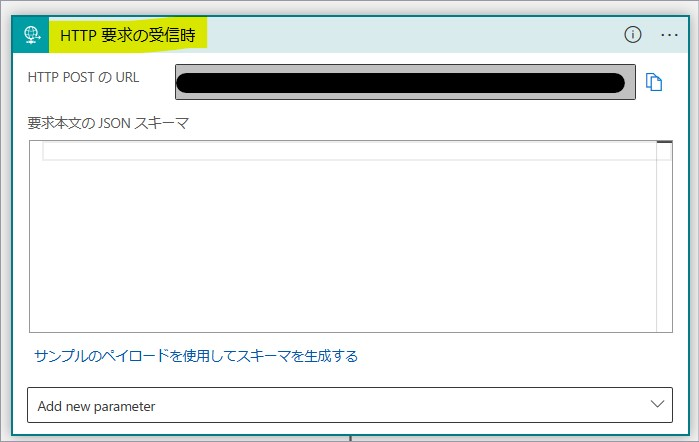
**<Standard タイプ>**
「Runtime」にて「アプリ内」にチェックを入れ、「Request」を選択いたします。
「When a HTTP request is received」トリガーを設定いたします。
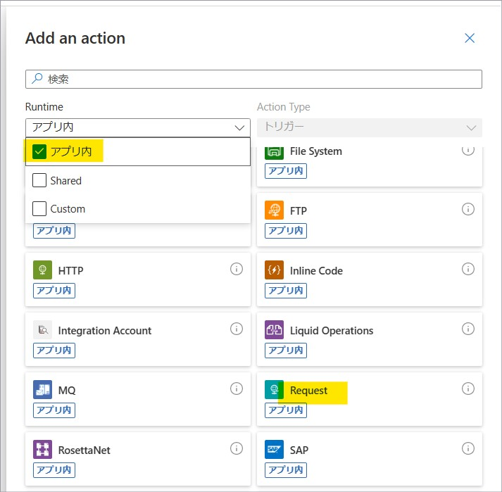

2. アクション グループを作成する。
[モニター] - [アラート] にて「アクション グループ」を選択します。
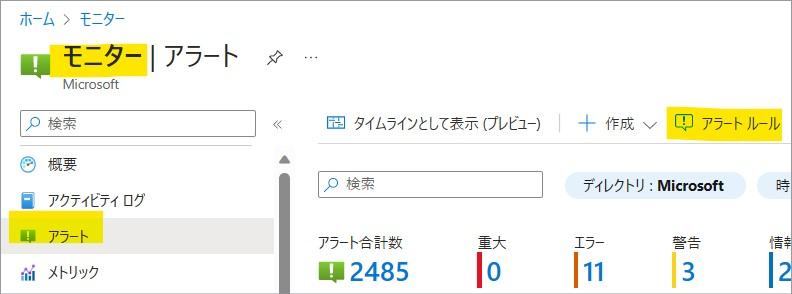
「 + 作成」を押下します。
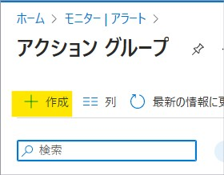
「基本」タブおよび「通知」タブを適宜設定し、「アクション」タブに遷移します。
「アクション タイプ」にて「ロジック アプリ」を選択します。
1 で作成した Logic Apps が存在するサブスクリプションおよびリソース グループをプルダウンで選択し、「ロジック アプリを選択します」にて対象の Logic Apps を選択します。
**<従量課金タイプ>**
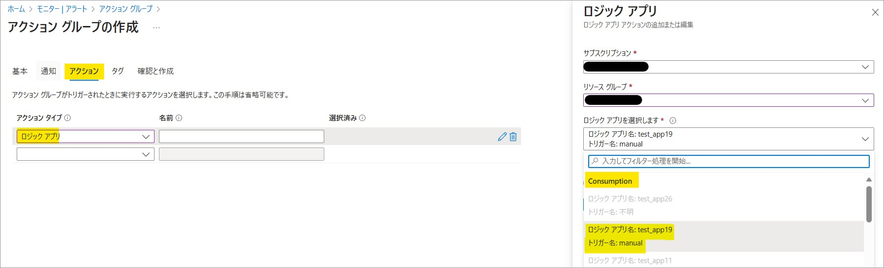
**<Standard タイプ>**

残りの設定を適宜行い、アクション グループを作成いたします。

### テスト実行
実際のアラートを発報せずに、アクション グループのテストを行うことが可能です。
- 参考ドキュメント : [Azure Portal でのアクション グループの作成および管理 # Azureポータルでアクショングループをテストする。](https://learn.microsoft.com/ja-jp/azure/azure-monitor/alerts/action-groups#test-an-action-group-in-the-azure-portal)

先ほどの手順で作成したアクション グループの [概要] を開き、「テスト」を押下します。


「サンプルの種類を選択」にて任意のアラートを選択し、「アクション タイプ」にてテストしたいアクションにチェックを入れ、「Test」ボタンを押下します。
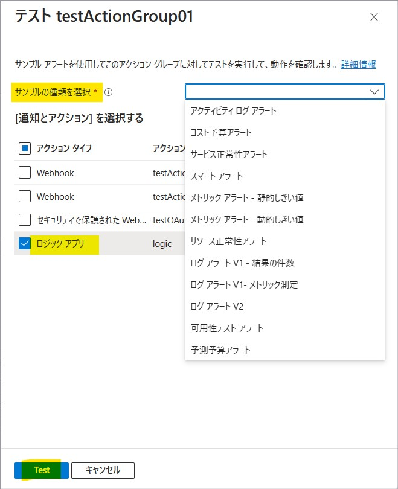

このとき利用されるスキーマは、共通アラート スキーマになります。
- 参考ドキュメント : [共通アラート スキーマ](https://learn.microsoft.com/ja-jp/azure/azure-monitor/alerts/alerts-common-schema)

以下はテストが成功した状態になります。
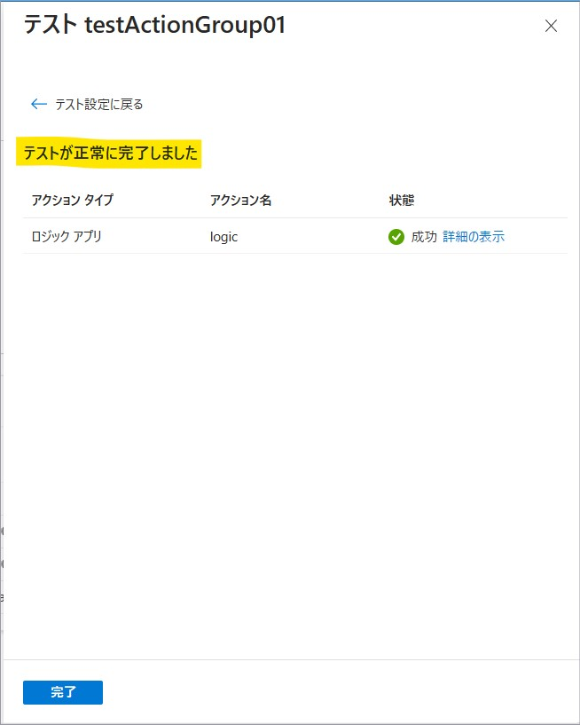

対象の Logic Apps の履歴を確認すると、トリガーが起動しています。
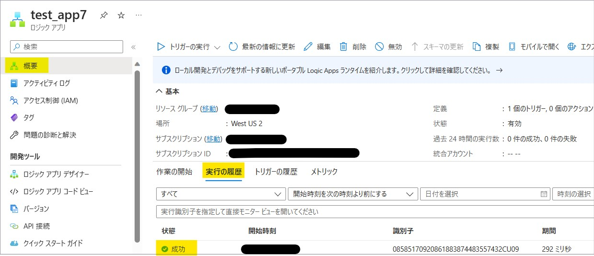

たとえば「ログ アラート V2」ですと、以下のようなスキーマが連携されます。
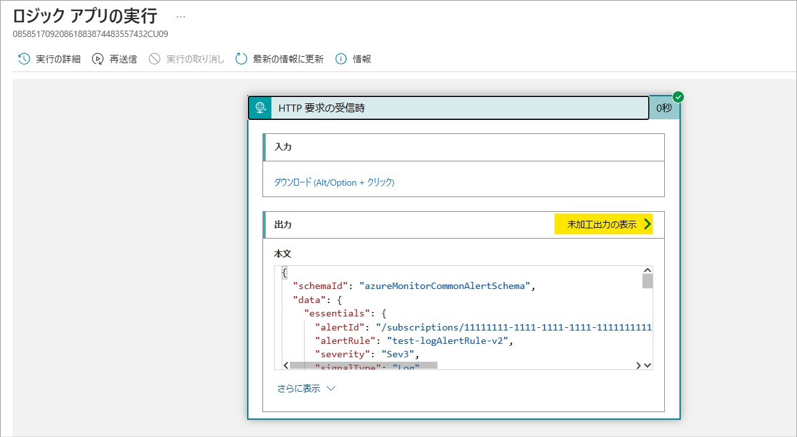

```json
{
  "schemaId": "azureMonitorCommonAlertSchema",
  "data": {
    "essentials": {
      "alertId": "/subscriptions/11111111-1111-1111-1111-111111111111/providers/Microsoft.AlertsManagement/alerts/12345678-1234-1234-1234-1234567890ab",
      "alertRule": "test-logAlertRule-v2",
      "severity": "Sev3",
      "signalType": "Log",
      "monitorCondition": "Fired",
      "monitoringService": "Log Alerts V2",
      "alertTargetIDs": [
        "/subscriptions/11111111-1111-1111-1111-111111111111/resourcegroups/test-RG/providers/microsoft.operationalinsights/workspaces/test-logAnalyticsWorkspace"
      ],
      "configurationItems": [
        "test-computer"
      ],
      "originAlertId": "22222222-2222-2222-2222-222222222222",
      "firedDateTime": "2023-05-19T16:46:38.738Z",
      "description": "Alert rule description",
      "essentialsVersion": "1.0",
      "alertContextVersion": "1.0"
    },
    "alertContext": {
      "properties": {
        "customKey1": "value1",
        "customKey2": "value2"
      },
      "conditionType": "LogQueryCriteria",
      "condition": {
        "windowSize": "PT1H",
        "allOf": [
          {
            "searchQuery": "Heartbeat",
            "metricMeasureColumn": null,
            "targetResourceTypes": "['Microsoft.OperationalInsights/workspaces']",
            "operator": "GreaterThan",
            "threshold": "0",
            "timeAggregation": "Count",
            "dimensions": [
              {
                "name": "Computer",
                "value": "test-computer"
              }
            ],
            "metricValue": 3,
            "failingPeriods": {
              "numberOfEvaluationPeriods": 1,
              "minFailingPeriodsToAlert": 1
            },
            "linkToSearchResultsUI": "https://portal.azure.com#@aaaaaaaa-aaaa-aaaa-aaaa-aaaaaaaaaaaa/blade/Microsoft_Azure_Monitoring_Logs/LogsBlade/source/Alerts.EmailLinks/scope/%7B%22resources%22%3A%5B%7B%22resourceId%22%3A%22%2Fsubscriptions%2F11111111-1111-1111-1111-111111111111%2FresourceGroups%2Ftest-RG%2Fproviders%2FMicrosoft.OperationalInsights%2Fworkspaces%2Ftest-logAnalyticsWorkspace%22%7D%5D%7D/q/aBcDeFgHiJkLmNaBcDeFgHiJkLmNaBcDeFgHiJkLmNaBcDeFgHiJkLmN1234567890ZAZBZiaGBlaG5lbKlnAAFRmnp6WNUZoqvTBAA%3D/prettify/1/timespan/2021-11-16T10%3a17%3a39.0000000Z%2f2021-11-16T11%3a17%3a39.0000000Z",
            "linkToFilteredSearchResultsUI": "https://portal.azure.com#@aaaaaaaa-aaaa-aaaa-aaaa-aaaaaaaaaaaa/blade/Microsoft_Azure_Monitoring_Logs/LogsBlade/source/Alerts.EmailLinks/scope/%7B%22resources%22%3A%5B%7B%22resourceId%22%3A%22%2Fsubscriptions%2F11111111-1111-1111-1111-111111111111%2FresourceGroups%2Ftest-RG%2Fproviders%2FMicrosoft.OperationalInsights%2Fworkspaces%2Ftest-logAnalyticsWorkspace%22%7D%5D%7D/q/aBcDeFgHiJkLmN%2Fl35oOTZoKioEOouaBcDeFgHiJkLmN%2BaBcDeFgHiJkLmN%2BaBcDeFgHiJkLmN7HHgOCZTR0Ak%2FaBcDeFgHiJkLmN1234567890Ltcw%2FOqZS%2FuX0L5d%2Bx3iMHNzQiu3Y%2BzsjpFSWlOzgA87vAxeHW2MoAtQxe6OUvVrZR3XYZPXrd%2FIE/prettify/1/timespan/2021-11-16T10%3a17%3a39.0000000Z%2f2021-11-16T11%3a17%3a39.0000000Z",
            "linkToSearchResultsAPI": "https://api.loganalytics.io/v1/workspaces/bbbbbbbb-bbbb-bbbb-bbbb-bbbbbbbbbbbb/query?query=Heartbeat%7C%20where%20TimeGenerated%20between%28datetime%282021-11-16T10%3A17%3A39.0000000Z%29..datetime%282021-11-16T11%3A17%3A39.0000000Z%29%29&timespan=2021-11-16T10%3a17%3a39.0000000Z%2f2021-11-16T11%3a17%3a39.0000000Z",
            "linkToFilteredSearchResultsAPI": "https://api.loganalytics.io/v1/workspaces/bbbbbbbb-bbbb-bbbb-bbbb-bbbbbbbbbbbb/query?query=Heartbeat%7C%20where%20TimeGenerated%20between%28datetime%282021-11-16T10%3A17%3A39.0000000Z%29..datetime%282021-11-16T11%3A17%3A39.0000000Z%29%29%7C%20where%20tostring%28Computer%29%20%3D%3D%20%27test-computer%27&timespan=2021-11-16T10%3a17%3a39.0000000Z%2f2021-11-16T11%3a17%3a39.0000000Z"
          }
        ],
        "windowStartTime": "2023-05-19T16:46:38.738Z",
        "windowEndTime": "2023-05-19T16:46:38.738Z"
      }
    }
  }
}
```
テスト実行ではサンプル データが利用されますので、実在するサブスクリプション ID やリソース グループは連携されません。

## Logic Apps 側のアクセス制限について
Logic Apps 側では、受信トラフィックに制限を設けるご想定の場合には、アクション グループからの通信を許可する必要があります。

**<従量課金タイプ>**
従量課金タイプの場合、[ロジック アプリ] - [<対象の ロジック アプリ>] - [設定 - ワークフロー設定] にて受信トラフィックに制限を設けることが可能です。
こちらでアクション グループが利用している IP アドレスを許可します。
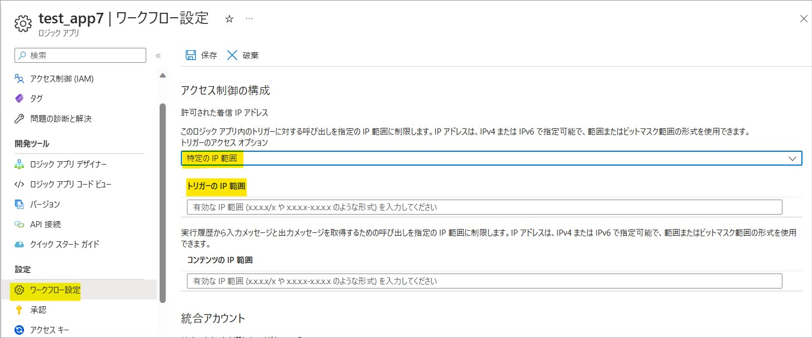

以下のダウンロード先より、アクション グループのサービス タグで利用されている IP アドレスを取得することが可能です。
- ダウンロード先 : [Azure IP Ranges and Service Tags – Public Cloud](https://www.microsoft.com/en-us/download/details.aspx?id=56519)

ダウンロードした JSON ファイルを開き、「ActionGroup」に該当する IP アドレスをすべて許可します。


**<Standard タイプ>**
Standard Logic Apps の場合、[ロジック アプリ] - [<対象の ロジック アプリ>] - [設定 - ネットワーク] と遷移し、「受信トラフィック」の「アクセス制限」を選択します。
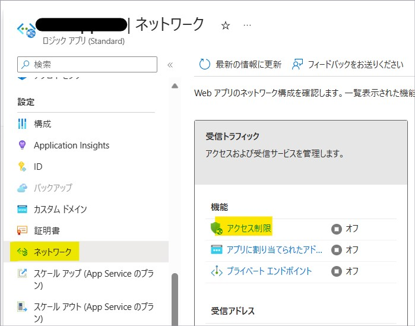

Standard Logic Apps では、サービス タグを利用してアクセス制限を行うことが可能です。

アクション グループからの通信を許可するためには、「ActionGroup」というサービス タグを許可するルールに追加する必要がございます。
- 参考ドキュメント : [Azure Monitor で使用される IP アドレス # アクション グループ サービス タグ](https://learn.microsoft.com/ja-jp/azure/azure-monitor/app/ip-addresses#action-group-service-tag)

以下のように許可ルールを追加いたします。
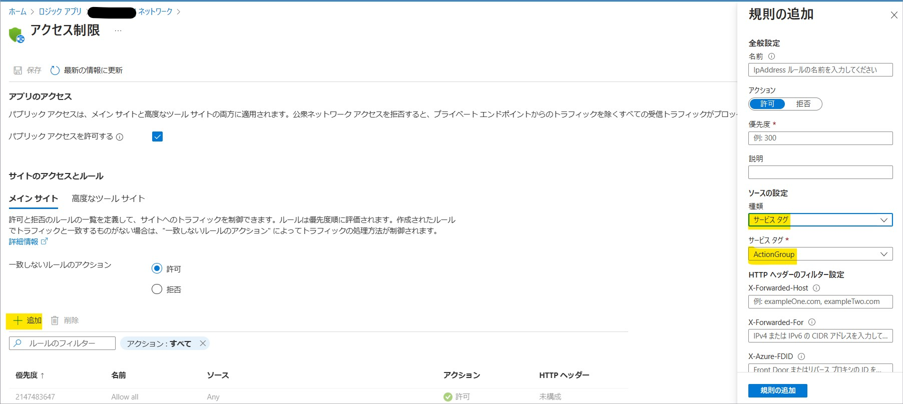

## まとめ
本記事では、Logic Apps の送信 IP アドレスについて説明いたしました。
本記事が少しでもお役に立ちましたら幸いです。