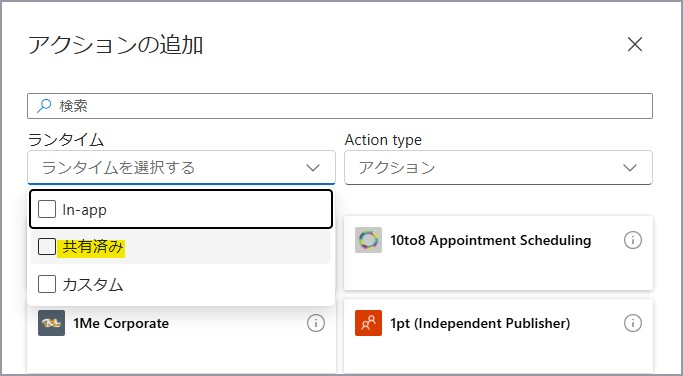
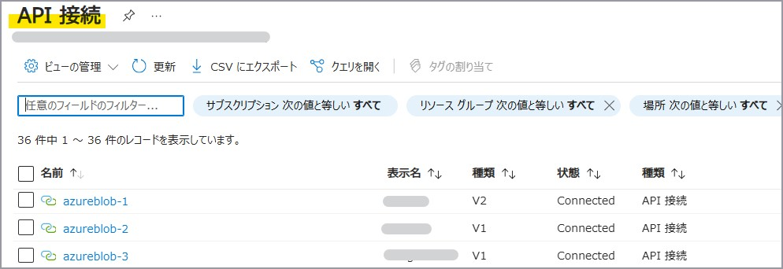
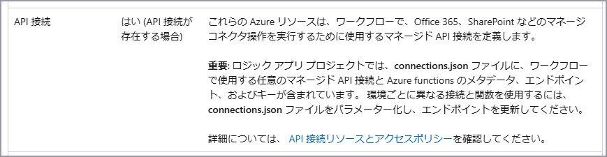
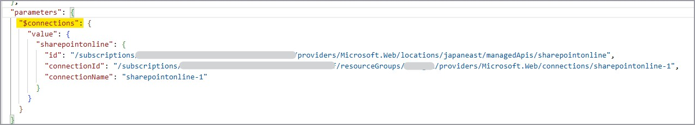
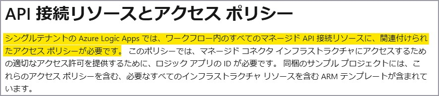
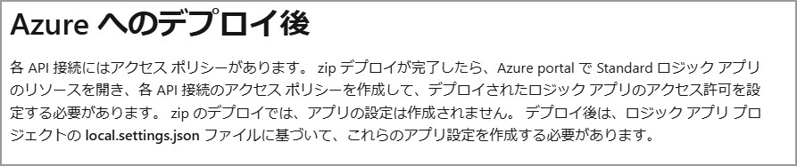
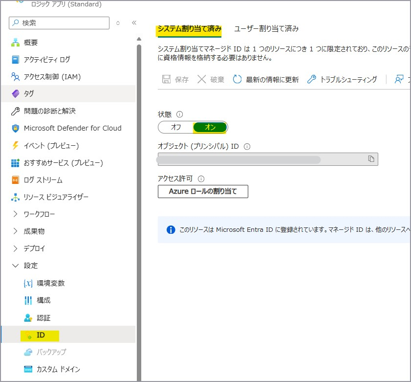

こんにちは。Azure Integration サポート チームの髙橋です。

Logic Apps の [API 接続] について説明いたします。

<!-- more -->

## 目次
- Logic Apps における [接続]
- Logic Apps のコネクタの種類
- 1. API 接続とは
- 2. 確認方法
- 3. 削除方法
- 4. デプロイ
- 5. [API 接続] が無効となる場合

## Logic Apps における [接続]
まず、Logic Apps における [接続] は、各トリガーやアクションの実行時に利用する認証情報を保持しておくものであり、従量課金タイプの Logic Apps と Standard タイプの Logic Apps とで以下のように異なります。
参考ドキュメント : [Azure portal でロジック アプリ ワークフローを管理する # 接続の表示](https://learn.microsoft.com/ja-jp/azure/logic-apps/manage-logic-apps-with-azure-portal?tabs=standard#view-connections)

具体的な確認方法につきましては、後述の [2. 確認方法] にて説明いたします。

### 1. 従量課金タイプ
[開発ツール - API 接続] にてご確認いただけます。

- API 接続

### 2. Standard タイプ
[ワークフロー - 接続] にてご確認いただけます。

- API 接続
- サービス プロバイダー接続
- 関数の接続

## Logic Apps のコネクタの種類
Logic Apps では、大きく 2 種類のコネクタのご用意があり、コネクタの種類によって利用される [接続] が異なります。

- 組み込み (built-in) コネクタ
参考ドキュメント : [Azure Logic Apps の組み込みコネクタ](https://learn.microsoft.com/ja-jp/azure/connectors/built-in)

トリガーやアクション追加時に、[In-app] にチェックを入れますとご確認いただけます。


- マネージド コネクタ
参考ドキュメント : [Azure Logic Apps のマネージド コネクタ](https://learn.microsoft.com/ja-jp/azure/connectors/managed)

トリガーやアクション追加時に、[共有済み] にチェックを入れますとご確認いただけます。


### ご参考情報
コネクタの種類によって送信 IP アドレスも異なります。
詳細につきましては以下のブログもご参照ください。
参考ドキュメント : [Logic Apps の送信 IP アドレスについて](https://jpazinteg.github.io/blog/LogicApps/outboundIpaddress/)

## 1. API 接続とは
本記事では [API 接続] について説明いたします。

従量課金 Logic Apps または Standard Logic Apps でマネージド コネクタをご利用の場合に、[API 接続] という別リソースが作成されます。

たとえば、[Office 365 Outlook] コネクタの [メールの送信 (V2)] アクションを追加した際に、以下のような画面が表示されます。
当該コネクタでは、ユーザーのサインイン情報を必要としますので、[サインイン] ボタンを押下し認証を行います。
※ ご利用いただける認証方法は、コネクタによって異なります。


これにより、[API 接続] という別リソースが自動的に作成され、認証情報を保持します。
各トリガーやアクションの実行時に、[API 接続] にて保持している認証情報が利用されます。

## 2. 確認方法
#### 2-1. 従量課金タイプ
対象の従量課金 Logic Apps 内で利用している [API 接続] は、[開発ツール - API 接続] にてご確認いただけます。


#### 2-2. Standard タイプ
対象の Standard Logic Apps 内で利用している [API 接続] は、[ワークフロー - 接続] の [API 接続] タブにてご確認いただけます。


#### 2-3. 一覧での確認
Azure ポータル上で [API 接続] と検索いただきますと、過去に作成されたすべての [API 接続] をご確認いただけます。


[種類] にて **V1** と表示されますのが従量課金 Logic Apps の [API 接続]、**V2** が Standard Logic Apps の [API 接続] になります。

## 3. 削除方法
#### 3-1. 従量課金タイプ
ご不要になりました [API 接続] の削除方法につきましては、過去のブログをご参照ください。
参考ドキュメント : [Azure Logic Apps の コネクタにおける不要な接続情報の削除方法について](https://jpazinteg.github.io/blog/LogicApps/ApiConnectionsDelete/)

#### 3-2. Standard タイプ
[API 接続] リソース自体の削除方法は従量課金タイプと同様となりますが、[API 接続] リソース自体の削除後も [ワークフロー - 接続] の [API 接続] タブにて表示され続けます。
[ワークフロー – 接続] の [JSON ビュー] タブを開き、"managedApiConnections" 配下にある対象の [API 接続] のプロパティを削除いただき、[保存] ボタンを押下いただくことで [API 接続] タブ表示からも削除されます。


[JSON ビュー] にてご確認いただける内容は、connections.json (*) に記載されております内容と同様になります。

(*) connections.json のご確認方法につきましては、以下をご参照ください。

参考ドキュメント : [シングルテナントの Azure Logic Apps に Standard ロジック アプリの DevOps デプロイを設定する # インフラストラクチャ リソースのデプロイ](https://learn.microsoft.com/ja-jp/azure/logic-apps/set-up-devops-deployment-single-tenant-azure-logic-apps?tabs=github#deploy-infrastructure-resources)
参考ドキュメント : [シングルテナントの Azure Logic Apps に Standard ロジック アプリの DevOps デプロイを設定する # ポータルから Standard ロジック アプリの成果物をダウンロードする](https://learn.microsoft.com/ja-jp/azure/logic-apps/set-up-devops-deployment-single-tenant-azure-logic-apps?tabs=github#download-standard-logic-app-artifacts-from-portal)

### 4. デプロイ
上述の通り、[API 接続] は Logic Apps のリソースとは別に存在するリソースですので、Logic Apps を別サブスクリプションや別テナントへデプロイ (コピー) する場合には、[API 接続] も別途デプロイが必要となります。
複数の [API 接続] をご利用の場合には、それぞれをデプロイする必要があります。
組み込みコネクタのみで構成されており、[API 接続] が紐づいていない Logic Apps におきましては [API 接続] のデプロイは不要です。

#### 4-1. 従量課金タイプ
Logic Apps 自体をデプロイするよりも先に、[API 接続] をデプロイします。
以下は ARM テンプレートを利用する場合についてとなります。
※ Logic Apps のデプロイ方法の詳細につきましては、一部割愛させていただいております。

1. [API 接続] の ARM テンプレートをエクスポートする
[Azure ポータル] - [API 接続] - [<対象の　API 接続>] - [オートメーション - テンプレートのエクスポート] ページへ移動します。
[パラメーターを含める] にチェックを入れ、[ダウンロード] を選択します。
ダウンロードした zip ファイル内の [template.json] が ARM テンプレートになります。
参考ドキュメント : [Azure portal を使用してテンプレートをエクスポートする # リソースからテンプレートをエクスポートする](https://learn.microsoft.com/ja-jp/azure/azure-resource-manager/templates/export-template-portal#export-template-from-a-resource)

2. ARM テンプレートを編集する
ARM テンプレート内に以下のような記述の API 接続のリソース ID が記述されています。
```
/subscriptions/{サブスクリプション ID}/resourceGroups/{リソースグループ名}/providers/Microsoft.Web/connections/{API 接続名}
```
サブスクリプション、リソースグループ名 に変更がある場合は、文字列置換にて移行先の情報に変更する必要があります。
例)
置換前 : 現行サブスクリプション ID
置換後 : 移行先サブスクリプション ID
システム割り当てマネージド ID を有効化されている Logic App の ARM テンプレートの場合、
ARM テンプレート内の [resources. Identity. principalId] および [resources. Identity. tenantId] を null にする必要もあります。

3. [API 接続] をデプロイする
[Azure ポータル] - [カスタム テンプレートのデプロイ] へ移動します。
[エディターで独自のテンプレートを作成します] を選択します。
デプロイする ARM テンプレートに差し替えます。(全選択頂きペーストで問題ございません。)
リソースグループを選択し、[確認と作成] を選択します。
[作成] を選択します。

4. Logic Apps をデプロイする
[API 接続] のデプロイ完了後に、Logic Apps のデプロイを行いますが、このとき Logic Apps 側の ARM テンプレートに記載されている [API 接続] の情報を、1.~3. で新しく作成したものに置き換えます。
"parameters" > "$connections" に [API 接続] の記載がございます。


5. [API 接続] の再認証を行う
API 接続はデプロイしただけでは認証に用いる認証情報が格納されていない状況となります。
この状況で Logic App でマネージド コネクタの処理を実行すると認証エラーになりますので、以下の手順にて再認証を実施頂く必要があります。
[Azure ポータル] - [API 接続] - [<対象の API 接続>] - [全般 - API 接続の編集] ページへ移動します。
[承認する] を選択します。(*)
画面の指示に従い再認証手順をご実施頂きます。
[保存] を選択します。

(*) たとえば、[Azure Blob Storage] コネクタでアクセス キー認証をご利用の場合には、[Azure Storage アカウント名または BLOB エンドポイント] および [Azure ストレージ アカウントのアクセス キー] の入力が必要となります。
各コネクタでの認証方法によって、再認証に必要な作業が異なりますのでご注意ください。

#### 4-2. Standard タイプ
1. [API 接続] をデプロイする
従量課金タイプと同様の方法にて、まず [API 接続] を先にデプロイします。
参考ドキュメント : [シングルテナントの Azure Logic Apps に Standard ロジック アプリの DevOps デプロイを設定する # Azure にリリースする前に](https://learn.microsoft.com/ja-jp/azure/logic-apps/set-up-devops-deployment-single-tenant-azure-logic-apps?tabs=github#before-you-release-to-azure)

2. Standard Logic Apps をデプロイする
ARM テンプレート等を用いて Standard Logic Apps (基盤側) をデプロイします。
※ Standard Logic Apps の場合ですと、この他ストレージ アカウントや App Service Plan 、必要に応じて Application Insights や VNet 等のデプロイも必要ですが、本記事では説明を割愛させていただきます。

3. zip デプロイを行う
zip デプロイによってワークフロー (アプリケーション側) をデプロイすることが可能です。
zip デプロイに利用する zip ファイルは、移行元の Standard Logic Apps の [概要] より取得いただけます。
[アプリ コンテンツのダウンロード] ボタンを押下します。
[ダウンロード] ボタンを選択し、zip ファイルをダウンロードします。

このとき、zip ファイルには [API 接続] 等の接続情報を保持している connections.json ファイルが含まれております。
connections.json ファイルの内容を、1. で新しく作成した [API 接続] の情報をもとに編集します。
新しく作成した [API 接続] の [全般 - プロパティ] を開き、[接続ランタイム URL] および [リソース ID] をコピーして控えておきます。

connections.json ファイルを開き、"managedApiConnections" 配下に [API 接続] の情報がありますので、"connectionRuntimeUrl" の値に控えておいた [接続ランタイム URL] をペーストします。
また、"connection" > "id" に、[リソース ID] の値を置き換えます。
その他の箇所において connections.json 内のサブスクリプション ID やリソース グループ名も移行先のものに置き換えてください。
以下の手順に従い、zip デプロイを行います。
参考ドキュメント : [シングルテナントの Azure Logic Apps に Standard ロジック アプリの DevOps デプロイを設定する # Azure へのリリース](https://learn.microsoft.com/ja-jp/azure/logic-apps/set-up-devops-deployment-single-tenant-azure-logic-apps?tabs=azure-cli#release-to-azure)

4. [API 接続] の再認証を行う
従量課金タイプと同様の方法にて、[API 接続] の再認証を行います。

4. アクセス ポリシーを追加する
各 [API 接続] には、アクセス ポリシーがあります。
新しくデプロイした Standard Logic Apps に対して、アクセス ポリシーを付与する必要があります。
参考ドキュメント : [シングルテナントの Azure Logic Apps に Standard ロジック アプリの DevOps デプロイを設定する # API 接続リソースとアクセス ポリシー](https://learn.microsoft.com/ja-jp/azure/logic-apps/set-up-devops-deployment-single-tenant-azure-logic-apps?tabs=github#api-connection-resources-and-access-policies)

参考ドキュメント : [シングルテナントの Azure Logic Apps に Standard ロジック アプリの DevOps デプロイを設定する # Azure へのデプロイ後](https://learn.microsoft.com/ja-jp/azure/logic-apps/set-up-devops-deployment-single-tenant-azure-logic-apps?tabs=azure-cli#release-to-azure)

新しく作成した [API 接続] を開き、[設定 - アクセス ポリシー] にて [+ 追加] ボタンを押下します。

新しく作成した Standard Logic Apps 名を検索し、アクセス ポリシーを追加します。
※ アクセス ポリシーを割り当てるためには、Standard Logic Apps のマネージド ID が有効化されている必要があります。


## 5. [API 接続] が無効となる場合
[API 接続] が無効となり、トリガーやアクションの実行が失敗する場合があります。
以下、よくお問い合わせいただく事例についてご紹介いたします。

### 5-1. ユーザー情報によるサインインで認証を行う場合
[API 接続] が無効となるケースについては以下が考えられます。
参考ドキュメント : [Power Automate で接続が「無効な接続」になる原因 # Power Automate で「無効な接続」と表示される原因](https://jpdynamicscrm.github.io/blog/powerautomate/Invalid-Connection/#Power-Automate-%E3%81%A7%E3%80%8C%E7%84%A1%E5%8A%B9%E3%81%AA%E6%8E%A5%E7%B6%9A%E3%80%8D%E3%81%A8%E8%A1%A8%E7%A4%BA%E3%81%95%E3%82%8C%E3%82%8B%E5%8E%9F%E5%9B%A0)

※ 上記は Logic Apps の類似製品である Power Automate 側のブログを参照しております。
ユーザー情報によるサインインで認証を行っているマネージド コネクタの実行にて、[Unauthorized] エラーが発生した場合には上記のような要因が考えられますので一度ご確認いただけますと幸いです。
もしエラー内容等からご判断が難しい場合には、Azure ポータルより **Logic Apps 観点** でお問い合わせください。

### 5-2. マネージド ID 認証の場合
一例となりますが、たとえば対象の Logic Apps のマネージド ID を一度無効化し、再度有効化しますとマネージド ID のオブジェクト ID が刷新されますので、
改めて新しいマネージド ID に対して必要なロールを付与する必要があります。

### 5-3. サービス プリンシパル認証の場合
一例となりますが、シークレットの有効期限切れによって接続が無効となります。

## まとめ
本記事では、Logic Apps で利用される [API 接続] についてご案内いたしました。
本記事が少しでもお役に立ちましたら幸いです。
