こんにちは。Azure Integration サポート チームの髙橋です。

「Azure Monitor Logs」コネクタのクエリ実行に関わる制約についてご説明いたします。

<!-- more -->

## こんな方におすすめです
- 「Azure Monitor Logs」コネクタのクエリ実行に関わる制約を確認されたい方
- 「Azure Monitor Logs」コネクタのクエリ実行に関わる制約の回避方法を知りたい方

## 関連情報
- 「Azure Monitor Logs」コネクタについては、以下の公開情報がございます。
  - 参考ドキュメント : [Azure Monitor Logs](https://learn.microsoft.com/ja-jp/connectors/azuremonitorlogs/)

- 「Azure Monitor Logs」コネクタを使った実装例については、以下の公開情報がございます。
  - 参考ドキュメント : [Logic Apps を使用した Log Analytics ワークスペースからストレージ アカウントへのデータのエクスポート](https://learn.microsoft.com/ja-jp/azure/azure-monitor/logs/logs-export-logic-app)

## 制約
「Azure Monitor Logs」コネクタには、以下の制約事項がございます。

- 参考ドキュメント : [Logic Apps および Power Automate の Azure Monitor Logs コネクタ # コネクタの制限](https://learn.microsoft.com/ja-jp/azure/azure-monitor/logs/logicapp-flow-connector#connector-limits)

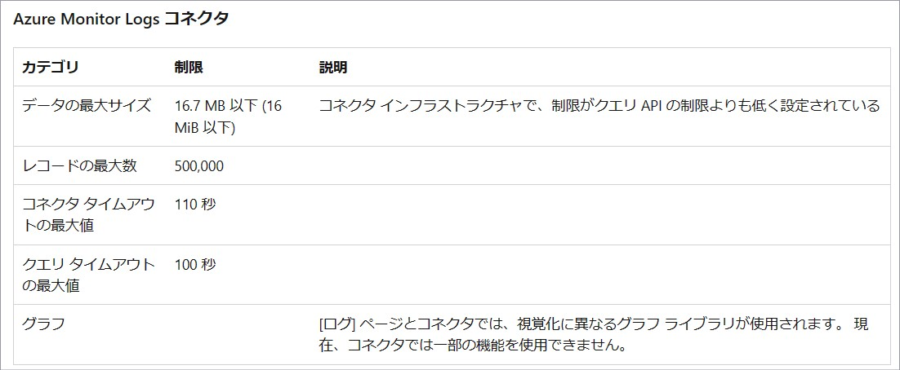
- 参考ドキュメント : [Azure Monitor サービスの制限 # Log Analytics ワークスペース # Azure Monitor Logs コネクタ](https://learn.microsoft.com/ja-JP/azure/azure-monitor/service-limits#log-analytics-workspaces)

※ Azure Monitor Logs コネクタはデータを圧縮した形式で通信いたします。
上記のデータ容量の制限は圧縮した状態でのデータ容量に関する制限となります。
そのため、ワークフローの実行履歴からダウンロードした場合や、ファイルとして出力した際の容量とは異なるものとなります。

## 制約に抵触した場合の動作
件数やサイズの制約を超える結果を取得した場合には、**エラーは発生せずに**結果が省かれて返却される動作となります。
また、「クエリ タイムアウトの最大値」を超えた場合には、「RequestTimeout (408)」エラーが発生いたします。

## 回避策 1 - クエリの工夫
以下の公開情報に記載がございますように、一度に取得されるログが制約に抵触しない範囲となるよう、クエリを工夫いただく方法になります。

- 参考ドキュメント : [Logic Apps および Power Automate の Azure Monitor Logs コネクタ # コネクタの制限](https://learn.microsoft.com/ja-jp/azure/azure-monitor/logs/logicapp-flow-connector#connector-limits)

たとえば、時間範囲を狭めることや project 演算子を利用して、一度に取得されるデータを小さくする方法が考えられます。
- 参考ドキュメント : [project 演算子](https://learn.microsoft.com/ja-jp/azure/data-explorer/kusto/query/projectoperator)

「クエリ」にて where 句を用いた時間範囲の指定を行いますと、「時間範囲」にて「クエリで設定」を選択することが可能でございます。
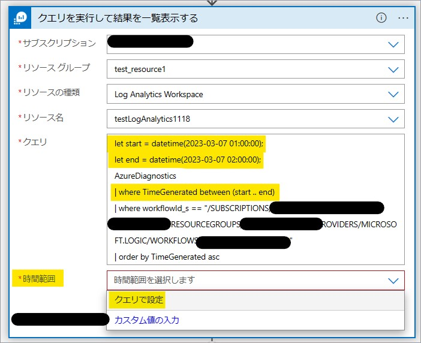

※ 「Set in query」と表示される場合もございます。
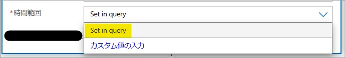

※ もし「クエリ」にて where 句を用いて時間範囲指定を行っているにも関わらず、「クエリで設定」や「Set in query」という選択肢が表示されない場合には、「カスタム値の入力」を選択して直接「Set in query」と入力してください。

「まで」アクションや「For each」アクション等のループ処理を利用して、繰り返しクエリを実行する方法が考えられます。
- 参考ドキュメント : [Azure Logic Apps 内のワークフロー アクションを繰り返す、または配列を処理するループを作成する # "Foreach" ループ](https://learn.microsoft.com/ja-jp/azure/logic-apps/logic-apps-control-flow-loops#foreach-loop)
- 参考ドキュメント : [Azure Logic Apps 内のワークフロー アクションを繰り返す、または配列を処理するループを作成する # "Until" ループ](https://learn.microsoft.com/ja-jp/azure/logic-apps/logic-apps-control-flow-loops#until-loop)

## 回避策 2 - REST API の利用
「クエリを実行して結果を一覧表示する」アクションの代わりとして、「HTTP」アクションにて以下の REST API を利用する方法もございます。
- 参考ドキュメント : [Query - Execute](https://learn.microsoft.com/ja-jp/rest/api/loganalytics/dataaccess/query/execute?tabs=HTTP)

**注意点**
当該 REST API にも別途制約がございますので、この点につきましてご留意ください。
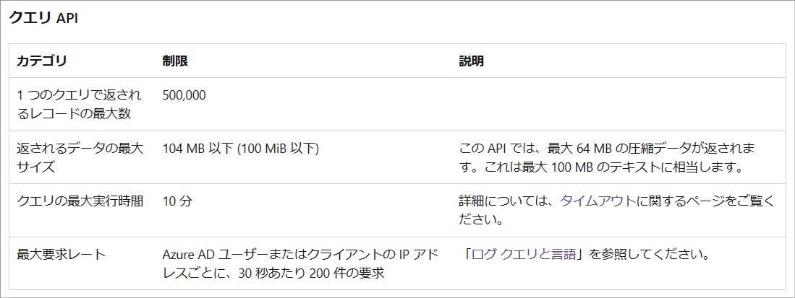
- 参考ドキュメント : [Azure Monitor サービスの制限 # Log Analytics ワークスペース # クエリ API](https://learn.microsoft.com/ja-JP/azure/azure-monitor/service-limits#log-analytics-workspaces)

また、Logic Apps 自体の制約もございますので、こちらもご確認ください。
- 参考ドキュメント : [Azure Logic Apps の制約と構成の参考文献](https://learn.microsoft.com/ja-jp/azure/logic-apps/logic-apps-limits-and-config?tabs=consumption%2Cazure-portal)

「クエリを実行して結果を一覧表示する」アクションから得られるデータの形式は「カラム名：値」ですが、
当該 REST API から得られるデータは形式が異なりますので、この点につきましてもご留意ください。
※ こちらにつきましては、後半に整形方法の一例をご案内しております。

「クエリを実行して結果を一覧表示する」アクションから得られるデータ
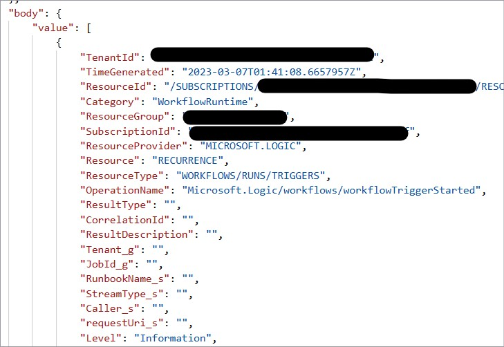

REST API で得られるデータ
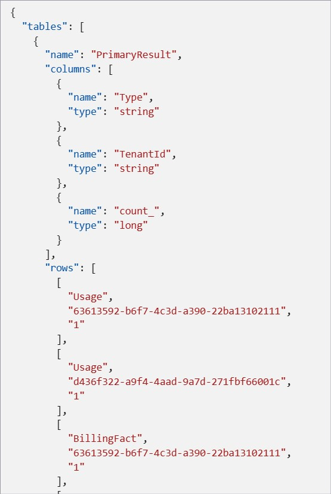
- 参考ドキュメント : [Query - Execute # Sample Response](https://learn.microsoft.com/ja-jp/rest/api/loganalytics/dataaccess/query/execute?tabs=HTTP#cross-workspace)

**REST API の実行方法**
以下に REST API の実行方法につきましてご案内いたします。
※ 従量課金タイプの Logic Apps を例としております。

1. Logic Apps のマネージド ID を有効化する。
[ロジック アプリ] - [<対象の ロジック アプリ>] - [設定 - ID] と遷移し、「システム割り当て済み」タブにて「状態」を「オン」とし、「保存」を押下します。
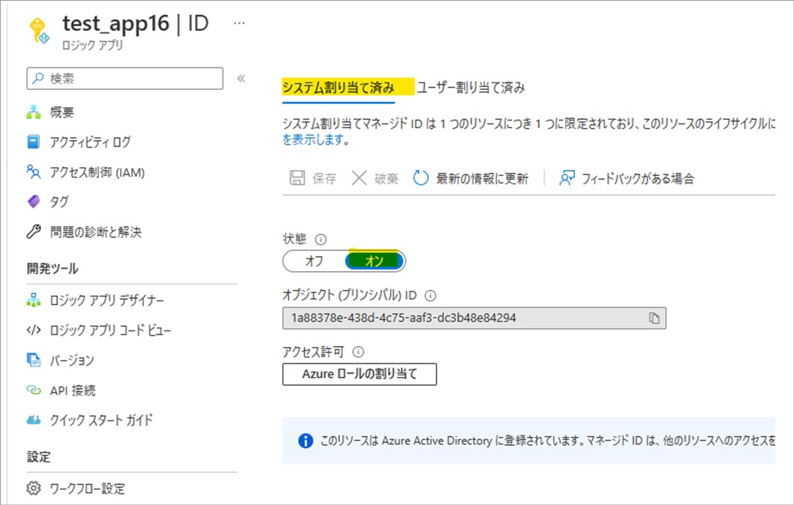

2. Log Analytics ワークスペースのロールを付与する。
1 で有効化されたマネージド ID に対して、ロールを付与します。
[Log Analytics ワークスペース] - [<対象の Log Analytics ワークスペース>] - [アクセス制御 (IAM)] と遷移し、「+ 追加」を押下して「ロールの割り当ての追加」を選択します。
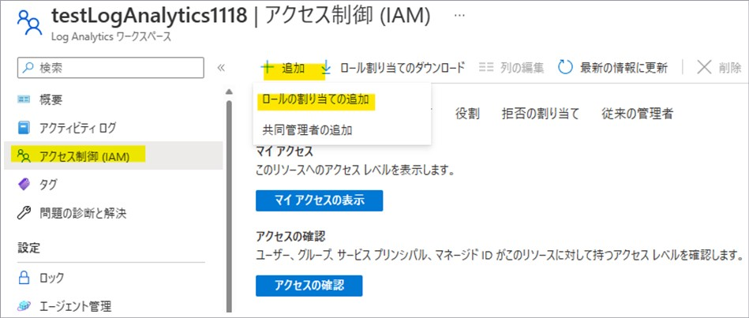
「ロール」タブにて「監視閲覧者」ロールを選択します。
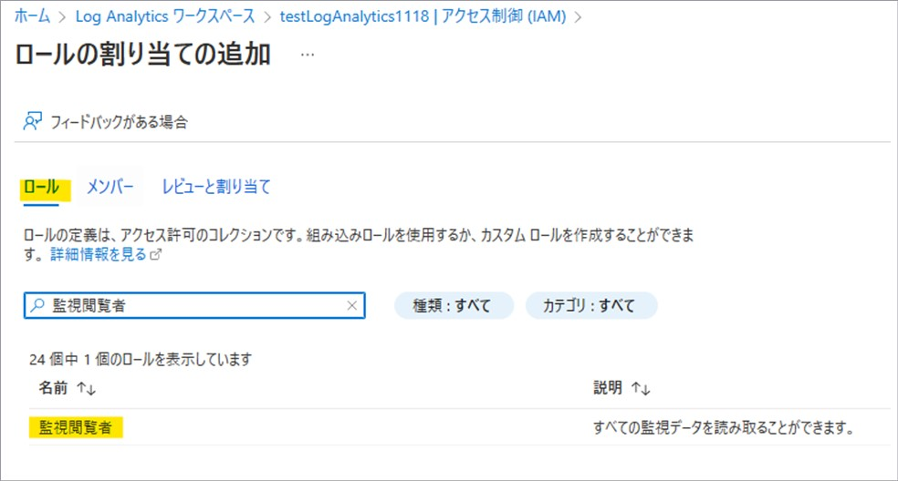
- 参考ドキュメント : [Azure 組み込みロール # Monitoring Reader](https://learn.microsoft.com/ja-jp/azure/role-based-access-control/built-in-roles#monitoring-reader)
- 参考ドキュメント : [Azure Monitor でのロール、アクセス許可、セキュリティ # 組み込みの監視の役割](https://learn.microsoft.com/ja-jp/azure/azure-monitor/roles-permissions-security#built-in-monitoring-roles)
「メンバー」タブにて「アクセスの割り当て先」に「ユーザー、グループ、またはサービス プリンシパル」を選択し、「+ メンバーを選択する」を押下します。
1 でマネージド ID を有効化した Logic Apps を検索・選択します。
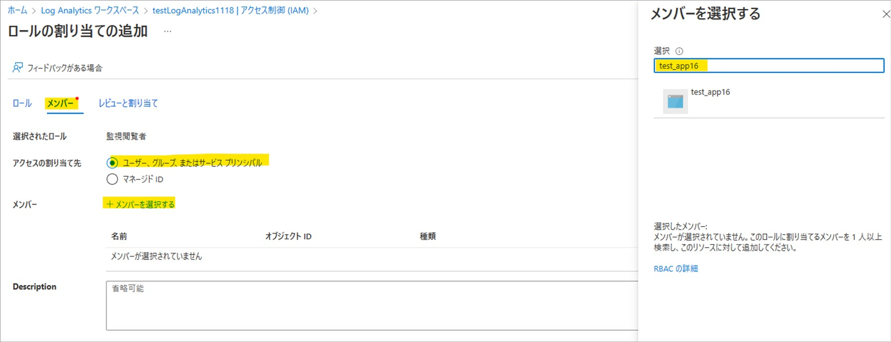
割り当てを完了します。
※ 割り当てに少しお時間がかかる場合がございます。
 
3. 「HTTP」アクションを設定する。
[ロジック アプリ] - [<対象の ロジック アプリ>] - [開発ツール - ロジック アプリ デザイナー] と遷移し、「HTTP」アクションを追加します。
以下の REST API を実行するために、各設定を行います。
- 参考ドキュメント : [Query - Execute](https://learn.microsoft.com/ja-jp/rest/api/loganalytics/dataaccess/query/execute?tabs=HTTP)

・方法：POST
・URI：https://api.loganalytics.io/v1/workspaces/{workspaceId}/query … (※1)
・本文：クエリを設定します。 … (※2)
・認証 (「Add new parameter」を押下し、「認証」にチェックを入れます。)
　・認証の種類：マネージド ID
　・マネージド ID：システム割り当てマネージド ID
　・対象ユーザー：https://api.loganalytics.io/
※1 workspaceId は、[Log Analytics ワークスペース] - [<対象の Log Analytics ワークスペース>] - [設定 - エージェント管理] にて、ご確認いただけます。

※2 クエリをご設定いただく際、クエリ内にダブルクォーテーションを使用しますと、有効な JSON として認識されない場合がございますので、ダブルクォーテーションの前に「\」をご設定ください。

**データの整形**
「選択」アクションを利用することで、「クエリを実行して結果を一覧表示する」アクションと同様のデータ形式に整形することが可能です。
- 参考ドキュメント : [Azure Logic Apps でデータの操作を実行する # 選択アクション](https://learn.microsoft.com/ja-jp/azure/logic-apps/logic-apps-perform-data-operations#select-action)

※ 以下にてご案内いたしますのは、あくまでサンプルでございます。お客様のご要件に合わせまして適宜ご変更いただき、
実運用に向けましたテストやハンドリングにつきましては、お客様ご自身にてご実施いただきますようお願い申し上げます。

「選択」アクションは以下のように入力します。
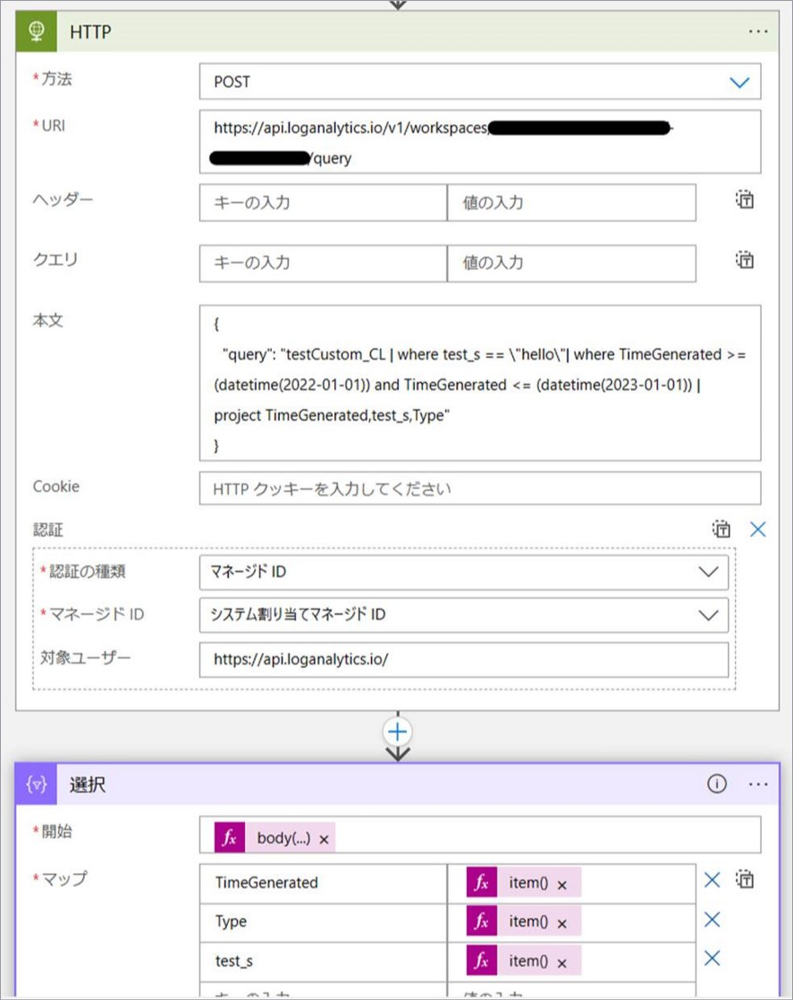

・開始 : 式「body('HTTP')?['tables'][0]?['rows']」
・マップ :
　・TimeGenerated：式「item()[0]」
　・Type：式「item()[1]」
　・test_s：式「item()[2]」
 
使用しております body 関数および item 関数につきましては、以下の公開情報もございます。
- 参考ドキュメント : [body](https://learn.microsoft.com/ja-jp/azure/logic-apps/workflow-definition-language-functions-reference#body)
- 参考ドキュメント : [item](https://learn.microsoft.com/ja-jp/azure/logic-apps/workflow-definition-language-functions-reference#item)
 
※ 「動的なコンテンツの追加」を押下し、「式」タブにて各式をご設定いただき「OK」ボタン (以下のスクリーンショットの「更新」ボタンにあたります) を選択します。
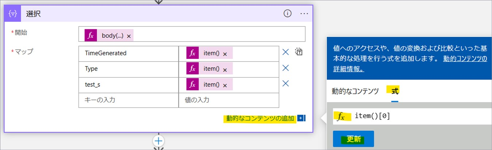

結果として、以下のデータを得ることができます。
```json
[
  {
    "TimeGenerated": "2022-12-22T01:18:36.023709Z",
    "Type": "testCustom_CL",
    "test_s": "hello"
  },
  {
    "TimeGenerated": "2022-12-22T01:19:51.6295168Z",
    "Type": "testCustom_CL",
    "test_s": "hello"
  }
]
```

なお、大変申し訳ございませんが、columns の長さに応じて動的に「選択」アクションの「マップ」パラメーターの行を変更する機能はございません。

## まとめ
本記事では、「Azure Monitor Logs」コネクタの制約と、その制約の回避策についてご案内いたしました。
本記事が少しでもお役に立ちましたら幸いです。