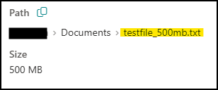
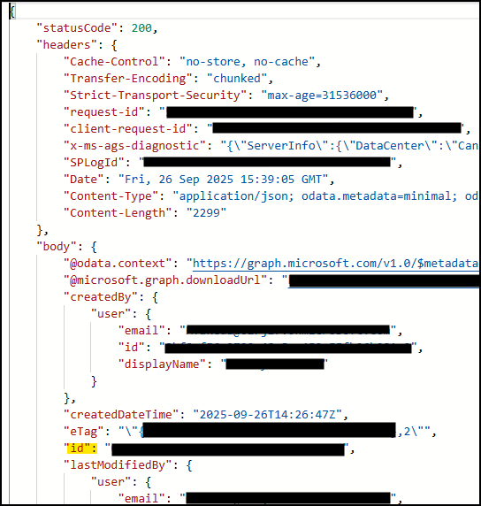
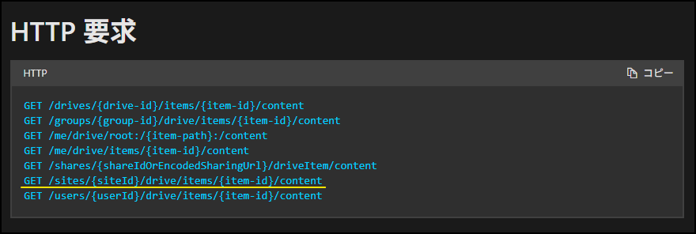
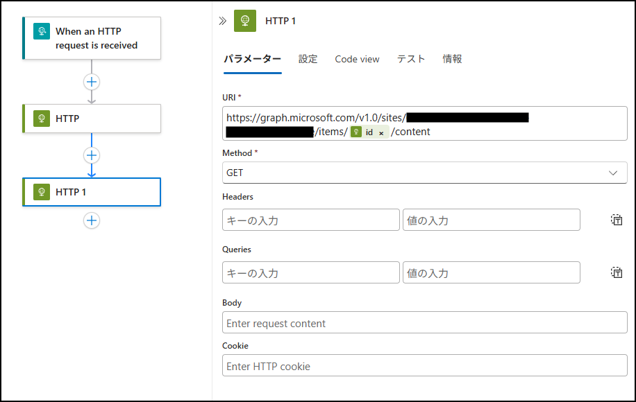
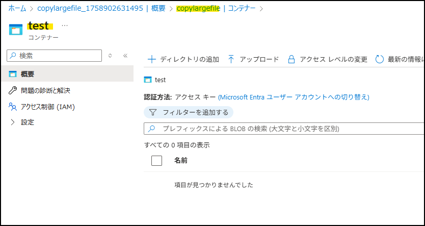
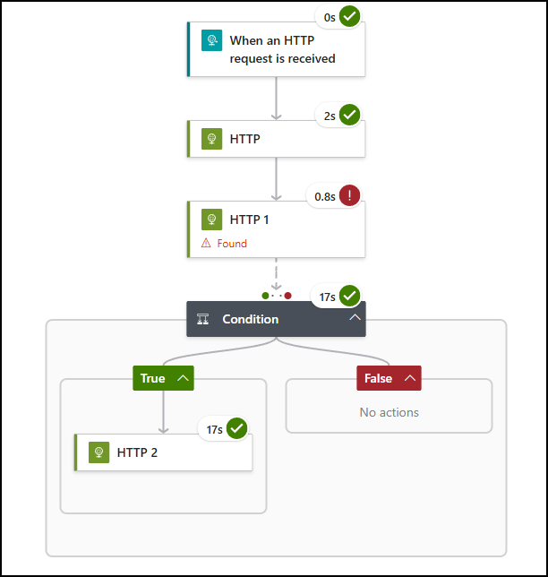
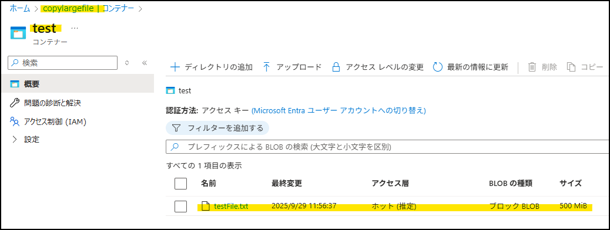
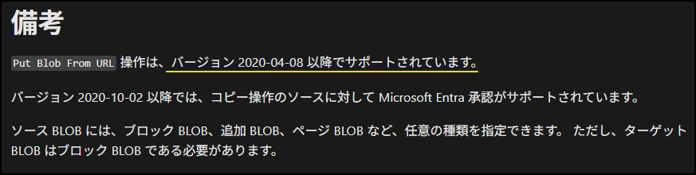
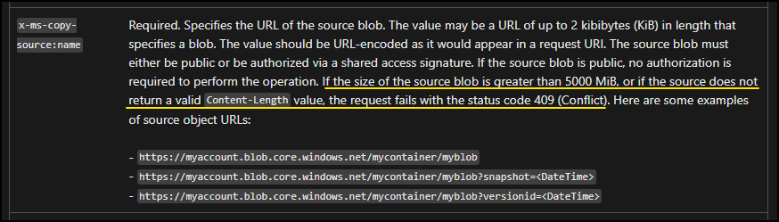

こんにちは！ Azure Integration サポート チームの 武田 です。 
頻繁にいただくお問い合わせに、SharePoint Online からファイルを取得して Azure Blob Storage にアップロードしたいけれど、ファイルサイズが大きいためにコネクタを使用できない、というものがございます。
そこで今回は、SharePoint Online から Azure Blob Storage へ、大容量ファイルをコピーする方法を紹介させていただきます。

<!-- more -->

## 目次
- 処理の流れ
- Graph API を使用するための前準備
- 取得するファイルの itemID を取得する
- Graph API を使用してダウンロード URL を取得する
- URL を使用して、Azure Blob Storage に BLOB を作成する
- 実行結果の確認
- 留意点
- まとめ

<br/>

## 処理の流れ
具体的な設定方法をご案内する前に、簡単に処理の流れをご案内します。
本手順の処理は、大きく以下の 3 つに分けることができます。

1. SharePoint Online から取得するファイルの、itemId を取得する
2. Graph API を使用して、1 のファイルをダウンロードする URL を発行する
3. 2 で発行した URL を使用して、Azure Blob Storage に BLOB を作成する

詳細な設定手順は各項目でご説明致しますが、まずは上記のような流れで処理を行いますこと、お心に留めていただけますと幸いです。

<br/>

## Graph API を使用するための前準備
本手順には、Graph API を使用する手順が含まれます。
Graph API を使用するためにはアクセス許可を付与する必要がございますため、事前にその設定をしておく必要がございます。
この設定方法については、当ブログの別記事にて詳細にご案内しております。
後述する手順を実行される前に、上記ブログを参照の上、あらかじめ Graph API 実行のためのアクセス許可をご設定ください。

- [Logic Apps から Graph API を実行する | Japan Azure Integration Support Blog](https://jpazinteg.github.io/blog/LogicApps/Integration-graphApi/)

付与いただくアクセス権は以下の通りです。
今回使用する Graph API、「driveItem コンテンツのダウンロード」で必要とされるアクセス許可は、以下のいずれかとなります。
お客様のご要件に合わせて付与するアクセス許可を選定ください。


<br/>

## 取得するファイルの itemID を取得する
本記事では、SharePoint Online から任意のファイルをダウンロードするのに、「driveItem コンテンツのダウンロード」という Graph API を使用します。
この Graph API を使用するには、ダウンロードするファイルの siteId、driveId および itemId がわかっている必要があります。
このうち siteId と driveId は通常固定となりますため、あらかじめ確認して固定値ないしはパラメーター等に設定することが可能ですが、ファイルごとに変わる itemId は都度取得する必要がございます。

<b>siteId と driveId の取得方法</b>
外部資料ではございますものの、以下サイトをご参照ください。

 - [【SharePoint】Microsoft GraphでサイトID, ドライブID, アイテムIDを調べる方法 #GraphAPI - Qiita](https://qiita.com/kyohets/items/d8d90ed5e398469fffd5)

<b>itemId の取得方法</b> 
SharePoint Online から、取得対象のファイルの itemId を取得してみます。
今回は、SharePoint Online より、こちらの 500 MB のファイルを取得するものとします。


itemId の取得につきましては、次の URI を [HTTP] アクションに設定ただくことで取得可能です。
```
https://graph.microsoft.com/v1.0/sites/{siteId}/drives/{driveId}/root:/{fileName}
```

上記形式に落とし込んだ URL が正しく実行できるかは、Graph Exolorer よりご確認いただくことが可能です。
[HTTP] アクションにご設定をいただきます前に、まずは Graph Explorer を使用して記述内容に問題がないかを確認することを、強くお勧めいたします。

 - [Graph Explorer | Try Microsoft Graph APIs - Microsoft Graph](https://developer.microsoft.com/en-us/graph/graph-explorer)


上記を踏まえた、itemid を取得するための [HTTP] アクションの設定がこちらです。
詳細パラメーターより設定する Authentication については、「Graph API を使用するための前準備」でご案内している内容に準拠しますため割愛します。


当アクションの実行結果は以下です。
body 直下にある「id」の値が、今回使用する itemId の値でございます。


<br/>

## Graph API を使用してダウンロード URL を取得する
取得対象のファイルの itemId が取得できましたので、Graph API「driveItem コンテンツのダウンロード」を使用して、対象のファイルのダウンロード URL を取得します。

 - [driveItem コンテンツのダウンロード - Microsoft Graph v1.0 | Microsoft Learn](https://learn.microsoft.com/ja-jp/graph/api/driveitem-get-content?view=graph-rest-1.0&tabs=http)


当該 Graph API を呼び出すための URL のパターンはいくつかございますが、今回は下図黄色下線を引いている形式を使用します。

```
https://graph.microsoft.com/v1.0/sites/{siteId}/drive/items/{itemId}/content
```

上記を踏まえた、当該 Graph API を呼び出す [HTTP] アクションの設定がこちらです。


「items」と「content」の間に設定する itemId は可変値となりますため、前段で itemId を取得している [HTTP] アクションの body 部より取得する形をとっています。
コードで見た場合は以下の通りです。

```
body('{itemId を取得した HTTP アクションのアクション名}')?['id']
```

当アクションの実行結果は以下です。
処理が正常に実行できた場合、応答として Status code: 302、Found を受け取ります。


しかし、Logic Apps では 302 応答を正常終了として取り扱えないため、後続処理に [Condition] アクションを設定することで処理を継続させます。

[Condition] アクションの設定内容は以下の通りです。
分岐条件として、ダウンロード URL を取得する [HTTP] アクションの Status code が 302 かどうかを設定します。


また、Status code: 302 を応答として受け取っても [Condition] アクションを実行できるよう、[設定] タブより、前段のアクションが失敗した場合も実行条件として設定します。


<br/>

## URL を使用して、Azure Blob Storage に BLOB を作成する
続いて、取得したダウンロード URL を用いて Azure Blob Storage に BLOB を作成します。
本手順には、REST API の「URL から BLOB を配置」を使用します。

 - [URL からの BLOB の配置 (REST API) - Azure Storage | Microsoft Learn](https://learn.microsoft.com/ja-jp/rest/api/storageservices/put-blob-from-url?tabs=microsoft-entra-id)

[HTTP] アクションの URI 欄に設定する URI は、以下の形式となります。
```
https://{ストレージ アカウント名}.blob.core.windows.net/{コンテナー名}/{保存するファイル名}
```

今回の例では、以下のコンテナーに「testFile.txt」というファイル名で BLOB を作成するものとします。



上記を踏まえた、当該 REST API を呼び出す [HTTP] アクションの設定内容がこちらです。
今回は、認証に SAS 認証を使用しておりますため、URI の一部をマスキングしております。


認証方法を含め、設定内容を順番にご説明させていただきます。

<b>認証方法</b>
SAS 認証のほか、使用可能な認証方式のご用意がございます。
どの認証方式を採用されるかにつきましては、お客様のご要件に合わせてご検討ください。

- [Azure Storage への要求を承認する (REST API) | Microsoft Learn](https://learn.microsoft.com/ja-jp/rest/api/storageservices/authorize-requests-to-azure-storage)

<b>x-ms-date</b>
必須項目で、世界協定時刻(UTC)を設定します。

<b>x-ms-copy-source</b>
必須項目で、「Graph API を使用してダウンロード URL を取得する」にて取得したダウンロード URL を設定します。
ダウンロード URL は、以下の形で取得いただくことが可能です。
```
outputs('{ダウンロード URL を取得した HTTP アクションのアクション名}')?['headers']?['Location']
```

<b>x-ms-blob-type</b>
固定値で「BlockBlob」と設定します。
なお、本設定が漏れますと、ファイルサイズ 0 の BLOB が作成されてしまいますので、ご注意ください。

<b>Content-Length</b>
固定値で「0」を設定します。

<b>x-ms-version</b>
2020-04-08 以降の、任意の API バージョンをご設定ください。


以上で、SharePoint Online から Azure Blob Storage へファイルをコピーする処理の設定が完了しました。

<br/>

## 実行結果の確認
では、設定したワークフローを実際に動かしてみます。

まずは処理が正常終了したことを確認します。



指定した Blob Storage のコンテナーを確認します。
BLOB が作成されていることが確認できます。


<br/>

## 留意点
「URL からの BLOB の配置」は、バージョン 2020-04-08 以降でサポートされております。
設定いただく API のバージョンにご注意ください。



「URL からの BLOB の配置」で取り扱えるのは 5000 MiB まででございます。
上記サイズを超えるファイルにつきましては、本記事でご紹介しております手順をもってしても、SharePoint Online から Azure Blob Storage へのコピーが叶いません。


<br/>

## まとめ
本記事では、以下についてご案内いたしましたが、ご理解いただけましたでしょうか。
- SharePoint Online に格納されているファイルの itemId を取得する方法
- Graph API を用いて、SharePoint Online に保存されているファイルのダウンロード URL を取得する方法
- URL を使用して Azure Blob Storage に BLOB を作成する方法

一連の処理としてご案内をしておりますが、それぞれ単独でもご使用いただける内容かと存じます。
本記事でご案内しております内容以外にも、是非ご活用ください。

本記事が少しでもお役に立ちましたら幸いです。最後までお読みいただき、ありがとうございました！

<Azure Logic Apps の参考サイト>
-- 概要 - Azure Logic Apps とは
https://learn.microsoft.com/ja-jp/azure/logic-apps/logic-apps-overview
Azure Logic Apps とは、ロジック アプリ デザイナーでフロー チャートを用いて作成したワークフローを自動実行するソリューションです。
Azure Logic Apps では、条件分岐などを実装することができ、ワークフローの実行状況に応じて実行する処理を分岐することが可能です。
