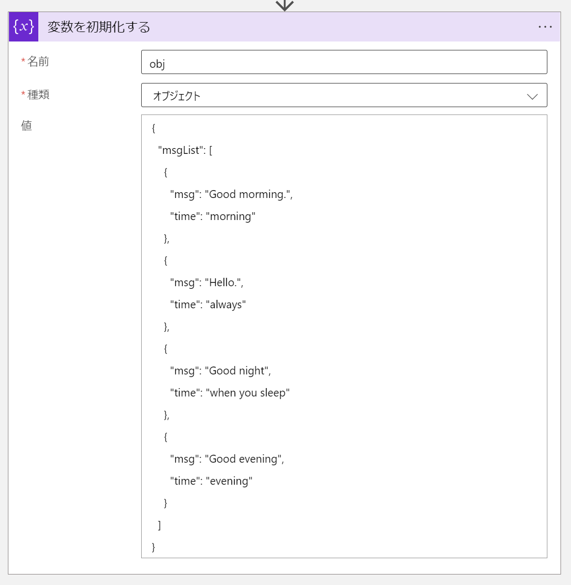
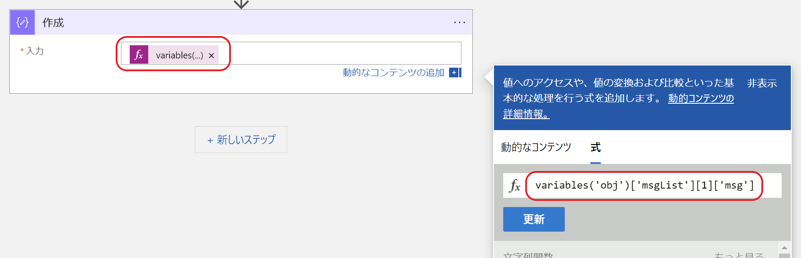
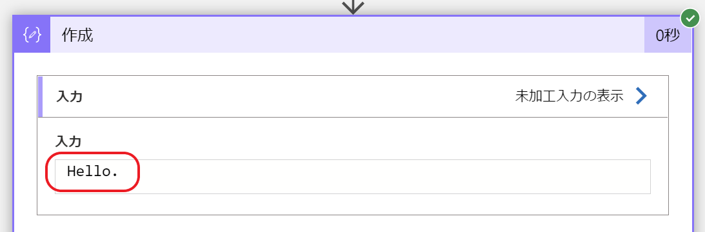

こんにちは。Azure Integration サポート チームの 花井 です。  
本記事では Azure Logic Apps で JSON オブジェクトの特定のプロパティから値を取得する方法についてご説明します。

## こんな方におすすめです
- 動的なコンテンツとして表示されないプロパティの値を取得されたい
- JSON の解析アクションを実行せず特定のプロパティの値を取得されたい

## 前提条件
- 本記事では従量課金版 Logic Apps ワークフローを使用しますが、Standard Logic Apps、Power Automate のワークフローでも同様に動作します。
- どのトリガーを使用しても問題ございません。
- 以下の JSON オブジェクトを格納した変数 obj を初期化するアクションを配置した Logic Apps ワークフローを用意します。
  ※事前準備の項目で詳細をご案内します。
  ```
  {
    "msgList": [
      {
        "msg": "Good morming.",
        "time": "morning"
      },
      {
        "msg": "Hello.",
        "time": "always"
      },
      {
        "msg": "Good night.",
        "time": "when you sleep"
      },
      {
        "msg": "Good evening.",
        "time": "evening"
      }
    ]
  }
  ```
- 本記事の例では、上記の JSON オブジェクトが格納された変数 obj から、msgList プロパティ (配列) の 1 番目の要素の msg プロパティの値 "Hello." を取得する関数をご案内します。
  
## 事前準備
以下のように変数初期化アクションを追加し、変数 obj を定義します。


- 各パラメーターの設定
名前 : obj
種類 : オブジェクト
値 : (以下の JSON を入力します)
```
{
  "msgList": [
    {
      "msg": "Good morming.",
      "time": "morning"
    },
    {
      "msg": "Hello.",
      "time": "always"
    },
    {
      "msg": "Good night.",
      "time": "when you sleep"
    },
    {
      "msg": "Good evening.",
      "time": "evening"
    }
  ]
}
```

## 構築
1. 変数初期化アクションの次のステップとして、作成アクションを追加します。


2. 作成アクションの [入力] パラメーターに以下の関数を入力します。
```
variables('obj')['msgList'][1]['msg']
```

3. ワークフローを保存します。

## 確認
1. Azure ポータル上で、Logic Apps の概要ページの [トリガーの実行 - 実行] を選択し、トリガーを手動実行します。
2. Azure ポータル上で、Logic Apps の概要ページの [実行の履歴] タブから、手動実行した実行のアクションの実行履歴を開きます。
3. 作成アクションの未加工入力から正常に値 "Hello." が取得できていることを確認できます。


## 入力した関数の解説
variables 関数は、指定した変数の値を取得する関数です。
関数「variables('obj')」の場合は変数 obj の値を取得する動作となる、以下の JSON オブジェクト型の値を取得します。
```
{
  "msgList": [
    {
      "msg": "Good morming.",
      "time": "morning"
    },
    {
      "msg": "Hello.",
      "time": "always"
    },
    {
      "msg": "Good night.",
      "time": "when you sleep"
    },
    {
      "msg": "Good evening.",
      "time": "evening"
    }
  ]
}
```

Logic Apps では JSON オブジェクトを取得する関数の末尾に以下の記述のいずれかを追加することで指定したプロパティの値を取得できます。
```
1 ?['プロパティ名'] 
// 1 の記述では ? を付加することで Null 許容となり指定したプロパティが存在しない場合もエラーとなりません。
2 ['プロパティ名']
3 .プロパティ名
// 半角スペースを含むプロパティ名では 3 の記述はご利用いただけません。
```


関数「variables('obj')['msgList']」では以下の配列 (アレイ) 型の値を取得します。
```
[
  {
    "msg": "Good morming.",
    "time": "morning"
  },
  {
    "msg": "Hello.",
    "time": "always"
  },
  {
    "msg": "Good night.",
    "time": "when you sleep"
  },
  {
    "msg": "Good evening.",
    "time": "evening"
  }
]
```

Logic Apps では JSON 配列 (アレイ) 型を取得する関数の末尾に以下のような記述を追加することで指定した要素番号の要素の値を取得できます。
なお要素番号は 0 からカウントします。
```
[要素番号]
```

関数「variables('obj')['msgList'][1]」では以下の JSON オブジェクト型の値を取得します。
```
{
  "msg": "Hello.",
  "time": "always"
}
```

作成アクションに入力した関数「variables('obj')['msgList'][1]['msg']」では、上記のオブジェクトの msg プロパティを取得する動作であり、値 "Hello." を取得します。

## まとめ
本記事では、以下についてご案内しましたが、いかがでしたでしょうか。
- JSON オブジェクトから指定したプロパティの値を取得する方法
- 配列の特定の要素から値を取得する方法

本記事ではオブジェクト型の変数からプロパティを指定し値を取得しましたが、triggerBody 関数や body 関数を組み合わせ、アクションやトリガーの出力の body プロパティに格納されたオブジェクトから指定したプロパティの値を取得することも可能でございます。

本記事が少しでもお役に立ちましたら幸いです。最後までお読みいただき、ありがとうございました！