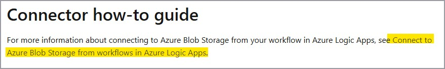
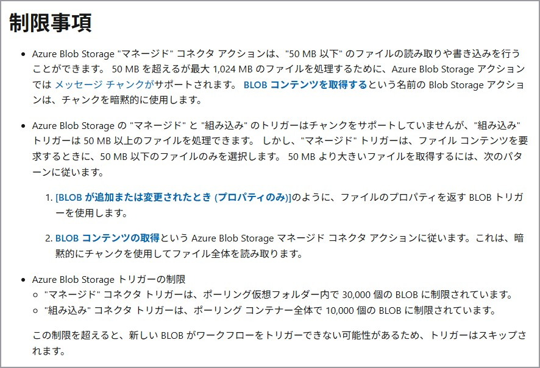
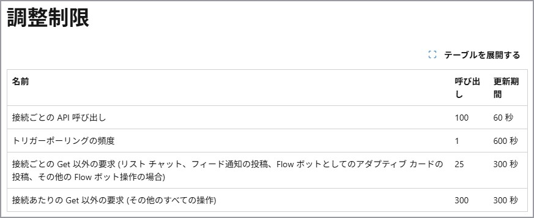

こんにちは。Azure Integration サポート チームの髙橋です。

Logic Apps をご利用いただく際に、ご考慮いただきたい制約事項について説明いたします。

<!-- more -->

# こんな方におすすめです
- 初めて Logic Apps での開発をされる方
- Logic Apps で 429 エラーが発生する方

## 目次
1. [Logic Apps に関する制約](#header1)
2. [Logic Apps 全般の制約](#header2)
3. [マネージド コネクタの制約](#header3)
4. [接続先サービスの制約](#header4)
5. [まとめ](#header5)

<h2 id="header1"> 1. Logic Apps に関する制約 </h2>

Logic Apps をご利用いただく上では、大きく以下の 3 つの制約についてご考慮いただく必要がございます。
- Logic Apps 自体の制約
- マネージド コネクタの制約
- 接続先サービスの制約

<h2 id="header2"> 2. Logic Apps 全般の制約 </h2>

Logic Apps 全般の制約は以下にまとめられています。
[制約と構成の参考ガイド - Azure Logic Apps | Microsoft Learn](https://learn.microsoft.com/ja-jp/azure/logic-apps/logic-apps-limits-and-config?tabs=consumption)

たとえば、[単一のトリガーまたはアクション - 入力または出力の最大サイズ] は 105 MB まで、との制約があります。

何等かのアクションで大きなサイズのデータを取得するような場合や、一つの変数に繰り返しデータを追加するような処理がある場合には注意が必要です。

また、Logic Apps 独自のスループットの制約を超えた場合の一般的なハンドリング方法につきましては、以下の公開情報もございますので、本記事と併せましてご一読いただけますと幸いです。
[スロットリング問題の対処または429エラーレスポンス(リクエストが多すぎます)の処理 - Azure Logic Apps | Microsoft Learn # ロジック アプリのリソースの調整](https://learn.microsoft.com/ja-jp/azure/logic-apps/handle-throttling-problems-429-errors?tabs=consumption#logic-app-resource-throttling)

<h2 id="header3"> 3. コネクタの制約 </h2>

### 3-1. 組み込みコネクタ

組み込みコネクタの概要につきましては、以下の公開情報に記載があります。
[組み込みコネクタの概要 - Azure Logic Apps | Microsoft Learn](https://learn.microsoft.com/ja-jp/azure/connectors/built-in)

たとえば、[HTTP] アクションの制約は、以下に記載があります。
[制約と構成の参考ガイド - Azure Logic Apps | Microsoft Learn # HTTP 要求の制限](https://learn.microsoft.com/ja-jp/azure/logic-apps/logic-apps-limits-and-config?tabs=consumption#http-request-limits)

また、組み込みコネクタの中でも Standard Logic Apps でのみご利用いただけますサービス プロバイダー ベースの組み込みコネクタの場合、各コネクタについて説明した公開情報がございます。
詳細な検索方法につきましては、以下をご参照ください。
[Logic Apps で使用できるコネクタについて](https://jpazinteg.github.io/blog/LogicApps/LogicAppsConnectorList/)

たとえば、[Azure Blob Storage] コネクタ (サービス プロバイダー ベース) の場合、[Connector how-to guide] という項目があります。
[Azure Blob Storage - Connectors | Microsoft Learn](https://learn.microsoft.com/ja-jp/azure/logic-apps/connectors/built-in/reference/azureblob/)

リンク先に遷移しますと、以下のように制限事項の記載があります。
[ワークフローから Azure Blob Storage に接続する - Azure Logic Apps | Microsoft Learn # 制限事項](https://learn.microsoft.com/ja-jp/azure/connectors/connectors-create-api-azureblobstorage?tabs=standard#limitations)

### 3-2.マネージド コネクタ

マネージド コネクタの概要につきましては、以下の公開情報に記載があります。
[マネージド コネクタの概要 - Azure Logic Apps | Microsoft Learn](https://learn.microsoft.com/ja-jp/azure/connectors/managed)

マネージド コネクタの詳細な検索方法につきましては、以下をご参照ください。
[Logic Apps で使用できるコネクタについて](https://jpazinteg.github.io/blog/LogicApps/LogicAppsConnectorList/)

たとえば、[Microsoft Teams] コネクタといたしましては、以下のような制約があります。
※ このような調整制限はコネクタごとに異なります。
[Microsoft Teams - Connectors | Microsoft Learn # 調整制限](https://learn.microsoft.com/ja-jp/connectors/teams/?tabs=text1%2Cdotnet#limits)

一番上の [接続ごとの API 呼び出し] とは、"API 接続ごと" を意味します。
※ API 接続につきましては、以下のブログもご参照ください。
[API 接続について | Japan Azure Integration Support Blog](https://jpazinteg.github.io/blog/LogicApps/apiConnection/)

従量課金タイプの Logic Apps が複数あり、それらで同一の API 接続を共有してご利用の場合、上記のような調整制限に抵触しやすくなります。
調整制限を超えて Logic Apps が実行される場合に 429 エラーが発生する場合がございます。
回避策としては、Logic Apps ごとに API 接続を分ける方法等が考えられます。
一般的なハンドリング方法につきましては以下の公開情報もございますので、本記事と併せましてご一読いただけますと幸いです。
[スロットリング問題の対処または429エラーレスポンス(リクエストが多すぎます)の処理 - Azure Logic Apps | Microsoft Learn # コネクタの調整](https://learn.microsoft.com/ja-jp/azure/logic-apps/handle-throttling-problems-429-errors?tabs=consumption#connector-throttling)

エラー メッセージから調整が発生しているように見受けられるものの、再試行ポリシーの対象とならないエラー コードが返却されている場合の再試行方法につきましては、以下の記事がご参考になりますと幸いです。
[Logic Apps における再試行について | Japan Azure Integration Support Blog](https://jpazinteg.github.io/blog/LogicApps/retryPolicy/)

<h2 id="header4"> 4. 接続先サービスの制約 </h2>

たとえば、マネージド コネクタの [Office 365 Outlook] コネクタでは、以下のような注意書きがあります。
[Office 365 Outlook - Connectors | Microsoft Learn # Office 側での調整の制限](https://learn.microsoft.com/ja-jp/connectors/office365/#throttling-limits-on-the-office-side)

リンク先に遷移しますと、メッセージ サイズの上限や件名の長さの制限等について記載があります。
[Exchange Online の制限 - Service Descriptions | Microsoft Learn # メッセージの制限](https://learn.microsoft.com/ja-jp/office365/servicedescriptions/exchange-online-service-description/exchange-online-limits#message-limits)

このようにコネクタで接続する先のサービス自体の制約についてもご考慮いただく必要があります。
一般的なハンドリング方法につきましては以下の公開情報もございますので、本記事と併せましてご一読いただけますと幸いです。
[スロットリング問題の対処または429エラーレスポンス(リクエストが多すぎます)の処理 - Azure Logic Apps | Microsoft Learn # 接続先のサービスまたはシステムの調整](https://learn.microsoft.com/ja-jp/azure/logic-apps/handle-throttling-problems-429-errors?tabs=consumption#destination-service-or-system-throttling)

<h2 id="header5"> まとめ </h2>

Logic Apps をご利用の際には、大きく以下 3 つの制約についてご確認いただき、実装をご検討いただけますと幸いです。
- Logic Apps 自体の制約
- マネージド コネクタの制約
- 接続先サービスの制約

**参考:**
- [スロットリング問題の対処または429エラーレスポンス(リクエストが多すぎます)の処理 - Azure Logic Apps | Microsoft Learn](https://learn.microsoft.com/ja-jp/azure/logic-apps/handle-throttling-problems-429-errors?tabs=consumption)

本記事が少しでもお役に立ちましたら幸いです。
