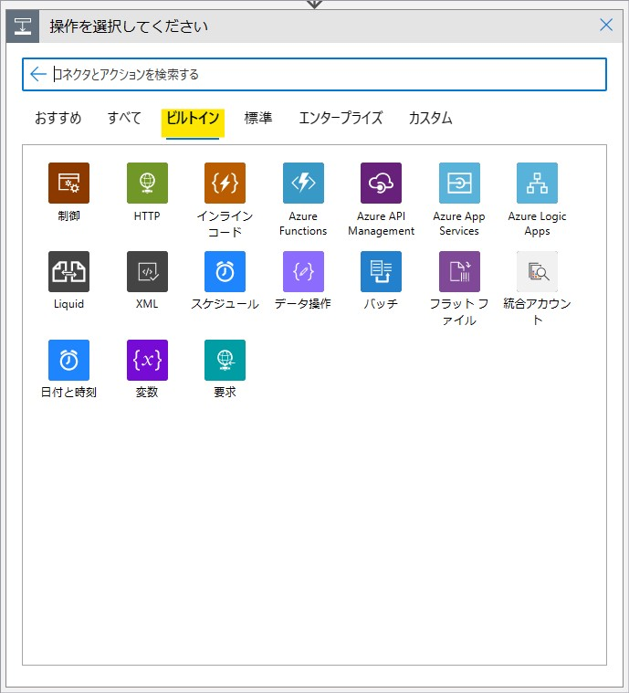
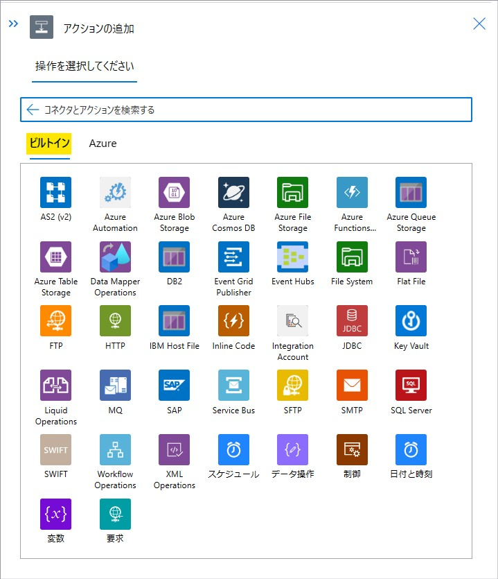
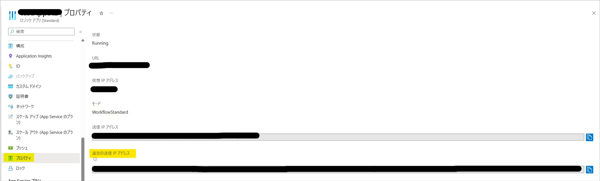
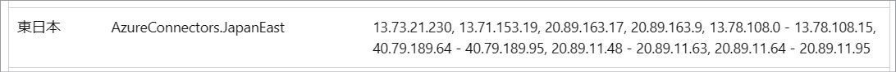
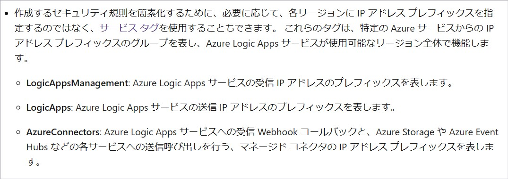
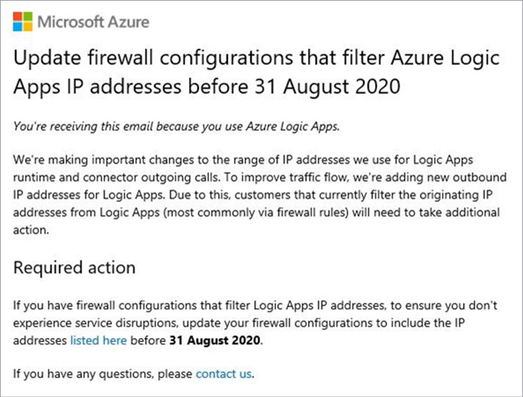
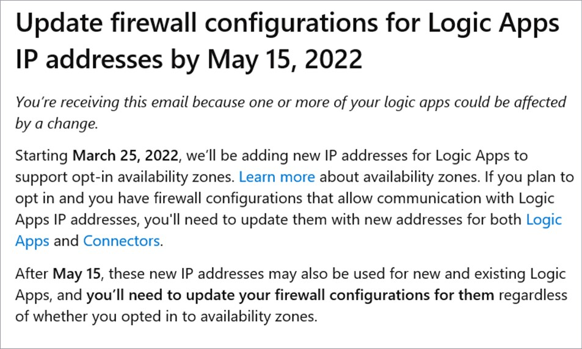

こんにちは。Azure Integration サポート チームの髙橋です。

Logic Apps の送信 IP アドレスについて説明いたします。

<!-- more -->

## こんな方におすすめです
- Logic Apps の送信 IP アドレスの情報を用いて、アクセス制限を行いたい方

## Logic Apps のコネクタの種類
Logic Apps では、組み込みのトリガーおよびアクションと、マネージド コネクタの大きく 2 種類があります。
それによって送信 IP アドレスが異なりますので、まずはコネクタの種類について説明いたします。

### 組み込みのトリガーおよびアクション

トリガーおよびアクション追加時に、「ビルトイン」タブに表示されるものになります。
**<従量課金タイプ>**

**<Standard タイプ>**

- 参考ドキュメント : [Azure Logic Apps の組み込みコネクタ # 従量課金と Standard の組み込みコネクタの比較](https://learn.microsoft.com/ja-jp/azure/connectors/built-in#built-in-connectors-in-consumption-versus-standard)

### マネージド コネクタ

**<従量課金タイプ>**
従量課金タイプでは、トリガーおよびアクション追加時に「標準」タブおよび「エンタープライズ」タブに表示されるものになります。

**<Standard タイプ>**
Standard タイプでは、「Azure」タブに表示されるものになります。

- 参考ドキュメント : [Azure Logic Apps のマネージド コネクタ](https://learn.microsoft.com/ja-jp/azure/connectors/managed)

## 送信 IP アドレス
### 組み込みのトリガーおよびアクション

**<従量課金タイプ>**
従量課金タイプの Logic Apps において「HTTP」アクションのような組み込みアクションで利用されます送信 IP アドレスは、
以下の公開情報の該当リージョンのものとなります。
- 参考ドキュメント : [Azure Logic Apps の制約と構成の参考文献 # マルチテナント - 送信 IP アドレス](https://learn.microsoft.com/ja-jp/azure/logic-apps/logic-apps-limits-and-config?tabs=consumption%2Cazure-portal#multi-tenant---outbound-ip-addresses)

たとえば、東日本リージョンに Logic Apps を配置されている場合、以下が対象となります。
ファイアウォール等で受信ルールをご設定いただいている場合には、該当リージョンのすべての IP アドレスを許可いただく必要がございます。

また、こちらの IP アドレスは、[ロジック アプリ] - [<対象の ロジック アプリ>] - [設定 - プロパティ] の「ランタイム発信 IP アドレス」が該当いたします。

**<Standard タイプ>**
Standard タイプの Logic Apps におきましては、[ロジック アプリ] - [<対象の ロジック アプリ>] - [設定 - プロパティ] にて、「追加の送信 IP アドレス」が該当いたします。
※ 「送信 IP アドレス」は、「追加の送信 IP アドレス」に含まれております。

### マネージド コネクタ

マネージド コネクタは、従量課金タイプの Logic Apps でも Standard タイプの Logic Apps でも送信 IP アドレスは共通しております。
以下の公開情報の該当リージョンのものとなります。
- 参考ドキュメント : [マネージド コネクタのアウトバウンド IP アドレス # Azure Logic Apps](https://learn.microsoft.com/ja-jp/connectors/common/outbound-ip-addresses#azure-logic-apps)

たとえば、東日本リージョンに Logic Apps を配置されている場合、以下が対象となります。
ファイアウォール等で受信ルールをご設定いただいている場合には、該当リージョンのすべての IP アドレスを許可いただく必要がございます。

従量課金タイプの場合、こちらの IP アドレスは、[ロジック アプリ] - [<対象の ロジック アプリ>] - [設定 - プロパティ] の「コネクタ発信 IP アドレス」が該当いたします。

## サービス タグ
Azure 上の VNet 等の一部の製品では、サービス タグをご利用いただくことが可能でございます。
- 参考ドキュメント : [仮想ネットワーク サービス タグ](https://learn.microsoft.com/ja-jp/azure/virtual-network/service-tags-overview)

Logic Apps に関連するサービス タグは以下になります。

- 参考ドキュメント : [Azure Logic Apps の制約と構成の参考文献 # ファイアウォールの IP 構成に関する考慮事項](https://learn.microsoft.com/ja-jp/azure/logic-apps/logic-apps-limits-and-config?tabs=consumption%2Cazure-portal#firewall-ip-configuration-considerations)

### 組み込みのトリガーおよびアクション

従量課金タイプの場合は、サービス タグは「**LogicApps**」になります。
※ Standard タイプでは、サービス タグのご用意がございません。

### マネージド コネクタ

マネージド コネクタの場合は、従量課金タイプ、Standard タイプ問わず、サービス タグは「**AzureConnectors**」になります。
「**AzureConnectors.リージョン**」とすることで、特定のリージョンのものを指定することが可能です。

## IP アドレスの変更
以下に記載の送信 IP アドレスは、過去に変更された事例がございます。
- 参考ドキュメント : [Azure Logic Apps の制約と構成の参考文献 # マルチテナント - 送信 IP アドレス](https://learn.microsoft.com/ja-jp/azure/logic-apps/logic-apps-limits-and-config?tabs=consumption%2Cazure-portal#multi-tenant---outbound-ip-addresses)
- 参考ドキュメント : [マネージド コネクタのアウトバウンド IP アドレス # Azure Logic Apps](https://learn.microsoft.com/ja-jp/connectors/common/outbound-ip-addresses#azure-logic-apps)

Azure のサブスクリプション管理者宛てにメールでの通知、およびサービス正常性での通知が行われましたので、
変更時には IP アドレスの設定の見直しをお願いいたします。
※ サービス タグをご利用の場合には、ご変更いただく必要はございません。

ご参考までに過去のアナウンスのスケジュールにつきましてご案内いたします。
 
・メールでのアナウンス：2020/7/16
・変更実施：2020/8/31

・メールでのアナウンス：2022/3/26
・変更実施：2022/5/15

## サービス正常性アラートの設定
正常性アラートからメールで通知する方法がございます。

1. [Azure ポータル] - [サービス正常性] - [アラート - 正常性アラート] - [+ サービス正常性アラートの追加] を選択します。
2. 以下の項目を設定します。
[条件 - アラートの対象] - [サブスクリプション] : 対象のサブスクリプションを選択します。
[条件 - アラートの対象] - [サービス] : Logic Apps
[条件 - アラートの対象] - [リージョン] : Logic Apps をご利用頂いておりますリージョンを選択します。 [全体] を選択することも可能です。
[条件 - アラートの対象] - [Service Health の基準] : 全てにチェック入れます。
[アクション - アクショングループ名] : [アクショングループの追加] を選択し、メール通知を含むアクショングループを追加します。
[アラートルールに詳細 - アラートルール名] : 任意のアラートルール名を入力します。
[アラートルールの作成] を選択します。
アクショングループのご利用手順につきましては、以下の公開情報でご確認頂けます。
- 参考ドキュメント : [Azure Portal でのアクション グループの作成および管理](https://docs.microsoft.com/ja-jp/azure/azure-monitor/alerts/action-groups)

## まとめ
本記事では、Logic Apps の送信 IP アドレスについて説明いたしました。
本記事が少しでもお役に立ちましたら幸いです。