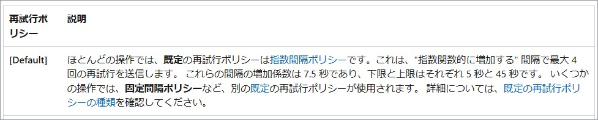
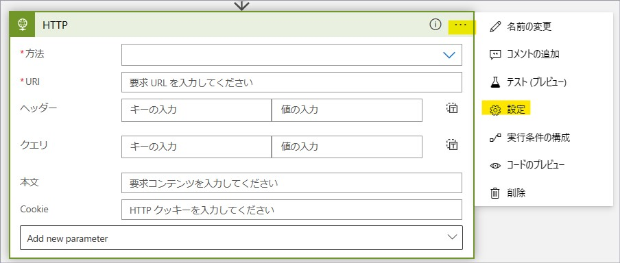
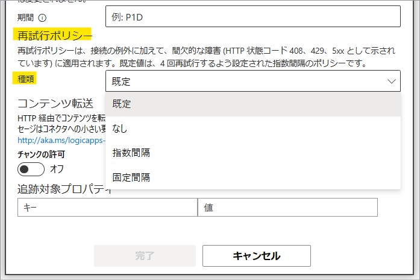
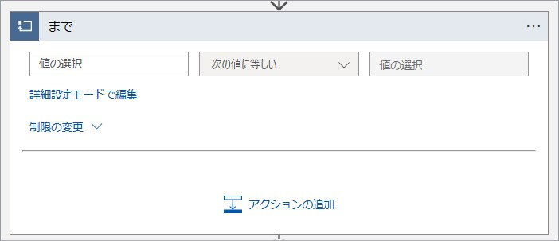
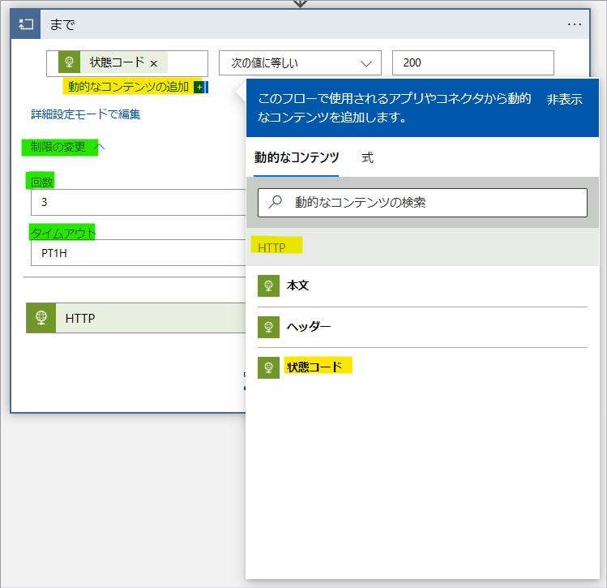
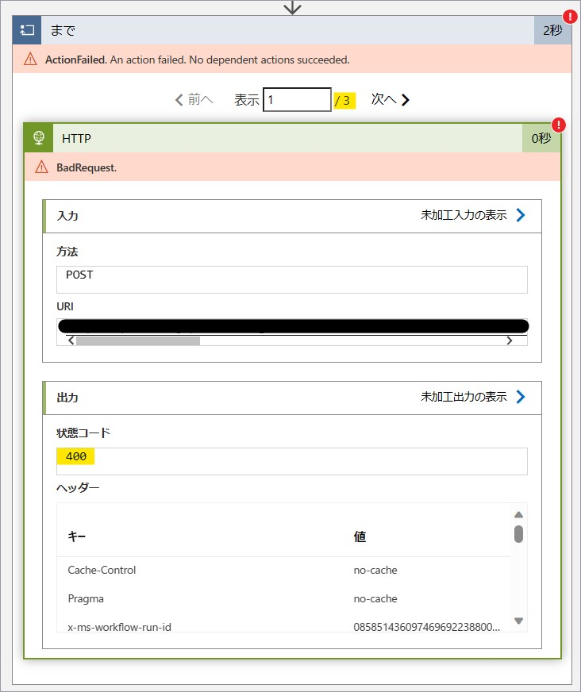

こんにちは。Azure Integration サポート チームの髙橋です。

Logic Apps における再試行について説明いたします。

<!-- more -->

## こんな方におすすめです
- Logic Apps の再試行ポリシーについて知りたい方
- Logic Apps で再試行の設定を解除されたい方
- 再試行ポリシー対象外の場合でも、再試行を行いたい方

## Logic Apps の再試行ポリシー
Logic Apps では、「HTTP」アクション等一部のトリガーおよびアクションにて、再試行ポリシーを設定することが可能です。

- 参考ドキュメント : [Azure Logic Apps におけるエラーと例外の処理 # 再試行ポリシー](https://learn.microsoft.com/ja-jp/azure/logic-apps/logic-apps-exception-handling?tabs=consumption#retry-policies)

上記に記載がございますように、特定のレスポンス コード (**408、429、または 5xx 応答**) を受け取った場合にのみ自動的に再試行されます。

## 再試行ポリシーのデフォルト設定
既定の設定では、再試行ポリシーは有効化されています。
具体的な設定値は以下となります。

- 参考ドキュメント : [Azure Logic Apps におけるエラーと例外の処理 # 既定の再試行ポリシー](https://learn.microsoft.com/ja-jp/azure/logic-apps/logic-apps-exception-handling?tabs=consumption#default-retry-policy)

## 再試行ポリシーの設定変更
再試行ポリシーは無効化したり、回数および間隔をご変更いただくことが可能です。

**<従量課金タイプ>**
対象のトリガーまたはアクションを展開し、右上の「…」を押下して「設定」を選択します。
以下は「HTTP」アクションでの例になります。

「再試行ポリシー」にて設定をご変更いただけます。

**<Standard タイプ>**
Standard Logic Apps でも対象のトリガーまたはアクションを選択し、「Settings」タブを開きます。
[ネットワーク - Retry Policy] にてご変更いただけます。

再試行ポリシーの種類といたしましては「既定」以外に、「なし」、「指数間隔」、「固定間隔」がございます。
たとえば「HTTP」アクションで外部システムへリクエストを送信されているようなシナリオですと、安易に再試行できない場合もあるかと存じます。
その場合には、こちらで「なし」とご設定いただくことが可能です。
なお、弊社として推奨値は特にございませんので、以下の公開情報をご参照の上、お客様のご要件を照らし合わせましてご検討いただけますと幸いでございます。

- 参考ドキュメント : [Azure Logic Apps におけるエラーと例外の処理 # 再試行ポリシーの種類](https://learn.microsoft.com/ja-jp/azure/logic-apps/logic-apps-exception-handling?tabs=consumption#retry-policy-types)

再試行ポリシーの制限につきましては、以下の公開情報もございます。
- 参考ドキュメント : [Azure Logic Apps の制約と構成の参考文献 # 再試行ポリシーの制限](https://learn.microsoft.com/ja-jp/azure/logic-apps/logic-apps-limits-and-config?tabs=consumption%2Cazure-portal#retry-policy-limits)

## 再試行ポリシー対象外の場合
上述の通り、再試行ポリシーは特定のレスポンス コード (**408、429、または 5xx 応答**) を受け取った場合にのみ自動的に再試行されます。
これら以外のレスポンス コードを受け取った場合には、再試行されません。
もしこの場合にも再試行をご希望の場合には、適宜作り込みが必要となります。

Logic Apps では、「まで」アクションや「条件」アクション等のご用意がございますので、これらを組み合わせる方法が考えられます。
**「まで」アクション**

- 参考ドキュメント : [Azure Logic Apps 内のワークフロー アクションを繰り返す、または配列を処理するループを作成する # "Until" ループ](https://learn.microsoft.com/ja-jp/azure/logic-apps/logic-apps-control-flow-loops#until-loop)

**「条件」アクション**

- 参考ドキュメント : [Azure Logic Apps のワークフロー アクションを制御する条件を追加する](https://learn.microsoft.com/ja-jp/azure/logic-apps/logic-apps-control-flow-conditional-statement)

少し時間を空けてから再試行されたい場合には、「待ち時間」アクションのご用意もございます。
**「「待ち時間」アクション**

- 参考ドキュメント : [Azure Logic Apps で次のアクションの実行を遅延させる](https://learn.microsoft.com/ja-jp/azure/connectors/connectors-native-delay)

また、Logic Apps では「実行条件の構成」の設定によって、前段のアクションが失敗した場合でも後続処理を続けることが可能です。
- 参考ドキュメント : [Azure Logic Apps におけるエラーと例外の処理 # "実行条件" の動作を管理する](https://learn.microsoft.com/ja-jp/azure/logic-apps/logic-apps-exception-handling?tabs=consumption#manage-the-run-after-behavior)

以下に従量課金タイプの Logic Apps で、「HTTP」アクションと「まで」アクションを利用した場合についてのサンプルをご案内いたします。

「まで」アクション内に「HTTP」アクションを追加します。
「まで」アクションの条件式として、「状態コード / 次の値に等しい / 200」と設定しております。
※ 「状態コード」につきましては、「動的なコンテンツの追加」を押下して追加することが可能でございます。

「制限の変更」にてループ回数 (再試行回数) をご設定いただけます。
無限ループとならないよう、ご注意ください。
- 参考ドキュメント : [Azure Logic Apps 内のワークフロー アクションを繰り返す、または配列を処理するループを作成する # 無限ループを防ぐ](https://learn.microsoft.com/ja-jp/azure/logic-apps/logic-apps-control-flow-loops#prevent-endless-loops)

実行した結果が以下となります。
レスポンス コードが 400 (200 ではない) 場合には、「まで」アクションの「制限の変更」にて設定されている回数分、繰り返し「HTTP」アクションを実行しております。

レスポンス コードが 200 の場合では、「HTTP」アクションを一回実行したのみでございます。

こちらはあくまでサンプルでございますので、お客様のご要件に応じまして適宜変更いただき、
実運用に向けましたテストおよびハンドリングにつきましては、お客様ご自身でご実施いただきますようお願い申し上げます。

## まとめ
本記事では、Logic Apps の再試行ポリシーの概要、設定変更、再試行ポリシーの対象外の場合についてご案内いたしました。
本記事が少しでもお役に立ちましたら幸いです。