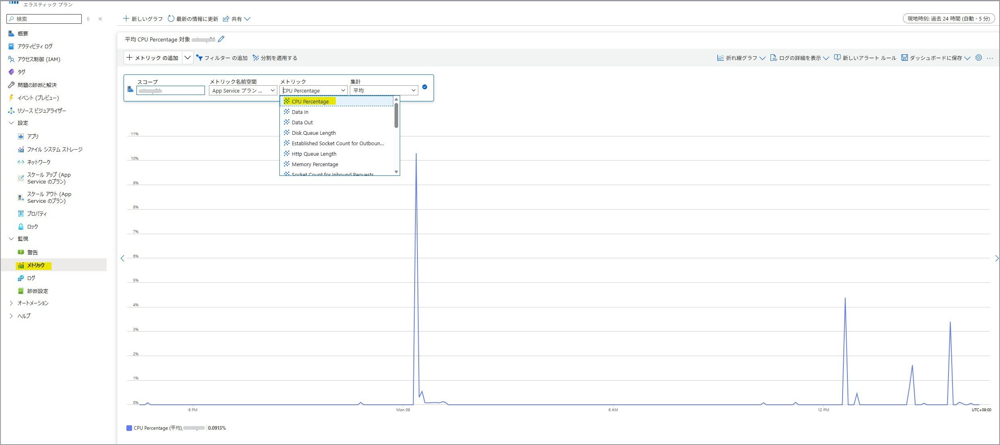
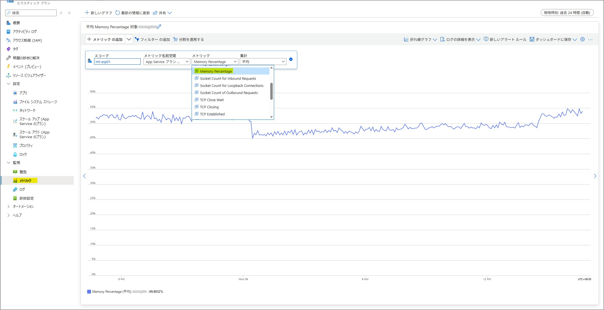
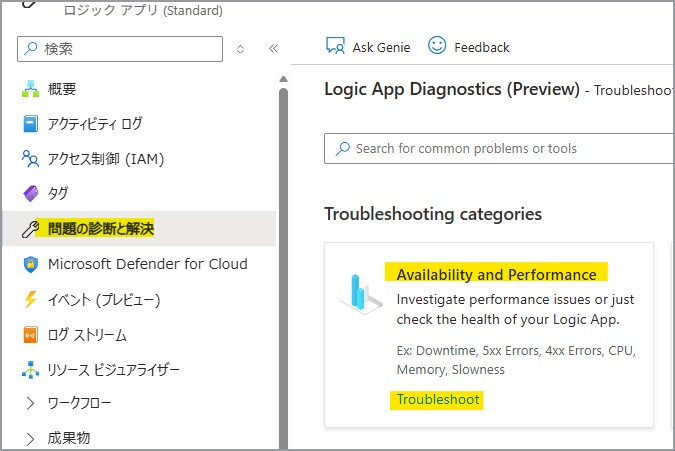
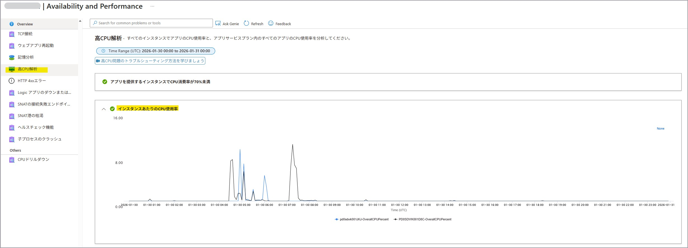
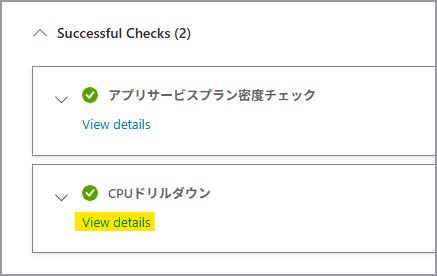
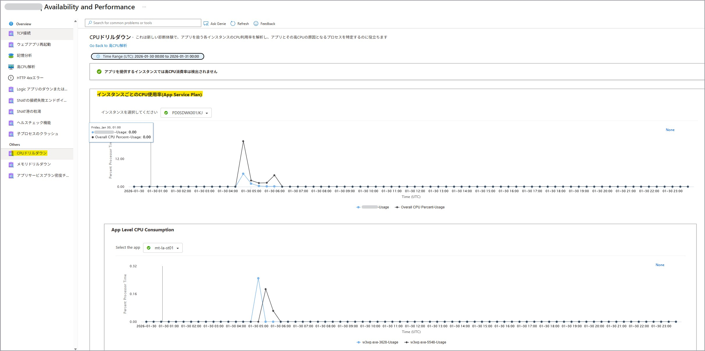
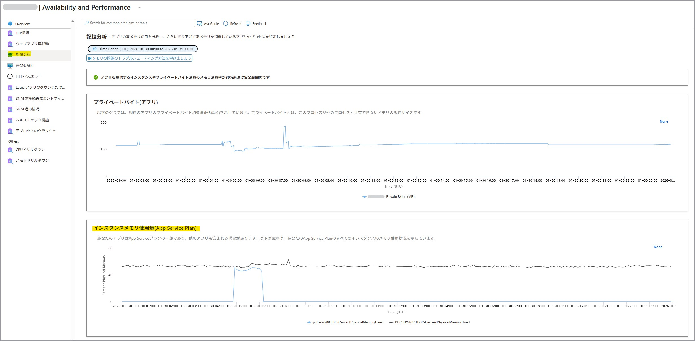
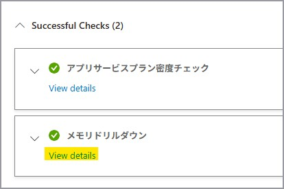
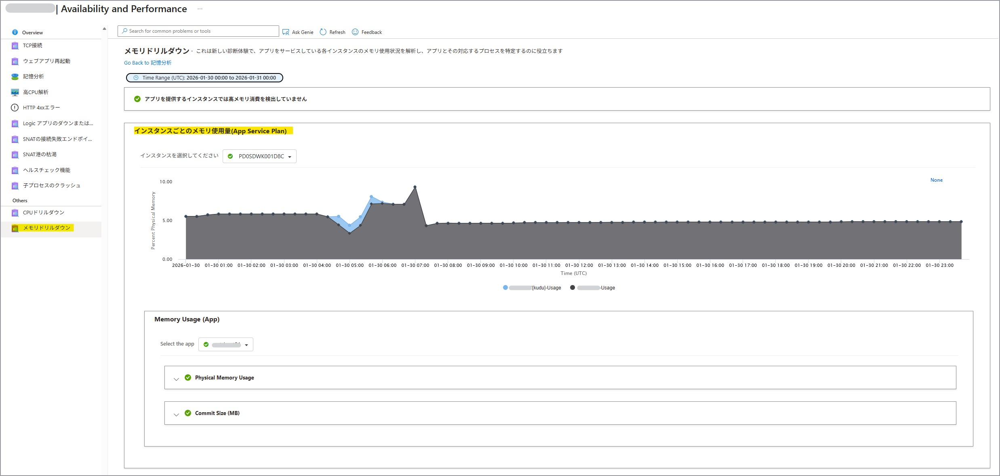
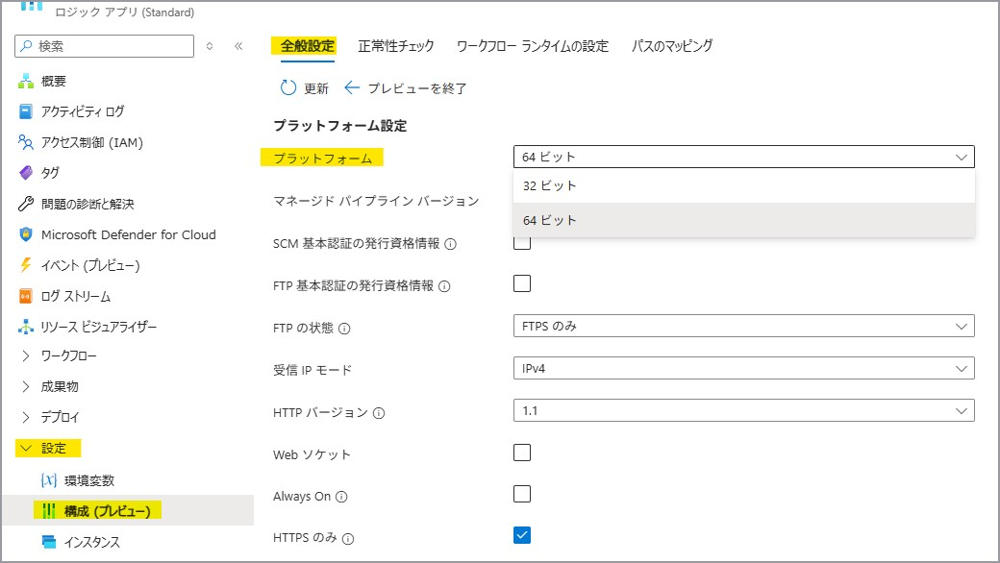

こんにちは。Azure Integration サポート チームの髙橋です。

Standard Logic Apps で CPU やメモリが高騰する一般的な原因とその確認方法、対処法について説明いたします。

<!-- more -->

# こんな方におすすめです
- 初めて Standard Logic Apps での開発をされる方
- Standard Logic Apps でしばしば CPU やメモリが高騰することがある方

本記事は以下の記事の一部を翻訳および大まかにまとめたものになります。
こちらも併せてご確認ください。
[Logic App Standard - When High Memory / CPU usage strikes and what to do | Microsoft Community Hub](https://techcommunity.microsoft.com/blog/integrationsonazureblog/logic-app-standard---when-high-memory--cpu-usage-strikes-and-what-to-do/4425155)

## 目次
1. [CPU やメモリの高騰が処理に与える影響](#header1)
2. [CPU やメモリが高騰する例](#header2)
3. [CPU やメモリの確認方法](#header3)
4. [CPU やメモリの使用率の高騰を抑えるために考えられること](#header4)
5. [まとめ](#header5)

<h2 id="header1"> 1. CPU やメモリの高騰が処理に与える影響 </h2>

[Logic App Standard - When High Memory / CPU usage strikes and what to do | Microsoft Community Hub # How High Memory and high CPU affects the processing](https://techcommunity.microsoft.com/blog/integrationsonazureblog/logic-app-standard---when-high-memory--cpu-usage-strikes-and-what-to-do/4425155)

一般的に、Standard Logic Apps の CPU やメモリ使用率が高騰すると、ワークフローの実行時間が長くなり、内部的な再試行 (リトライ) が増加します。

ワークフローの実行に使用される命令やデータは、メモリ上に読み込まれます。
メモリの占有量が増えると、OS は必要な命令セットを探したり、情報を読み書きするのに通常より多くの時間を要するようになります。
その分、ワークフローの実際の処理に割ける計算資源が減り、処理速度が低下します。

CPU 使用率が高い状態では、ランタイムのワーカーが複数の処理を同時に捌くことができなくなり、結果として全体の処理速度が低下します。

CPU やメモリ使用量が閾値に達すると、実行が遅くなり、アクションやタスクに設定されているタイムアウト制限に抵触しやすくなります。
このため、内部でリトライが発生し、さらに負荷が増加する悪循環が起こる可能性があります。

<h2 id="header2"> 2. CPU やメモリが高騰する例 </h2>

[Logic App Standard - When High Memory / CPU usage strikes and what to do | Microsoft Community Hub # How High Memory and high CPU affects the processing](https://techcommunity.microsoft.com/blog/integrationsonazureblog/logic-app-standard---when-high-memory--cpu-usage-strikes-and-what-to-do/4425155)

### 2-1. メモリが高騰する例
たとえば、[Read blob content] アクション (組み込みの Azure Blob Storage コネクタ) では、Blob の内容をすべてメモリに読み込みます。
そのため、非常に大きな Blob を取得すると、その分だけメモリの占有量が増加します。
さらに、[For each] アクションによるループ処理内でこのアクションを使用し、大きな Blob を並列で読み込む場合や、
複数のワークフローが同時に同様の処理を実行する場合には、メモリ使用率が急激に高騰する可能性があるため注意が必要です。

一般的に、メモリ使用率が 70% を超えると、バックグラウンド タスクが予期せぬ動作を起こす可能性があるため、メモリの状態を継続的に監視することが重要です。

### 2-2. CPU が高騰する例
CPU についても同様で、負荷が高まるほど処理速度は低下します。
メモリ使用量が低い場合でも、XML 変換や組み込みのデータ変換といった複雑なタスクを実行している際には、CPU ワーカーが多くの計算処理を行う必要があるため、CPU 使用率が急上昇することがあります。

特に以下の状況では CPU の負荷が高騰しやすくなります：
- より大きなファイルを処理する場合
- 変換処理 (XML → JSON、条件分岐を伴う構造変換等) が複雑な場合
- マネージド コネクタで大量のデータを処理し、CPU による処理時間が増加する場合

ファイルサイズが大きくなるほど、解析・変換・バリデーションなどの内部処理に必要な CPU による処理時間が長くなり、結果として CPU 使用率が高騰します。

>[!NOTE]
>ワークフローが空の場合でも、Logic Apps Standard は Azure Functions ランタイム上で動作しているため、System / Platform プロセスが一定量の CPU / メモリを常に消費します。
>下図資料にて Platform / System プロセスが一定のリソースを消費する旨が説明されています。
>[Azure App Service に関する FAQ - 可用性、パフォーマンス、アプリケーションに関する問題 - Azure | Microsoft Learn # すべての Web アプリが停止した場合でも CPU/メモリ使用量を表示する App Service プラン](https://learn.microsoft.com/ja-jp/troubleshoot/azure/app-service/web-apps-performance-faqs#my-app-service-plan-displaying-cpumemory-usage-even-when-all-web-apps-are-stopped)

<h2 id="header3"> 3. CPU やメモリの確認方法 </h2>

[Logic App Standard - When High Memory / CPU usage strikes and what to do | Microsoft Community Hub # How to check memory/CPU](https://techcommunity.microsoft.com/blog/integrationsonazureblog/logic-app-standard---when-high-memory--cpu-usage-strikes-and-what-to-do/4425155)

### 3-1. App Service Plan (ASP) から確認する方法
Standard Logic Apps が紐づけられた App Service plan を開き、[監視 – メトリック] にて **[CpuPercentage]** を選択しますと、
プランの全インスタンスで使用された平均 CPU がご確認いただけます。

[サポートされているメトリック - Microsoft.Web/serverfarms - Azure Monitor | Microsoft Learn](https://learn.microsoft.com/ja-jp/azure/azure-monitor/reference/supported-metrics/microsoft-web-serverfarms-metrics)

また、 **[MemoryPercentage]** を選択しますと、プランの全インスタンスで使用された平均メモリがご確認いただけます。

[サポートされているメトリック - Microsoft.Web/serverfarms - Azure Monitor | Microsoft Learn](https://learn.microsoft.com/ja-jp/azure/azure-monitor/reference/supported-metrics/microsoft-web-serverfarms-metrics)

ASP で確認可能なこれらの値は **プラン全体のインスタンス** に対する CPU / メモリ使用率となります。
そのため、 1 つの ASP 上に複数の Standard Logic Apps を配置されている場合には、Standard Logic Apps 側の挙動や実行状況についても併せてご確認いただきますようお願いいたします。

### 3-2. Standard Logic Apps の [問題の診断と解決] から確認する方法
Standard Logic Apps の [問題の診断と解決] から [Availability and Performance] を選択します。

**[高 CPU 解析]** より、インスタンスあたりの CPU 使用率をご確認いただけます。

[CPU ドリルダウン] を押下しますと、各プロセス単位 (ランタイム プロセスなどの特定プロセス) の CPU 使用率をご確認いただけます。

**[記憶分析] (メモリ分析)** より、インスタンスあたりのメモリ使用量をご確認いただけます。

[メモリ ドリルダウン] を押下しますと、各プロセス単位のメモリ使用率をご確認いただけます。

>[!NOTE]
>Standard Logic Apps 側の [CPU ドリルダウン] や [メモリ ドリルダウン] では、 Standard Logic Apps のランタイム プロセスなどの特定プロセスの CPU / メモリ使用率をご確認いただけますが、 
>ASP での [CpuPercentage] や [MemoryPercentage] は Logic Apps のプロセス、プラットフォーム維持のための System/Platform プロセスなどすべてを合算したインスタンス全体の使用率となります。
>[Azure App Service に関する FAQ - 可用性、パフォーマンス、アプリケーションに関する問題 - Azure | Microsoft Learn # すべての Web アプリが停止した場合でも CPU/メモリ使用量を表示する App Service プラン](https://learn.microsoft.com/ja-jp/troubleshoot/azure/app-service/web-apps-performance-faqs#my-app-service-plan-displaying-cpumemory-usage-even-when-all-web-apps-are-stopped)

また、Standard Logic Apps 側でご利用いただけるメトリックにつきましては、以下の公開情報に記載があります。
※ 一部、「FunctionApps のみが対象。」、「Flex 従量課金の関数アプリ のみが対象。」など、Standard Logic Apps ではご利用いただけないメトリックもございます。
[サポートされているメトリック - Microsoft.Web/sites - Azure Monitor | Microsoft Learn](https://learn.microsoft.com/ja-jp/azure/azure-monitor/reference/supported-metrics/microsoft-web-sites-metrics)

[WorkflowJobExecutionDelay] / [WorkflowRunsCompleted] など、ワークフローの健全性 (実行状態) を示すメトリックもご利用いただけます。
[ワークフローの正常性とパフォーマンスのメトリックを表示する - Azure Logic Apps | Microsoft Learn # メトリックを見つけて表示する](https://learn.microsoft.com/ja-jp/azure/logic-apps/view-workflow-metrics?tabs=standard#find-and-view-metrics)

CPU およびメモリの直接的な監視ではありませんが、Standard Logic Apps が正常に動作しているかについて監視する機能もございます。
[正常性チェックを使用して Standard ワークフローを監視する - Azure Logic Apps | Microsoft Learn](https://learn.microsoft.com/ja-jp/azure/logic-apps/monitor-health-standard-workflows)

<h2 id="header4"> 4. CPU やメモリの使用率の高騰を抑えるために考えられること </h2>

[Logic App Standard - When High Memory / CPU usage strikes and what to do | Microsoft Community Hub # How to mitigate - a few possibilities](https://techcommunity.microsoft.com/blog/integrationsonazureblog/logic-app-standard---when-high-memory--cpu-usage-strikes-and-what-to-do/4425155)

### 4-1. Standard Logic Apps を構築する上での推奨事項
デザイナーの応答性とパフォーマンスを最適なものにするために、以下のような推奨事項がありますので、こちらをご考慮の上ご構築ください。
[Azure portal でサンプル Standard ワークフローを作成する - Azure Logic Apps | Microsoft Learn # ベスト プラクティスと推奨事項](https://learn.microsoft.com/ja-jp/azure/logic-apps/create-single-tenant-workflows-azure-portal#best-practices-and-recommendations)

**参考:**
Logic Apps を構築する上で過度な負荷がかかることを避けるため、以下のような制約事項につきましてもご考慮いただけますと幸いです。
[Logic Apps を利用する上でご考慮いただきたい制約 | Japan Azure Integration Support Blog](https://jpazinteg.github.io/blog/LogicApps/logicAppsLimitation/)

### 4-2. プロセス ビット数を確認する
現在、Standard Logic Apps ではプロセスビット数を 64bit に設定いただくことを推奨しております。
直近に作成された Standard Logic Apps ではデフォルトで 64bit が設定されておりますが、数年前に作成された Standard Logic Apps では 32bit に設定されている可能性があります。

もしメモリが常時高騰しておりプロセスビット数が 32bit である場合には、64 bit に変更することでより多くのメモリが割り当てられるため、メモリの過剰消費を回避することが可能となります。
[Azure アプリ サービス プラットフォームでメモリ ダンプをキャプチャする - Azure | Microsoft Learn # 過剰なメモリ消費のシナリオ](https://learn.microsoft.com/ja-jp/troubleshoot/azure/app-service/capture-memory-dumps-app-service#excessive-memory-consumption-scenario)

プロセス ビット数は、[設定 - 構成 (プレビュー)] > [全般設定 - プラットフォーム設定] より確認、ご変更いただけます。
32bit から 64bit への変更は構成変更にあたるため、基盤が再起動される見込みですのでご注意ください。

そのほかの設定には特に影響はごなく、変更後についても 32 bit に戻すことは可能です。
また、これによる追加料金は発生いたしません。

### 4-3. 完了できずに滞留している実行を確認する
さまざまな理由により、一部のワークフロー実行が正常に完了せず、長時間実行されたまま、または例外によって終了できないことがあります。
このような実行は メモリ上の情報がアンロードされないまま残留するため、メモリ使用量の増加を引き起こします。
完了できずに滞留している実行は検出されない限りリソースを消費し続け、CPU やメモリを圧迫し、パフォーマンス低下の原因となります。

そのため、ワークフローの実行履歴を定期的に確認し、想定終了時刻を大幅に過ぎて実行中のままになっている実行を特定することが重要です。
実行履歴はステータスでフィルタリングすることができ、「実行中」の状態を効率的に見つけることができます。
さらに、診断設定を有効化したうえでログアラートを設定することで、こうした実行状態の異常を早期に検知する運用も有効です。
[ワークフローの診断データを収集する - Azure Logic Apps | Microsoft Learn](https://learn.microsoft.com/ja-jp/azure/logic-apps/monitor-workflows-collect-diagnostic-data?tabs=standard)

### 4-4. 大きなペイロード
2. でご紹介したように、大きなサイズのペイロードはメモリ消費を大幅に増加させるため、Logic Apps のパフォーマンスに大きな影響を与えます。

組み込みコネクタは、Logic Apps ランタイム上でネイティブに実行され、処理するデータを すべてメモリに読み込む特性があります。
そのため、非常に大きなペイロードを読み込もうとすると、メモリ不足によりワーカーがクラッシュし、Out Of Memory（OOM）例外が発生する可能性があります。

OOM が発生すると、該当実行が完了できずに滞留している状態になり、ランタイムは内部的に複数回の再試行を行いますが、状態が回復不能な場合はワーカーが再びクラッシュすることもあります。
こうした状況を早期に検知するため、CPU やメモリ使用量を継続的に監視することが重要です。

一方、マネージドコネクタではデータが ASP メモリに直接読み込まれることはありませんが、大量のデータは CPU による処理時間を大幅に増加させます。
Logic Apps 自体は大容量データを処理できますが、**大きなペイロード × 大量の同時実行 × 多数のアクション・入出力リクエスト** が重なると、
負荷が指数的に増加しスケールアウトを繰り返した結果、時間の経過とともにパフォーマンス問題を引き起こす可能性があります。

そのため、ワークフロー設計においては、処理の分散、ペイロードの分割、ステートレスな子ワークフローの活用などを検討し、1 回あたりの処理負荷を抑制することが推奨されます。

### 4-3. スケールアップを検討する
4-1. および 4-4. について見直していただき、かつ常時 CPU やメモリが高騰している場合には、スケールアップすることも適宜ご検討ください。
[使用量の測定、課金、価格 - Azure Logic Apps | Microsoft Learn](https://learn.microsoft.com/ja-jp/azure/logic-apps/logic-apps-pricing#pricing-tiers-in-the-standard-model)

明確に「○% 以上でスケールアップすべき」といった公式な指標はございませんが、一般的には、メモリ使用率が 70〜80% を継続的に超える場合、処理遅延や例外発生の可能性が高まることが報告されています。
[Logic App Standard - When High Memory / CPU usage strikes and what to do | Microsoft Community Hub](https://techcommunity.microsoft.com/blog/integrationsonazureblog/logic-app-standard---when-high-memory--cpu-usage-strikes-and-what-to-do/4425155)
 
※「70～80%」 の目安は、インスタンス単位のメモリ使用率を指しています。
以下 いずれかのインスタンス単位のメモリ使用をご考慮ください。
- [Logic Apps] > [問題の診断と解決] > [Availability and Performance] > [記憶分析 (メモリ分析)] > インスタンス メモリ使用量（App Service Plan）
- [App Service プラン (ASP)] > [監視 - メトリック] > [MemoryPercentage]

なお、1 つの ASP 上に複数の Logic Apps を配置している場合、Logic Apps 側の [記憶分析 (メモリ分析)] でインスタンスごとの詳細を確認することで、どの Logic App がより負荷を与えているかなどより正確に分析いただけます。

<h2 id="header5"> まとめ </h2>

Standard Logic Apps で CPU やメモリが高騰する一般的な原因とその確認方法、対処法についてご案内いたしました。
- CPU やメモリの高騰が処理に与える影響
- CPU やメモリが高騰する例
- CPU やメモリの確認方法
- CPU やメモリの使用率の高騰を抑えるために考えられること

**参考:**
[Logic App Standard - When High Memory / CPU usage strikes and what to do | Microsoft Community Hub](https://techcommunity.microsoft.com/blog/integrationsonazureblog/logic-app-standard---when-high-memory--cpu-usage-strikes-and-what-to-do/4425155)

本記事が少しでもお役に立ちましたら幸いです。
