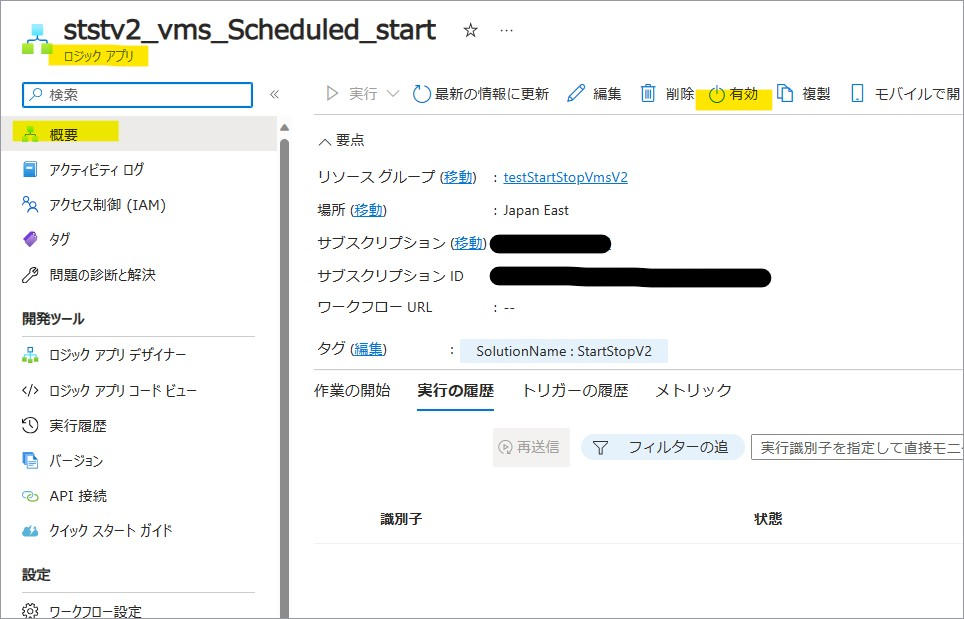
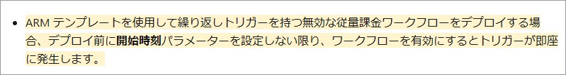
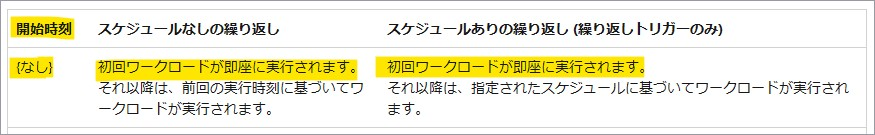
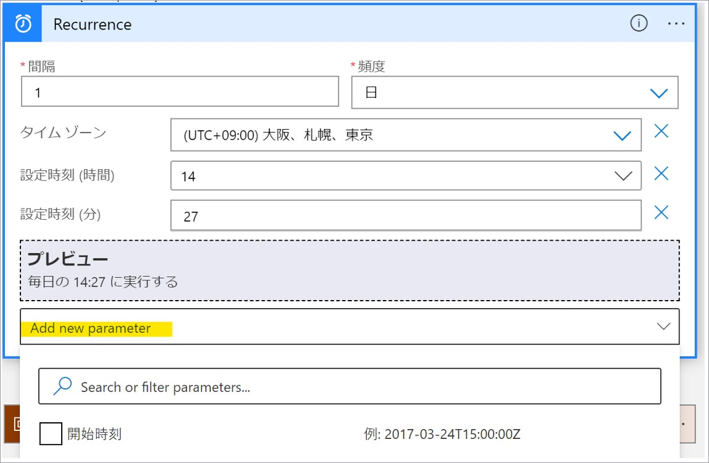
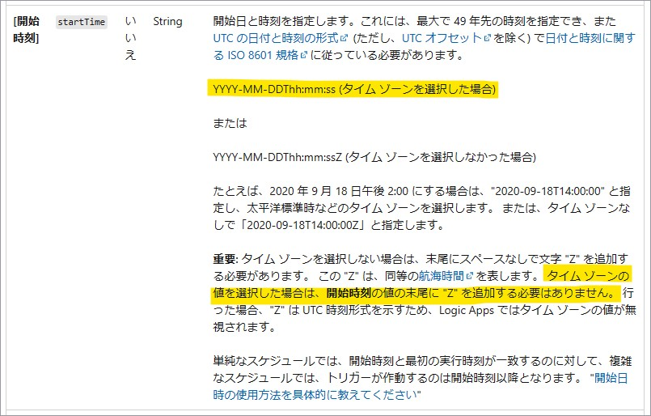
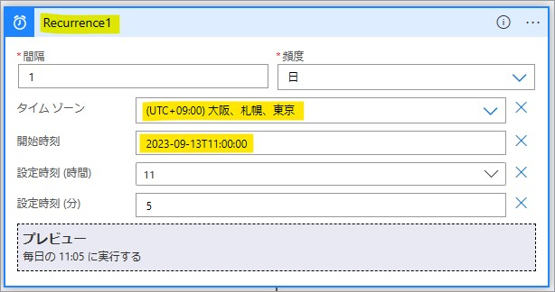

こんにちは。Azure Integration サポート チームの髙橋です。

Start/Stop VMs v2 機能利用時に、Logic Apps を有効化すると即時で起動してしまう原因と、回避策について説明します。

<!-- more -->

## こんな方におすすめです
- Start/Stop VMs v2 機能利用時に、Logic Apps が即時起動することを避けたい方
- 「繰り返し (Recurrence)」トリガーを利用している場合に、即時起動を避けたい方

## Start/Stop VMs v2
Start/Stop VMs v2 につきましては、以下の公開情報やブログがあります。
- 参考ドキュメント : [Start/Stop VMs v2 の概要](https://learn.microsoft.com/ja-jp/azure/azure-functions/start-stop-vms/overview)
- 参考ドキュメント : [Start/Stop VMs v2 のご紹介](https://jpazpaas.github.io/blog/2021/11/29/introduce-Start-Stop-VMs-v2.html)

Start/Stop VMs v2 は、以下よりデプロイすることが可能です。
- 参考ドキュメント : [Start/Stop VMs v2 を Azure サブスクリプションにデプロイする](https://learn.microsoft.com/ja-jp/azure/azure-functions/start-stop-vms/deploy)
- 参考ドキュメント : [Start/Stop VMs during off-hours overview (V2)](https://github.com/microsoft/startstopv2-deployments/blob/main/README.md)

## 事象
Start/Stop VMs v2 をデプロイしますと、以下のリソースが作成されます。

Logic Apps は無効化された状態でデプロイされておりますが、この状態で有効化しますとトリガーが即時に起動いたします。

## 「繰り返し (Recurrence)」トリガーが即時起動してしまう原因
本事象は、仕様の動作になります。

Logic Apps がデプロイされた時点では、「繰り返し (Recurrence)」トリガーの [開始時刻] パラメーターが設定されていないため、
有効化されたタイミングで即座に実行するよう、予約済みの初回実行のジョブが既に作成されていることに起因いたします。

※ デプロイ後かつ有効化前に [開始時刻] をご設定いただいた場合でも、既にジョブが作成されてしまっていますので、有効化後に起動してしまいます。
当該ツールのデプロイ方法およびトリガーの仕様に起因した事象でございます。

- 参考ドキュメント : [Azure Logic Apps で Recurrence トリガーを使用して繰り返しワークフローをスケジュール設定および実行する # 繰り返しトリガーを追加する](https://learn.microsoft.com/ja-jp/azure/connectors/connectors-native-recurrence?tabs=consumption#add-the-recurrence-trigger)

なお、Start/Stop VMs v2 機能ではなく、Logic Apps を Azure ポータル上で手動で作成し初めて「繰り返し (Recurrence)」トリガーを設定した場合におきましても、
[開始時刻] が設定されていない場合には Logic Apps 保存後に即時に起動いたします。
即時起動後には、設定された値に基づいてトリガーが起動いたします。

- 参考ドキュメント : [Azure Logic Apps ワークフローで繰り返し実行されるトリガーのスケジュール # 開始日時のパターン](https://learn.microsoft.com/ja-jp/azure/logic-apps/concepts-schedule-automated-recurring-tasks-workflows#patterns-for-start-date-and-time)

## 回避策
以下の例では、Start/Stop VMs v2 における即時起動の回避策についてご案内いたします。
考え方といたしましては、デプロイ時に予約されたジョブをリセットする方法になります。

有効化する前に、トリガー名を一時的に変更し、[開始時刻] パラメーターの設定をご実施ください。
トリガー名を変更することにより、予約済みのジョブがリセットされ、[開始時刻] に従ってトリガーを起動するよう新しくジョブを設定することが可能です。

1. [Start/Stop VMs during off hours - V2] をデプロイ
2. ロジック アプリ [ststv2_vms_Scheduled_start] を開き、ロジック アプリ デザイナーを開く
3. [Recurrence] トリガーにて、トリガー名を変更 (Reccurence1)
4. [Recurrence] トリガーにて、以下のパラメーターを変更 (開始時刻は変更必須ですが、「設定時刻 (時間)」および「設定時刻 (分)」は必要に応じて変更ください。)
・タイム ゾーン : (UTC+09:00) 大阪、札幌、東京
・設定時刻
・開始時刻: 2022-11-06T14:00:00 (過去、未来いずれも設定いただくことが可能です。詳細については、下記の資料をご参考ください)
- 参考ドキュメント : [Azure Logic Apps ワークフローで繰り返し実行されるトリガーのスケジュール # 開始日時のパターン](https://learn.microsoft.com/ja-jp/azure/logic-apps/concepts-schedule-automated-recurring-tasks-workflows#patterns-for-start-date-and-time)
※ 開始時刻の項目は [Add new parameter] より追加いただけます。

**タイムゾーンを指定した場合、[開始時刻] の最後に「Z」は不要です。**

- 参考ドキュメント : [Azure Logic Apps で Recurrence トリガーを使用して繰り返しワークフローをスケジュール設定および実行する # 繰り返しトリガーを追加する](https://learn.microsoft.com/ja-jp/azure/connectors/connectors-native-recurrence?tabs=consumption#add-the-recurrence-trigger)
5. ワークフローを保存

6. [Recurrence] トリガーのトリガー名を戻し、改めてワークフローを保存 (動作上、戻す必要はありません)
7. VM 指定のコードを編集し、ワークフローを保存
8. 有効化

## まとめ
本記事では、Start/Stop VMs v2 機能利用時に、Logic Apps を有効化すると即時で起動してしまう原因と、回避策についてご案内いたしました。
本記事が少しでもお役に立ちましたら幸いです。

## 関連記事
以下、「繰り返し (Recurrence)」トリガーに関連した記事になります。
- [Logic Apps で日付や時刻を判定してワークフローを制御する](https://jpazinteg.github.io/blog/LogicApps/LogicApps-Functions/)
- [「繰り返し (Recurrence)」トリガーの起動時刻の差異について](https://jpazinteg.github.io/blog/LogicApps/ScheduleTriggerStrattime/)